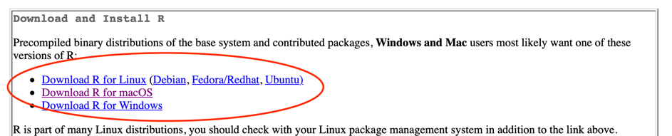
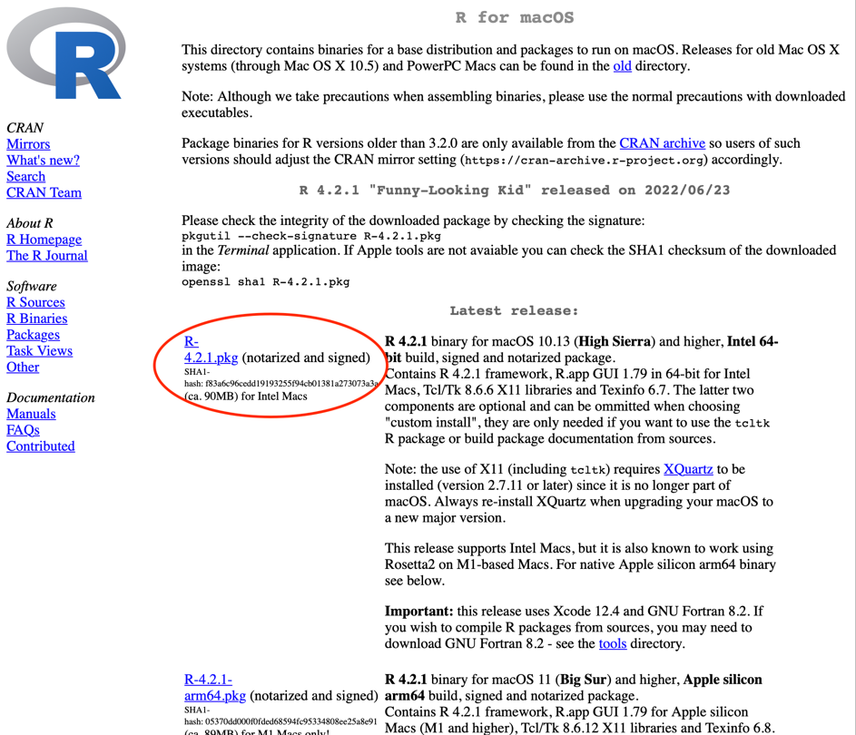
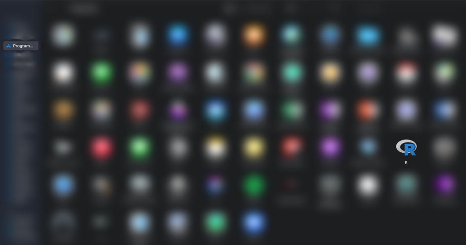
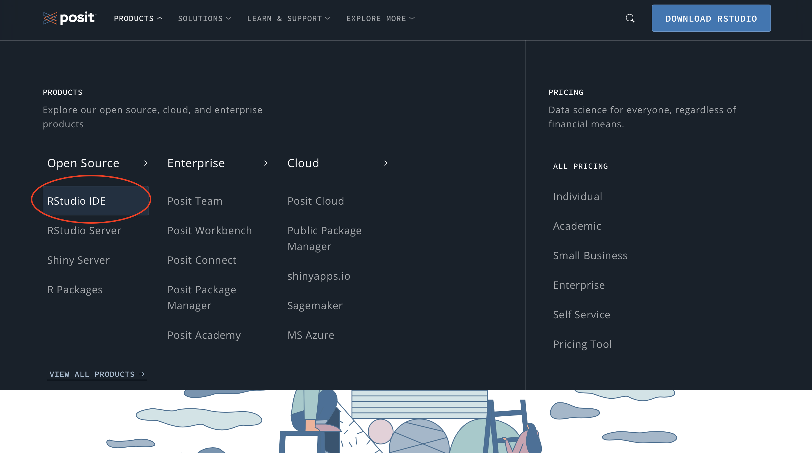
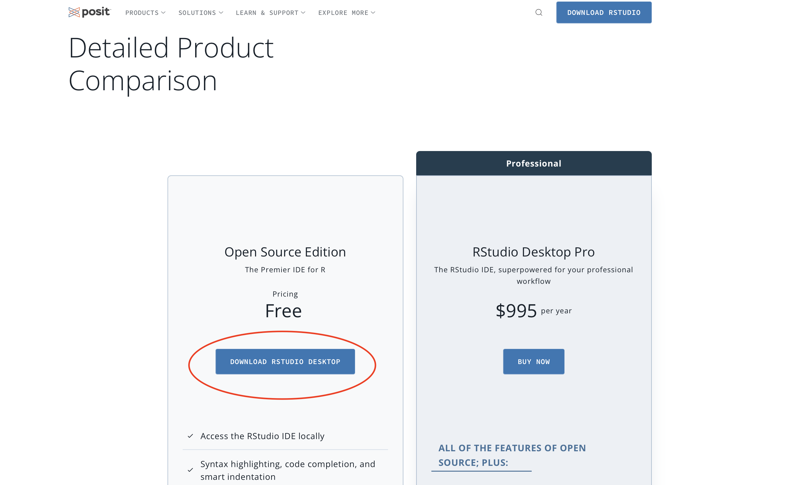
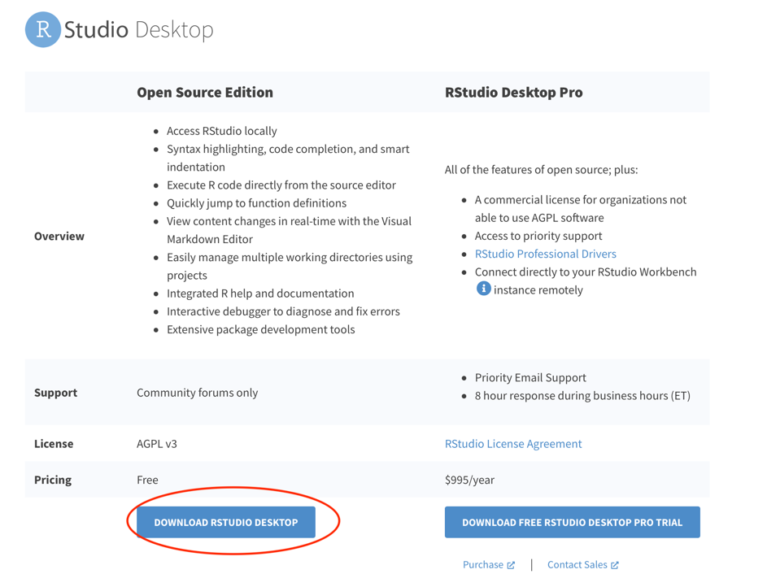
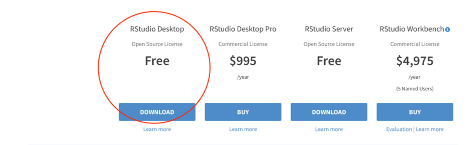
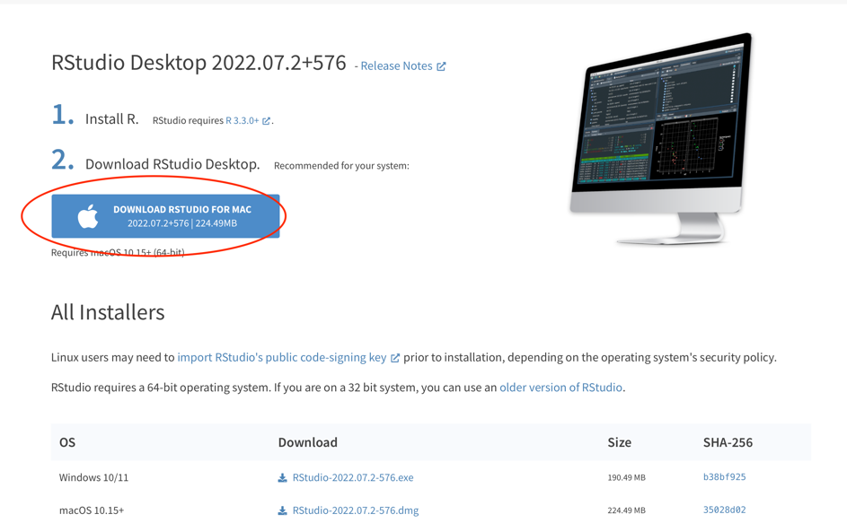
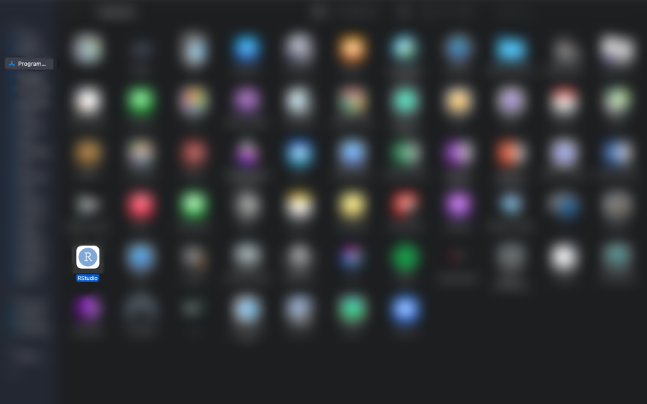

# Installing R and R Studio

Downloading R is an entirely free process. It requires little time and is ready-to-use directly after the installation process. In addition to downloading R, R Studio is a great complement, as it gives you an integrated user interface that works alongside the conventional R interpreter and allows for smooth and hasslefree coding!

## Installing R

1. Go to [The Comprehensive R Archive Network (CRAN)](https://cran.r-project.org).
2. Choose your operating system and click on the corresponding download link:

3. Download the latest version of R and click on the filename to begin the installation. The latest Version (R-4.2.1.pkg as of 31.10.2022) can be found at the top of the page:

4. Follow the steps on the installation manager.

5. After the installation the R program should be found in the program's folder:

## Installing R Studio

*R Studio is a piece of software that allows working with R a lot easier, by providing a graphical user interface. The interface allows to navigate and manage the information in R more efficiently.*

1. Go to [Posit.co](https://posit.co) and select Products on the top-left and then click on "RStudio IDE" drop-down-menu:

> Note: As of November 2022, the company that manages RStudio has redesigned its name and website. However, the product, RStudio, remains unaltered and is still free to use.

2. Scroll down and choose the free desktop version of RStudio:

3. You will be redirected to a latter part of the page, click on “download RStudio Desktop”

------ 
Ab hier neue Screenshots!!

4.	Next, you will get to another page which asks you to choose the free or the paid version. Choose the free open source version and click on download:

5.	You are going to get redirected to a site with a list of installers for supported platforms, however, the website usually recommends an installer based on your operating system. Click on “Download RStudio for ….”

6.	Go through the installation process. Afterwards, RStudio should be found in your Programs Folder:

7.	Congratulations, you have successfully downloaded R and R Studio! 🥳

