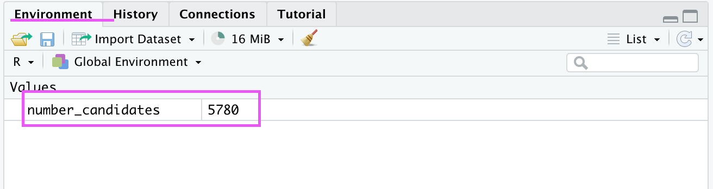
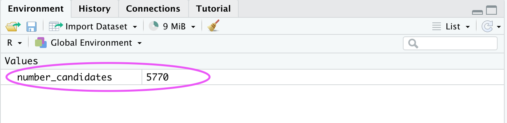

# Data types in R

In this chapter we will focus on the very basics of R programming:

- [Variables](#variables)
- [Data types in R](#data-types-in-r)
- [Operators](#operators)
    - [Arithmetic](#arithmetic-operators)
    - [Relational](#relational-operators)
    - [Logical](#logical-operators)
    
## Variables

A variable is a place to store a value. The value can be anything: a text, a numeric, a data frame, etc. The value can later be used in R by simply typing the name of the variable.

A variable is created when you assign a value to it. There are three symbols used to assign a value to a variable:
- `<-` : The name of the variable is on the **left** of the symbol and the value is on the **right**.
- `->`:The name of the variable is on the **right** of the symbol and the value is on the **left**.
- `=`: The name of the variable is on the **left** of the symbol and the value is on the **right**.

 > Although there are many ways to assign a value to a variable, `<-` is the most commonly used symbol to do so! 
 >

Here is an example:

```R
#You have a study that has 5780 candidates. You would like to store that number in a variable:

number_candidates <- 5780

```
In this line of code, we assigned the value ` 5780` to the variable `number_candidates`. R will store the variable and its value assigned in the current workspace. You can view all variables in the workspace in RStudio in the ‘Environment’ tab in the top right corner.



**To change the value of a variable, you need to reassign the new value using `<-`. The new value will replace the previous value**

```R
#Some candidates decided to not participate in the study, you have now around 5770 candidates. Assign a new value to the variable:

number_candidates <- 5770
```
This change is also reflected in the workspace in RStudio:




### Rules for naming variables
- A variable name can have letters, numbers, dots and underscores.
- A variable cannot start with a number, dot or an underscore.
- R is case-sensitive (NUMBER, Number and number are all different variables.)
- The variable should not have the same name as functions.

### Printing variables

If you would like to see the contents of a variable, you can simply type up the name of the variable in the console. This is different to other programming languages, such as Python, where you usually use a function such as `print()` to display the content of the variable. You can also use this function in R to print variables.

```r
colour_favourite <- "blue"

#auto-print the value of the name variable
colour_favourite
Output: [1] "blue"

#using the print() function:
print(colour_favourite)
Output: [1] "blue"
```

You can also use the `cat()` or the `paste()` function to print out the variables. They are used to combining multiple values into a continuous print output:

```r
#using the cat() function:
cat("My favourite colour is", colour_favourite)
Output: My favourite colour is blue

#using the paste() funtion:
paste("My favourite colour is", colour_favourite)
Output: [1] "My favourite colour is blue"

```

You can also assign the same value to multiple of variables:

```r

breakfast_1 <- lunch_1 <- dinner_1 <- "Tuna sandwich"

paste(breakfast_1, lunch_1, dinner_1)

```


## Data types in R

In R it is important to understand that there are different types of data, as many functions and operations can only work with specific data types, e.g. arithmetic operations can only work with numbers, but not with text. 

There are six different data types in R:
- **Numeric** - decimal numbers, such as 3.14. They can be negative.

- **Integer** - whole numbers, such as 4. They can also be negative. This data type can also count as numeric.
- **Logical** - data that takes only two values: `FALSE` or `TRUE`. 
    - `NA` is a special type of logical and is used to represent missing values.
- **Character** - symbols, letters, words or phrases. The data is denoted using quotation marks: ` "This is text."` 
- **Complex** - data that contains complex number, such as `9 + 3i`.
- **Raw** - holds raw bytes. This is a rather unusual data type and only mentioned for the sake of completeness.

### Checking the type of data in R
You can find out the type (or class) of any object using the `class()` function:

```r
#Create variables with different data types
test_scores <- 87.9
final_grade <- "B"
pass_logical <- TRUE

#check the data type using the class() function

class(test_scores)
Output: [1] "numeric"

class(final_grade)
Output: [1] "character"

class(pass_logical)
Output: [1] "logical"

```

Another way to check what type of data you have is by using the logical function `is.[classOfData]()`. R will return with either `TRUE` or `FALSE`:

```r

is.numeric(test_scores)
Output: [1] "TRUE"

is.logical(final_grade)
Output: [1] "FALSE"

```

### Coercing Data:
You can also change the type of data in a variable by using the `as.[classOfData]()` function. This will convert whatever data type you have stored in a variable to a different, specified data type. 

```r
#Create a variable and assign a numeric. 
test_scores <- 87.9
#Check the data type
class(test_scores)
Output: [1] "numeric"
#convert this data type into a numeric
test_scores_char <- as.character(test_scores)
test_scores_char #print out the value of the new variable
Output: [1] "87.9"
#the converted data is stored in a new variable called test_score-char. Check the class:
class(test_scores)
Output: [1] "character"
```
You need to be careful with this function, as you cannot convert all data types into one another. For instance, you will receive an error message, when you try to convert a character string into a numeric:

```r
#Create a variable and assign a character. 
final_grade <- "B"
#Check the data type
class(final_grade)
Output: [1] "character"
#convert this data type into a numeric
final_grade_numeric <- as.numeric(final_grade)
Output: "NA
Warning message: NAs introduced by coercion"

```
The `is.[classOfData]()` and the `as.[classOfData]()` function look slightly different depending on the data type:


| Data type    | `is.[classOfData]()` function | `as.[classOfData]()` function |
|:------:|:-----:|:-----------:|
| Character |  `is.character()` |        `as.character()` |
| Numeric      |  `is.numeric()` |          `as.numeric()` |
| Logical | `is.logical()` |        `as.logical()` |
| Complex     |  `is.complex()` |          `as.complex()` |
| Integers      | `is.integer()` | `as.integer()`


## Operators

An operator in computer science is usually a symbol or a set of symbols that represent an action. It tells the programme to perform a specific set of instructions or calculations. 


### Arithmetic operators

Arithmetic operators are used to perform maths operations:


| Operator    | Definition |
|:------:|:-----:|
| + |  Addition |        
| -      |  Subtraction |          
| * | Multiplication |       
|    /  |  Division |          
| %%      | Modulus: returns the remainder of the division of the number to the left by the number on its right | 
|   %/%   | Gives result of division of first vector with second (quotient) | 
|   ^   | Index | 


### Relational operators

Relational operators are used to compare two values:

| Operator    | Description |
|:------:|:-----:|
| > |  Is first value greater than second value? |        
| <      |  Is first value smaller than second value? |       
| <= | Is first value less than or equal to second value? |   
|    >=  |  Is first value greater than or equal to second value? |        
| ==      | Is first value equal to second value? |
|   !=   | Is first value not equal to second value? | 


### Logical operators


| Operator    | Definition | 
|:------:|:-----:|
| &      |  AND operator (element-wise)      |     
|  	 &&  |  AND operator (vector-wise)       |          
| !      | Logical NOT (will return a statement as FALSE, if it is true)                                        |      
|    I   |  OR Operator (element-wise)       |         
| II     | OR operator (vector wise)         | 


