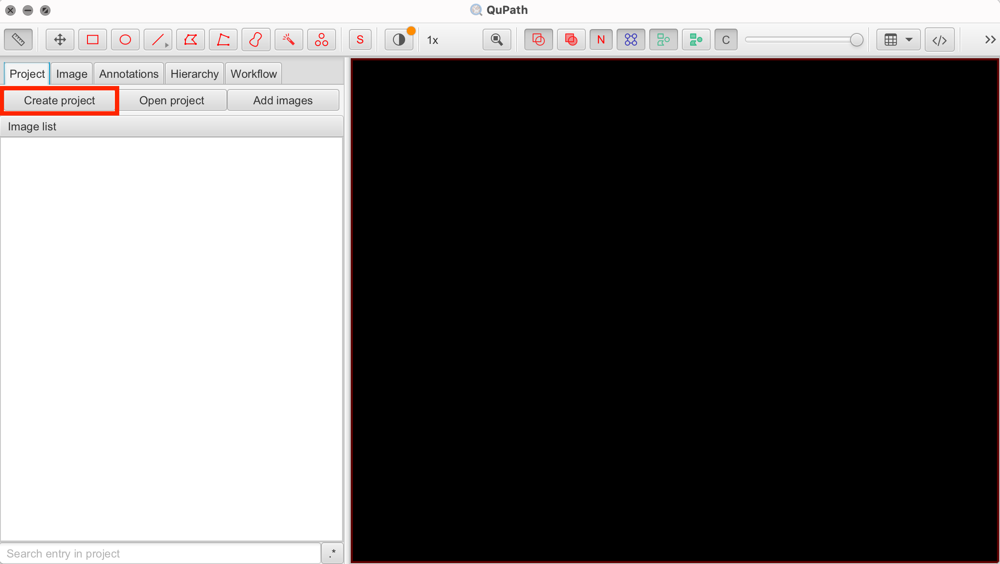
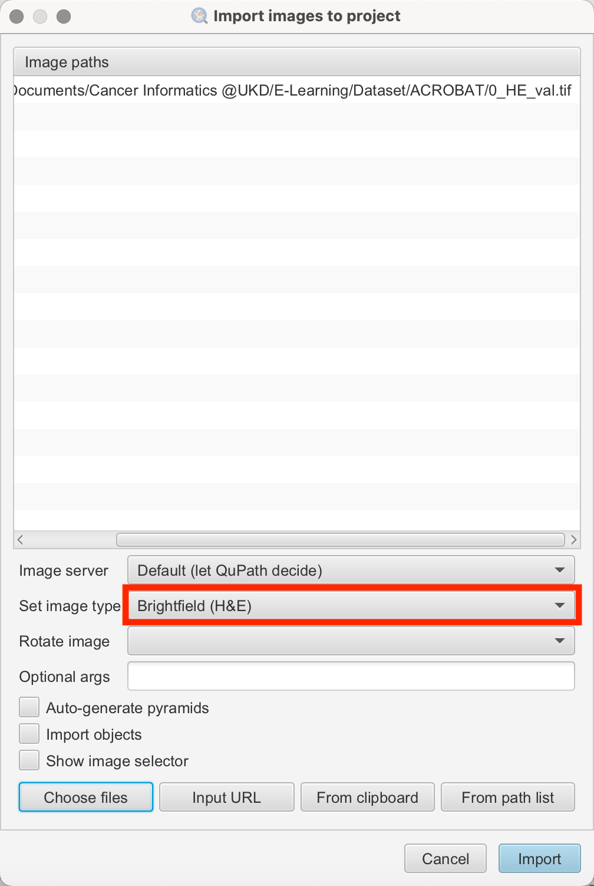
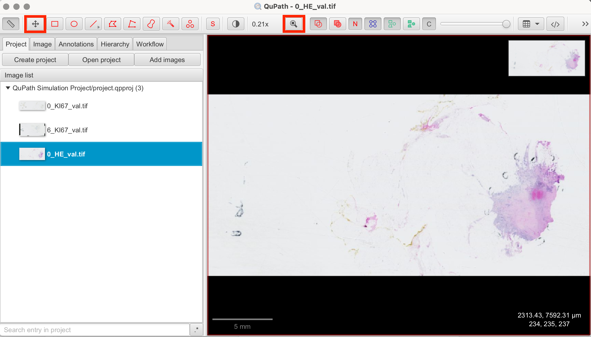
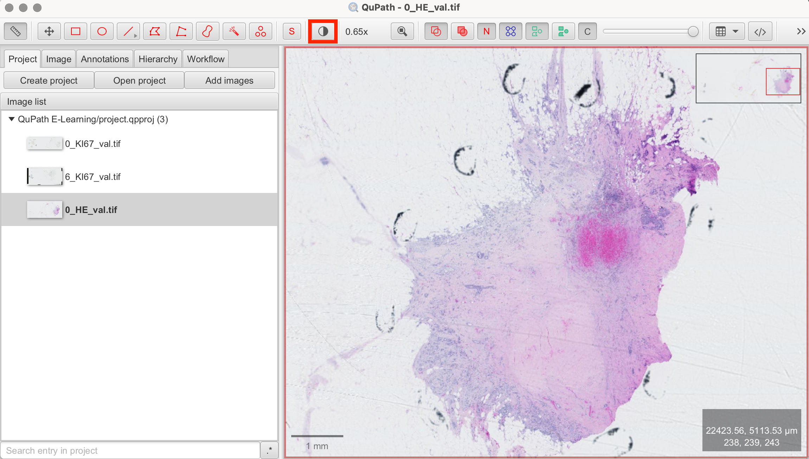
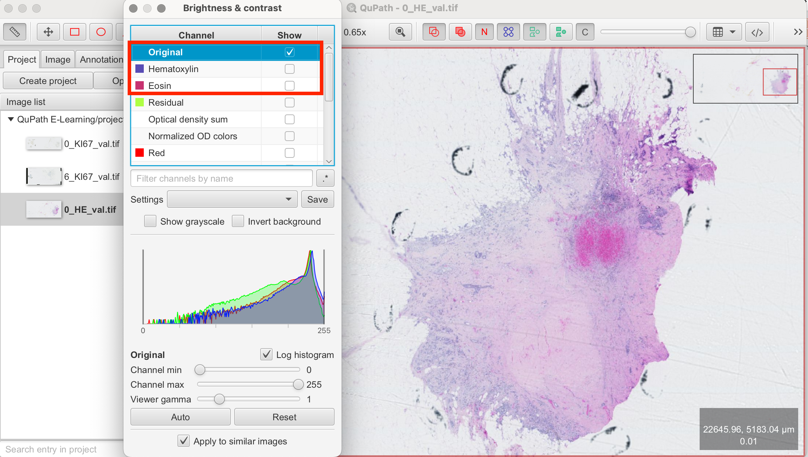

# Introduction to QuPath

QuPath is an open-source software designed for bioimage analysis, particularly in digital pathology. It facilitates the visualization, annotation, and analysis of large whole-slide images. QuPath is widely used for tasks such as cell detection, tissue classification, and fluorescence quantification, making it an essential tool for research in cancer, neuroscience, and other fields of biomedical science.

## Using the ACROBAT Dataset for QuPath Analysis

For this tutorial series, we'll utilize the publicly available ACROBAT study dataset, which provides whole-slide images (WSIs) from 1,153 primary breast cancer patients, scanned at 10x magnification. It includes images stained with Hematoxylin and Eosin (H&E) as well as immunohistochemistry (IHC) markers such as ER (Estrogen Receptor), PR (Progesterone Receptor), HER2, and Ki67. This dataset will enable us to explore various functionalities in QuPath, from project creation to image analysis. You can download the dataset [here](https://snd.se/en/catalogue/dataset/2022-190-1). The demonstration image for this article is “0_HE_val.tif” from the validation dataset “valid.zip”.

## Introduction to Working with QuPath

To start using QuPath, download and install the software from the official QuPath GitHub page [here](https://github.com/qupath/qupath/releases/tag/v0.5.1). After launching QuPath, create a new project by selecting "Project" > "New Project" from the menu. Specify the directory where the project will be stored and name your project accordingly.

## Importing Images

QuPath supports a variety of image formats commonly used in digital pathology, including:
- **Whole-slide images:** Formats like SVS, NDPI, SCN, MRXS, and more.
- **Standard image formats:** TIFF, JPEG, PNG, and BMP.

To import images into your project, select "Project" > "Add Images." Navigate to your image file, select them, and click "Open." The images will be added to your project directory and ready for analysis.

## Working with Overlays and Channels

QuPath allows for the import of multi-channel images, which is particularly useful for analyzing Immunohistochemistry (IHC) and Immunofluorescence (IF) images. Each channel in an image can represent a different stain or marker, allowing for a detailed analysis of the sample.

To illustrate, we will import an image with Hematoxylin and Eosin (H&E) staining. During the import, ensure you select the image stained with H&E.
- **Select Analysis > Set Image Type > Brightfield (H&E):** This ensures that QuPath recognizes the staining type and adjusts its tools accordingly.

## Navigating Within the Image

To navigate within the image, you can zoom in and out using the scroll wheel on your mouse or by using the zoom buttons on the toolbar. To move around the image, click and hold the left mouse button while dragging the image to the desired position. To move or recenter the image, you can also use the buttons of the toolbar shown below.

## Viewing Channels Separately
You can use the "Channels" tool in the viewer to adapt the visibility of each channel individually. 

## Understanding H&E and DAB Staining

Before performing any analyses, it's crucial to understand the type of staining used in your images. Throughout this series, we will be working with images from the ACROBAT dataset stained with either Hematoxylin and Eosin (H&E) or H-DAB. These are commonly used staining techniques in histopathology. Here's a brief overview:

### Hematoxylin and Eosin (H&E) Staining:
- **Hematoxylin:** Stains the nuclei of cells a deep blue to purple. This stain binds to the acidic components of the nucleus, particularly DNA, allowing pathologists to visualize nuclear structures.
- **Eosin:** Stains the cytoplasm and extracellular matrix of tissues in varying shades of pink. Eosin is an acidic dye that binds to the basic components of cells, such as proteins, providing contrast to the nuclei stained by hematoxylin. Together, H&E staining provides a view of tissue architecture, highlighting both cellular and extracellular components.

### DAB Staining (3,3'-Diaminobenzidine):
- **DAB:** A chromogen used in immunohistochemistry (IHC) that produces a brown color upon reacting with the enzyme horseradish peroxidase (HRP), which is linked to the antibody targeting the antigen of interest. DAB staining can highlight virtually any antigen within a sample. For instance, in the context of Ki67 (a proliferation marker) staining, DAB marks Ki67-positive nuclei with a brown color, indicating cells that are actively proliferating.

## Basic Functions in QuPath

QuPath offers a comprehensive range of tools for digital pathology analysis, allowing researchers to perform a wide range of tasks. Below are some of the basic functions to get you started, but QuPath also provides advanced tools and scripting options to extend its capabilities.

- ### Annotations
QuPath allows for both manual and automatic annotation of Regions of Interest (ROIs) within tissue samples. This function is useful for marking specific areas relevant to further analysis, such as tumor regions within larger tissues or areas with specific staining patterns. These annotations can serve as the foundation for all subsequent analyses, including cell detection and counting.

- ### Cell Detection
The Cell Detection feature identifies and quantifies cells within annotated regions. QuPath’s cell detection tools use algorithms to detect cells based on size, shape, and staining intensity. These parameters can be manually adjusted to ensure accurate cell identification.

- ### Classifiers
QuPath’s classifiers can automatically categorize different tissues, cells, or image features based on specific characteristics such as color, texture, or morphology. By training classifiers on annotated regions, QuPath can differentiate between tissue types, such as distinguishing tumor tissue from stroma or identifying specific cell types based on staining patterns. Classifiers not only improve analysis efficiency by reducing the need for manual categorization but also ensure more consistent and reproducible results when working with multiple images or large datasets.

- ### Measurements
The measurement tools in QuPath allow you to extract and analyze a variety of morphological features from the images, including cell size, shape, and staining intensity.

- ### Scripting
To further enhance efficiency, QuPath supports scripting with Groovy or Python to automate tasks and analyses. Scripting is particularly useful for batch processing large datasets or applying analytical workflows consistently across multiple images.

## Further Information

For more instructions and information, have a look at QuPath documentation [here](https://qupath.readthedocs.io/en/0.5/).

## References

- https://qupath.readthedocs.io/en/0.5/
- Bankhead, P. et al. QuPath: Open source software for digital pathology image analysis. Scientific Reports (2017). https://doi.org/10.1038/s41598-017-17204-5