# Tissue Segmentation Using a Pixel Classifier in QuPath

## Introduction

In this tutorial, we will learn how to use QuPath’s pixel classifier to distinguish between different regions of an image, specifically focusing on separating tumor/epithelial and stroma components in breast cancer tissue. The pixel classifier is a machine learning tool that segments tissue automatically based on pixel-level features such as color, texture, and intensity. Knowing this tool is necessary because tissue classification is often required for further image analyses, such as quantifying the Ki67 index, which we will cover in a subsequent article.

## Understanding the Pixel Classifier 

The pixel classifier in QuPath is a machine learning-based tool for automatic tissue classification by analyzing individual pixel characteristics like color, texture, and intensity. It learns to differentiate tissue types based on predefined annotations and then applies this knowledge across the entire image. For instance, in breast cancer tissues, the classifier can learn to automatically distinguish between tumor/epithelial and stroma regions after training on representative samples.

## Importing the Ki67-Stained Whole Slide Image
We'll be working with a Ki67-stained whole-slide image (WSI) from the ACROBAT dataset. For demonstration purposes, we'll use the image “0_KI67_val.tif” from the validation dataset “valid.zip”. You can import this image by following the steps outlined in our first article, “Introduction to QuPath.”

## Identifying and Selecting Regions of Interest (ROIs)

As previously mentioned, QuPath is capable of performing complex image analyses, which can be computationally intensive. Thus, it is always advisable to start with smaller regions. Before we begin the main steps of this tutorial, we will create an annotation around the tissue area. By doing this, QuPath will exclude background areas and empty regions of the slide, preventing unnecessary pixel analysis of areas, where there is no tissue at all.

- **Select the Brush or Wand Tool:** Draw a shape along the outline of the tissue, in which you you want to continue working. Right-click on the annotation and select "Lock Annotation" to secure the selection.

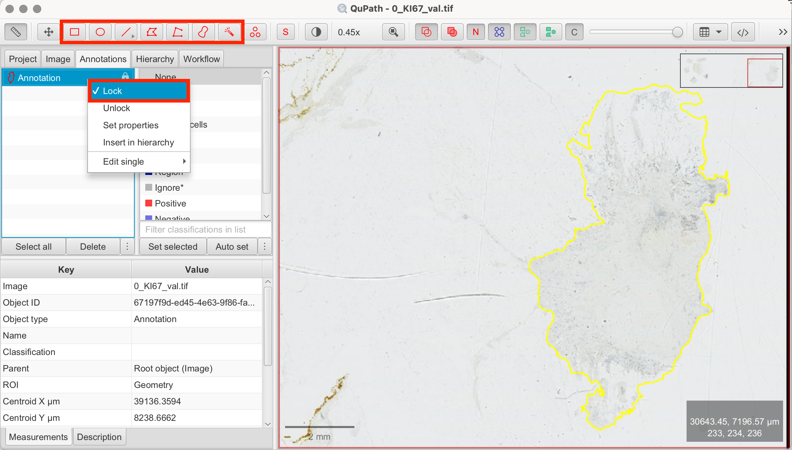

Alternatively, you can use QuPath’s Pixel Thresholder to automatically create an annotation based on pixel intensity values. This method can often be more efficient and precise. However, since our demonstration image displays very light staining, the manual approach is faster and sufficiently accurate in this case. 

## Creating Training Annotations

Before the pixel classifier can function, it needs training examples. This involves drawing annotations within the tissue and assigning them to specific classes (e.g., tumor/epithelial, stroma, background). QuPath uses these annotations to train the pixel classifier. It’s important to choose representative regions for each class that the pixel classifier should detect. Depending on the variability of your tissue, you can start with just a few annotations and later on add more as needed to improve the classifier’s accuracy. For demonstration purposes, I used different tools from the toolbar to show various ways of creating annotations.

Let’s create these training annotations:

1. **Draw Training Annotations:** Use the Rectangle, Brush, or Wand tools to annotate small areas that clearly represent tumor/epithelial and stroma regions. It’s best to select representative regions with clear distinctions between the tissue types. These annotations should stay unlocked as they are by default.
2. **Create Classes:** In the annotation tab, QuPath provides pre-defined classes. If none of these match your needs, you can create custom classes by clicking the three-dot menu at the bottom of the panel and adding new classes. These are the classes I used:
- Stroma (pre-existing)
- Tumor/Epithelial (new class)
3. **Classify Annotations:** You will now see all of your annotations in the annotation tab on the image on the left. Now classify each annotation by left-clicking on it to Classify or by clicking on each annotation first, then on the according class on the right and “Set Selected”.
- Select Annotation > Select Class

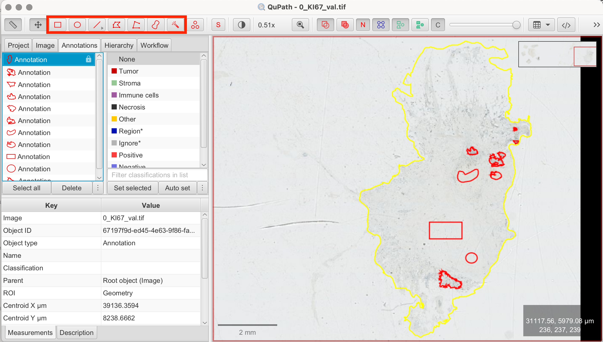

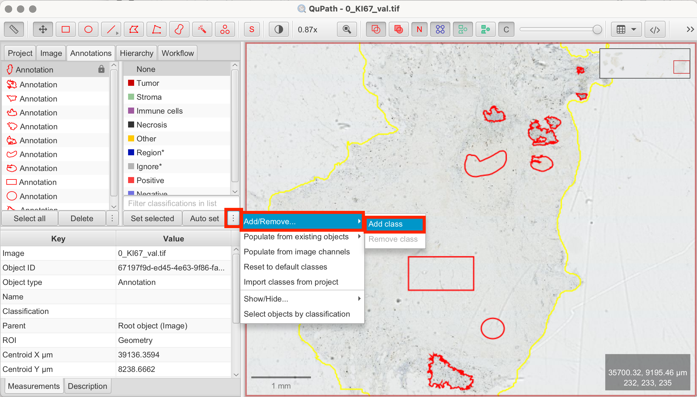

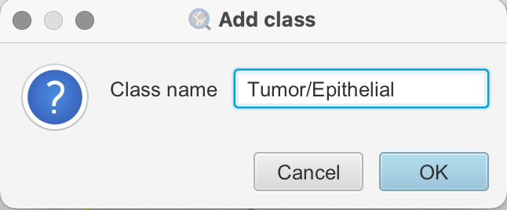

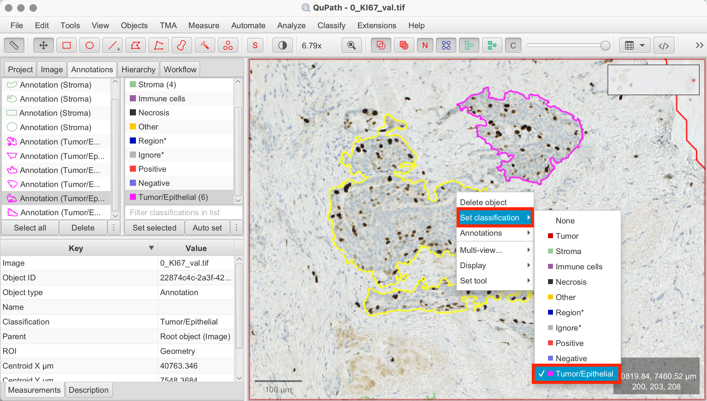

## Creating Pixel Classifier for Tumor/Epithelial vs. Stroma Segmentation

Now that we have our training annotations, we can proceed with training the pixel classifier:

1. **Classify > Pixel Classification > Train Pixel Classifier:** This will open the pixel classifier configuration panel.
2. **Set Parameters**: 
- **Classifier > Random Trees (RTrees):** Choose “Random Trees (RTrees)” as the learning algorithm, as it is commonly used. 
- **Resolution:** Set the resolution to determine the level of detail. Higher resolution captures finer details for distinguishing between closely related tissue types. However, using higher resolution increases processing time. Conversely, lower resolution speeds up processing but may lose some precision. Low to mid-level resolution is often a good starting point. 
- **Region > Any Annotation ROI:** Select “Any Annotation ROI” to ensure that the classifier only runs within the annotated tissue region, rather than on the entire image.
- **Other Parameters:** QuPath provides many options for adjusting parameters. In this tutorial, we’ll stick to the basic settings, but if the standard parameters don't work for your specific image, you can explore the other options and parameters. 
3. **Live Predicition:** Click “Live Prediction” to preview how the classifier distinguishes between tumor and stroma regions based on your training annotations. The preview automatically updates as you modify or add training annotations.
4. **Review Results:** If the classifier doesn’t perform well enough yet, refine it by adding, modifying, or deleting annotations. Keep the configuration panel open to observe the results as you fine-tune the training annotations. For better visibility, you can show/hide the pixel overlay by clicking the C symbol in the toolbar.
5. **Save the Classifier:** Once you’re happy with the classifier’s performance, name and save it.
6. **Create Objects > Current Selection:** After training, use the “Create Objects” function to segment the image based on your annotations. Make sure to select the current selection as the parent object. The segmented regions will appear as objects in the annotation tab. It is usually recommended to adjust the minimum object size and hole size, as pixel classification at high resolution can otherwise generate hundreds or even thousands of tiny objects. You can fine-tune these parameters either through trial and error or by estimating the minimum area based on your image’s characteristics and the desired object size.

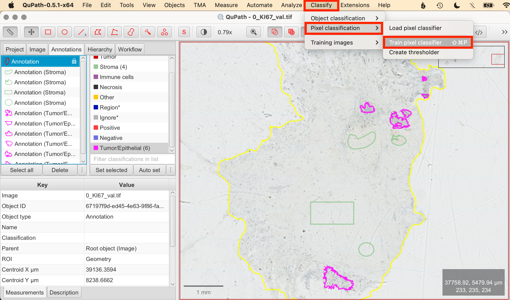

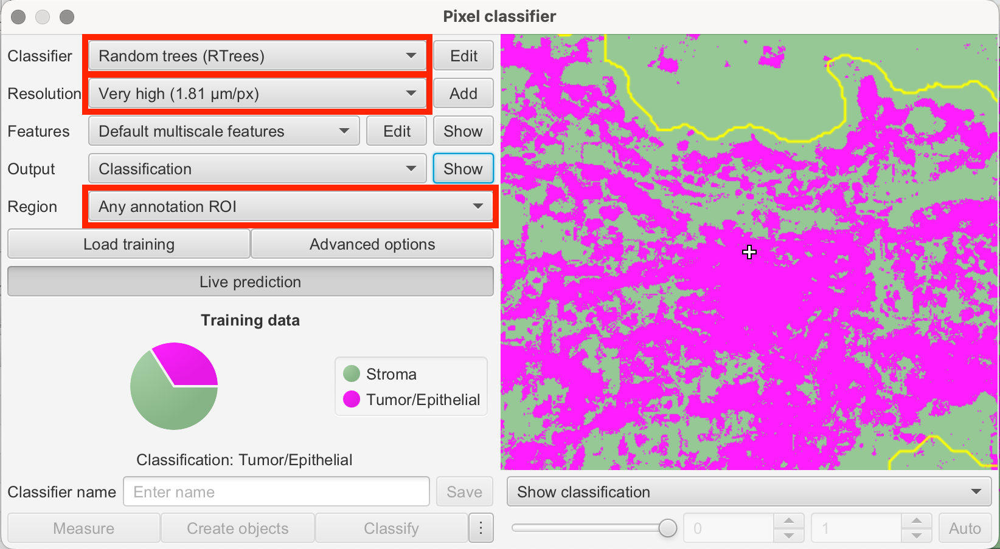

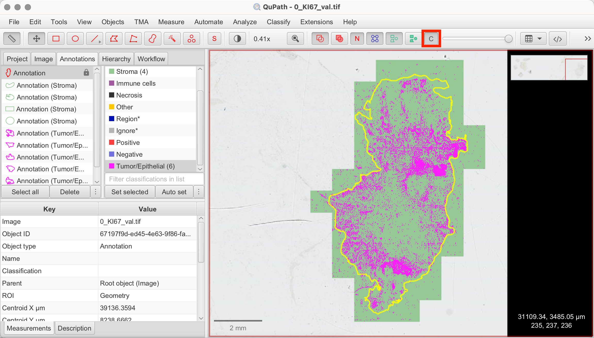

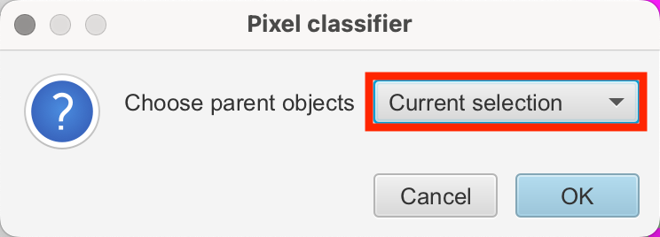

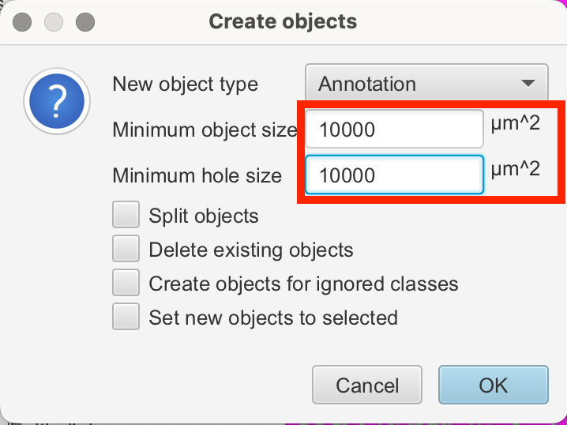

## Measuring Tissue Composition with the Pixel Classifier

When running the pixel classifier, QuPath automatically calculates the percentage of each tissue class (stroma vs. tumor/epithelium) based on the pixel area. In the annotation tab select the tissue annotation and the results will be displayed in the Measurements tab on the bottom left. That way the tissue classifier also proves as a method to assess tissue composition.

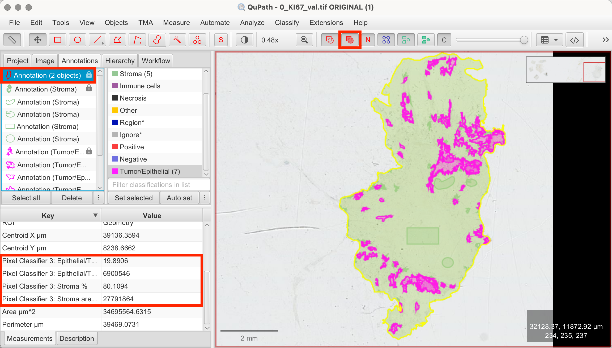

As shown in my results, QuPath detected 19.89 % tumor/epithelial area and 80.10 % stromal area in my tissue. 

## Conclusion

QuPath’s pixel classifier is an essential tool, as many subsequent analyses rely on properly classifying tissue regions first. Learning to use the pixel classifier serves as a foundation for more further analyses, such as calculating the Ki67 index, which we will cover in the next tutorial. Not only does the pixel classifier reduce manual effort, but it also ensures consistent results across large datasets.

## References

- https://qupath.readthedocs.io/en/0.5/
- Bankhead, P. et al. QuPath: Open source software for digital pathology image analysis. Scientific Reports (2017). https://doi.org/10.1038/s41598-017-17204-5