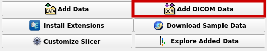
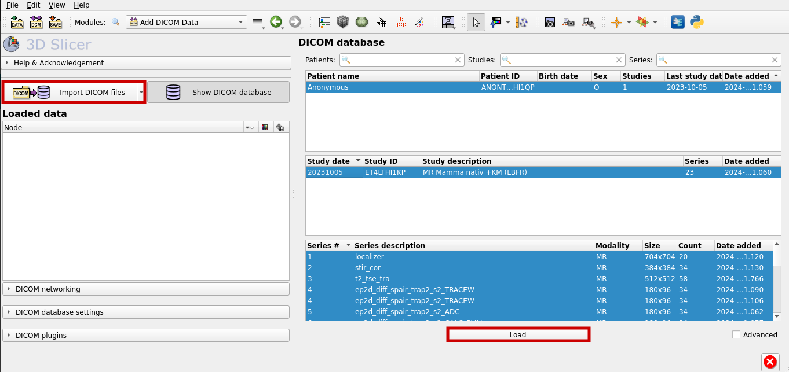
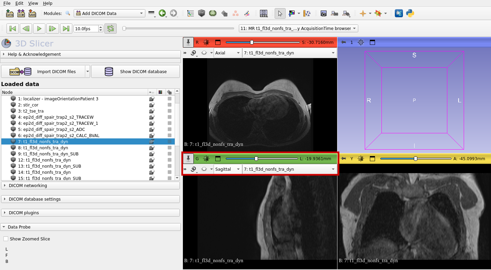
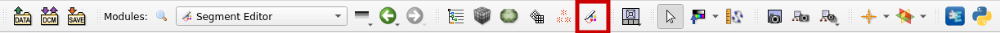
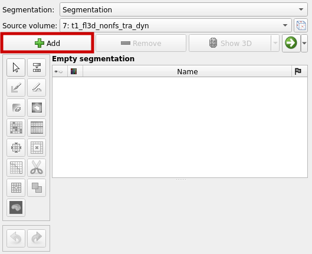
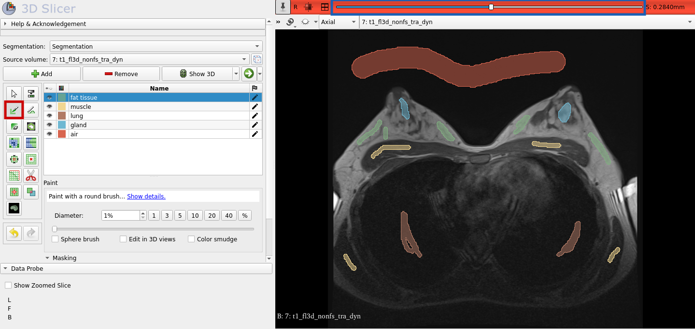
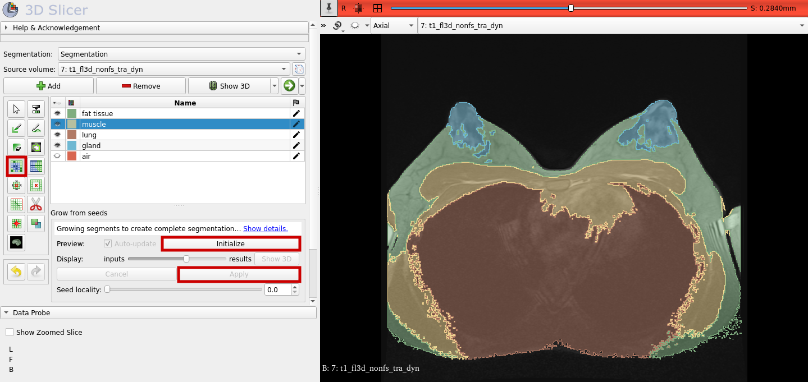
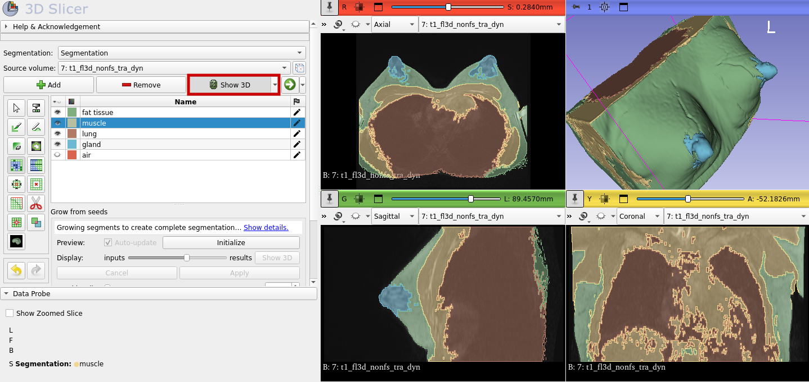
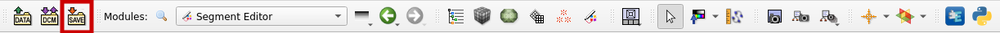
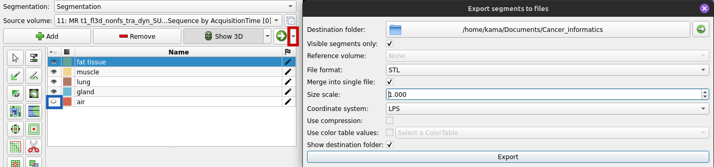

# Segmentation of 3D MRI Images With 3D Slicer

MRI images are often stored using the DICOM standard (Digital Imaging and Communications in Medicine), which is the international standard, that defines how medical image data, e.g., ultrasound or MRI images, should be handled.
It also contains personal information of the patient.

## Open DICOM Files With 3D Slicer

There are various software you can use to open a DICOM file.
We will use [3D Slicer](https://www.slicer.org/) because that is also the tool, we will segment the MRI images with.
You can download 3D Slicer [here](https://download.slicer.org/).

After starting 3D Slicer, select "Add DICOM Data" to add a DICOM file.

Now chose "Import DICOM files" to add a new file to the database.
After that, select the right file and load it.

Now you can visualize your 3d MRI image.
You can choose different options, for example, if you want to see the axial, sagittal or coronal perspective.

## Segmentation with 3D Slicer

Segmentation of MRI images are used to label which part of the images shows which tissue and to mark tumours.
In our example of a breast MRI, we will choose the following segments:
- fat tissue
- glandular tissue
- muscle tissue
- lung tissue
- air (the space around the body)

With 3D Slicer we can easily segment the MRI image as you will see. First, select "Segment Editor" from the toolbar.

To add a new segment, select "Add":

You can rename the segment by double clicking on it.
For each segment use the "Paint" function to mark a seed (red box in the graphic below). Repeat this for a few more image slices.
You can switch between the image slices by using the slider, which is highlighted with the blue box in the following graphic.

Now, that the seeds are created, we can let the segments grow from the seeds.
Select "Grow from seeds" and click "Initialize" as shown below. After you looked at the preview and you considered the result as good, you can click on "Apply."
As a result you should get something similar to the segmentation shown below on the right.
Use again the slider to look at the other image slices and how the segmentation turned out.

To get a 3D view, select "Show 3D":

At the end do not forget to save the file. Otherwise, you have to start over again.

## Export a 3D Mesh of the Segmentation

Another thing we can do is exporting a 3D mesh of the segmentation to use it later on.
A mesh represents the surface of a structure - in this case the surface of the thorax.
To export a 3D mesh, go to the Segment Editor and select "Export to files" (red box) as shown below. 
Make sure, the air segment isn't visible before you export your mesh (blue box in the graphic below).
As file format chose "STL" and tick "Merge into single file" to get one file that includes all of the segments.
Otherwise you get one file for each segment/tissue.
Also tick "visible segments only" to exclude the "air" segment. Then click "Export".

## References

- Pinter, C., Lasso, A., & Fichtinger, G. (2019). Polymorph segmentation representation for medical image computing. *Computer Methods and Programs in Biomedicine, 171*, 19-26. https://doi.org/10.1016/j.cmpb.2019.02.011

- https://www.dicomstandard.org/

- https://www.slicer.org/

- https://slicer.readthedocs.io/en/latest/