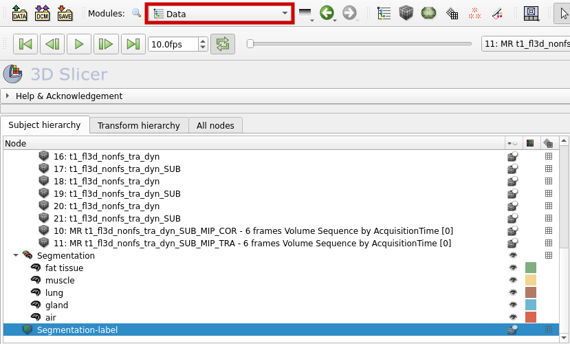

# Automated 3D MRI Segmentation with nnU-Net

In [this tutorial](./3d_mri_segmentation.md) we learned how to segment a 3D MRI image with 3D Slicer. There, we had to set the segment seeds by ourselves before the software could calculate the segments. Another method, which doesn't require as much human input, is utilizing deep neural networks. In the following, we will use the pretrained deep learning model [nnU-Net](https://github.com/MIC-DKFZ/nnUNet) for automated image segmentation on our 3D MRI images. Be aware, that we not only will use Python code but also bash commands (Linux shell). Furthermore, we will execute the whole programm in Google Colab because it requires more computing power than our computers probably have.

## Working with Google Colab

To use Google Colab, visit [this website](https://colab.research.google.com) and log in with your Google account. Then, create a new Jupyter notebook by hitting "File" in the toolbar and selecting "New notebook".

We want to use a GPU for executing our program. To do this, click on "Additional connection options" as shown below (red box):


Select "Change runtime type". Then tick "T4 GPU" and save. Now, the GPU should be shown under "resources":


## Install required packages

Now, we can start with our code. First, we need to install the required Python packages, on which nnU-Net depends. Because nnU-Net uses the PyTorch library, we need to install it first, before we install the nnU-Net package. Create a new code cell as shown in the graphic below.


Now, execute the following commands. Pay attention, that you don't change the order. The "!" at the beginning of the lines are needed because these are bash commands and we want to use them in our Jupyter notebook.

```
!pip install torch
!pip install nnunetv2
```

Probably, there will appear a warning after installing nnU-Net, that you should restart the runtime, but you don't have to do that.

## Set up datasets

For working with Google Colab, the following steps have to be taken while being in Google Drive, so the data can be accessed in Colab.

:::caution Never upload non-anonymized patient data to a cloud. :::

### Directory structure

A special directory structure is required for nnU-Net to be able to access the data. First, create a new directory in Google Drive, in which you want to save your datasets. Now in this directory, create three more folders with the following names:
- nnUNet_raw
- nnUNet_preprocessed
- nnUNet_results


We can save new datasets in the "nnUNet_raw" directory. Every dataset has to have a specific name. It always starts with "Dataset", is followed by a three digit integer, which is the dataset ID, and ends with a description. In the following graphic you can see some examples.


The ID and the description can be chosen by the user, but the ID should not collide with already existing ones, which you can find [here](https://github.com/MIC-DKFZ/nnUNet/tree/master/nnunetv2/dataset_conversion).

The last thing we have to consider, regarding the directory structure, is that every dataset folder has to include the following directories:
- imagesTr
- labelsTr

The "imagesTr" directory will include the training images and the "labelsTr" directory the corresponding segmentation files. You can also create a "imagesTs" folder, where you can save test images, but it is is not necessarily required for running nnU-Net.

### Adjust the file format

Our data needs to be transformed into a usable form for nnU-Net. nnU-Net supports different file formats. In this case we will use NRRD files. The associated segmentations to the MRI images need to be exported as labelmaps. For this, we will use 3D Slicer again.

First, open your DICOM file with the corresponding segmentation file in 3D Slicer. Now go to the "Segmentation Editor" and select "Import/Export nodes".


Now, export a labelmap as shown below.


The labelmap can now be found in the "Data" section.



To save the labelmap and the corresponding volume or image as NRRD files, follow these steps:
- Select "Save" from the toolbar.
- Tick "Show options" as shown in the graphic below.
- Chose "NRRD (.nrrd)" as file format.
- <ins>Do not tick "Compress"</ins> because nnU-Net needs uncompressed data.
- For our segmentation we used the volume *7 t1_fl3d_nonfs_tra_dyn*, so we save this file in the imagesTr directory and the segmentation file in the labelsTr directory.
- Save.


### Change the file names

The names of the training images (in the imagesTr directory) should include the description, an ID (three digit integer) and the channel or modality (four digit integer). The modality is the type of images, for example if your dataset contains MRI and ultrasound images, the MRI images could be the modality 0000 and the ultrasound images the modality 0001. Here are some examples:


The names of the corresponding segmentation files (in the labelsTr directory) should include the description and the image ID, to which the segmentation is associated:


### Mount Drive

After we generated the required directories and uploaded our data to Google Drive, we have to mount Drive in Google Colab by using the following code in a new code cell:

```python
from google.colab import drive
drive.mount('/content/drive', force_remount = True)
```

A popup window will appear, where you have to connect to your Google account. After that, you should be able to access your data in Colab.

### Generate a JSON file 

To save some meta data reguarding the dataset, a JSON file has to be generated. We can do this automatically by using the `generate_dataset_json()` function from the nn-Unet package.

```python
from nnunetv2.dataset_conversion.generate_dataset_json import generate_dataset_json

generate_dataset_json('./nnUnet_raw/Dataset011_Breast', # insert the right path to the dataset directory
                        channel_names = {0: 'MRI'},
                        labels = {
                            'background': 0,
                            'fat tissue': 1,
                            'muscle': 2,
                            'lung': 3,
                            'gland': 4,
                            'air': 5
                        },
                        num_training_cases = 5, # amount of training cases
                        file_ending = '.nrrd')
```

The JSON file for example contains the names of the labels and which integer values are corresponding to what label. It also contains the number of training cases, so it can later be checked if this amount of training cases are really included in the dataset folder. For this example, the file should look like this:

```
{
    "channel_names": {
        "0": "MRI"
    },
    "labels": {
        "background": 0,
        "fat tissue": 1,
        "muscle": 2,
        "lung": 3,
        "gland": 4,
        "air": 5
    },
    "numTraining": 5,
    "file_ending": ".nrrd"
}
```

Your dataset directory should now be structured as shown in the following graphic.


## Set environment variables

To make sure, that nnU-Net can locate the directories of your datasets, you have to set environment variables in your system. For this, create a new code block in your notebook and run the following code.

```python
import os

os.environ['nnUNet_raw'] = "/content/drive/MyDrive/ColabNotebooks/nnUNet/nnUNet_raw"
os.environ['nnUNet_preprocessed'] = "/content/drive/MyDrive/ColabNotebooks/nnUNet/nnUNet_preprocessed"
os.environ['nnUNet_results'] = "/content/drive/MyDrive/ColabNotebooks/nnUNet/nnUNet_results"
```

Be aware, that you have to chose the right path to the respective directory.

To test, if the environment variables are correctly set, you can also use the command `!echo ${nnUNet_raw}` afterwards. If the right path of your nnUnet_raw directory is shown as output, you can go on to the next step of the tutorial. If the output is empty, you should check if you spelled everything right and try again.

## Preprocess data

Before we can train the model with our images, the dataset has to be preprocessed. To do this, we can execute the following command:

```
!nnUNetv2_plan_and_preprocess -d 011 --verify_dataset_integrity
```
The dataset ID "011" has to be exchanged for the right ID of your dataset, that you want to use.
After preprocessing, a new directory including a preprocessed version of your dataset should appear in the nnUNet_preprocessed directory.

## Train model

To train the model, we also just have to use one single command:

```
!nnUNetv2_train 011 3d_lowres 1
```

Here are some of the options, that can be chosen from:

- "011" is again the ID of the used dataset.
- We chose "3d_lowres" because we have 3D images with a low resolution. There are also the options "3d_fullres", "2d" and "3d_cascade_lowres".
- As device it is recommended to use a powerful GPU, but if your computer doesn't have one (and if you don't use Colab), you can add "-device cpu" to execute the training on the CPU.

In most cases, the training will take a few hours. If you want to interrupt it, click on "Interrupt execution" and use the following command the next time, you want to continue the training.

```
!nnUNetv2_train 011 3d_lowres 1 --c
```

While the model is being fitted, you will get an output after each epoch, which will include some information like the training loss and validation loss and how long an epoch takes:


## References

- Isensee, F., Jaeger, P. F., Kohl, S. A., Petersen, J., & Maier-Hein, K. H. (2021). nnU-Net: a self-configuring method for deep learning-based biomedical image segmentation. Nature methods, 18(2), 203-211.

- <https://colab.research.google.com>

- <https://github.com/MIC-DKFZ/nnUNet>

- <https://github.com/MIC-DKFZ/nnUNet/blob/master/documentation/set_environment_variables.md>

- <https://github.com/MIC-DKFZ/nnUNet/blob/master/documentation/how_to_use_nnunet.md>

- <https://github.com/MIC-DKFZ/nnUNet/blob/master/documentation/dataset_format.md>

- <https://github.com/MIC-DKFZ/nnUNet/blob/master/nnunetv2/dataset_conversion/generate_dataset_json.py>

- <https://pytorch.org/>

- <https://www.slicer.org/>