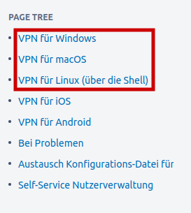
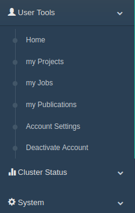
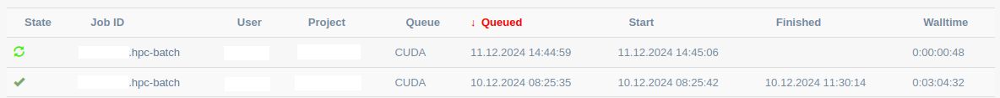

# High Performance Computing

High Performance Computing (HPC) is required for projects, that can't be run on a single computer, because they need a lot more resources. A HPC cluster is made of many GPUs and processors to make this possible. Especially with the recent advancements of AI, it has become more and more important to be able to use a HPC cluster. Deep learning models are often trained on large amounts of data and can take up a huge amount of computing power, meaning the training can only be reasonably run on a cluster.
This article will cover the basics of using the High Performance Computing cluster Hilbert, which is located at the Heinrich-Heine-University Düsseldorf. It uses the cluster management software [PBS Pro](https://www.altair.de/pbs-professional/). Be aware, that using clusters of other institutions may result in having to use other commands, because cluster management software and even the storage organisation vary.

## The HHU Cluster Hilbert

First of all, we will look at the structure of the cluster. There are three types of nodes - the login node, the storage node and various computing nodes.
The login node is used to connect to the system, for submitting jobs or to request a computing node for an interactive session. We will discuss later, what jobs and interactive sessions are.

For transferring files from and to the system you have to use the storage node, whereas the computing nodes are used to run programs. For more information take a look at the [Wiki](https://wiki.hhu.de/display/HPC/Wissenschaftliches+Hochleistungs-Rechnen+am+ZIM), where you can also find tutorials and further support.

:::caution
Never transfer files via the login node! The bandwidth of the login node is not large enough and transferring files would overload it. You risk being banned from the cluster if doing it anyways or at least getting a very angry e-mail.
:::

## Connect To The Cluster

Before being allowed to access Hilbert, you have to apply for it by filling out [this form](https://www.zim.hhu.de/forschung/high-performance-computing/antrag). After getting accepted, you can start by connecting to the intranet of the Heinrich-Heine-University via VPN. Otherwise you are not able to use the Hilbert cluster. To access the intranet, choose the right operating system under [this link](https://wiki.hhu.de/display/OPENVPN/VPN) as shown in the graphic below and follow the instructions.



After connecting to the intranet of the university, you can access the cluster via `ssh`. To connect to the login node use the following command and insert your HHU username instead of `$USER`.

```shell
ssh $USER@hpc.rz.uni-duesseldorf.de
```

For transferring or managing files connect to the storage node:

```shell
ssh $USER@storage.hpc.rz.uni-duesseldorf.de
```

## Storage System and How to Transfer Files

Hilbert has a unique storage system, which you should be familiar with, before starting to work on the cluster. You can find the basic information [here](https://wiki.hhu.de/display/HPC/Quickstart). Most of the time, you will need to work with the `project` folder. To change to this directory, use this command:

```shell
cd  /gpfs/project/$USER
```

You can manage your subdirectories as you would in your Linux terminal. We won't cover these commands here, but we will look at the mechanisms of transferring files from and to the cluster storage system. There is more than one way to do this, but we will focus on using `scp`. First, copy the target path or the one of your file, you want to transfer to your computer and disconnect from the cluster with `exit`.

To transfer files from the cluster to your computer, use the following command and insert the right paths.

```shell
scp $USER@storage.hpc.rz.uni-duesseldorf.de:/gpfs/project/$USER/{PATH} {TARGET DIRECTORY}
```

Transferring a file from your computer to the cluster is done by using this command:

```shell
scp {FILE} $USER@storage.hpc.rz.uni-duesseldorf.de:/gpfs/project/$USER/{TARGET PATH}
```

To copy entire directories, use `scp -r`instead of `scp`.

## Create Virtual Environment

For every project you should make a new virtual environment, in which you install the required packages for your program. In this article, we will show you, how you can make one for Python programs. In other languages the procedure may differ. Use the following commands in the given order.

```shell
# Load Python. Be sure to choose the right version. Otherwise it will load an old version (Python 2) by default.
module load Python/3.10.12

# Create virtual environment. The second "venv" is the name of the virtual environment directory and can be changed.
python -m venv venv

# Activate the virtual environment.
source venv/bin/activate
```

After activating the virtual environment, you will see an indicator on the left side of your prompt. In this case it will show the prefix `(venv)` as you can see below. With this, you can always check if the virtual environment is currently activated or not.

```shell
(venv) [$USER@hpc-storage-14k-2 test]$
```

Now, you can install all the packages that are needed for your project with `pip install`. To install more than one package at once, list the packages with spaces inbetween as shown below.

```shell
pip install numpy matplotlib
```

After installing the required packages, you can deactivate the virtual environment by using `deactivate`.

## Jobscripts

There are two ways to work on the cluster. You can start an interactive session, which we will discuss later in this article, or submit a jobscript. In the following, you will learn how to write a basic jobscript, which contains all the information, the cluster manager needs to have to run your job properly. The jobscript used below is based on the [tutorial in the Wiki](https://wiki.hhu.de/display/HPC/Unser+Batchsystem%3A+PBSPro).

To create a jobscript, open a new file of the type `.sh` (shell script).

First of all, you will need a header, which contains the following information:
- `#PBS -l select=1:ngpus=1:mem=16GB:accelerator_model=rtx6000` defines the hardware which you want to use. In this example, we request one RTX 6000 GPU and 16 GB memory.
- You also set the expected walltime with `#PBS -l`. If you haven't run this job before, you will have to estimate the time your job will need. Based on this information and the specifications of the hardware you request, the system will assign your job to a special queue.
- `#PBS -A "{PROJECT NAME}"` assigns the associated project to the job.
- If you want to receive an e-mail, when your job has terminated, you can specify your e-mail address with `#PBS -M {E-MAIL ADDRESS}`, but this isn't required.

You can add more information if you want to, but for the beginning this will be enough. After adding the header, you define the whole process, that should be executed while the job is running. In the following, there is an example of how a jobscript can look like.

```shell
#!/bin/bash
#PBS -l select=1:ngpus=1:mem=16GB:accelerator_model=rtx6000
#PBS -l walltime=08:00:00
#PBS -A "{PROJECT NAME}"
#PBS -M {MAIL ADRESS}
#PBS -m e

## Log which command is being executed.
set -x

## Set an environment variable for the logfile, which will include information about the executed job.
export LOGFILE=$PBS_O_WORKDIR/$PBS_JOBNAME"."$PBS_JOBID".log"

## Create scratch directory.
SCRATCHDIR=/gpfs/scratch/$USER/$PBS_JOBID
mkdir -p "$SCRATCHDIR" 

## Write some metadata at the beginning of the job into the logfile.
cd $PBS_O_WORKDIR
echo "$PBS_JOBID ($PBS_JOBNAME) @ `hostname` at `date` in "$RUNDIR" START" > $LOGFILE
echo "`date +"%d.%m.%Y-%T"`" >> $LOGFILE  

## Load modules.
module load Python/3.10.12 
## CUDA, for example, is needed if you want to train an AI model on a NVIDIA GPU.
module load CUDA/12.6.1

## Copy data from work directory to scratch directory.
cp -r $PBS_O_WORKDIR/* $SCRATCHDIR/.
cd $SCRATCHDIR
rm $PBS_JOBNAME"."$PBS_JOBID".log"

## Set environment variables if you need to.
export variable1="/gpfs/project/$USER/{PATH}}"
export variable2="/gpfs/project/$USER/{PATH}"
export variable3="/gpfs/project/$USER/{PATH}"

## Activate the virtual environment.
source venv/bin/activate

## Run your Python program.
python ultrasound_segmentation.py

## Copy data back from scratch directory to work directory.
cp -r "$SCRATCHDIR"/* $PBS_O_WORKDIR/.
cd $PBS_O_WORKDIR 

qstat -f $PBS_JOBID >> $LOGFILE

## Write some metadata at the end of the job into the logfile.
echo "$PBS_JOBID ($PBS_JOBNAME) @ `hostname` at `date` in "$RUNDIR" END" > $LOGFILE
echo "`date +"%d.%m.%Y-%T"`" >> $LOGFILE 
```

While your job is runninng, a logfile will be created in your project directory. If a problem occurs and the job is cancelled, there also will be an error logfile, in which you can check what went wrong.

## Manage Jobs

When your jobscript is ready, you can submit your job via the login node with the following command:

```shell
qsub ultrasound_segmentation_js.sh
```

Your job will automatically be assigned an ID, which will be shown after submitting. The ID will be needed if you want to get the status of the job via `qstat {JOB_ID}` or delete it with `qdel {JOB_ID}`.

Another way to get information about your jobs besides using the terminal, is the website [myJAM](https://myjam3.hhu.de/). After you log in, you can see a menu on the left side as shown in the graphic below.



Through selecting "User Tools" and "my Jobs" you get to an overview of your jobs, which is shown in the following graphic. Here, you can check the status of your job and the start and end time. By clicking on a job ID, you get even more information. For example, you can see, on which node your job is executed and how much resources are currently used.



## Interactive Sessions

Besides a jobscript, you can also start an interactive session to run your program. Connect to the login node and specify the needed resources similar to the header of the jobscript with the following command. The `-I`stands for interactive session.

```shell
qsub -I -l select=1:ncpus=1:mem=4GB -l walltime=00:30:00 -A {PROJECT NAME}
```

After being automatically connected to a computing node, you can start running your program via the terminal. Don't forget to change to the right directory and to load Python with `module load Python/3.10.12`. To run your script, use the command `python {FILE}`. After you are finished, you should always end the session by using `exit`. This way you won't block the resources for other users.

## References

- <https://www.altair.de/pbs-professional/>

- <https://wiki.hhu.de/display/HPC/Wissenschaftliches+Hochleistungs-Rechnen+am+ZIM>

- <https://myjam3.hhu.de/>