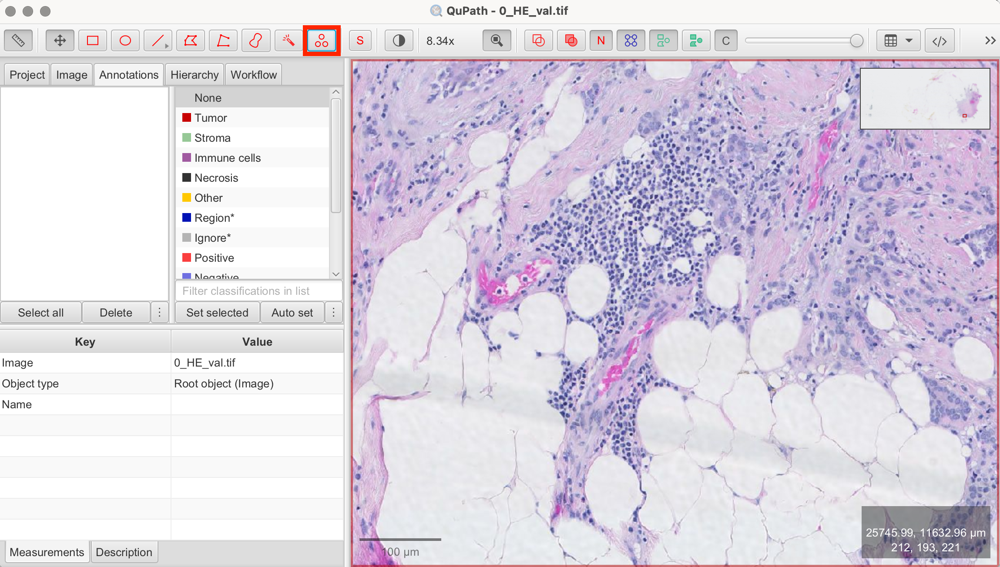
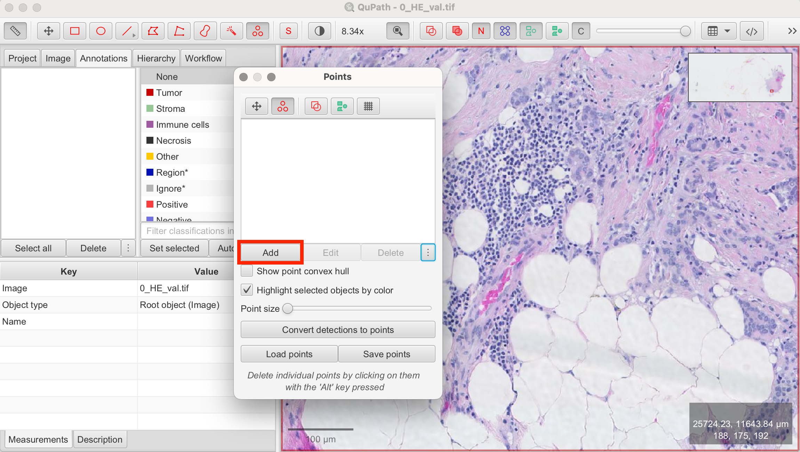
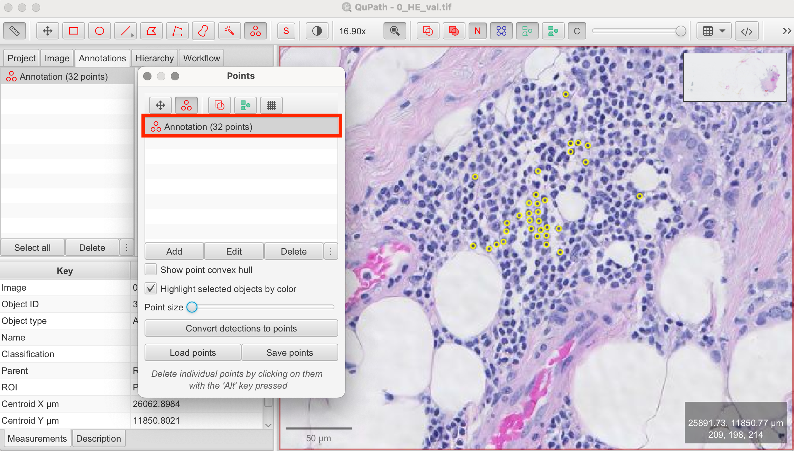
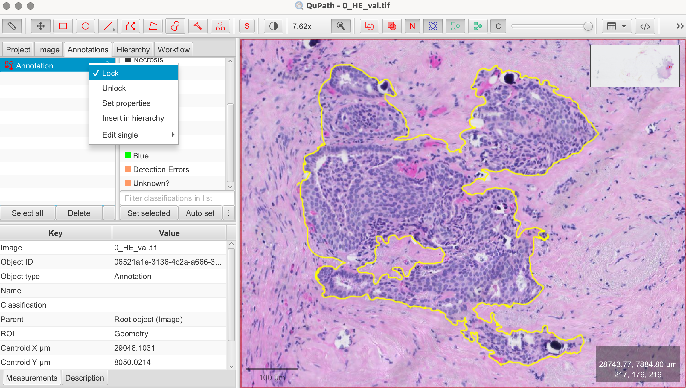
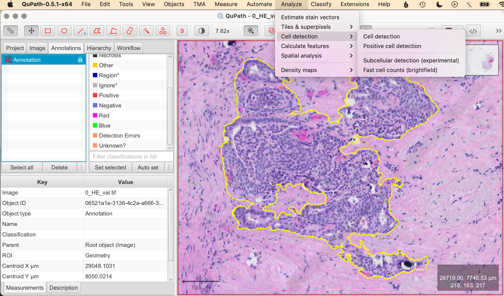
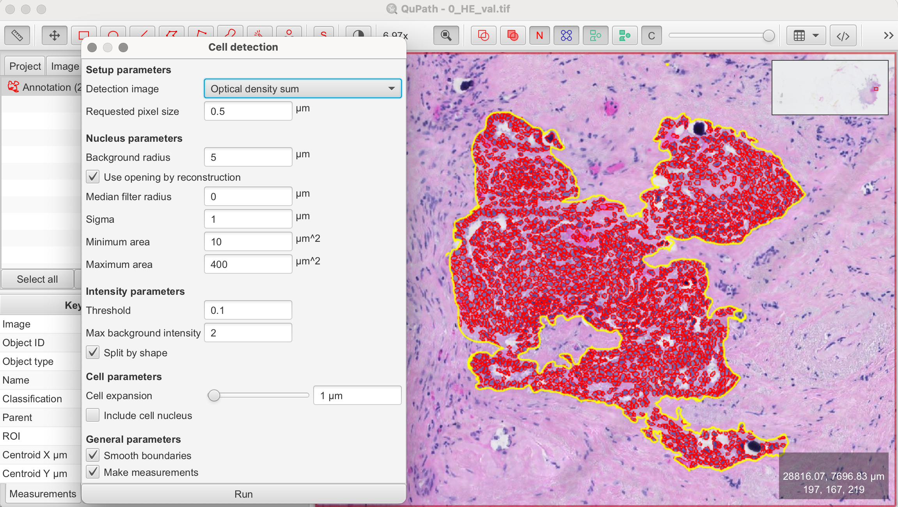
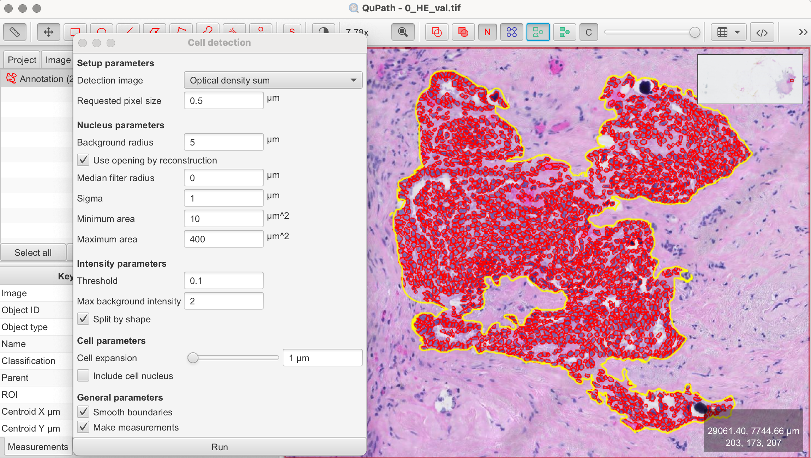
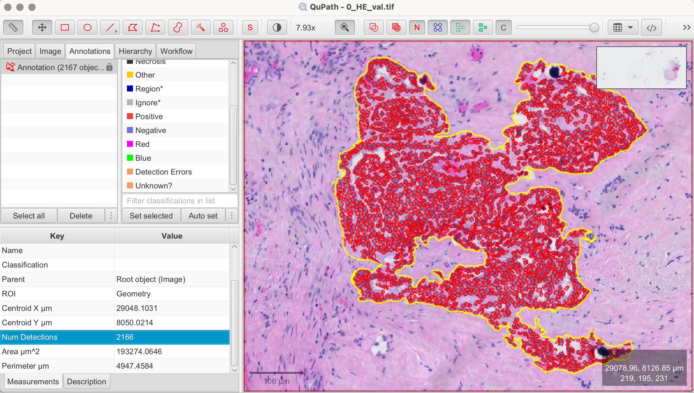

# QuPath: Cell Counting

In this article, we dive deeper into QuPath's cell counting functions, exploring both manual and automated approaches. We'll continue working with the ACROBAT breast cancer dataset, using the “0_HE_val.tif” image from the validation dataset “valid.zip” as our demonstration image.

## Manual Cell Counting 

Manual cell counting is a straightforward method where users manually annotate cells, making it ideal for small-scale analyses or when high precision is required.

### Steps for Manual Cell Counting:
1. **Open Your Image:** Start by opening the image in QuPath that you wish to analyze for cell counting.
2. **Select the Point Tool > Add Annotations > Place Markers**:
- In the toolbar, select the Point Tool.
- In the configuration panel, click Add to create an annotation for the cell class you wish to count.
- If desired, double-click on the annotation to rename it (e.g., "tumor cells," "nuclei," etc.) or to change the marker color.
- Adjust the point size based on the size of the cells.
- You can also create multiple annotations to categorize and count different types of cells simultaneously. For better visibility, assign a different color to each cell class.
3. **Place Markers**: Click on each cell within the image to place a marker. Each click represents one counted cell.
4. **Review and Save**: Once all markers are placed, review your work. If everything is satisfactory, you can save your points as a .tsv file. This is also useful if you need to pause counting and resume later from where you stopped.

The advantage of manual cell counting is obvious, as it provides a high level of precision. However it can be time-consuming, particularly for large datasets.

## Automatic Cell Detection and Counting

For larger datasets, automated cell counting is the preferred method, offering both speed and consistency. QuPath's automated tools use algorithms to detect and count cells based on various parameters.

**Tip**: When working with large images, tissues, or a high number of cells, cell detection can be resource-intensive in terms of processing time and computer memory. To optimize your workflow, it's recommended to perform initial tests on a smaller, representative area of your image. This allows you to fine-tune your parameters more efficiently. Once optimized, these parameters can be applied to larger areas or the entire image for further refinement.

- **Select the Rectangle/Brush/Circle/Wand Tool in the toolbar > Draw the shape over the area you want to analyze > Lock annotation**: Right-click on the annotation and select Lock Annotation to secure your selection. Locking ensures that the selected area remains fixed while you test and apply your optimized parameters. In the demonstration image, I used the Wand Tool to select an area with clearly visible cells for the automatic cell counting.

### Steps for Automated Cell Detection:
1. **Analyze > Open Cell Detection Tool**: Navigate to Analyze > Cell detection. This opens the cell detection configuration panel where you can customize the detection settings.
2. **Set Parameters**:
- **Threshold:** Adjust the intensity threshold to distinguish cells from the background. A lower threshold will include more pixels as potential cells, while a higher threshold will be more selective.
- **Cell Size:** Specify the expected size range of the cells by setting minimum and maximum diameter values. This helps the algorithm differentiate between actual cells and other tissue components.
- **Smoothing:** Apply a smoothing filter to reduce image noise, helping the algorithm focus on actual cells rather than random pixel intensity variations.
3. **Run Detection**: Once you've set your parameters, click Run to execute the cell detection algorithm. QuPath will automatically mark detected cells based on the configured settings.
4. **Review Results**: After the detection is complete, review the results. For better visibility, you can turn the detections on and off by pressing "D" on the keyboard or using the tool from the toolbar. Adjust parameters and rerun the detection until you’re satisfied.
5. **Apply Detection to Larger Area**: At this stage, you can apply the cell detection algorithm to a larger area or the entire image, depending on your requirements and analysis needs.
6. **Check Cell Detection Number**: Close the configuration panel and go to the Annotation tab of your image. Click on the annotation area you marked in the first step, and the "Measurements" panel will appear below. There, you will find Num Detections, which shows the number of detected cells from your cell detection—this number represents the counted cells.

## Final Result

As shown in my results, QuPath detected 2,166 cells in the annotated area. Given the time manual counting would require, this highlights the efficiency of QuPath's automated cell counting for large tissues or entire datasets.

## Manually Editing Pre-Detected Cells

Even after optimizing automatic cell detection, there might be cases where the algorithm incorrectly identifies cells or misses them. In such cases, you can manually edit pre-detected cells.

- **Remove falsely detected cells**: To delete incorrectly detected cells, simply double-click on the single cell and press the delete key. 

Combining automatic cell detection with manual editing often provides the best balance between the speed of automation and the precision of manual annotation.

## Next Steps: Classifying Detected Cells

After cell detection, QuPath allows you to classify detected cells based on additional criteria such as staining intensity, size, or texture. This is especially useful for distinguishing between different cell types. In the next article, we will learn how to perform this classification using a Ki-67 staining, which is commonly used to assess the proliferation rate of breast cancer tissues.

## References

- https://qupath.readthedocs.io/en/0.5/
- Bankhead, P. et al. QuPath: Open source software for digital pathology image analysis. Scientific Reports (2017). https://doi.org/10.1038/s41598-017-17204-5
