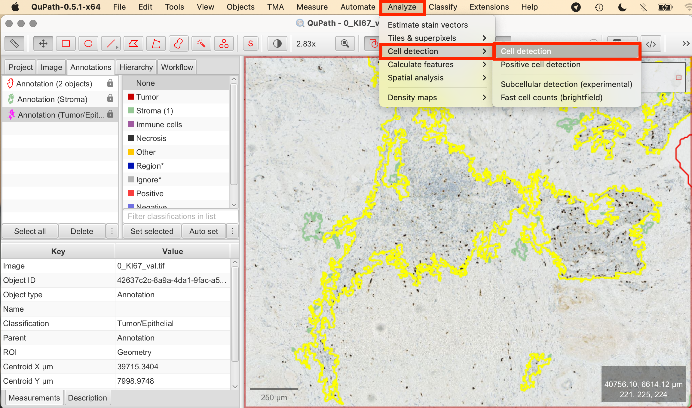

# QuPath: Ki-67 Index in Breast Cancer Tissue

## Introduction

In this tutorial, we will demonstrate how to measure the Ki-67 index in breast cancer tissue using QuPath. The Ki-67 index is a crucial marker for evaluating cell proliferation, providing insights into tumor aggressiveness and aiding in treatment decisions.

## Importing the Ki-67-Stained Whole Slide Image

We will be working with a Ki-67-stained whole-slide image (WSI) from the ACROBAT dataset. For demonstration purposes, we'll use the image "0_Ki-67_val.tif" from the validation dataset "valid.zip". You can import this image by following the steps outlined in our first article,["QuPath: Introduction"](./qupath_01_Introduction.md).

## Viewing and Preparing the Image

### Understanding H-DAB Staining

Our demonstration image uses H-DAB staining, a technique explained in our previous article. Here’s a brief recap:

- Hematoxylin (H) stains the nuclei blue or purple.
- DAB (Diaminobenzidine) stains the target antigen, in this case, Ki-67, brown.

In Ki-67 staining, DAB highlights Ki-67-positive nuclei with a brown color, indicating actively proliferating cells. The intensity and distribution of the brown stain provide insights into the tumor cells' proliferation rate.

### Understanding Ki-67 index

The Ki-67 index is widely used to measure tumor cell proliferation. In H-DAB-stained tissue, brown-stained nuclei represent Ki-67-positive cells, while blue or purple nuclei represent non-proliferating cells. Before detecting and counting cells, it's essential to identify the correct regions of interest (ROIs) and understand what to include in the analysis.

### Tumor Cell Regions for Analysis

To accurately measure the Ki-67 index, we must later focus on regions with identifiable tumor cells. Ki-67 index is not measured within the whole sample, but regions with clearly identifiable tumor cells, excluding non-tumor components like stroma or necrosis. Areas where Ki-67 expression appears most prominent, often called "hotspots," are ideal for counting. Avoid regions with clumped or indistinct cells, as this can lead to inaccurate results when using QuPath’s automated tools.

### Calculating Ki-67 Index

The standard approach involves counting at least 500 to 1,000 tumor cells in areas of high magnification, focusing on those with the highest proliferation. The Ki-67 index is calculated as the percentage of Ki-67-positive nuclei out of the total number of nuclei in the tumor region, using the formula:

For this tutorial:

- Focus on Tumor Regions with high concentration of brown-stained nuclei (= Ki-67 positive nuclei)
- Exclude the stromal regions, which are the lighter areas with few cells

## Identifying and Selecting Regions of Interest (ROIs)

In the previous article,["QuPath: Tissue Segmentation Using a Pixel Classifier"](./qupath_03_tissue_segmentation.md), we covered how to differentiate between various tissue regions. As you proceed with this tutorial, ensure that you have already completed the tissue segmentation step. 

Depending on your tissue sample, there are different approaches for moving forward. You can choose to apply the following steps across the entire tumor/epithelial area previously classified by the pixel classifier. In this case, both cell detection and Ki-67-positive cell detection will be performed for the entire region. While this area may not represent a specific hotspot, you can later draw annotations to focus on specific subregions or hotspots. QuPath will automatically display the number of cells and Ki-67-positive cells for each annotation you create within the broader tumor/epithelial area. Alternatively, if your tissue is large or a distinct hotspot is visually evident, focusing on that specific area can produce faster and potentially more accurate results, especially in terms of classification parameters like threshold adjustments. For this tutorial, we will begin by analyzing the entire tissue section.

## Automatic Cell Detection and Counting

Before we can specifically count Ki-67-positive cells, we first need to detect all cells in the selected region.

1. **Analyze > Cell Detection:** Navigate to Analyze > Cell detection. This opens the cell detection configuration panel. 
2. **Set Parameters:**
- **Detections Image > Optical Density Sum:** This option helps to differentiate cells based on staining intensity.
- **Threshold:** Adjust the intensity threshold to distinguish cells from the background. A lower threshold will include more pixels as potential cells, while a higher threshold will be more selective.
- **Cell Size (Minimum Area, Maximum Area):** Define the size range of the cells by setting minimum and maximum area values to differentiate actual cells from other tissue components.
- **Include/Exclude Cell Nucleus:** Ensure to tick off this box to exclude the nucleus in the detection.
3. **Run Detection:** Once you've set your parameters, click Run to execute the cell detection algorithm. QuPath will automatically mark detected cells based on the configured settings.
4. **Review Results:** After detection, review the results. You can adjust the parameters and rerun the detection until you’re satisfied. Double-click on a nucleus to view its DAB OD mean value in the measurements panel, which can help finding a suitable threshold to detect all cells. For better visibility, you can turn the detections on and off by pressing "D" on the keyboard or using the tool from the toolbar. 
5. **View Measurements:** The number of detected cells in your selected annotation will be displayed in the Measurements tab on the bottom left.

QuPath detected a total of 36362 cells within my tumor/epithelial region. 

## Cell Detection for Ki-67-Positive Cells

Now that general cell detection is complete, we can focus on detecting Ki-67-positive nuclei to measure the Ki-67 index, which is the percentage of Ki-67-positive cells relative to the total cell count. Continue working with the previously annotated area where cell detection was completed.

1. **Analyze > Positive Cell Detection:** Navigate to Analyze > Positive Cell detection. This opens the cell detection configuration panel where you can customize the detection settings to match the Ki-67-stained nuclei. 
2. **Set Parameters:**
- **Setup Parameters:** These remain the same as in the previous cell detection.
- **Intensity Threshold Parameters:** To categorize cells as Ki-67-positive or negative, tick the "Single Threshold" option. The first threshold will be used to classify cells. The Score compartment value of **"Cell: DAB OD mean"** indicates that the classification is based on the average DAB staining within the detected cells.
3. **View Measurements:** QuPath will automatically calculate the Ki-67 index, which is the percentage of Ki-67-positive cells relative to the total cell count. The results will be displayed in the Measurements tab on the bottom left.

In this case, QuPath detected 5.37 % Ki-67-positive cells out of the previously detected total of 36362 cells within the tumor/epithelial region.

## Selecting a Hotspot for Ki-67 Analysis

After completing both cell detection and positive cell detection across the entire tumor/epithelial region, you can now focus on identifying a hotspot to calculate the Ki-67 index more precisely. While QuPath does not automatically highlight hotspots, you can visually select an area that appears to have the highest concentration of Ki-67-positive cells. Hotspots are typically identified either through manual inspection or semi-automated methods like heatmaps.

It’s important to note that this annotation should be placed within the larger annotation of the tumor/epithelial tissue. Once the annotation is created, QuPath will automatically calculate and display the number of detected cells along with the percentage of Ki-67-positive cells within the selected region.

- **Select the Brush or Wand Tool:** Draw a shape along the outline of the tissue, in which you you want to continue working. Right-click on the annotation and select "Lock Annotation" to secure the selection.

In this example, QuPath detected 1807 cells within my annotated hotspot, with 14.1% classified as Ki-67-positive.

## Interpreting and Validating Results
The final step involves interpreting the Ki-67 index. Generally, a higher Ki-67 index indicates a more aggressive tumor. 

## Disclaimer

This tutorial is intended for learning and technical understanding of Ki-67 analysis in QuPath. While QuPath and similar tools are increasingly used in clinical diagnostics, manual review by a trained pathologist is obligatory for accurate interpretation.

Please note that the images used in this article have not been reviewed by a pathologist. As such, the percentage of Ki-67-positive cells may not be pathologically accurate. This tutorial is meant to demonstrate the general principles of Ki-67 scoring in QuPath and is not intended for clinical or diagnostic use.

## References

- https://qupath.readthedocs.io/en/0.5/
- Bankhead, P. et al. QuPath: Open source software for digital pathology image analysis. Scientific Reports (2017). https://doi.org/10.1038/s41598-017-17204-5
- Skjervold, Anette H et al. Visual and digital assessment of Ki67 in breast cancer tissue - a comparison of methods. Diagnostic pathology (2022). https://doi.org/10.1186/s13000-022-01225-4
- Nielsen TO, Leung SCY, Rimm DL, et al. Assessment of Ki67 in Breast Cancer: Updated Recommendations From the International Ki-67 in Breast Cancer Working Group. Journal of the National Cancer Institute (2021). https://doi.org/10.1093/jnci/djaa201
