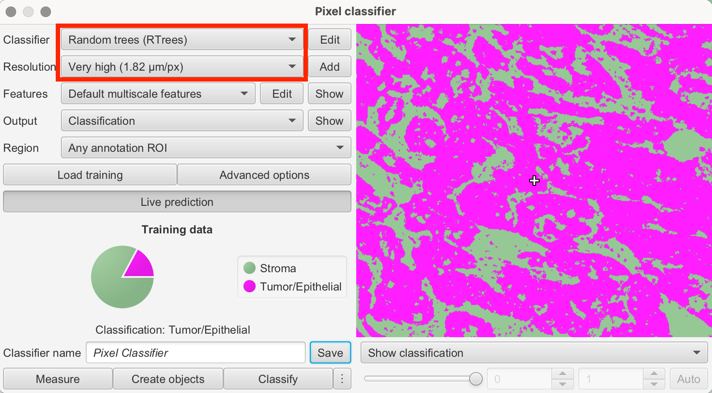
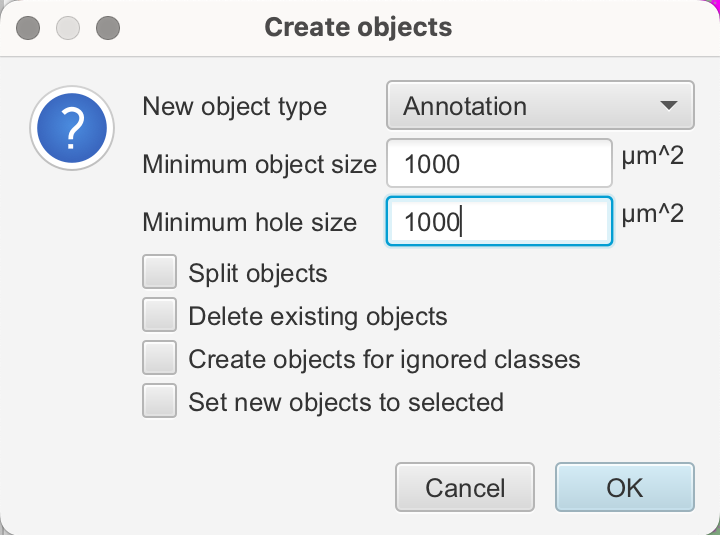
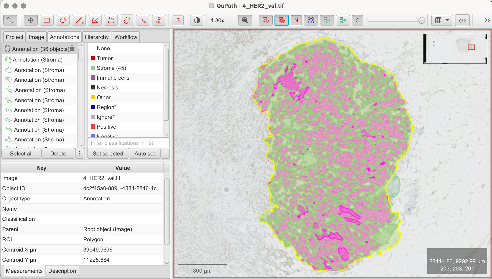
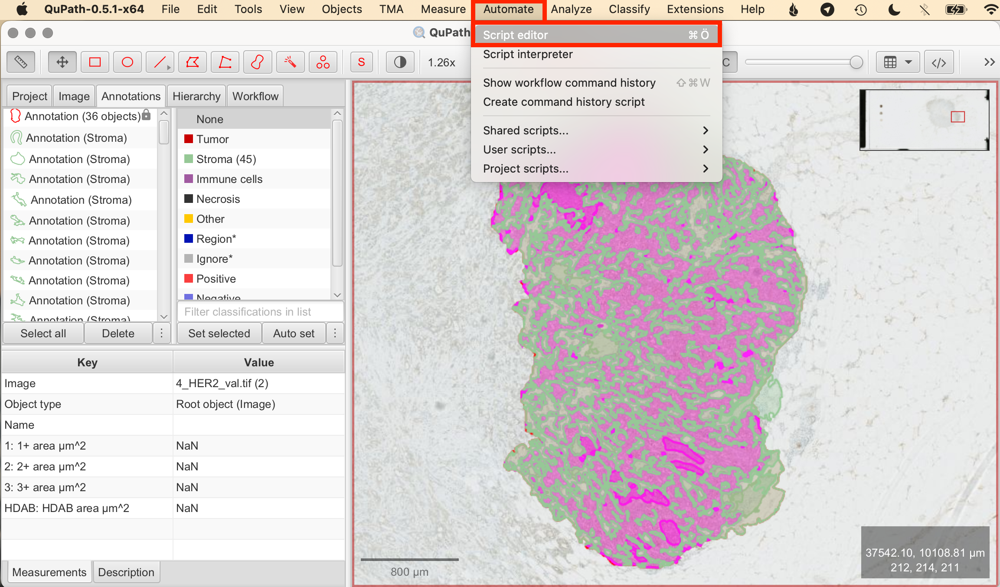
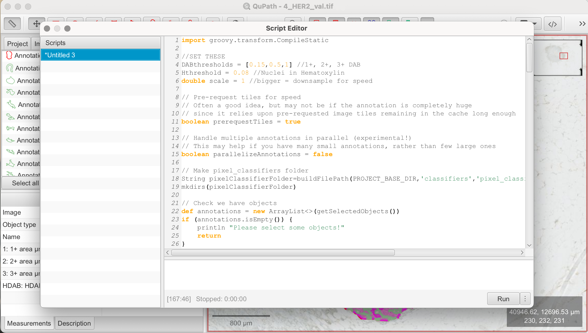
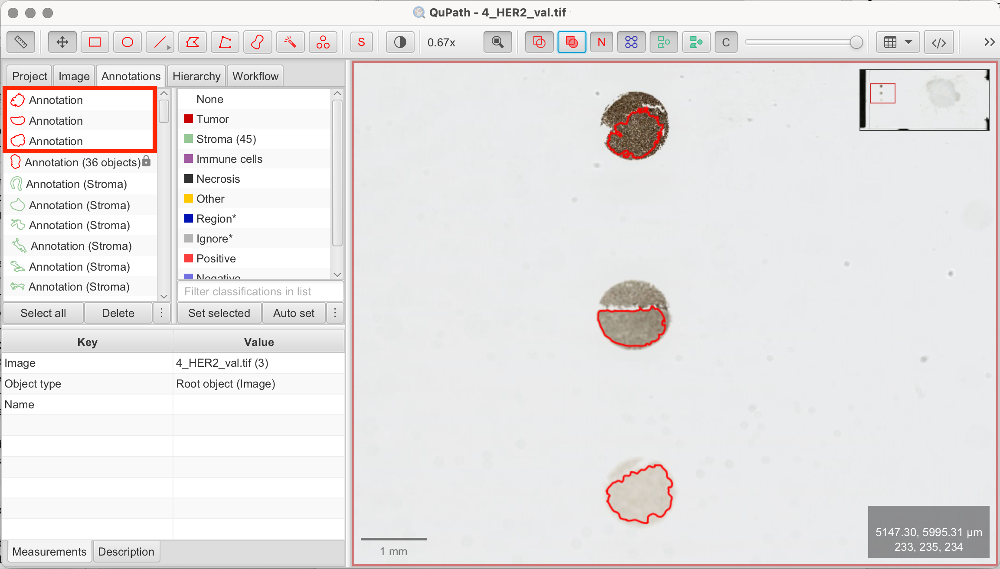
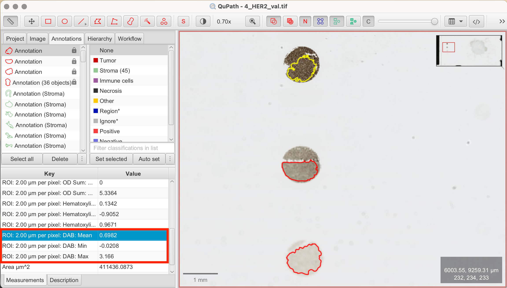
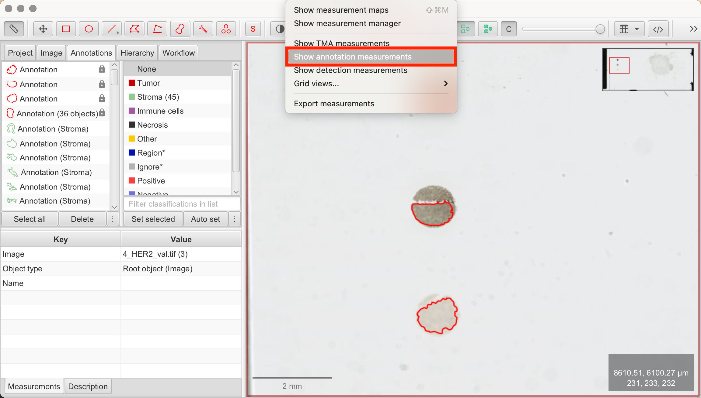
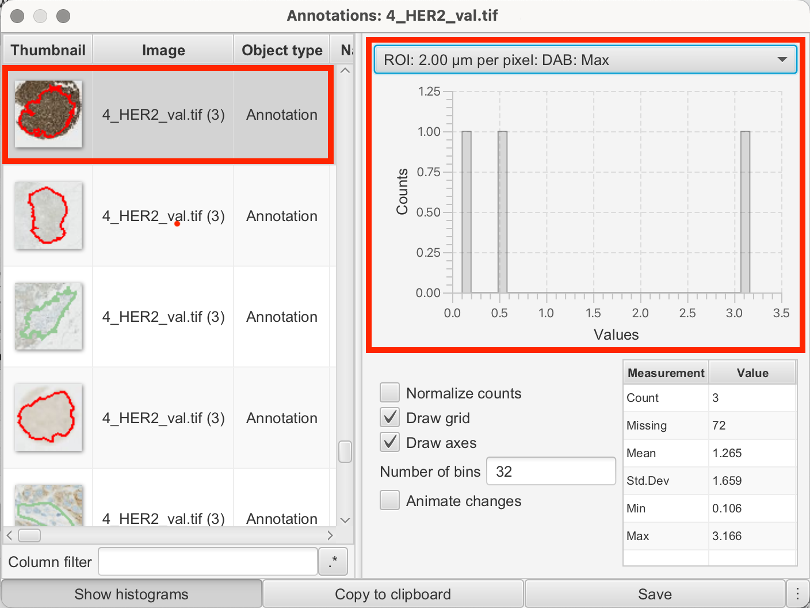
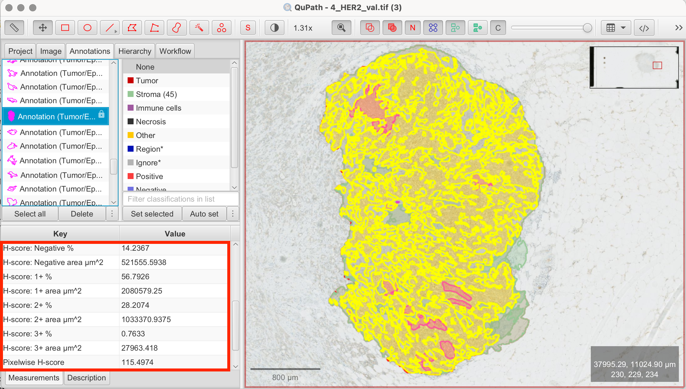

# HER2 Expression in Breast Cancer Tissue with QuPath

## Introduction

In this article, we will guide you through the process of evaluating HER2 (Human Epidermal Growth Factor Receptor 2) expression in breast cancer tissues using QuPath. HER2 overexpression is a key factor in identifying patients who may benefit from HER2-targeted therapies, such as trastuzumab. Accurate HER2 assessment is critical for optimal treatment decisions in breast cancer management.

## Importing HER2-Stained Images

To begin, we will work with HER2-stained Whole Slide Images (WSIs) from the publicly available ACROBAT study dataset, which includes images from 1,153 primary breast cancer patients. For this tutorial, we'll use a representative HER2-stained image “4_HER2_val.tif” from the validation dataset “valid.zip”. For details on how to import images, refer to the "Introduction to QuPath" tutorial.

In some HER2 slides, as you can also see in our demonstration slide, reference dots are included to help standardize DAB (Diaminobenzidine) staining intensity. These dots represent levels of HER2 expression, corresponding to scores of 0, 1+, 2+, and 3+ allowing for easier visual comparison.

## Viewing and Preparing the Image

### Understanding H-DAB Staining

Our demonstration image uses H-DAB staining, a technique explained in our previous article. Here’s a brief recap:
- Hematoxylin (H) stains the nuclei blue or purple.
- DAB (Diaminobenzidine) stains the target antigen, in this case, HER2, brown.

In HER2 staining, DAB highlights HER2-positive membranes with a brown color, indicating overexpression of the HER2 protein. HER2 is located on the cell membrane because it is a transmembrane receptor that plays a key role in cell growth and proliferation. The intensity and distribution of the brown stain provide insights into HER2 expression levels in tumor cells.

### Understanding HER2 Scoring

HER2 scoring is a critical component in the evaluation of breast cancer, particularly for determining the suitability of targeted therapies. The scoring system is generally based on the intensity of HER2 membrane staining and the percentage of tumor cells showing this staining. According to guidelines developed by the American Society of Clinical Oncology (ASCO) and the College of American Pathologists (CAP), HER2 scoring is categorized as follows:

- **Score 0:** No staining or membrane staining in <10% of tumor cells.
- **Score 1+ (Negative):** Faint membrane staining in ≥10% of tumor cells with incomplete membrane staining. The cells exhibit incomplete membrane staining.
- **Score 2+ (Equivocal):** Weak to moderate complete membrane staining in ≥10% of tumor cells.
- **Score 3+ (Positive):** Strong complete membrane staining in ≥10% of tumor cells.

### Tumor Cell Regions for Analysis

HER2 scoring is typically performed on entire tumor areas, ensuring that at least 500–1000 nuclei are evaluated, as recommended by clinical guidelines. However, if the sample is large, scoring may be done in representative "hotspots" where HER2 overexpression is likely. 

### Calculating HER2 Score

The HER2 score is based on the proportion of cells falling into each intensity category. HER2 is considered positive if ≥10% of cells are classified as 3+. For cases classified as 2+ (Equivocal), further testing, such as Fluorescence In Situ Hybridization (FISH), is often required to confirm HER2 status.

## Identifying and Selecting Regions of Interest (ROIs)

Before proceeding with analysis, ensure that you have completed tissue segmentation to separate tumor/epithelial and stromal regions, as covered in the article “Tissue Segmentation Using a Pixel Classifier in QuPath”. 

For demonstration purposes, I will analyze a smaller representative area rather than the entire tissue. Here’s a visual guide on how I performed tissue segmentation.








## Pixel-Wise HER2 Scoring Using QuPath

### Understanding the Pixel-Wise HER2 Method

To quantify HER2 expression, we now employ a pixel-wise approach using H-Score, which analyzes each pixel's staining intensity across the tissue. Instead of focusing on individual cells, this method classifies pixels based on the intensity of membrane staining (weak, moderate, or strong). Using this method, QuPath will calculate the % of 1+/2+/3+ and Negative as well as an overall H-Score. While this method is based on the standard pathological classes of 1+/2+/3+, the pixel-wise H-Score provides a continuous scale that captures.

### Pixel-wise H-Score Formula


This formula generates a score between 0 and 300, representing the overall HER2 expression. A higher H-Score reflects stronger staining. HER2 positivity in manual scoring generally correlates with an H-Score close to 300.

### Download the Pixelwise H-Score Script

Familiarize yourself with the script by reviewing it here. Before executing the script, we will add some steps to figure out parameters for individualization.

1. **Automate > Script Editor:** This opens the blank Script Editor.
2. **Insert Pixelwise H-Score Script:** Copy the pixelwise H-Score Groovy script from [here](https://github.com/saramcardle/Image-Analysis-Scripts/blob/master/QuPath%20Groovy%20Scripts/QuPath%200.4.x/PixelwiseHScore.groovy) and paste the script in the script editor.
3. **Set Script Parameters:** The script allows you to define intensity thresholds (weak, moderate, strong) for HER2 membrane staining. Individual parameters are set in line 4-6 of the script:
- DAB-thresholds: Set thresholds for classifying 1+, 2+, and 3+ in DAB.
- H-threshold: Set threshold for nuclei detection in Hematoxylin.





At this point, we will stop to learn how to determine the thresholds to be set.

### Identifying DAB-Thresholds

Visual inspection is often used to determine initial thresholds based on staining intensity. However, QuPath provides tools to assist in identifying thresholds for differentiating HER2 Scores 1+/2+/3+.

To identify accurate thresholds, we will use the reference dots on the slide. The method is simple: draw an annotation within each reference dot. Ensure that no background is selected. Next, QuPath calculates intensity values such as mean and maximum DAB values within each annotation. This will give us an idea of suitable threshold ranges. We will then test various thresholds using the pixel-wise H-Score script on the reference dots again. An ideal threshold would result in the script measuring 100% of 1+/2+/3+ in the corresponding reference dot. Exact separation is usually not possible, but using this method with some trial-and-error is often successfull. Always visually verify that the script's measurement results are logical by comparing them to your visual assessment.

1. **Draw Annotations:** Use the Rectangle, Brush, or Wand tools to annotate each reference dot on the left of the slide.
2. **Select Annotations:** Select all three annotations from the reference dots simultaneously.
3. **Analyze > Calculate features > Add intensity features:** This opens the panel to add intensity features. Check the following boxes and click “Run”:
- Channels/Color transforms: Optical density sum, Hematoxylin, DAB
- Basic features: Min & Max
4. **View measurements:** Once the calculation is complete, close the panel. Clicking on the annotations in the annotation tab will display results for each reference dot in the Measurements tab on the bottom left.






You can now choose thresholds based on the measurements to start running the script based on the different mean, min, or max DAB values. Another way to visualize measurements is through a histogram.

### Histograms

Histogram can display the distribution of DAB OD mean/min/max values across cells/annotations/detections, in our case among the reference dots. This can help for easier visual detection of thresholds for classification.

1. **Measure > Show Annotation Measurements:** A table of annotation measurements will appear. In this table, select the annotated reference dots.
2. **Show Histograms:** Click “Show Histograms” at the bottom left of the measurements panel. On the right, QuPath will open a new tab. At the top, select DAB: Mean/Min/Max to compare intensity values between the reference dot annotations.






For example, the intensity values in my annotations from the reference dots were as follows:

## 3+ 

| ROI                       | DAB Value     |
|:------------------------:|:-------------:|
| 2.00 µm per pixel       | Mean: 0.6982  |
| 2.00 µm per pixel       | Min: -0.0208  |
| 2.00 µm per pixel       | Max: 3.166    |

## 2+ 

| ROI                       | DAB Value     |
|:------------------------:|:-------------:|
| 2.00 µm per pixel       | Mean: 0.2375  |
| 2.00 µm per pixel       | Min: 0.0983  |
| 2.00 µm per pixel       | Max: 0.5249    |

## 1+

| ROI                       | DAB Value     |
|:------------------------:|:-------------:|
| 2.00 µm per pixel       | Mean: 0.064   |
| 2.00 µm per pixel       | Min: 0.0181   |
| 2.00 µm per pixel       | Max: 0.1056    |

Based on this data, I decided to set my parameters as follows as a baseline for further fine-tuning: 

```r
//SET THESE
DABthresholds = [0.06,0.1,0.52] //1+, 2+, 3+ DAB
Hthreshold = 0.08 //Nuclei in Hematoxylin
double scale = 1 //bigger = downsample for speed
```

### Testing/Validation of DAB-Thresholds 

To validate thresholds and find the optimal one, we will run the Pixel-Wise Script on the annotated reference dots. If we use ideal thresholds, the script should detect 100% of 2+ in the 2+ reference dot and 100% of 1+ in the 1+ reference dot, etc.

Here’s how we do it:

1. **Select Annotation:** Choose one of the reference annotations you previously used to add intensity measurements.
2. **Script Editor > Pixelwise H-Score Script:** Open the script as explained earlier.
3. **Set Script Parameters:** Individual parameters are set in line 4-6 of the script. Edit your thresholds you just figured out here:
- DAB-thresholds: Set thresholds for classifying 1+, 2+, and 3+ in DAB.
4. **Run Pixel-Wise Analysis Script:** Execute the script. 
5. **View measurements:** Once the calculation is complete, close the panel. Results for each reference dot will appear in the Measurements tab on the bottom left. By examining the percentages in each DAB class (1+/2+/3+), you can evaluate how well your thresholds perform.
6. **Review and repeat:** Run the script on all reference dot annotations, adjust parameters, and re-run until satisfied.

I decided on the following thresholds to run the script on my entire tumor/epithelial annotation in the following step:

```r
//SET THESE
DABthresholds = [0.03,0.1,0.3] //1+, 2+, 3+ DAB
Hthreshold = 0.05 //Nuclei in Hematoxylin
double scale = 1 //bigger = downsample for speed
```

## Calculating Pixel-Wise H-Score in QuPath

Now that we have established parameters for thresholding and classification, we are ready to run the script on our tumor/epithelial area to obtain the final H-Score and HER2 expression for our tumor/epithelial tissue. We’re opening again the script editor.

1. **ROI Selection:** Select your annotated tumor/epithelial region as defined by the pixel classifier.
2. **Automate > Script Editor > Insert Pixelwise H-Score Script:** Copy and paste the pixelwise H-Score Groovy script from [here](https://github.com/saramcardle/Image-Analysis-Scripts/blob/master/QuPath%20Groovy%20Scripts/QuPath%200.4.x/PixelwiseHScore.groovy).
3. **Set Script Parameters:** The script allows you to define intensity thresholds (weak, moderate, strong) for HER2 membrane staining. Individual parameters are set in line 4-6 of the script. Other than that there are no more modifications necessary.
- **DAB-thresholds:** Set thresholds for classifying 1+, 2+, and 3+ in DAB.
- **H-threshold:** Set threshold for nuclei detection in Hematoxylin.
- **Double scale:** A speed optimization parameter. Keep this at 1.
4. **Run Pixel-Wise Analysis Script:** Click "Run" to execute the script. Once the script is finished it will be displayed at the bottom of the script editor. Once finished, you can close the editor. 
5. **View Measurements:** QuPath will automatically calculate the percentages of cells for each H-Score category (1+/2+/3+) and display the overall H-Score in the Measurements tab on the bottom left.



In my annotated tumor/epithelial region I calculated a H-Score of 115.

## Verifying Accuracy of the Pixel-Wise Method

To ensure consistency between pixel-wise H-Score and manual HER2 scoring, it’s essential to validate results manually. Always compare pixel-wise H-Scores with those from manual methods.

## Interpreting and Validating Results

The final step is to interpret HER2 expression. According to manual scoring guidelines, HER2 is positive if ≥10% of tumor cells are classified as 3+. Cases scoring 2+ are equivocal and often require additional testing, such as FISH. The pixel-wise H-Score adds a finer level of detail but should be cross-validated with manual assessments for clinical accuracy. 

## Disclaimer

This tutorial is intended for learning and technical understanding of HER2 analysis in QuPath. While QuPath and similar tools are increasingly used in clinical diagnostics, manual review by a trained pathologist is obligatory for accurate interpretation. The images used in this tutorial have not been reviewed by a pathologist, and the percentages of HER2-positive cells presented here may not reflect pathologically accurate results.

## References

- https://qupath.readthedocs.io/en/0.5/docs/intro/about.html2
- https://forum.image.sc/t/implementing-h-score/75041
- https://github.com/saramcardle/Image-Analysis-Scripts/blob/master/QuPath%20Groovy%20Scripts/QuPath%200.4.x/PixelwiseHScore.groovy
- Bankhead, P. et al. QuPath: Open source software for digital pathology image analysis. Scientific Reports (2017). https://doi.org/10.1038/s41598-017-17204-5
- Ram S, Vizcarra P, Whalen P, et al. Pixelwise H-score: A novel digital image analysis-based metric to quantify membrane biomarker expression from immunohistochemistry images. PLoS One (2021). https://doi.org/10.1371/journal.pone.0245638
- Bankhead P, Fernández JA, McArt DG, et al. Integrated tumor identification and automated scoring minimizes pathologist involvement and provides new insights to key biomarkers in breast cancer. Laboratory investigation; a journal of technical methods and pathology (2018). https://doi.org/10.1038/labinvest.2017.131
- Wolff AC, Somerfield MR, Dowsett M, et al. Human Epidermal Growth Factor Receptor 2 Testing in Breast Cancer: ASCO-College of American Pathologists Guideline Update. Journal of clinical oncology : official journal of the American Society of Clinical Oncology (2023). https://doi.org/10.1200/JCO.22.02864
