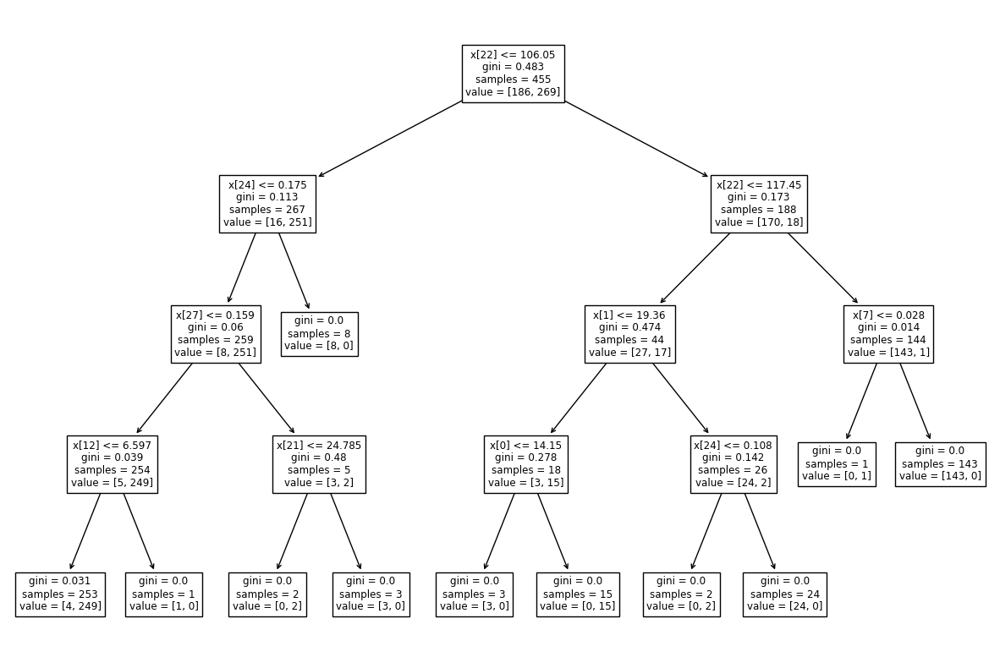
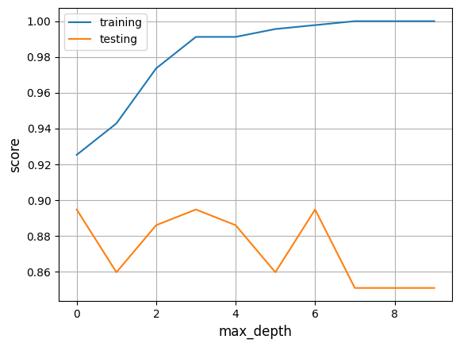

# Supervised Machine Learning

Supervised machine learning is used to categorize unknown data with the use of models which were trained with a labeled dataset. In this context "labeled" means, that for example images of breast cancer cells are already classified as benign or malignant.

In Python there are various libraries that can be used to build a machine learning model. In the following we will use [scikit-learn](https://scikit-learn.org/stable/index.html).

First, we will need a dataset that is already labeled. Because it is simple to work with, we can use the [Breast Cancer Wisconsin dataset](https://archive.ics.uci.edu/dataset/17/breast+cancer+wisconsin+diagnostic) in the beginning. For every image of this dataset features of the cell nuclei were measured and put into a list together with the label "benign" or "malignant". If the label is "benign", the list contains `0`, which stands also for `false` and for "malignant" it contains `1` for `true`.

## Packages

To implement a machine learning model in Python we first need to import all dependencies with the following code:

```python
from sklearn.datasets import load_breast_cancer
from sklearn.model_selection import train_test_split
from sklearn import tree
from sklearn.metrics import confusion_matrix
import matplotlib.pyplot as plt
```

## Load and access data

The dataset we want to work with is already integrated in scikit-learn. We can load it to use it further.

```python
dataset = load_breast_cancer()
```

Sometimes you would have to preprocess the data to use it for machine learning. Because our dataset hasn't any missing values or other critical content, we don't have to do this in this case.

The dataset contains metadata, which is not needed for our machine learning model. The only parts we will need are the labels and the data itself. Because this dataset is organized as a dictionary, it consists of key-value pairs. An example of an arbitrary dictionary you can see here:

```python
dataset = {"data": [[0.3, 0.04, ...], 
                    [0.5, 0.06, ...], 
                    ...],
           "target": [0, 0, 1, ...],
           "feature_names": ["radius", "area", ...]
          }
```

This dictionary has similar key-value pairs as the one that we use. The labels "benign" and "malignant" can be found under the key "target". To access these labels and the data, the following code is used:

```python
data = dataset["data"]
targets = dataset["target"]
```

## Split dataset

A machine learning needs to be trained and tested. In order to test our model after we train it, we will need data, that wasn't seen by the model before. For that reason we have to split our original dataset in two seperate datasets. We can use the function `train_test_split()` for that:

```python
X_train, X_test, y_train, y_test = train_test_split(data, targets, test_size = 0.2, shuffle = False)
```

Normally the test dataset is smaller than the one for training, so we use the parameter `test_size = 0.2` to use 20 percent of the original dataset as testing data. The parameter `"shuffle = False"` makes sure that we will get the same splits if we run the programm multiple times.
`X_train` refers to the training data and `y_train` to the training labels, whereas `X_test` and `y_test` represent the data and labels of the testing set.

## Define model

There are different kinds of algorithms we can use to define a supervised machine learning model. The choice depends on the underlying data and the task, which can for example be classification or regression. Classification algorithms are used to categorize data, whereas regression algorithms can predict new data.
Popular methods are for example decision trees, random forests and logistic regression.

In this case we want our model to classify the data with the labels "benign" or "malignant". Our method of choice will be a decision tree. To define our model we use `DecisionTreeClassifier()`:

```python
model = tree.DecisionTreeClassifier(random_state = 0, max_depth = 4)
```

`random_state` must be set to an integer to prevent that the results of the training randomly change when the programm runs again. The parameter `max_depth` determines the depth of the decision tree.


## Train model

Now, after we defined our model, we can train it. In order to do that, we use the training data and training labels as parameters for the `fit()` function. 

```python
model.fit(X_train, y_train)
```

The model parameters should now be fitted to predict the correct labels from the data.

To visualize the created tree we can use the following code:

```python
tree.plot_tree(model)
```

Output:



## Test model

To test the performance of our machine learning model we use the function `score()` on the training and testing data and compare the results. Ideally the results should be nearly the same.

```python
print(f"Training accuracy:  {model.score(X_train, y_train)}")
print(f"Testing accuracy:  {model.score(X_test, y_test)}")
```

Output:
```
Training accuracy:  0.9912087912087912
Testing accuracy:  0.8947368421052632
```

As we can see, there is a big difference between the two results which would indicate overfitting. That means, the model memorized the training data and doesn't perform well on unseen data.

To solve this problem we could change the `max_depth` parameter of `DecisionTreeClassifier()` to a smaller number. For every new model you individually need to adjust `max_depth` to avoid overfitting.
Here you can see how the score varies if the max_depth is changed in this example:



Other metrics we can look at are the sensitivity and specificity. We can calculate them with the following code.

```python
y_pred = model.predict(X_test)

# We need the confusion matrix to calculate the sensitivity and specificity
conf_mat = confusion_matrix(y_test, y_pred)
tp, fn, fp, tn = conf_mat.ravel()

sensitivity = tp / (tp + fn)
specificity = tn / (tn + fp)

print(f"Sensitivity: {sensitivity}")
print(f"Specificity: {specificity}")
```

Output:
```
Sensitivity: 0.8846153846153846
Specificity: 0.8977272727272727
```

As we can see, the sensitivity is 88,46% and the specificity is 89,77%.

To make it more clear, that our model can now classify breast cancer cells as benign or malignant, we take a single data point as input. Therefore we can chose any point of our test data `X_test()` and let our model predict the label. To check, if it is correct, we can print the already known label with the `y_test` array:

```python
# Prints the known label of the sixth datapoint
print(y_test[5])
```

Output:
```
0
```

Now we use our model:

```python
# Predicts the label of the given data
print(model.predict(X_test[5:6]))
```

Output:
```
[0]
```

We can see, that the outputs match. Our model predicted correctly, that this breast cancer cell is benign.

## Summary

To have a better overview, here is a short summary of the most important steps to create your own supervised machine learning model.

```python
# Import dependencies
from sklearn.datasets import load_breast_cancer
from sklearn.model_selection import train_test_split
from sklearn import tree

# Load dataset
# This step can vary if you use an external dataset
dataset = load_breast_cancer()

# Preprocess data if needed

# Access labels and data
data = dataset["data"]
targets = dataset["target"]

# Split the dataset in training data and a test set
X_train, X_test, y_train, y_test = train_test_split(data, targets, test_size = 0.2, shuffle = False)

# Define your model
model = tree.DecisionTreeClassifier(random_state = 0, max_depth = 4)

# Train model
model.fit(X_train, y_train)

# Test model (there are different possibilities for this step)
print(f"Training accuracy:  {model.score(X_train, y_train)}")
print(f"Testing accuracy:  {model.score(X_test, y_test)}")
```

## References

- Breast Cancer Wisconsin dataset: [https://archive.ics.uci.edu/dataset/17/breast+cancer+wisconsin+diagnostic](https://archive.ics.uci.edu/dataset/17/breast+cancer+wisconsin+diagnostic)
- Mohamed, A. (2017). Comparative study of four supervised machine learning techniques for classification. International Journal of Applied, 7(2), 1-15.
- Ying, X. (2019). An overview of overfitting and its solutions. In Journal of physics: Conference series (Vol. 1168, p. 022022). IOP Publishing. https://doi.org/10.1088/1742-6596/1168/2/022022
- [https://scikit-learn.org/stable/modules/tree.html](https://scikit-learn.org/stable/modules/tree.html)
- [https://scikit-learn.org/stable/modules/generated/sklearn.tree.DecisionTreeClassifier.html#sklearn.tree.DecisionTreeClassifier](https://scikit-learn.org/stable/modules/generated/sklearn.tree.DecisionTreeClassifier.html#sklearn.tree.DecisionTreeClassifier)
- [https://scikit-learn.org/stable/modules/generated/sklearn.metrics.confusion_matrix.html#sklearn.metrics.confusion_matrix](https://scikit-learn.org/stable/modules/generated/sklearn.metrics.confusion_matrix.html#sklearn.metrics.confusion_matrix)