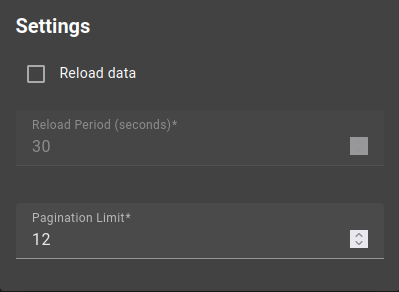
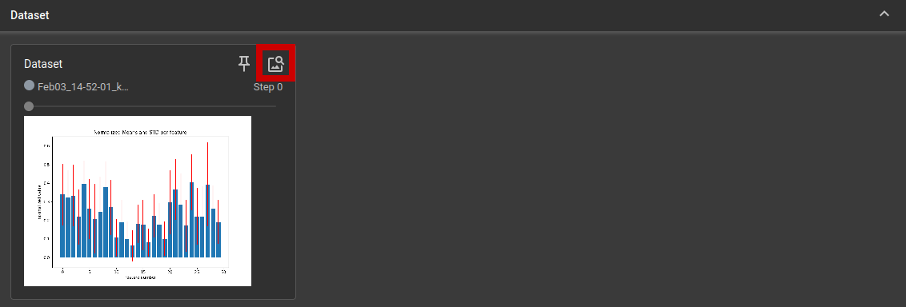
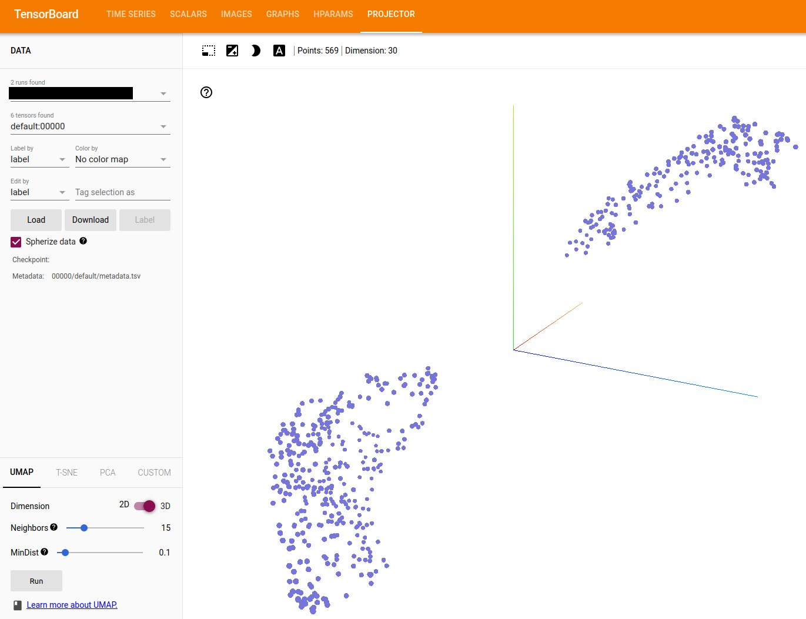
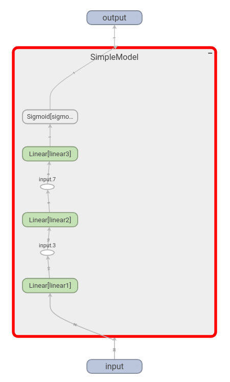
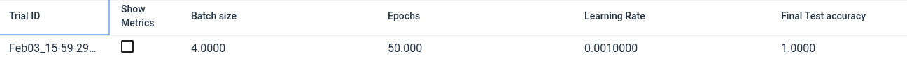

# TensorBoard

[TensorBoard](https://www.tensorflow.org/tensorboard) is a Graphical User Interface (GUI) tool for visualizing various data structures and formats, captured by training machine learning algorithms, which Neural Networks (NNs) are a part of. Although it is part of the TensorFlow library, we can also use it with the more familiar PyTorch library, in which it is also integrated.
In this article, we will use the [Breast Cancer Wisconsin dataset](https://archive.ics.uci.edu/dataset/17/breast+cancer+wisconsin+diagnostic) to train a simple classifier and discuss some of the usages of TensorBoard like tracking training and testing losses of the neural network or visualizing the NN as a graph of layers and operations.

## Create a virtual environment and install the dependencies

An environment is the scope in which a software operates. There is a global environment, which every part of the computer has access to and there are also virtual environments, which can be seen as local, dedicated to one project. They are a useful tool to isolate the different projects someone has on their computer.
Change to the directory, where you you want to save your code later on. In the command line, the following command creates a virtual environment called `venv`.

```bash
python3 -m venv venv
```

Afterwards, a new directory called "venv" should appear as shown below.


There are now all the essentials installed in the `venv` directory to start our project. We need to tell our command line to use the virtual environment instead of the global environment. For that we need to use the following command:

```bash
source ./venv/bin/activate
```

Now the virtual environment is active. The command line prompt should now show a `(venv)` as a prefix to indicate the current environment.
To install the required dependencies for the code in this article run the following command:

```bash
pip3 install tensorboard torch scikit-learn jupyter matplotlib
```

In this article we will focus on the `tensorboard` library, which is used to log and visualize data about Neural Network training and related tasks. The `torch` library is used for deep learning and neural network related functions, while `scikit-learn` is used for more traditional machine learning algorithms. We specifically use this library in this article, because it has a variety of datasets, from which we will use the Breast Cancer Wisconsin dataset.

## Starting TensorBoard

We can now start TensorBoard by running the following command in the terminal. Execute this in the directory, where your code is located:

```shell
tensorboard --logdir=runs
```

This executes the tensorboard program. The `runs` directory is the folder, containing all the data, which we tell TensorBoard to keep track of. We run this command now, so we can utilize it while we train a neural network. After running the command, you can now open the tensorboard GUI via the link the provided in the output of the command or type the following URL into the address bar of your browser: http://localhost:6006/. In this URL `localhost` references your own computer in the network and 6006 is the port tensorboard uses by default.

If you open the address in your browser, you should see the tensorboard GUI. It will say, that no dashboard is active. This will change when we go on. To be sure that the site will reload automatically, click on *settings* on the upper right corner and tick *Reload data*.




## Import the required packages

Now we can start with actual code. At first we want to import all the libraries we will require and create our logger, which is writing the data we tell it to into the `runs` directory, in order for TensorBoard in the browser to show it. Create a Python file or Jupyter notebook and run the following code.

```python
import torch
import torch.nn as nn
import torch.nn.functional as F
from torch.utils.data import random_split, DataLoader, TensorDataset

from sklearn.datasets import load_breast_cancer

import matplotlib.pyplot as plt
```

Due to TensorBoard popularity, it is also integrated into pytorch, so using it requires only the following two lines of code.

```python
from torch.utils.tensorboard import SummaryWriter

logger = SummaryWriter()
```

Now that we have set up TensorBoard as our logger, we can now proceed by creating a neural network to classify the Wisconsin dataset into the binary classes **benign** and **malignant**.

## Create the dataset

Due to being form the `scikit-learn` library, which is using `numpy`, we first need to load the dataset into tensors, which is the fundamental data structure of the `torch` library.

```python
# load the dataset, which is already integrated in scikit-learn
X, y = load_breast_cancer(return_X_y=True)
# load the data into tensors
X = torch.tensor(X, dtype=torch.float32)
y = torch.tensor(y, dtype=torch.float32).unsqueeze(dim=1)
```

Generally it is a good idea for the dataset to be standardized, meaning each column, which corresponds to a variable in the dataset, should have a mean of 0 and a standard deviation of 1. This improves the stability and time needed for a neural network to train.

```python
# standardize data
X_standardized = (X - X.mean(axis=0))/X.std(axis=0)
```

Now, we need to pack the data into a pytorch dataset and dataloader. This way, during training, not every data point is handed individually into the neural network, but smaller groups of data points instead. This speeds up the training, but may need more resources, like RAM.

To know if our neural network generalizes well to unseen data, we need to test it with some data, which we set aside. For that we use 20 % of the entire dataset, while the rest (80 %) is used to train the model. To divide the dataset into a testing and a training dataset, run the following code.

```python
BATCH_SIZE = 4

dataset = TensorDataset(X_standardized, y)
train_size = int(0.8 * len(dataset))
test_size = len(dataset) - train_size

train_dataset, test_dataset = random_split(dataset, [train_size, test_size])

train_dataloader = DataLoader(train_dataset, batch_size=BATCH_SIZE, shuffle=True)
test_dataloader = DataLoader(test_dataset, batch_size=BATCH_SIZE)
```

## Add figures to TensorBoard

We now have our first oppurtunity, to make use of TensorBoard and its ability to capture and visualize data. With the `logger.add_figure` function, we can add `matplotlib` figures to our dashboard. The plot we create here shows the scaled means and standard deviations of every one of the 30 variables in the dataset.

```python
# this scales our data to comparable scales, because some variables have large values (100-1000), while others have only values between (0.1 to 1.0)
X_norm = (X - X.min(axis=0).values) / (X.max(axis=0).values - X.min(axis=0).values)

fig, ax = plt.subplots(figsize=(8, 6))
# this part creates the vertical bars
ax.bar(range(X_norm.shape[1]), X_norm.mean(axis=0))
# this part creates the red error bars, representing the standard deviation
ax.errorbar(range(X_norm.shape[1]), X_norm.mean(axis=0), yerr=X_norm.std(axis=0), color="r", linestyle="None")
ax.set_title("Normalized Means and STD per feature")
ax.set_ylabel("normalized value")
ax.set_xlabel("feature number")
plt.show()

# this line adds the figure we created to the tensorboard dashboard in the browser
logger.add_figure("Dataset", fig)

plt.close()
```

When you open your browser again, you will see, that the graphic was added to tensorboard. You can view it by clicking on the symbol, which is marked in the image below.



## Data visualization with TensorBoard

Most of the datasets one encounters in the real world are very high-dimensional, meaning we can't visualize them directly. However, there are techniques, which embed high-dimensional data into lower dimensions for visualization. Embedding in this context means a kind of projection, which tries to retain as much information as possible. Meaning the resulting plot is as close to the original data as it can possible be, while having less dimensions.
This is a useful tool to visually investigate the data and to try to spot patterns, which might help us later.

Normally, this would require us to use a lot more code, than we need when we use TensorBoard. It has such methods already built-in, we only need to tell it for which data it should do this projection into 2D or 3D. The dataset we work with is pretty small, so we can do this visualization on the entire dataset.

The following line should add a tab called `Projector` in the TensorBoard dashboard. In it, there is now an interative 3D plot of data points. There are also some options to change and play around with the visualization.

```python
logger.add_embedding(X_standardized, metadata=y)
```

In some cases, when the dataset is more or less simple they are organized into separate clusters like shown below, indicating that a simple learning algorithm might be enough to classify the data.



## Create a model

The model used to classify the dataset is shown below. It consists of 3 linear layers, with a ReLU activation function inbetween. The output, which is passed through a sigmoid function, maps between 0 and 1. If the value is below 0.5, then the model predicts the class 0, when it is above it predicts 1.

```python
class SimpleModel(nn.Module):
    def __init__(self, input_size):
        super(SimpleModel, self).__init__()
        self.linear1 = nn.Linear(input_size, 10)
        self.linear2 = nn.Linear(10, 5)
        self.linear3 = nn.Linear(5, 1)
        self.sigmoid = nn.Sigmoid()

    def forward(self, x):
        x = self.linear1(x)
        x = F.relu(x)
        x = self.linear2(x)
        x = F.relu(x)
        x = self.linear3(x)
        x = self.sigmoid(x)

        return x
```

Now we create our model, which has the 30 variables of the dataset as input. The `optimizer` is doing the iterative adjustment of the model parameters to perform better each step and the `criterion` is use as the metric to judge how well the model is performing. A high value means it is doing badly, while a low value means, it is mostly correctly.

```python
model = SimpleModel(X.shape[1])

lr = 1e-3 # learning rate
optimizer = torch.optim.Adam(model.parameters(), lr=lr)
criterion = nn.BCELoss()
```

The criterion is a more or less intuitive way of judging how a model is performing. A simpler and more direct metric is calculating the ratio of how many times the model predicted correctly to all predictions. This is also known as the accuracy, which we define in the function below.

```python
def accuracy(pred, true):
    return torch.sum(pred == true) / len(true)
```

With the following code, we can visualize our model by adding a graph representation of it to TensorBoard, to understand how it is built. The second argument needs to be a datapoint in order for the logger to trace the model parts as it goes through the model. This adds another tab in the TensorBoard dashboard called `Graphs`.

```python
logger.add_graph(model, dataset[0][0])
```



## Set up the training routine

The following code block contains the training and test routine for our neural network. In total we want to train the network 50 epochs over the entire training dataset and measure its testing loss and accuracy after it. For each data sample in the training dataset, we record the models prediction, calculate its loss when compared to the true values and let the `optimizer` iteratively adjust the models parameters to perform better the next time. For each epoch we save the training loss and accuracy to TensorBoard. While it is training we can watch in real time how our model is performing. The same applies to the testing loss. Here we can validate if it is actually learning something, which is useful for data in general or if it is just memorizing the things it has seen without learning any patterns in the data.

```python
epochs = 50

for epoch in range(epochs):
    epoch_train_acc = 0
    epoch_train_loss = 0

    # training loop
    for x, y in train_dataloader:
        optimizer.zero_grad()

        # calculate the model predictions of the current data points
        prediction = model(x)

        # calculate the loss, as a measure of how good the predictions were  as compared to the true values
        train_loss = criterion(prediction, y)

        # accumulate the training loss over the entire epoch
        epoch_train_loss += train_loss.item()

        # adjust the model parameters one step at a time
        train_loss.backward()
        optimizer.step()

        # calculate the accuracy
        train_acc = accuracy(prediction.round(), y)
        epoch_train_acc += train_acc.item()

    # calculate the training loss and accuracy of the epoch
    epoch_train_acc /= len(train_dataset)/BATCH_SIZE
    epoch_train_loss /= len(train_dataset)/BATCH_SIZE

    # add the training accuracy and loss to the logger
    logger.add_scalar("Accuracy/train", epoch_train_acc, epoch)
    logger.add_scalar("Loss/train", epoch_train_loss, epoch)

    epoch_test_acc = 0
    epoch_test_loss = 0

    # testing loop
    for x, y in test_dataloader:
        prediction = model(x)
        test_loss = criterion(prediction, y)
        epoch_test_loss += test_loss.item()

        test_acc = accuracy(prediction.round(), y)
        epoch_test_acc += test_acc.item()

    epoch_test_acc /= len(test_dataset)/BATCH_SIZE
    epoch_test_loss /= len(test_dataset)/BATCH_SIZE

    # add the testing loss and accuracy to tensorboard
    logger.add_scalar("Accuracy/test", epoch_test_acc, epoch)
    logger.add_scalar("Loss/test", epoch_test_loss, epoch)
```

You can look at the plots under "Time series" or "Scalars".

Something, that is also very useful, is tracking the hyperparameters, that were used when training the model. This helps us to judge, which parameters work well.
The metric dictionary can be used to save the last test accuracy, which helps us to keep track of which hyperparameters resulted in what performance.

```python
# learning rate, batch size and the number of epochs are useful to know due to the impact they can have on model performance
logger.add_hparams(hparam_dict = {"Learning Rate": lr,
                                  "Batch size": BATCH_SIZE,
                                  "Epochs": epochs,},
                   metric_dict = {"Final Test accuracy": epoch_test_acc})
```

Under "HParams" you should now see the tracked hyperparamaters.



## Add images to TensorBoard

Here is a small example, of how an image can be added to TensorBoard, even though we don't use images in this article. The example image is a random RGB image with a height and width of 100.

```python
logger.add_image("White noise image", torch.rand((100, 100, 3)), dataformats="HWC")
```

The first argument is the text for the image, which will be associated with it in the TensorBoard dashboard. The second argument is just the `torch` function used to create the image. The 3 represents the color channels Red Green Blue and the `dataformats` parameter tells the function that the three values height, width, channels come in this exact order.

## Close the logger

When we are finished, as a final step, we need to close the logger, which is done by calling `logger.flush()` and after that we can save our trained model for later use.

```python
logger.flush()
torch.save(model.state_dict(), "model_params.pth")
```

## References

- https://archive.ics.uci.edu/dataset/17/breast+cancer+wisconsin+diagnostic

- https://www.tensorflow.org/tensorboard

- https://pytorch.org/tutorials/recipes/recipes/tensorboard_with_pytorch.html

- https://pytorch.org/tutorials/intermediate/tensorboard_tutorial.html

- https://pytorch.org/docs/stable/tensorboard.html