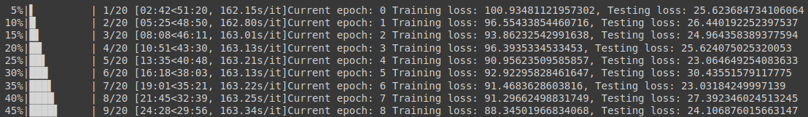
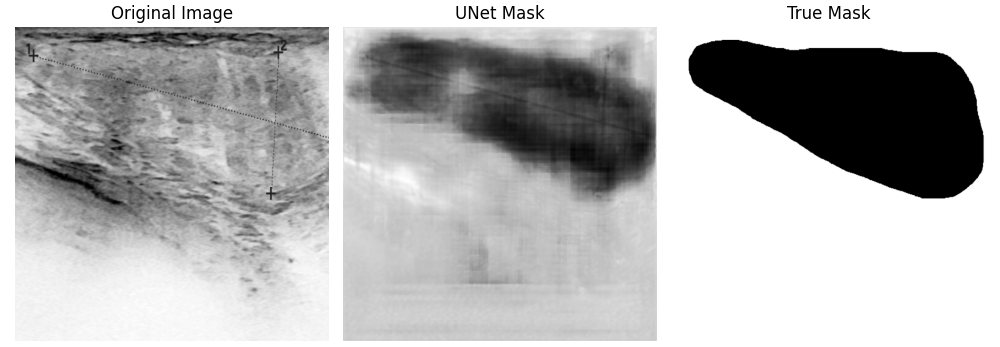
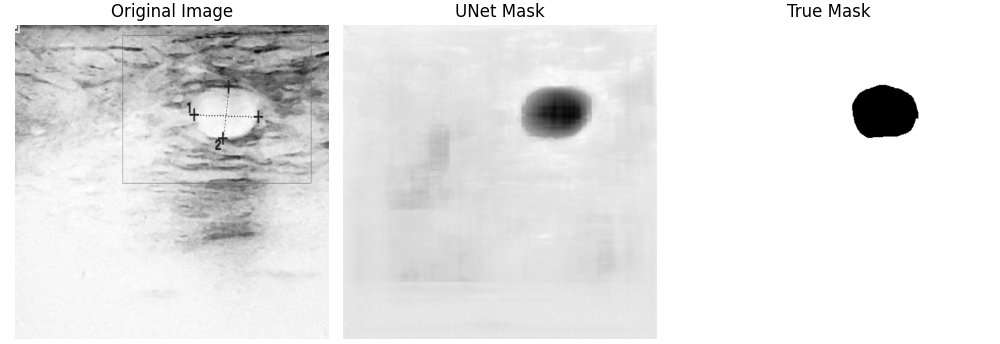
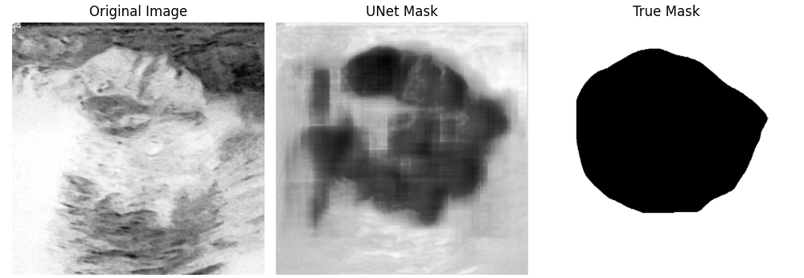
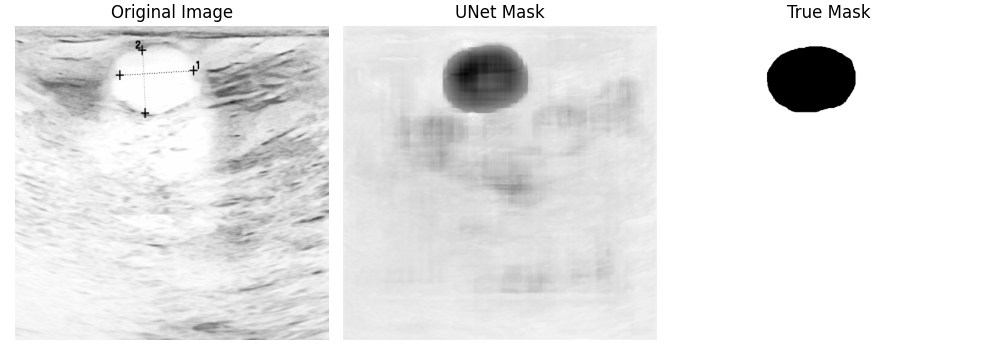
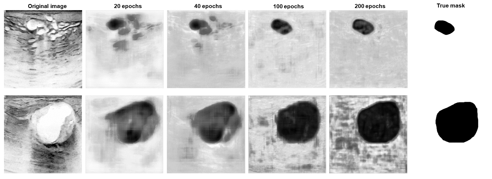
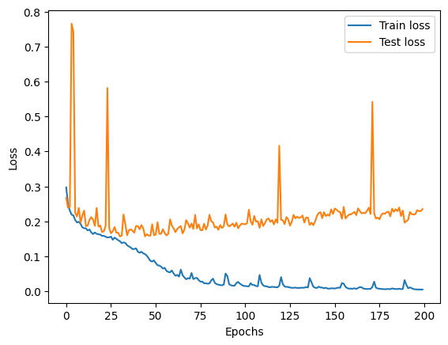

# Automated Segmentation of 2D Ultrasound Images

In this article, we will learn how to program a deep learning model for breast ultrasound image segmentation. More concretely, we will use the U-Net architecture, which is state of the art for image segmentation.
In the following, we will use the model definition of [Pytorch-UNet](https://github.com/milesial/Pytorch-UNet/tree/master), published under the GPL-3.0 license. You can find the license agreement [here](https://github.com/milesial/Pytorch-UNet/tree/master?tab=GPL-3.0-1-ov-file#readme).

## Dataset

We will use [this ultrasound image dataset](https://www.sciencedirect.com/science/article/pii/S2352340919312181?via%3Dihub), which you can also download [here](https://www.kaggle.com/datasets/aryashah2k/breast-ultrasound-images-dataset/).
After downloading the images, you can see that the dataset contains the directories "benign", "malignant" and "normal". For this example, we copy all of the images into one directory. The different labels are still distinguishable through the file names. To each ultrasound image one or multiple masks are included, which show where tumors are located. Our goal will be to let our model predict masks as similar as possible to the true ones.

## Working with Google Colab

The training of deep learning models requires more computing power than our private computers can provide. Google Colab offers GPUs we can use for free for a certain amount of time.
We start by uploading the dataset to Google drive. To set up a new project in Colab, follow the steps described [here](https://cancer-informatics.org/docs/ai/automated_mri_segmentation#working-with-google-colab)

After starting a new project, you have to mount drive by using the following code:

```python
from google.colab import drive
drive.mount('/content/drive', force_remount = True)
```

Now you should have access to your data in Google Colab and can continue with this tutorial.

## Install and import the required packages

As always, we have to install all the required packages with the following code:

```shell
!pip install torch torchvision numpy pillow matplotlib tqdm
```

After that, we can import the dependencies.

```python
import os

import torch
import torch.nn.functional as F
import torch.nn as nn
from torch.utils.data import Dataset, DataLoader, random_split
from torchvision.transforms import v2

from PIL import Image
import matplotlib.pyplot as plt
import numpy as np
from tqdm import tqdm
import pandas as pd
```

## Data preparation

To simplify further use, we set global parameters like `DATA_PATH` and `IMAGE_SIZE` and load the images and the corresponding labels (masks) into lists. If you ever want to change some of the parameters, it is easier if you defined them at the beginning of your code, because this way, you only have to change them at one location.

```python
DATA_PATH = r"/content/drive/MyDrive/ColabNotebooks/ultrasound_seg/" # insert the path to your dataset directory
MASK_PATTERN = r"_mask" # to differentiate masks from the images
IMAGE_SIZE = (512, 512)

DEVICE = torch.device("cuda" if torch.cuda.is_available() else "cpu")

# standard values for neural network image nomalization with greyscale images
MEAN = [0.485]
STD = [0.229] # standard deviation

# load the file names of the images and masks into two different lists 
images = [img for img in os.listdir(DATA_PATH) if not MASK_PATTERN in img]
masks = [mask for mask in os.listdir(DATA_PATH) if mask not in images]
```

### Set up a dataset class

We will now write a dataset class, that simplifies working with this specific dataset. It is based on [this Pytorch tutorial](https://pytorch.org/tutorials/beginner/data_loading_tutorial.html).

The two following variables `image_transforms` and `mask_transforms` contain the necessary image transformations to go from a `.png` image to a neural network understandable tensor. A tensor is a multidimensional array of numerical values.

```python
image_transforms = v2.Compose([
    v2.Resize(size=IMAGE_SIZE),
    v2.ToImage(), # transforms the image into a torchvision image
    v2.ToDtype(torch.float32, scale=True), # changes datatype of the values to float32
    v2.Normalize(mean=MEAN, std=STD),
])

mask_transforms = v2.Compose([
    v2.Resize(size=IMAGE_SIZE),
    v2.ToImage(), 
    v2.ToDtype(torch.float32, scale=True),
])
```

Now, we define the dataset structure with the following class.

```python
class SegmentationDataset(Dataset): # we use the base class Dataset from Pytorch
    def __init__(self,
                 data_path: str,
                 images: list[str],
                 masks: list[str],
                 image_transforms,
                 mask_transforms):
        super().__init__()

        self.data_path = data_path
        self.images = images
        self.masks = masks
        self.image_transforms = image_transforms
        self.mask_transforms = mask_transforms

        self.data = []
        self._prepare_data()

    def _get_all_masks(self, image: str, masks : list[str]):
        """Get all masks, that contain the image name."""
        base_name = image.split(".")[0]
        
        return [mask for mask in masks if base_name in mask]

    def _merge_masks(self, all_masks: list[str]):
        """Return tensor of merged masks."""
        merged = torch.zeros((1, *IMAGE_SIZE), dtype=torch.float32)
        
        for mask in all_masks:
            merged += self.mask_transforms(Image.open(self.data_path + mask).convert("L"))
            
        return torch.clamp(merged, min=0.0, max=1.0)
    
    def _prepare_data(self):
        for image in self.images:
            image_masks = self._get_all_masks(image, self.masks)
            
            sample = {"image": self.image_transforms(Image.open(self.data_path + image).convert("L")),
                      "mask": None}
            
            if len(image_masks) == 1:
                sample["mask"] = self.mask_transforms(Image.open(self.data_path + image_masks[0]).convert("L"))

            else:
                sample["mask"] = self._merge_masks(image_masks)

            self.data.append(sample)

    def __getitem__(self, idx):
        return self.data[idx]

    def __len__(self):
        return len(self.images)
```

With this dataset class, we can initialize an instance of our dataset and everything that needs to be done, like merging masks if there is more than one corresponding mask to one image, is done automatically.

## Define the U-Net

In the following, we will look at the definition of the U-Net model. The code in this section was taken over unchanged from [this repository](https://github.com/milesial/Pytorch-UNet/tree/master). It is based on the U-Net architecture by Ronneberger, Fischer & Brox (2015), which is visualized down below. The graphic was taken from the [original paper](https://arxiv.org/abs/1505.04597).

")

The first thing, that needs to be done to create the neural network, is to define the different blocks. As you can see in the image above, there is a downsampling part on the left, an upsampling part on the right and each of the blocks include double convolution blocks. Besides that, there is an out convolution block at the end. The following classes define the different parts.

```python
class DoubleConv(nn.Module):
    """(convolution => [BN] => ReLU) * 2"""
    def __init__(self, in_channels, out_channels, mid_channels=None):
        super().__init__()

        if not mid_channels:
            mid_channels = out_channels

        self.double_conv = nn.Sequential(
            nn.Conv2d(in_channels, mid_channels, kernel_size=3, padding=1, bias=False),
            nn.BatchNorm2d(mid_channels),
            nn.ReLU(inplace=True),
            nn.Conv2d(mid_channels, out_channels, kernel_size=3, padding=1, bias=False),
            nn.BatchNorm2d(out_channels),
            nn.ReLU(inplace=True)
        )

    def forward(self, x):
        return self.double_conv(x)
```

```python
class Down(nn.Module):
    """Downscaling with maxpool then double conv"""

    def __init__(self, in_channels, out_channels):
        super().__init__()
        self.maxpool_conv = nn.Sequential(
            nn.MaxPool2d(2),
            DoubleConv(in_channels, out_channels)
        )

    def forward(self, x):
        return self.maxpool_conv(x)
```

```python
class Up(nn.Module):
    """Upscaling then double conv"""
    def __init__(self, in_channels, out_channels, bilinear=True):
        super().__init__()

        # if bilinear, use the normal convolutions to reduce the number of channels
        if bilinear:
            self.up = nn.Upsample(scale_factor=2, mode='bilinear', align_corners=True)
            self.conv = DoubleConv(in_channels, out_channels, in_channels // 2)
        else:
            self.up = nn.ConvTranspose2d(in_channels, in_channels // 2, kernel_size=2, stride=2)
            self.conv = DoubleConv(in_channels, out_channels)

    def forward(self, x1, x2):
        x1 = self.up(x1)
        # input is CHW
        diffY = x2.size()[2] - x1.size()[2]
        diffX = x2.size()[3] - x1.size()[3]

        x1 = F.pad(x1, [diffX // 2, diffX - diffX // 2,
                        diffY // 2, diffY - diffY // 2])
        # if you have padding issues, see
        # https://github.com/HaiyongJiang/U-Net-Pytorch-Unstructured-Buggy/commit/0e854509c2cea854e247a9c615f175f76fbb2e3a
        # https://github.com/xiaopeng-liao/Pytorch-UNet/commit/8ebac70e633bac59fc22bb5195e513d5832fb3bd
        x = torch.cat([x2, x1], dim=1)
        return self.conv(x)
```

```python
class OutConv(nn.Module):
    def __init__(self, in_channels, out_channels):
        super(OutConv, self).__init__()
        self.conv = nn.Conv2d(in_channels, out_channels, kernel_size=1)

    def forward(self, x):
        return self.conv(x)
```

Now, the model can be created by combining the different blocks. As you can see in the `UNet` class below, the model consists of multiple blocks of each type. In the `__init__()` method, each block is instantiated with the different in and out channel sizes. The `forward()` method defines, in which order which block is called.

```python
class UNet(nn.Module):
    def __init__(self, n_channels, n_classes, bilinear=False):
        super(UNet, self).__init__()
        self.n_channels = n_channels
        self.n_classes = n_classes
        self.bilinear = bilinear

        self.inc = (DoubleConv(n_channels, 64))
        self.down1 = (Down(64, 128))
        self.down2 = (Down(128, 256))
        self.down3 = (Down(256, 512))

        factor = 2 if bilinear else 1

        self.down4 = (Down(512, 1024 // factor))
        self.up1 = (Up(1024, 512 // factor, bilinear))
        self.up2 = (Up(512, 256 // factor, bilinear))
        self.up3 = (Up(256, 128 // factor, bilinear))
        self.up4 = (Up(128, 64, bilinear))
        self.outc = (OutConv(64, n_classes))

    def forward(self, x):
        x1 = self.inc(x)
        x2 = self.down1(x1)
        x3 = self.down2(x2)
        x4 = self.down3(x3)
        x5 = self.down4(x4)
        x = self.up1(x5, x4)
        x = self.up2(x, x3)
        x = self.up3(x, x2)
        x = self.up4(x, x1)
        logits = self.outc(x)

        return logits
```

## Train model

Now, that we have defined a model, we can continue with the training, but first of all, we need to transform our set of breast ultrasound images to a usable form by using our dataset class from before.

```python
dataset = SegmentationDataset(DATA_PATH, images, masks, image_transforms, mask_transforms)
```

Some hyperparameters like the number of epochs and the batch size should also be specified before training. All of these parameters can be varied, but be aware, that if you change `EPOCHS` and `BATCH_SIZE`to higher values, the training can take much longer or demand more computing power.

```python
# Hyperparameters
EPOCHS = 40
BATCH_SIZE = 4
LR = 1e-3 # learning rate
```

Subsequently, the dataset is divided into a training and a testing set. In this example, we use 80 percent of the dataset for training. You can change that arbitrarily, but the`train_size` should always be larger than the `test_size`. The method `random_split()` assigns the data points randomly to the two sets.

```python
train_size = int(0.8 * len(dataset))
test_size = len(dataset) - train_size

train_dataset, test_dataset = random_split(dataset, [train_size, test_size])

# loads 4 (= batch size) images of the training dataset and the test dataset
train_dataloader = DataLoader(train_dataset, batch_size=BATCH_SIZE, shuffle=True)
test_dataloader = DataLoader(test_dataset, batch_size=BATCH_SIZE)
```

Now, we instantiate the model with `UNet(1,1)` and push it to the GPU (or CPU, if cuda is not available). Besides that, we specify the loss function and the optimizer, that should be used during training. The `optimizer` adjusts the model parameters after each training loop. We also define `sigmoid` to transform each value to be between 0 and 1.

```python
model = UNet(1, 1)
model.to(DEVICE)

sigmoid = nn.Sigmoid() # we use the sigmoid function to get values between 0 and 1

criterion = nn.BCELoss() # loss function
optimizer = torch.optim.Adam(model.parameters(), lr=LR) 
```

Reguarding the training, we have to make a training and a testing loop. The training loop adjusts the model parameters iteratively and the testing loop is used to check, if the model is generalizing to unseen data.

```python
# saves the train and test loss after each loop
total_train_loss = []
total_test_loss = []

for epoch in tqdm(range(EPOCHS)): # tqdm() plots a progress bar

    epoch_train_loss = 0
    epoch_test_loss = 0

    # training loop
    model.train()

    for batch in train_dataloader:
        optimizer.zero_grad()
        image = batch["image"].to(DEVICE)
        mask = batch["mask"].to(DEVICE)
        output = sigmoid(model(image)) # returns values between 0 and 1 (greyscale)
        loss = criterion(output, mask)
        # add dice loss; is used to calculate the overlap of the predicted and the real mask
        loss += 1 - (2.*(output * mask).sum() + 1)/(output.view(-1).sum() + mask.view(-1).sum() + 1) # view() reshapes the matrix and returns a vector
        epoch_train_loss += loss.item()
        loss.backward() # back propagation
        optimizer.step() # updates parameters at the end of the loop

    # testing loop
    model.eval() # ensures that model parameters will only be checked and won't be changed 

    for batch in test_dataloader:
        image = batch["image"].to(DEVICE)
        mask = batch["mask"].to(DEVICE)
        output = sigmoid(model(image))
        loss = criterion(output, mask)
        loss += 1 - (2.*(output * mask).sum() + 1)/(output.view(-1).sum() + mask.view(-1).sum() + 1)
        epoch_test_loss += loss.item()

    epoch_train_loss /= len(train_dataset)
    epoch_test_loss /= len(test_dataset)
    total_train_loss.append(epoch_train_loss)
    total_test_loss.append(epoch_test_loss)

    print(f"Current epoch: {epoch}\tTraining loss: {epoch_train_loss}, Testing loss: {epoch_test_loss}")
```

During training, `tqdm(range(EPOCHS))` prints a progress bar, which includes the remaining training time and the training and testing loss as shown in the graphic below.



After the training process is finished, we have to save the parameters of our model with `torch.save()` to be able to use it later on. Insert the path to the directory, you want to save the file in.

```python
torch.save(model.state_dict(), f"/content/drive/MyDrive/Colab Notebooks/eps{EPOCHS}_bs{BATCH_SIZE}_unet.pth")
```

If you want to plot the train and test loss later on, save the values into a `.csv` file with the following code. Be aware to insert the right path.

```python
df = pd.DataFrame({'train_loss': total_train_loss, 'test_loss': total_test_loss})
df.to_csv(DATA_PATH + f'{EPOCHS}eps_loss.csv')
```

If the training wasn't finished or you want to train for more epochs, you can load the saved model and continue the training afterwards by executing the training and testing loops. For loading a model, use the following code and chose the right `EPOCHS` and `BATCH_SIZE`, which are included in the file name.

```python
model.load_state_dict(torch.load(f"/content/drive/MyDrive/Colab Notebooks/eps{EPOCHS}_bs{BATCH_SIZE}_unet.pth"))
```

When starting a new runtime, don't forget to run the other required cells as well (e.g. the model definition). Save the model again after training.

## Test model

To test the model and visualize, how well masks are predicted compared to the real masks, we can plot the masks with the Python package matplotlib.

```python
def plot_image_prediction_mask(model, sample):
    output = model(sample["image"].unsqueeze(0))

    fig, ax = plt.subplots(1, 3, figsize=(10, 6))
    ax[0].imshow(sample["image"].squeeze().detach().numpy(), cmap="Greys")
    ax[0].set_title("Original Image", size=12)
    ax[0].axis("off")

    ax[1].imshow(output.squeeze().detach().numpy(), cmap="Greys")
    ax[1].set_title("UNet Mask", size=12)
    ax[1].axis("off")

    ax[2].imshow(sample["mask"].squeeze().detach().numpy(), cmap="Greys")
    ax[2].set_title("True Mask", size=12)
    ax[2].axis("off")

    fig.tight_layout()

    return fig
```

Our U-Net model is located on the GPU because we trained it there. To be able to test it, we need to push it to the CPU, where our dataset is located. Otherwise they can't be accessed together.

```python
model.to("cpu")
```

Now, we chose some images of our `dataset` and let the trained model predict the masks of these images. The `plot_image_prediction_mask()` function, we have defined before, will save the predicted mask together with the original image and the real mask in one file under the chosen data path.

```python
for i in range(90, 100):
    fig = plot_image_prediction_mask(model, dataset[i])
    fig.savefig(f"/content/drive/MyDrive/Colab Notebooks/in_out_pred_sample_{i}.png")
```

Here are some of the output images of our model, which was trained for 40 epochs:






Your results may look different because of the random assignment of the images to the train and test dataset. As you can see, some predicted masks turned out well, others didn't. This can sometimes be improved by training longer, but it will not work in every case.
In the following graphic, you can see how the results change by increasing the number of epochs. The form of the segmented tumor improves, but on the other hand, the background gets noisier, what could have happened due to overfitting.



The train and test loss of a model trained for 200 epochs is shown below. As you can see, at approximately 30 epochs, the two curves start to diverge, which means, the model is overfitting from that point on. For every case, an optimal amount of epochs has to be found to achieve the best results without risking the model to overfit.



## References

- Ronneberger, O., Fischer, P. & Brox, T (2015). U-net: convolutional networks for biomedical image segmentation. In MICCAI (eds. Navab, N. et al) 234-241. https://doi.org/10.48550/arXiv.1505.04597

- Al-Dhabyani, W., Gomaa, M., Khaled, H., & Fahmy, A. (2020). Dataset of breast ultrasound images. *Data in Brief*, 28. https://doi.org/10.1016/j.dib.2019.104863

- <https://github.com/milesial/Pytorch-UNet/tree/master>

- <https://github.com/milesial/Pytorch-UNet/tree/master?tab=GPL-3.0-1-ov-file#readme>

- <https://colab.research.google.com>

- <https://pytorch.org/>

- <https://pytorch.org/tutorials/beginner/data_loading_tutorial.html>