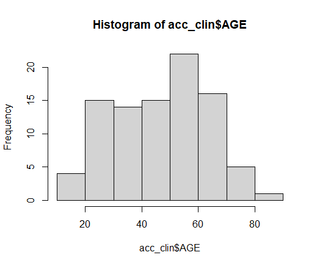

# Big Data

## Introduction

Big data refers to extremely large and complex datasets that cannot be easily processed, managed or analysed using traditional data processing techniques or tools. Big data is characterized by three main attributes - volume, velocity, and variety:

- Volume: Refers to the vast amount of data generated from various sources such as social media, sensors, devices, and more. The volume of data is so huge that traditional data storage and processing technologies cannot handle it.

- Velocity: Refers to the speed at which data is generated, processed, and analysed. Big data is constantly flowing in real-time, making it difficult for traditional systems to keep up with the pace.

- Variety: Refers to the various forms of data such as structured, semi-structured, and unstructured data that are generated from different sources in different formats.

To handle big data, organizations use advanced data processing technologies such as [**Hadoop**](https://hadoop.apache.org/), [**Spark**](https://spark.apache.org/), [**NoSQL**](hhttps://de.wikipedia.org/wiki/NoSQL), and more. 
These tools help to store, process, and analyse large volumes of data, and extract valuable insights and patterns from it. 
The insights obtained from big data can be used to make informed decisions, improve business processes, and gain a competitive advantage.

## cBioPortal

[**cBioPortal**](https://www.cbioportal.org/) is an open-source web-based platform that provides researchers with access to a large collection of genomic data from various cancer studies. 
It is a Big Data platform that allows researchers to analyse and explore large datasets of genomic data and extract valuable insights that can be used to understand the genetic basis of cancer.

cBioPortal provides a user-friendly interface that allows researchers to interact with the data and perform various types of analysis, such as exploring genetic alterations in cancer patients, identifying potential cancer targets, and visualizing genomic data. 
The platform is designed to be flexible and customizable, allowing researchers to upload their own data, perform custom analyses, and share their findings with the scientific community.

The platform provides access to a large collection of cancer genomics data, including data from [**The Cancer Genome Atlas**](https://www.cancer.gov/ccg/research/genome-sequencing/tcga) (TCGA), [**Cancer Cell Line Encyclopedia**](https://sites.broadinstitute.org/ccle/) (CCLE), and many other sources. 
The data is constantly updated, and new studies are added regularly to ensure that researchers have access to the latest and most comprehensive cancer genomics data.

Overall, cBioPortal is a powerful Big Data platform that enables researchers to analyse and explore large datasets of cancer genomics data, helping to advance our understanding of the genetic basis of cancer and ultimately leading to better cancer treatments.

### Use-Case

Here's an example of how to use and set up cBioPortal in R.
First, install and load the [**cbioportal package**](https://bioconductor.org/packages/release/bioc/html/cBioPortalData.html) in R by running the following command:
```r
# Install the package
if (!require("BiocManager", quietly = TRUE))
    install.packages("BiocManager")

BiocManager::install("cBioPortalData")
# Load the package
library(cBioPortalData)
```
Next you want to use the cBioPortal() function to connect to the cBioPortal API in R. The function takes several parameters, including:

- **hostname**: The hostname of the cBioPortal server (default: "www.cbioportal.org").
- **protocol**: The protocol to use when connecting to the cBioPortal server (default: "https").
- **api**: The path to the API documentation (default: "/api/v2/api-docs").
- **token**: An optional authentication token to use when connecting to the cBioPortal server.

```r
# Connect to the cBioPortal API
cBioPortal(
  hostname = "www.cbioportal.org",
  protocol = "https",
  api. = "/api/v2/api-docs",
  token = character())
# Stores the connection in the cbio object.  
cbio <- cBioPortal()
```
Call the `getStudies()` function to retrieve a list of the available cancer studies from the cBioPortal API and store them in the studies object. 
The api argument specifies the API URL to use, which in this case is set to the default cBioPortal API URL.
```r
# Full list of available cancer studies
getStudies(api., buildReport = FALSE)
# Stores the data
studies <- getStudies(api = cbio)
```
Call the `searchOps()` function to search for available data types and options based on a keyword. 
For example, to search for options related to "molecular" data, run:

```r
# Summary of the availaible studies with the keyword molecular
searchOps(api = cbio, keyword = "molecular")
```
Next retrieve clinical data for the ACC study from the cBioPortal API and store it in the acc_clin object.
```r
## obtain clinical data
acc_clin <- clinicalData(api = cbio, studyId = "acc_tcga")
acc_clin
```
You can then further analyse the dataset. In the following example we create a histogram showing the age when the Adrenocortical carcinoma where first diagnosed.

```r
#To check the format of the AGE variable use the `class()` function
class(acc_clin$AGE)
# The class of the AGE variable is not "numeric", so you need to convert it to a numeric format. You can use the `as.numeric()` function to do this:
acc_clin$AGE <- as.numeric(acc_clin$AGE)
# After converting the AGE variable to numeric format, you should be able to create a histogram using the hist() function:
hist(acc_clin$AGE)
```

This will create a histogram of the distribution of ages in the clinical data:

  

## Sources & Further Reading

- Borges do Nascimento IJ, Marcolino MS, Abdulazeem HM, et al. Impact of Big Data Analytics on People's Health: Overview of Systematic Reviews and Recommendations for Future Studies. J Med Internet Res. 2021;23(4):e27275. Published 2021 Apr 13. doi:10.2196/27275

- Ristevski B, Chen M. Big Data Analytics in Medicine and Healthcare. J Integr Bioinform. 2018;15(3):20170030. Published 2018 May 10. doi:10.1515/jib-2017-0030

- Zhang Z. Data management by using R: big data clinical research series. Ann Transl Med. 2015;3(20):303. doi:10.3978/j.issn.2305-5839.2015.11.26

- Cerami E, Gao J, Dogrusoz U, et al. The cBio cancer genomics portal: an open platform for exploring multidimensional cancer genomics data [published correction appears in Cancer Discov. 2012 Oct;2(10):960]. Cancer Discov. 2012;2(5):401-404. doi:10.1158/2159-8290.CD-12-0095

- Barrett T, Suzek TO, Troup DB, et al. NCBI GEO: mining millions of expression profiles--database and tools. Nucleic Acids Res. 2005;33(Database issue):D562-D566. doi:10.1093/nar/gki022

- Syed YY. Ribociclib: First Global Approval. Drugs. 2017;77(7):799-807. doi:10.1007/s40265-017-0742-0