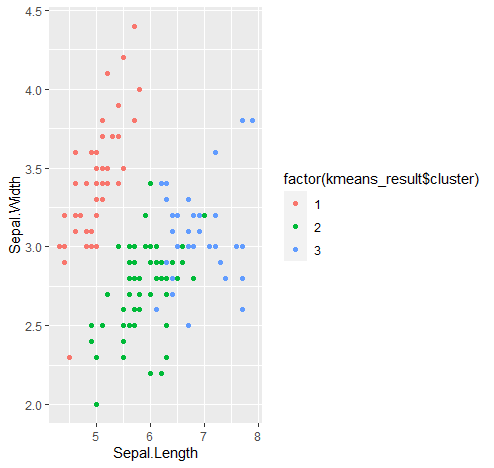
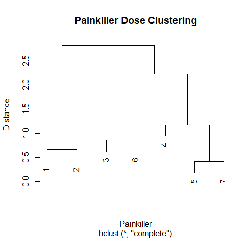
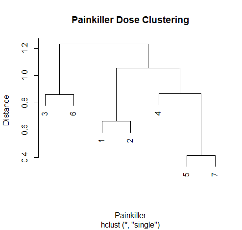
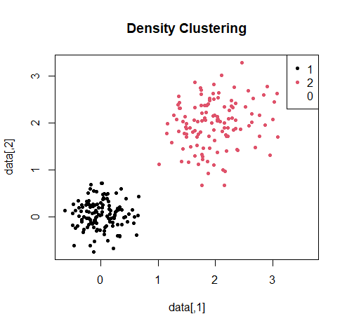

# Clusters

## Introduction

Clustering is a type of unsupervised learning technique used in data analysis to group together similar objects or data points based on their characteristics or attributes. 
Clustering is an exploratory technique that helps to identify patterns and structures in the data without any prior knowledge or labels.

The goal of clustering is to group together data points that are similar to each other and different from those in other groups. 
The similarity between data points is usually measured using a distance metric, such as Euclidean distance or cosine similarity. 
The choice of distance metric depends on the type of data and the clustering algorithm being used.

There are several types of clustering algorithms, including:

- **K-means clustering:** This algorithm partitions data points into K clusters based on their distances to K randomly chosen cluster centres. The algorithm iteratively updates the cluster centres until convergence.

- **Hierarchical clustering:** This algorithm builds a tree-like structure of nested clusters, where each cluster contains sub-clusters that are more similar to each other than to clusters at higher levels of the tree.

- **Density-based clustering:** This algorithm groups together data points that are located in dense regions of the feature space, separated by sparse areas.

## `kmeans()` clustering

K-means clustering is a popular clustering algorithm that partitions a dataset into K clusters, where K is a user-specified parameter. 
The algorithm starts by randomly assigning K cluster centres to the data points and then iteratively reassigns the points to the nearest cluster centre and updates the centre until convergence. 
The goal of K-means clustering is to minimize the sum of squared distances between each point and its assigned cluster centre. 
The function takes the following arguments:

```r
kmeans(x, centers, iter.max = 10, nstart = 1)
```
:::note

- `x`: A numeric matrix or data frame containing the data to be clustered
- `centers`: Either the number of clusters or a set of initial cluster centres
- `iter.max`: The maximum number of iterations to perform
- `nstart`: The number of random initializations to use

:::

:::tip

Usually it is sufficient to fill in only the parameters x and centres. The function would accordingly be `kmeans(x, centers)`

:::

For simplicity in the following example, only two clusters are generated. 

As a first step, we need a data set from which we want to form two groups, each of which approximates most closely to converge in its values. 

We have a dataset of eight patients with the following weight data, which we want to divide into two groups (low weight and high weight).

```r 
# In the following vector the weight of 8 students is stored
weight <- c(85,83,80,55,40,44,77,39)

# Using the kmeans function we divide this group into two clusters
kmeans (weight, centers = 2)

Output:

K-means clustering with 2 clusters of sizes 4, 4

Cluster means:
   [,1]
1 81.25
2 44.50

Clustering vector:
[1] 1 1 1 2 2 2 1 2

Within cluster sum of squares by cluster:
[1]  36.75 161.00
 (between_SS / total_SS =  93.2 %)
```
The `kmeans()` function returns an object of class "kmeans", which contains the following components:

- **cluster**: A vector indicating the cluster assignments for each data point.
- **centers**: A matrix containing the final cluster centres.
- **totss**: The total sum of squares.
- **withinss**: A vector containing the within-cluster sum of squares for each cluster.
- **tot.withinss**: The total within-cluster sum of squares.
- **betweenss**: The between-cluster sum of squares.
- **size**: A vector containing the number of data points in each cluster.
- **iter**: The number of iterations performed.

To divide more complex data sets into clusters and visualize them, we use the following example:

```r
# Load the iris dataset
data(iris)

# Subset the dataset to include only the numeric variables
iris_numeric <- iris[,1:4]

# Perform K-means clustering with K = 3
kmeans_result <- kmeans(iris_numeric, centers = 3)

# View the cluster assignments
kmeans_result$cluster

# View the cluster centers
kmeans_result$centers
```
:::caution
The dataset should only contain **numeric variables** for K-means clustering to work.
:::

:::note
If you are not familiar with the visualization of datasets, please visit the **[ggplot section](ggplot.md)**.
:::

```r
# Plot the data points colored by cluster assignment
library(ggplot2)
ggplot(iris_numeric, aes(x = Sepal.Length, y = Sepal.Width, color = factor(kmeans_result$cluster))) + 
  geom_point()
```
This should give the following result:



## `hclust()` clustering

Hierarchical clustering is another clustering technique that builds a hierarchy of nested clusters by iteratively merging, or splitting clusters based on a similarity measure. 
There are two main types of hierarchical clustering: agglomerative and divisive. 
In agglomerative clustering, each data point starts in its own cluster and pairs of clusters are successively merged until all the points belong to a single cluster. 
In divisive clustering, all the points start in a single cluster and are recursively split into smaller clusters. 
Hierarchical clustering can handle different shapes and sizes of clusters and allows for a flexible visualization of the clustering structure.

```r
hclust(d, method = "complete")
```

:::note
- `d`: A dissimilarity object or a dist object (e.g. output of dist() function) containing the pairwise distances between the objects being clustered.
- `method`: The agglomeration method to be used. This determines how the distance between two clusters is calculated based on the distances between the individual objects in those clusters. 
Common options include "complete" (complete linkage), "single" (single linkage), "average" (average linkage), "ward" (Ward's minimum variance method)
:::

The following is an example of the application of hierarchical clustering in relation to the dose of pain medication.

```r
# Create a data frame with pain killer names and their doses
painkillers <- data.frame(medication = c("Acetaminophen", "Ibuprofen", "Aspirin", "Naproxen", "Diclofenac"),
  dose = c(500, 200, 325, 220, 50))

# Create a distance matrix using Euclidean distance
dist_matrix <- dist(painkillers$dose, method = "euclidean")
```
In the context of clustering, Euclidean distance is often used to measure the dissimilarity between observations in a dataset. 
The idea is that observations that are closer together in the Euclidean space are more similar to each other than those that are farther apart.

```r
# Perform hierarchical clustering with complete linkage
hc_complete <- hclust(dist_mat, method = "complete")
```

Complete linkage clustering defines the distance between two clusters as the maximum distance between any pair of objects in the two clusters. 
This method tends to produce more compact clusters, as it requires all pairs of objects in the clusters to be relatively close to each other.

```r
# Perform hierarchical clustering with single linkage
hc_single <- hclust(dist_mat, method = "single")
```

Single linkage clustering, on the other hand, is a method where the distance between two clusters is defined as the minimum distance between any pair of objects in the two clusters. 
This method tends to produce long, thin clusters, as it only requires one pair of objects to be close to consider the clusters close to each other.

```r
# Plot dendrogram for complete linkage
plot(hc_complete, main = "Painkiller Dose Clustering", xlab = "Painkiller", ylab = "Distance")
```

```r
# Plot dendrogram for single linkage
plot(hc_single, main = "Painkiller Dose Clustering", xlab = "Painkiller", ylab = "Distance")
```

This should result in the following two graphics:




:::tip
Single linkage clustering may be preferred when dealing with large datasets or when the clusters are expected to be elongated, while complete linkage clustering may be more appropriate when dealing with smaller datasets or when the clusters are expected to be compact.
:::

:::note
Note that in practice, you may want to choose a linkage method that is appropriate for your data and research question, and you may need to tune other parameters such as the number of clusters to generate. 
Additionally, you may want to consider normalizing or scaling your data before performing hierarchical clustering, depending on the specific characteristics of your dataset.
:::

## `densitybased()` clustering

Density-based clustering is a clustering technique that identifies clusters based on areas of high data density. 
The algorithm starts by identifying regions of the data space with high density, and then expands these regions until the points with lower densities are separated into distinct clusters. 
The most popular density-based clustering algorithm is [**DBSCAN**](https://en.wikipedia.org/wiki/DBSCAN) (Density-Based Spatial Clustering of Applications with Noise), which requires two user-specified parameters: a minimum number of points required to form a dense region (called the minPts parameter) and a distance threshold (called the eps parameter) that defines the neighbourhood of each point. 

The syntax of the `dbscan()` function is as follows:

```r
dbscan(x, eps, minPts)
```

:::note

- `x` is the input data matrix or data frame.
- `eps` is the radius of the neighbourhood around each point that is used to determine whether it belongs to a cluster or not. 
This is a required parameter and its value is usually chosen by analysing the distance distribution of the data.
- `minPts` is the minimum number of points required within the eps-neighbourhood of a point for that point to be considered a core point. 
This is a required parameter and its value is usually chosen based on the size and density of the clusters 

:::

In R, the DBSCAN algorithm is implemented in the [**dbscan package**](https://cran.r-project.org/web/packages/dbscan/index.html). 
So before we start we need to download and install the dbscan package using the following code:

```r
install.packages("dbscan")
library(dbscan)
``` 

In this example, we generate a 2-dimensional dataset with 500 points, which represent fictitious clinical characteristics of patients.
The code `data <- matrix(rnorm(1000, mean = 0, sd = 1), ncol = 2)` generates a 2-dimensional dataset `(ncol = 2)` with 1000 observations. 
Each observation is a randomly generated point drawn from a normal distribution with mean 0 and standard deviation 1 `(rnorm(1000, mean = 0, sd = 1))`.

The resulting dataset is a matrix with two columns `(ncol = 2)`, where the first column represents the x-coordinates of the points and the second column represents the y-coordinates.

```r
# Generate clinical characteristics of patients
data <- matrix(rnorm(500, mean = c(0, 2), sd = c(0.3, 0.5)), ncol = 2)
``` 

Then apply density clustering using the DBSCAN algorithm, setting the eps parameter to 0.5 and the minPts parameter to 5. 
These values control the density threshold for determining cluster membership.

```r
# Perform density clustering using DBSCAN
dbscan_res <- dbscan(data, eps = 0.5, minPts = 5)
``` 

Finally, plot the results, with each cluster assigned a different colour, and print the number of clusters found. 
The output will provide insight into the number and characteristics of subgroups within the patient population.

```r
# Plot the results
plot(data, col = dbscan_res$cluster, pch = 20, main = "Density Clustering")
legend("topright", legend = unique(dbscan_res$cluster), col = unique(dbscan_res$cluster), pch = 20)

# Print the number of clusters found
cat("Number of clusters:", length(unique(dbscan_res$cluster)))
``` 

This should result in the following graphic:



The `dbscan()` function returns an object of class dbscan that contains the following elements:

- **eps**: The value of the eps parameter used for clustering.
- **minPts**: The value of the minPts parameter used for clustering.
- **border**: A logical vector indicating which points are on the border of a cluster.
- **cluster**: A vector of integers indicating the cluster assignment of each point. 
Noise points are assigned a value of 0.
- **k**: The number of clusters found.
- **reachability**: A vector of reachability distances used for clustering. 
This is a measure of the distance from each point to its closest core point.
- **ordering**: A vector indicating the order in which the points were processed by the algorithm.

:::note
Note that the cluster element is the most important output of the `dbscan()` function, as it provides the cluster assignment for each point in the input data. 
The `plot()` function can be used to visualize the clustering result by colouring the points based on their cluster assignment.
:::

## Sources & Further Reading

- Pina A, Macedo MP, Henriques R. Clustering Clinical Data in R. Methods Mol Biol. 2020;2051:309-343. doi:10.1007/978-1-4939-9744-2_14

- Frades I, Matthiesen R. Overview on techniques in cluster analysis. Methods Mol Biol. 2010;593:81-107. doi:10.1007/978-1-60327-194-3_5