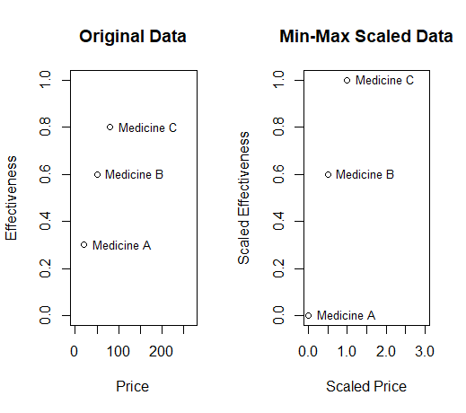
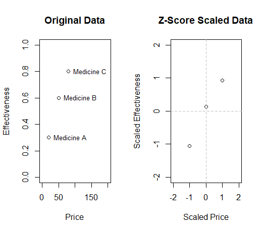
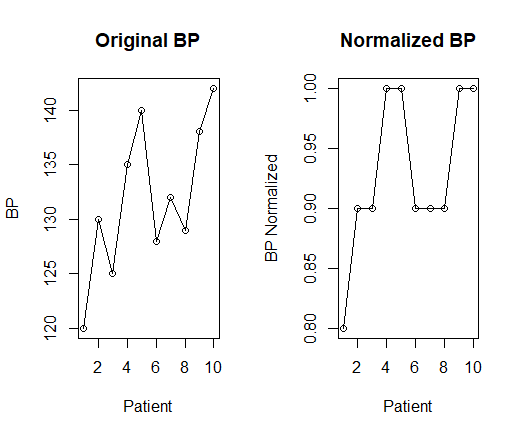
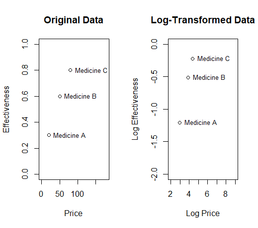
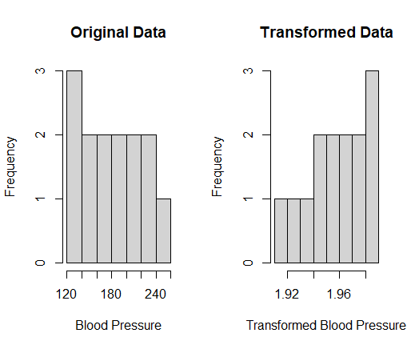

# Data Normalization

### Introduction

Data normalization is the process of transforming data into a standard format or scale to eliminate data redundancy, inconsistency, and improve the accuracy of the analysis. 
Normalization is typically performed on numerical data, although it can also be applied to categorical data.

The primary objective of data normalization is to bring the data into a common range or scale so that the data can be compared and analysed meaningfully. 
The normalization technique used will depend on the type of data, the characteristics of the data, and the intended use of the data.

There are several types of data normalization, including:

- **Min-max normalization:** This method scales the data to a range between 0 and 1.

- **Z-score normalization:** This method scales the data to have a mean of 0 and a standard deviation of 1.

- **Decimal scaling normalization:** This method scales the data to a range between -1 and 1.

- **Log transformation:** This method is used to normalize data that has a skewed distribution.

- **Box-Cox transformation:** This method is used to normalize data that has a skewed distribution and can handle negative values.

## Min-max normalization:

Min-max normalization is a popular data normalization technique that scales the data to a fixed range, typically between 0 and 1. The normalization formula is given by:

```r
# Min-max normalization
scaled_data <- (data - min(data)) / (max(data) - min(data))
``` 
:::note 
- **data** is the original data

- **min(data)** is the minimum value of the data

- **max(data)** is the maximum value of the data
:::
For a better comparison of the different methods, a medicine related dataset is always used in the following.
In this example, we have a dataset of three different medicines with their corresponding prices and effectiveness ratings. 

```r
# Example data
medicine <- data.frame(
  medicine_name = c("Medicine A", "Medicine B", "Medicine C"),
  price = c(20, 50, 80),
  effectiveness = c(0.3, 0.6, 0.8))
```
We first perform min-max normalization on the price and effectiveness columns using the `scale()` function. 

```r
# Min-max normalization
medicine_scaled <- as.data.frame(scale(medicine[,2:3], center = apply(medicine[,2:3], 2, min), scale = apply(medicine[,2:3], 2, max) - apply(medicine[,2:3], 2, min)))
medicine_scaled$medicine_name <- medicine$medicine_name
```

We then plot the original data and the scaled data using the `plot()` function, with medicine names displayed next to each data point using the `text()` function.

```r
# Plot the original and scaled data
par(mfrow = c(1, 2))
plot(medicine$price, medicine$effectiveness, xlim = c(0, 270), ylim = c(0, 1), main = "Original Data", xlab = "Price", ylab = "Effectiveness")
text(medicine$price, medicine$effectiveness, labels = medicine$medicine_name, pos = 4, cex = 0.8)
plot(medicine_scaled$price, medicine_scaled$effectiveness, xlim = c(0, 3), ylim = c(0, 1), main = "Min-Max Scaled Data", xlab = "Scaled Price", ylab = "Scaled Effectiveness")
text(medicine_scaled$price, medicine_scaled$effectiveness, labels = medicine_scaled$medicine_name, pos = 4, cex = 0.8)
```



The resulting plot shows how min-max normalization scales the data to a fixed range between 0 and 1, while preserving the original relationship between the data points. 
:::info
This can be useful in cases where we want to compare medicines based on their relative price and effectiveness, without one variable dominating the other.
:::

## Z-Score Normalization

Z-score normalization (also called standardization) is a method of normalizing data that transforms the data into a standard normal distribution with a mean of 0 and a standard deviation of 1. 
It's based on the idea that data points can be represented in terms of their distance from the mean in terms of standard deviations.

To perform Z-score normalization in R, you can use the `scale()` function, which scales the data by subtracting the mean and dividing by the standard deviation. 
The `scale()` function returns a matrix or data frame of the same dimensions as the input data, with each column transformed to have a mean of 0 and a standard deviation of 1.

```r
# Z-score normalization
scaled_data <- scale(data)
```

Here's an example of using the `scale()` function to perform Z-score normalization on a simple data frame.
In this example, we first define the same medicine dataset as before.

```r
# Example data
medicine <- data.frame(
  medicine_name = c("Medicine A", "Medicine B", "Medicine C"),
  price = c(20, 50, 80),
  effectiveness = c(0.3, 0.6, 0.8))
```
We then perform Z-score normalization on the price and effectiveness columns using the `scale()` function, which centres the data at 0 and scales it based on the standard deviation of the data. 
```r
# Z-score normalization
medicine_scaled <- as.data.frame(scale(medicine[,2:3]))
```
Now we can plot the original data and the scaled data using the `plot()` function, with medicine names displayed next to each data point using the `text()` function. 
On further notice we add horizontal and vertical dashed lines at 0 to show the centre of the distribution.

```r
# Plot the original and scaled data
par(mfrow = c(1, 2))
plot(medicine$price, medicine$effectiveness, xlim = c(0, 200), ylim = c(0, 1), main = "Original Data", xlab = "Price", ylab = "Effectiveness")
text(medicine$price, medicine$effectiveness, labels = medicine$medicine_name, pos = 4, cex = 0.8)
plot(medicine_scaled$price, medicine_scaled$effectiveness, xlim = c(-2, 2), ylim = c(-2, 2), main = "Z-Score Scaled Data", xlab = "Scaled Price", ylab = "Scaled Effectiveness")
text(medicine_scaled$price, medicine_scaled$effectiveness, labels = medicine_scaled$medicine_name, pos = 4, cex = 0.8)
abline(h = 0, lty = 2, col = "gray")
abline(v = 0, lty = 2, col = "gray")
```



The resulting plot shows how Z-score normalization scales the data based on the mean and standard deviation of the data, with negative values indicating below-average values and positive values indicating above-average values. 

:::info
This can be useful in cases where we want to compare medicines based on their relative distance from the mean, or to identify outliers in the data.
:::

## Decimal scaling normalization

Decimal scaling normalization is a data normalization technique that involves scaling the values of a variable by dividing each value by a power of 10 based on the maximum absolute value in the data. 
In R, you can perform decimal scaling normalization using a simple for loop and the `log10()` function to determine the appropriate scaling factor for each variable. Here's an example:
```r
# Decimal scaling normalization
scaled_data <- x / 10^(ceiling(log10(max(abs(x)))))
```
:::note
- **x** is the original variable to be normalized

- **max(abs(x))**is the maximum absolute value of x

- **ceiling(log10(max(abs(x))))** calculates the number of decimal places needed to normalize the variable, which is the smallest integer greater than or equal to the base 10 logarithm of the maximum absolute value of x
:::

Here's an example of using decimal scaling normalization in an easy medicine-related context:

```r
# Example data: Original blood pressure measurements
bp <- c(120, 130, 125, 135, 140, 128, 132, 129, 138, 142)
```
The `max` function is used to find the maximum absolute value in the bp vector, and this value is used to divide each value in the vector to normalize the data. 
The `abs` function is used to ensure that the maximum value used for normalization is the maximum absolute value, regardless of whether the values in the vector are positive or negative. 
The `round` function is used to round the normalized values to one decimal place.

```r
# Decimal scaling normalization
bp_normalized <- round(bp / max(abs(bp)), 1)
```
Finally, the code creates a plot to compare the original and normalized blood pressure values. 
The par function is used to set up a multi-plot layout with one row and two columns:

```r
# Create a plot to compare the original and normalized values
par(mfrow = c(1,2)) # set up a multi-plot layout with 1 row and 2 columns
```
The first plot shows the original blood pressure measurements for each patient, using the plot function with the type argument set to "o" to create a line plot with points:
```r
# Plot original blood pressure values
plot(bp, type = "o", main = "Original BP",
     xlab = "Patient", ylab = "BP")
```
The second plot shows the normalized blood pressure values, again using the plot function with the type argument set to "o":
```R
# Plot normalized blood pressure values
plot(bp_normalized, type = "o", main = "Normalized BP",
     xlab = "Patient", ylab = "BP Normalized")
```



As you can see, the second plot shows the same trend as the first plot, but with values that are scaled between -1 and 1 using decimal scaling normalization. 
This makes it easier to compare the relative magnitudes of the blood pressure measurements for each patient.
:::info 
This can be useful in cases where we want to simplify the data by removing large differences in magnitude between different variables, without losing the relative relationships between the data points.
:::

## Log transformation

In R, log transformation can be performed using the `log()` function. This function takes one argument, the vector or matrix to be transformed, and returns the natural logarithm of each element in the input. 
The natural logarithm is a mathematical function that maps a positive number to its logarithm in base e (approximately 2.71828).

```r
# Log transformation
x_log <- log(x)
```
In this example, we first define the same medicine dataset as before. 

```r
# Example data
medicine <- data.frame(
  medicine_name = c("Medicine A", "Medicine B", "Medicine C"),
  price = c(20, 50, 80),
  effectiveness = c(0.3, 0.6, 0.8)
```

We then perform log transformation on the price and effectiveness columns using the `log()` function. 
This transformation helps to reduce the impact of extreme values and compresses the range of values, making the data more normally distributed. 

```r
# Log transformation
medicine_log <- medicine
medicine_log[, 2:3] <- log(medicine[, 2:3])
```

We then plot the original data and the log-transformed data using the `plot()` function, with medicine names displayed next to each data point using the `text()` function.

```r
# Plot the original and transformed data
par(mfrow = c(1, 2))
plot(medicine$price, medicine$effectiveness, xlim = c(0, 180), ylim = c(0, 1), main = "Original Data", xlab = "Price", ylab = "Effectiveness")
text(medicine$price, medicine$effectiveness, labels = medicine$medicine_name, pos = 4, cex = 0.8)
plot(medicine_log$price, medicine_log$effectiveness, xlim = c(2, 9), ylim = c(-2, 0), main = "Log-Transformed Data", xlab = "Log Price", ylab = "Log Effectiveness")
text(medicine_log$price, medicine_log$effectiveness, labels = medicine_log$medicine_name, pos = 4, cex = 0.8)
``` 



The resulting plot shows how log transformation compresses the range of values, with values closer to zero showing a greater degree of compression. 
:::info
This transformation can be useful in cases where we want to reduce the impact of outliers or extreme values, while still preserving the underlying relationships between the data points.
:::

## Box-Cox transformation

The Box-Cox transformation is a method used to transform non-normal data into a normal distribution. 
The transformation involves raising the data to a power (lambda) and then taking the natural logarithm of the result. 
The Box-Cox transformation is often used in regression analysis, where it can help to improve the fit of a linear model by reducing heteroscedasticity and improving normality.

In R, the boxcox function from the [**MASS library**](https://cran.r-project.org/web/packages/MASS/index.html) can be used to perform the Box-Cox transformation. 
This function calculates the log-likelihood function for a range of lambda values, and returns the lambda value that maximizes the log-likelihood function.

```r
# Install the MASS package
install.packages("MASS")
library(MASS)
```
```r
# In R, the formula for the Box-Cox transformation is:
y_transformed = (y^lambda - 1) / lambda
```
:::note
- **y** is the original variable or dataset

- **lambda** is the parameter that controls the transformation

- **y_transformed** is the transformed variable or dataset
:::

Just a visualized example of the application of the Box Cox transformation to a group of 10 patients and their blood pressure:



The histogram on the left shows the distribution of the original blood pressure data. 
We can see that the data is slightly skewed to the right, with most of the readings between 120 and 200 mmHg.

The histogram on the right shows the distribution of the transformed blood pressure data, after applying the Box-Cox transformation with the optimal lambda value. 
We can see that the data is now more symmetric and approximately normally distributed, with most of the readings between -1 and 1.

:::tip5 Tips for Data Normalization

**1. Understand the data:** It is important to understand the characteristics of the data before selecting a normalization technique. The distribution, range, and presence of outliers should be taken into consideration.

**2. Choose the appropriate technique:** There are many normalization techniques available, and the appropriate technique should be selected based on the specific characteristics of the data and the requirements of the analysis.

**3. Check for errors:** Data normalization can introduce errors, such as loss of information or the introduction of bias. It is important to check for these errors and address them before proceeding with analysis.

**4. Validate the results:** It is important to validate the results of the normalization technique and ensure that it has achieved the desired outcome, such as improved normality or comparability of the data.

**5. Document the process:** It is important to document the normalization process, including the technique used, the parameters selected, and any issues encountered. This documentation can help ensure reproducibility and aid in the interpretation of results.
:::

## Sources & Further Reading

- Pickett B, Altieri G. Normalization: what does it really mean?. Med Dosim. 1992;17(1):15-27. doi:10.1016/0958-3947(92)90004-y

- Cao XH, Stojkovic I, Obradovic Z. A robust data scaling algorithm to improve classification accuracies in biomedical data. BMC Bioinformatics. 2016;17(1):359. Published 2016 Sep 9. doi:10.1186/s12859-016-1236-x

- Bolstad BM, Irizarry RA, Astrand M, Speed TP. A comparison of normalization methods for high density oligonucleotide array data based on variance and bias. Bioinformatics. 2003;19(2):185-193. doi:10.1093/bioinformatics/19.2.185

- Kranzusch R, Aus dem Siepen F, Wiesemann S, et al. Z-score mapping for standardized analysis and reporting of cardiovascular magnetic resonance modified Look-Locker inversion recovery (MOLLI) T1 data: Normal behavior and validation in patients with amyloidosis. J Cardiovasc Magn Reson. 2020;22(1):6. Published 2020 Jan 20. doi:10.1186/s12968-019-0595-7