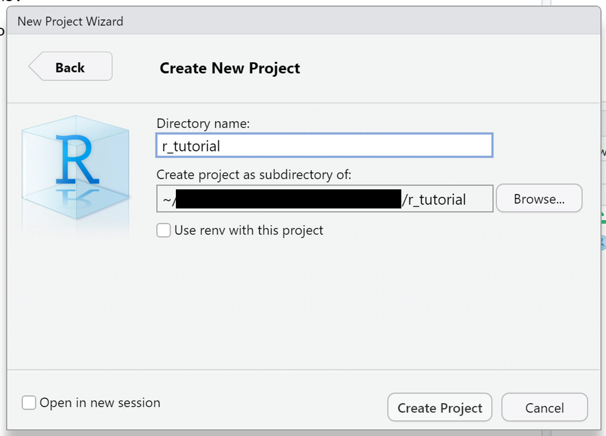
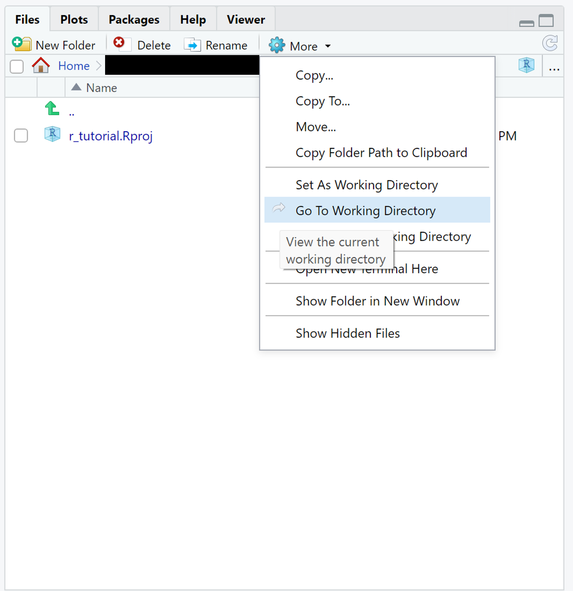

# Setting up the Environment

## Absolute and Relative Paths

When working with files and directories in the programming language R, it is essential to understand the difference between absolute and relative paths.

An absolute path provides a complete and specific address to a file or directory from the root of the file system.
It starts from the highest-level directory, such as "C:" on Windows or "/" on Unix-like systems, and includes all the intermediate directories required to reach the desired file or directory. 
Absolute paths are typically longer and less portable since they are tied to the specific file system structure.

Here's an example of an absolute path in R:

```r
absolute_path <- "C:/Users/Username/Documents/data.csv"
```

In this example, the absolute path points to a file named "data.csv" located in the "Documents" directory of the user "Username" on the "C:" drive.
The path explicitly specifies the entire directory structure required to reach the file.

On the other hand, a relative path specifies the location of a file or directory relative to the current working directory (the directory from which the R script or session is being executed).
It provides a more flexible approach as it does not depend on the specific file system structure or drive letter.

Consider the following example:

```r
relative_path <- "data/data.csv"
```

In this case, the relative path points to a file named "data.csv" located in the "data" directory within the current working directory.
Since the path is relative, it can be used on different systems without modification, as long as the file structure within the working directory remains consistent.

It is important to note that the current working directory can be changed during an R session using the `setwd()` function. Therefore, the interpretation of a relative path may differ based on the working directory's context.

To ensure portability and flexibility in your R code, it is often recommended to use relative paths whenever possible.
Relative paths make it easier to share code with others or move code to different directories or systems without requiring modifications to the file paths. 
However, there may be cases where absolute paths are necessary, such as when working with files in fixed locations or when specific system dependencies are required.

## RStudio Projects
The "Projects" feature in the RStudio IDE provides a powerful and efficient way to organize, manage, and collaborate on R projects.
Projects offer a dedicated workspace with a distinct working directory, making it easier to keep track of files, packages, and project-specific settings. 
Using relative paths is more intuitive with RStudio Projects as the working directory is automatically set.


"New project" will give you the choice of either creating a new folder as your workspace or choosing an existing folder to work in.
"New directory" → "New project" will allow you to choose a directory for your folder and give it a name.


In the bottom right part of RStudio you can now see your working directory. "View working directory" will open your folder in RStudio.


You can now create scripts and save data in this project.
For example, instead of using an absolute path such as `C:/.../documents/r_project/data.csv`, you can use `data.csv` if `C:/.../documents/r_project` is your working directory.

It is possible to create several R Projects, so you can easily keep an overview over you scripts and data.
