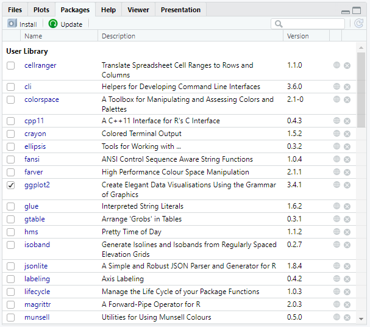
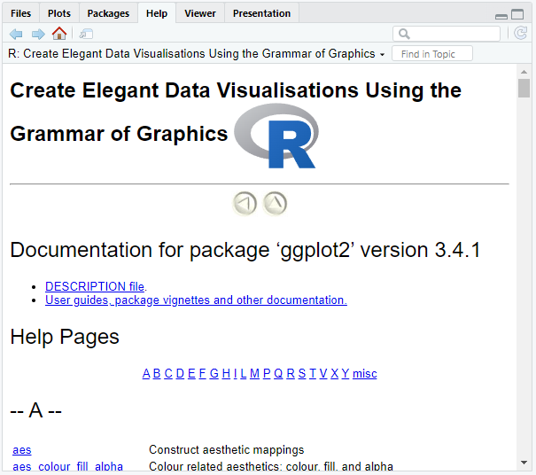

# Functions & Libraries

A function is a collection of statements that work together to complete a certain task.
A function can accept information in the form of parameters (= input).
As a result, it can return data (= output).

R includes a vast variety of built-in functions, and users can write their own.

## Call a Function

You've already learnt how to call functions unintentionally in previous chapters.
In the following, we will use the `sd()` function to demonstrate how to call a function.
It is utilized to calculate the standard deviation.

Type the name of the function followed by parentheses, such as `sd()`, and the arguments between the parentheses (arguments are separated by a comma):

```r
# Calculate the standard deviation of 2, 4, 5 and 8
sd(c(2, 4, 5, 8))

output:
[1] 2.5
```

:::tip
Variables can also be used as function arguments:

```r
values <- c(2, 4, 5, 8)
sd(values)

output:
[1] 2.5
```

You may also assign the function's output to a variable if you wish to reuse the function's output:

```r
my_sd <- sd(values)
my_sd

output:
[1] 2.5
```

**NOTE**   
R passes arguments by value, not by reference.
It basically implies that a variable that you pass into an R function cannot be changed.
:::

## Built-in Functions

Basic examples of built-in functions are seq(), mean(), max(), sum(), and paste(), among others.
They are directly accessed by user-written applications.

### Function Information

With `help()` or `?`, you can achieve information about a function:

```r
# Find out information about sd()
help(sd)
?sd
```

:::tip
With `args()`, you can simply call the arguments of the function:

```r
# Call the arguments of sd()
args(sd)

output:
function (x, na.rm = FALSE) 
NULL
```
:::

### Argument Matching

The description for `sd()` shows that the function actually takes two arguments: `sd(x, na.rm = FALSE)`.

When you enter `sd(values)` into the R console, R understands that `values` is the argument `x` and not `na.rm`.
That is because of the arguments' positioning (`values` comes first, such as `x`).

Another way to match the arguments is by using the equal sign: `sd(x = values)`.

### Default Values

The second argument to the `sd()` function indicates that by default `na.rm` is set to `FALSE` (even if you do not specify this argument yourself).
This means that missing values will not be eliminated.
However, default values can be overwritten, e.g. `na.rm = TRUE`.

In contrast, `x` is not specified by default.
If you do not specify the value of an argument without default values, an error will occur.

## Nested Functions

R allows you to use functions within functions.

:::note example
To get the absolute differences in patient ages in gynaecology and dermatology, use `abs()` on `gynaecology - dermatology`. To determine the mean absolute deviation, call `abs()` within `mean()`.

```r
# The gynaecology and dermatology vectors have already been created for you
gynaecology <- c(16, 49, 25, 20, 33, 56)
dermatology <- c(77, 56, 16, 28, 43, 64)

# Calculate the mean absolute deviation
mean(abs(gynaecology - dermatology))

output:
[1] 17.16667
```
:::

## User-Defined Functions

### Create a Function

You can use the preceding function construct to build your own function:

```r
function_name <- function(arguments) {
    body
}
```

- **Function name**: It should be short yet clear and meaningful, so that the person who sees our code understands exactly what this function performs.
- **Function arguments**: We have already covered what arguments are.
But it is possible for a function to have no arguments, although this is rarely practical.
You can have as many arguments as you like, and you may assign default values to them or not.
- **Function body**: The function body is a collection of commands enclosed by curly braces that are executed in a preset sequence each time the function is called.
In other words, we put what we need the function to accomplish in the function body.

:::note example
We want to create a function that squares the given integer.
```r
# Build the function square()
square <- function(x) {
    x^2
}

# Calculate 4 squared
square(4)

output:
[1] 16
```
:::

### Return Values

By default, R returns the value of the function's final statement.
However, you may use the `return()` function to directly tell R what to return.

:::note example
You must assign `x` to a new variable and return it in the function body to do this.
```r
# Return the value y by assigning y to x squared
square <- function(x) {
    y = x^2
    return(y)
}

# Calculate 4 squared
square(4)

output:
[1] 16
```
:::

Using `return()` at the conclusion of the function body is not usually beneficial, although it might be useful in some instances.

## Function Scoping

Function scoping means that variables specified within a function are inaccessible outside that function.

Consider our global R environment (our whole program) to be a room that contains all the objects, variables, functions, etc. that we have utilized.
When we call a variable x, R will search around the room to get the value of x.

:::tip
We may use `ls()` to see what's in our environment.
:::

As we define a new function, R sets up a fresh temporary environment for it.
Imagine setting up a new room within our global R environment.
The new room contains all the objects we have created, modified, and used within the function.
But, as soon as the function is finished performing, the room disappears.

:::note example
The next example will show you that the variable `txt` does not exist outside the function, only inside it.

```r
# Create a function with a local variable
R <- function() {
  txt <- "cool"
  paste("R is", txt)
}

# Print out R()
R()

output:
[1] "R is cool"

# Call the variable txt
txt

output:
Error: object 'txt' not found
```
:::

:::tip
You may use the global assignment operator `<<-` to define a global variable inside a function.

```r
# Create a function with a global variable
R <- function() {
  txt <<- "cool"
  paste("R is", txt)
}

# Print out R()
R()

output:
[1] "R is cool"

# Call the variable txt
txt

output:
[1] "cool"
```
The variable `txt` is now accessible outside the function.
:::

## R Packages

R packages are accessible collections of data, code, and documentation and are essentially additions or extensions to the R software.

R already offers built-in packages, such as the `base` package, which includes functions such as `mean()`, `list()`, and `sample()` among others.
However, for more in-depth data analysis, you might want to use more than that.

### Install and Load Packages

You can use R's built-in `install.packages()` function to install packages on your computer's hard drive.
This function navigates to CRAN (Comprehensive R Archive Network), a repository containing thousands of packages, and downloads them.

Afterwards, you have to load the package into memory by using `library()`.
This enables usage of a package's functionality throughout the current R session.
Therefore, before beginning a new R session, you must always load all the packages you intend to use.
Alternatively, you could call the `require()` function, which works similarly. 

:::note example
```r
# Install the ggplot2 package
install.packages("ggplot2")

# Load the ggplot2 package
library(ggplot2)
```
:::

### Identify Loaded Packages

If we want to see which packages we loaded, we may go to the packages tab in the console's bottom right window. We may search for packages and load them by ticking the box next to them.



You could also enter `(.packages())` or `search()` into the console.
They will display all the packages that are currently loaded into memory.

```r
(.packages())

output:
[1] "ggplot2"   "stats"     "graphics"  "grDevices" "utils"     "datasets"  "methods"   "base"
```
```r
search()

output:
 [1] ".GlobalEnv"        "package:ggplot2"   "tools:rstudio"     "package:stats"     "package:graphics" 
 [6] "package:grDevices" "package:utils"     "package:datasets"  "package:methods"   "Autoloads"        
[11] "package:base" 
```

### Package Information

By clicking the package name in the packages tab, we may get additional information about the selected package in the help tab.
If we click the `ggplot2` package, we get the following:



Alternatively, we may type `help(package = "ggplot2")` into the R console. This will also lead you to the help tab.