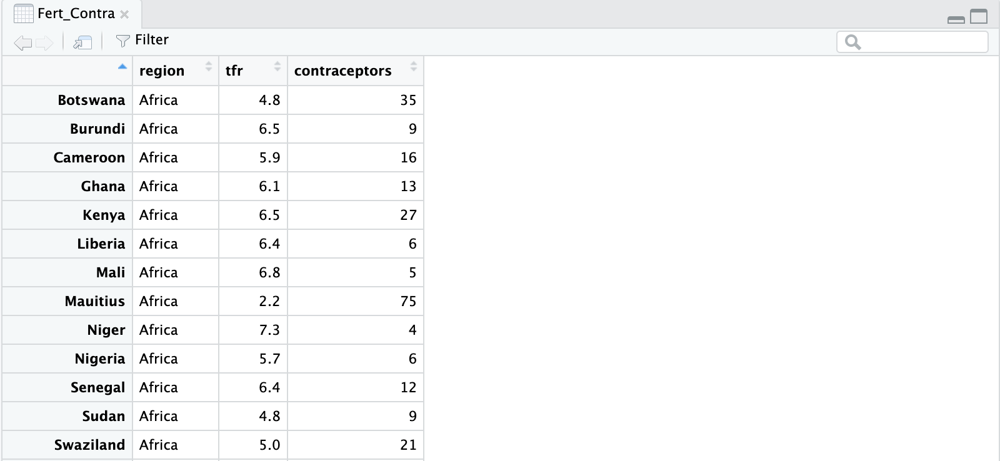
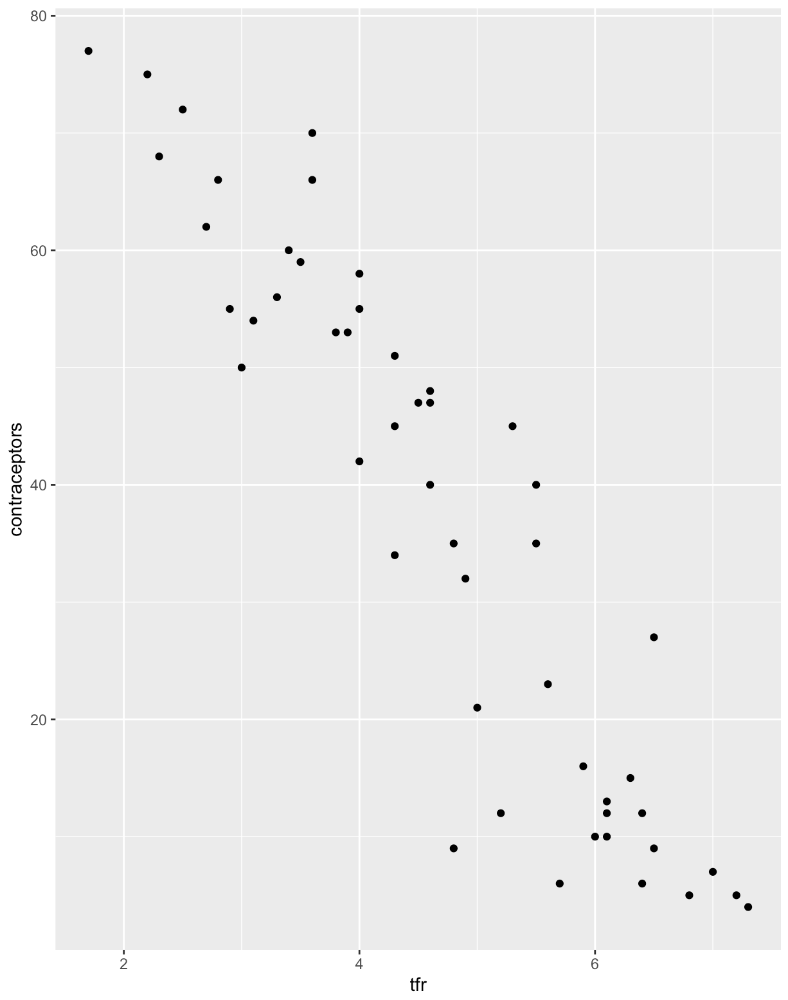
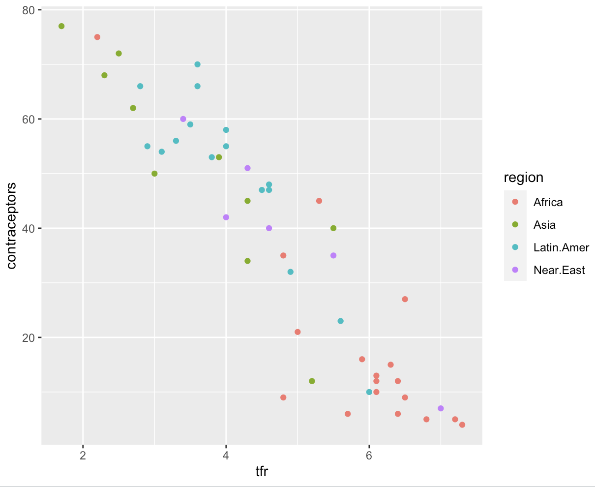
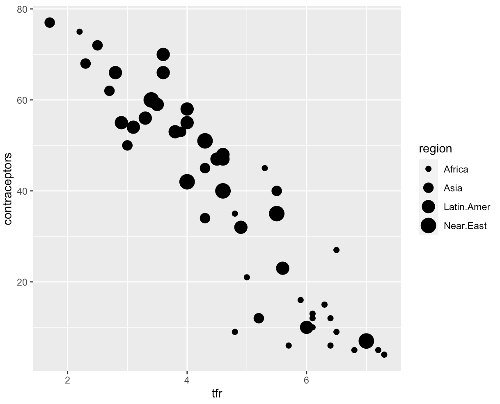
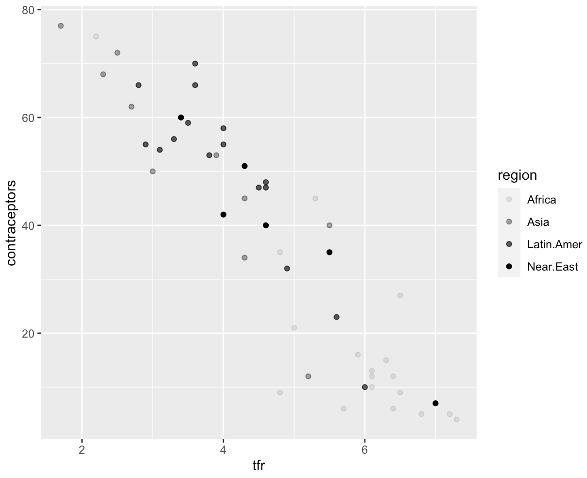
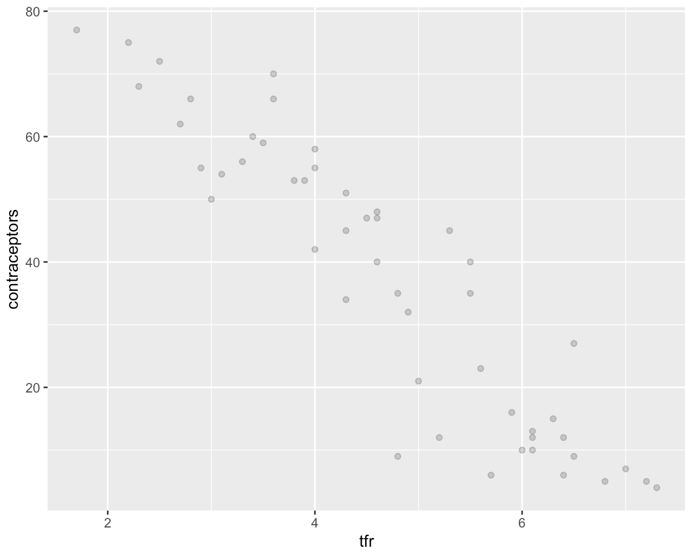
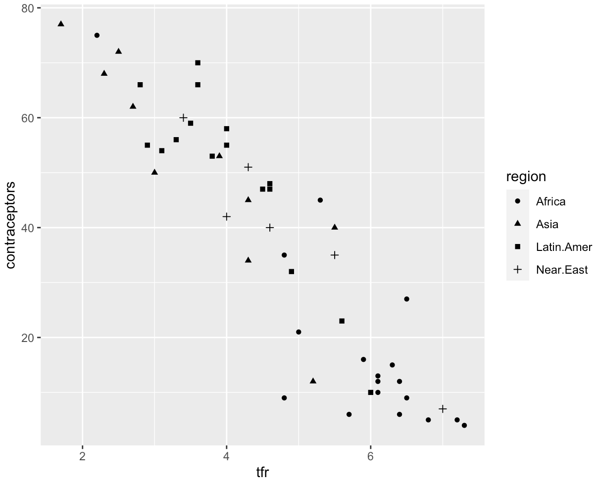
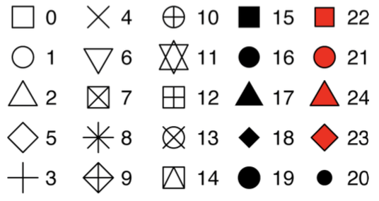

# ggplot2: Aesthetics

Aesthetics are one of the essential building blocks to create a plot in ggplot2. 

## The Robey dataset

In order to explore this topic thoroughly, we will be using R and a dataset called `Robey` that is already preloaded into R Studio.
The dataset contains information about total fertility rate and contraception usage amongst developing countries from 1992.
For more information, type in `?carData::Robey` in your console.
To access the data set, we need to load it into our workspace.
We do this, by assigning the data set to a variable, e.g. Fert_Contra.
Using the `View` function, we can look at the data in a new window:

```r
# load the data set into your workspace

Fert_Contra <- data(carData::Robey)

# get an overview of your data using the View function

View(Fert_Contra)
```

The `View` function will show the data set in a table format as seen below:



:::caution

You also need to load the ggplot package into your workspace before you can use it!
To do so, type `library(ggplot2)` into the console.

:::

## What are aesthetics?

Aesthetics are used to ***map*** different information to certain visual properties in a plot.
Mapping means that a variable from the specified data set is linked to the plot in R to display it accurately.
Examples of aesthetics include the size, colour or shape of the points in a plot.
The mapping of variables to the x- or y-axis are also aesthetics.

You apply the aesthetic function by using `aes()` after typing `ggplot2`.
Consider the following:

```r 
# create a scatter plot displaying the relationship between the total fertility rate 
ggplot(Fert_Contra, aes(x = tfr, y = contraceptors)) + geom_point()
```
This example of code contains the three essential parts that are always needed to create a graph in ggplot2:

- `ggplot()`: the coordinate system that you add layers to.
The `Fert_Contra` argument is the data set that you want to visualize.
It is always expected that the first parameter in this function is the data set, so you do not need to use a syntax such as `data =` here.
- `aes(x = tfr, y = contraceptors)`: The aesthetics argument, that maps the variables to the x and y axes of the plot.
- `+ geom_point()`: adds a geometry layer to your plot.
This particular geometry function adds a layer of points so that a scatter plot is created.
There are different geometry functions that create different plots (which will be explained in the next chapter).

The resulting plot will look like this:


The graph displays a clear relationship between the total fertility rate (`tfr`) and the percent of contraception amongst married women of childbearing age (`contraceptors`).

You will usually have more variables in your data set that you may want to display on a single plot.
You can display more variables in one plot by mapping them to additional aesthetics such as colour and size.

### Colour Aesthetics

If you have a variable with categorical data (meaning it has a few specific values such as eye colours), you use `color`. To use this aesthetic, you add `color = ` inside the `aes()` function:

``` r 
# create a plot that shows the relationship between tfr and contraceptors amongst different regions 
ggplot(Fert_Contra, aes(x= tfr, y = contraceptors, color = region)) 
    + geom_point()
```
In the above code we added an argument in the `aes()` function in which the region variable was mapped to the `color` aesthetics. This assigns a unique colour to each value in the variable.
ggplot2 automatically adds a legend to the plot to show which values correspond to which colours:



This plot conveys that the total fertility rate is at its highest in African regions, whilst the percent of contraceptors amongst married women of childbearing age is at its lowest in these regions. 

When you use other `geom` layers, the `fill` argument is used to change the colour inside a box or bar, whilst the `color` argument changes the outlines of a visualization.

:::info

Whereas most `geom` layers use the `fill` argument to change the colour, `geom_point()` is an exception: you use the `color` (not `fill`) argument for the point colour!

:::

### Size Aesthetics
If you have a variable with numerical data (meaning it can take any value in a range, such as height), you use `size`.
To use this aesthetic, you add `size = ` inside the `aes` function:

``` r 
# create a plot that shows the relationship between tfr and contraceptors amongst different regions 
ggplot(Fert_Contra, aes(x= tfr, y = contraceptors, size = region)) 
    + geom_point()
```
In this example, `region` was mapped to the size aesthetic, where the size of each point corresponds to a certain region.
However, since mapping a categorical data with the size aesthetic is not recommended, R will send out a warning along the lines of ***"Using size for a discrete variable is not advised"***:



:::note
The greater the size of the dots, the larger the value the dot represents!
:::

### Alpha Aesthetics

Using the `alpha` argument you can alter the transparency of your points:

```r 
# create a plot that shows the relationship between tfr and contraceptors amongst different regions 
ggplot(Fert_Contra, aes(x= tfr, y = contraceptors, alpha = region)) + geom_point()
``` 
In this case, `region` was mapped to the `alpha` aesthetic, with the transparency corresponding with a region. There will also be a warning message since we are mapping a categorical data with an aesthetic that is better used for numerical data:



:::info

The alpha argument can also be used to change the transparency of all points in a plot to the same value!
The default value for alpha is 1.
To reduce the transparency, you can set `alpha` to a value less than 1 (and larger than 0), outside `aes()` and inside the geom layer:

```r
ggplot(Fert_Contra, aes(x= tfr, y = contraceptors))
+ geom_point(alpha = 0.7)

```

Which gives the following result:



This syntax is usually used in an attempt to solve the problem of overplotting; in large data sets the dots are often all over each other and cannot be distinguished!

:::


### shape aesthetics
Categorical variables can also be mapped onto a plot using the shape aesthetic:

```r
# create a plot that shows the relationship between tfr and contraceptors amongst different regions 
ggplot(Fert_Contra, aes(x= tfr, y = contraceptors, shape = region)) + geom_point()

```
This will translate into the following plot:


ggplot2 has 25 different shapes to choose from:

|      | 
|--------------|
| ***Taken from Wickham & Grolemund, R for Data Science: Import, Tidy, transform, visualize, and model data.***     | 

The shapes seem to repeat themselves, but there are differences in their properties:
- Shapes 0 to 14 can only change the colour of their outline using the `color` argument.
- Shapes 15 to 18 are filled with `color`.
- Shapes 21 to 24 have an outline which can be modified using `color` and the insides can be modified using `fill`.


## Common aesthetics summary

The table below shows a summary of many aesthetics that are used to map information to a plot:

| Aesthetic:     | What it does:     | 
|--------------|-----------|
| `x`      | maps variables to the x-axis     | 
| `y`   | maps variables to the y-axis  | 
|  `color` |  maps variables (preferably categorical) to outline colour  | 
| `fill`       |  maps variables (preferably categorical) to fill colour  | 
|  `shape`  |  maps variables (preferably categorical) to shape  | 
|  `size`|  maps variables (preferably numerical) to size  | 
|  `alpha`     |   maps variables (preferably numerical) to transparency | 
|  `line type`     |   maps variables to line type | 
|  `labels`     |   maps variables to certain words.  | 