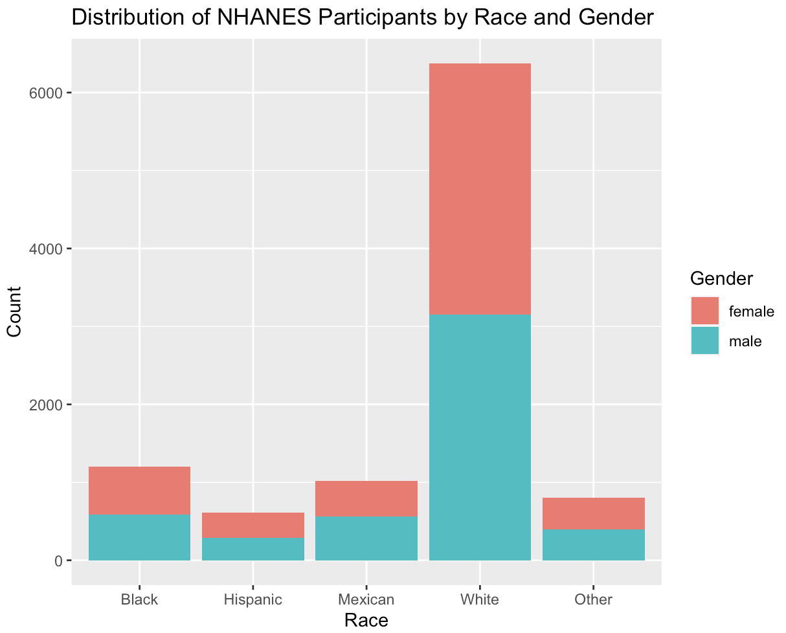
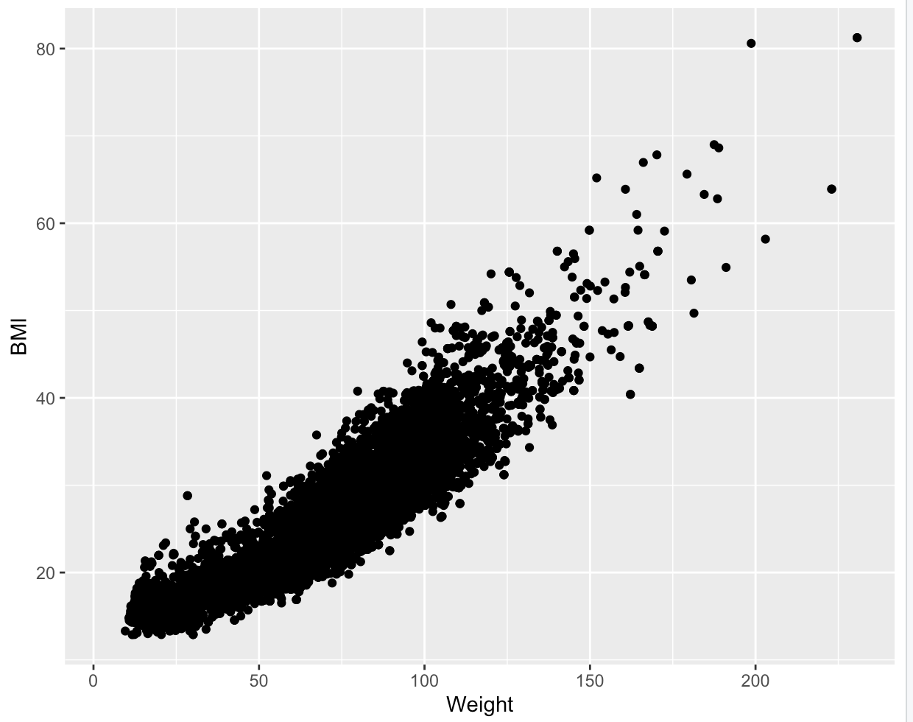
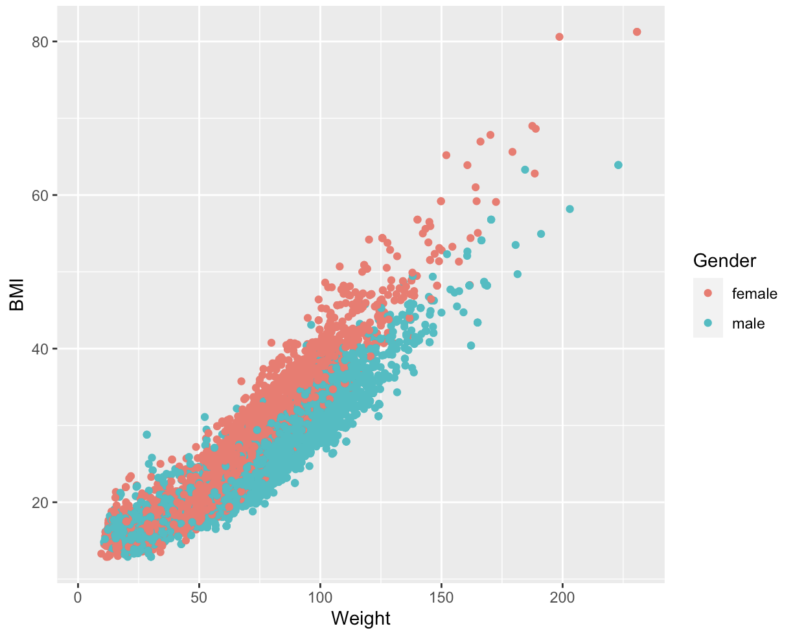
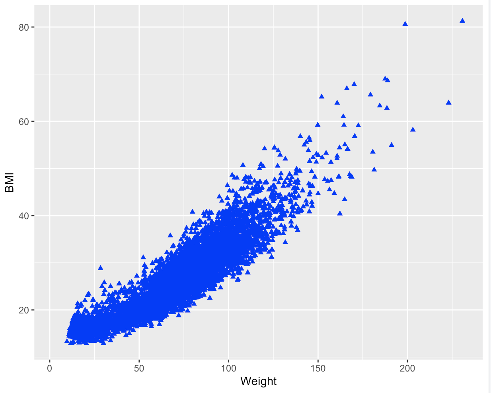
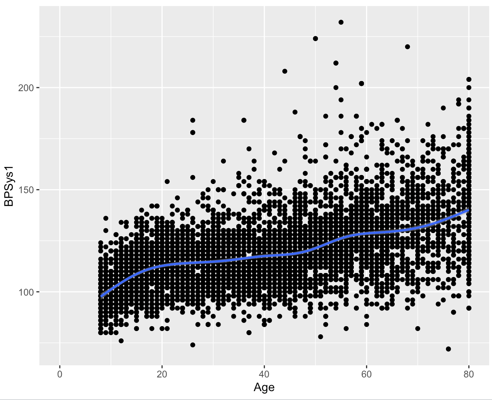
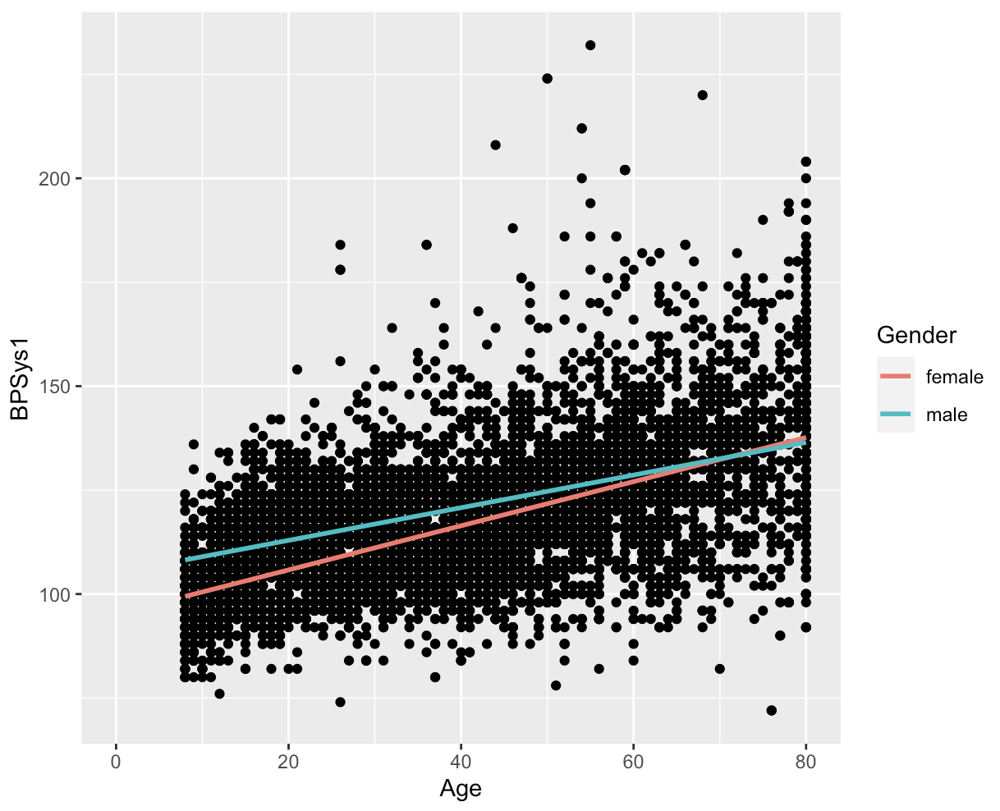
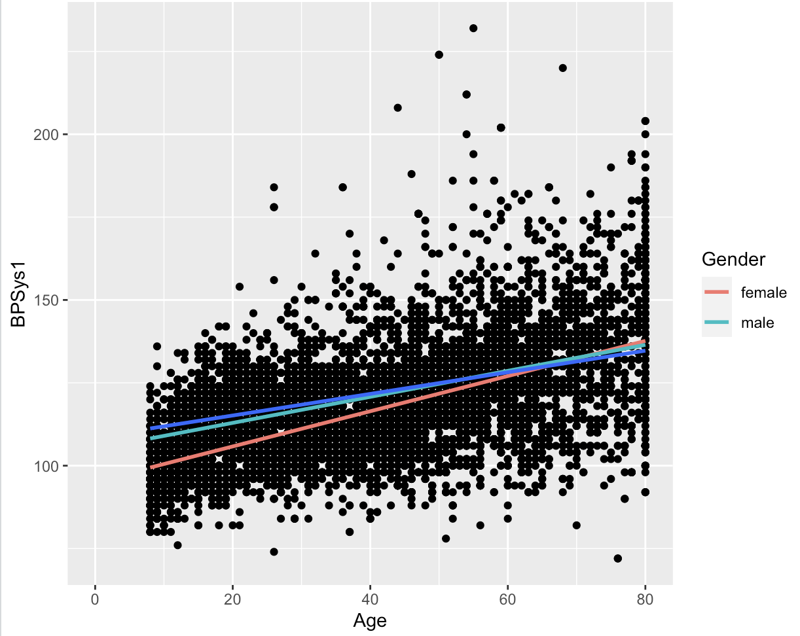
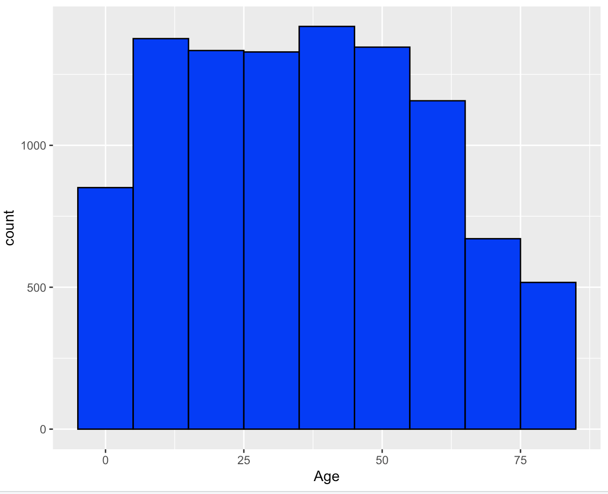
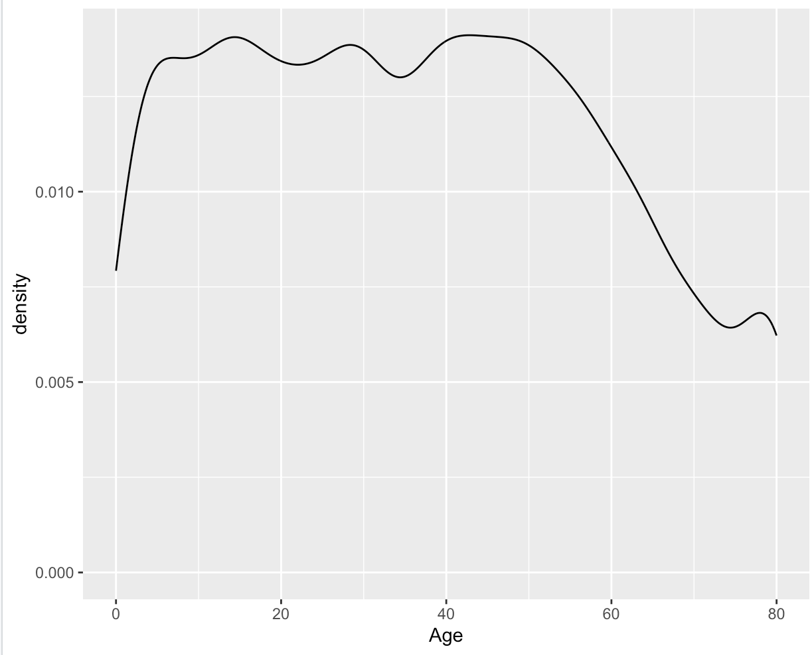
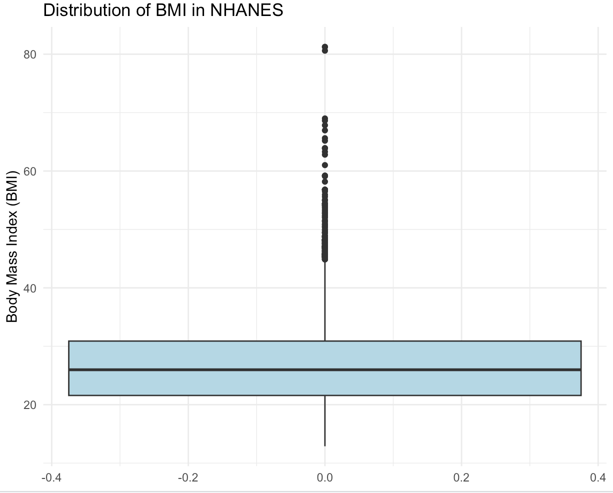

# ggplot: Geometries

The `ggplot()` function delivers the Cartesian plane on which the data points can be plotted on, however the function does not produce any visual output on its own. It is therefore necessary to add at least one geometric layer (or ***geoms*** for short) to our code. The geometric layer includes scatter plots, histograms, bar plots, box plots and many more. The layer can be accessed using the `geom_*()` function, where `*` is a term that is linked to a specific type of plot, as seen below:

- `geom_point()` creates a scatter plot.
- `geom_line()` creates a line graph.
- `geom_smooth()` creates a smoothed line, showing the trend in the data.
- `geom_bar()` creates a bar chart.
- `geom_histogram()` creates a histogram.
- `geom_density()` creates a density plot.
- `geom_boxplot()`creates a box plot.


## NHANES data set

In this chapter we will use the NHANES data set to create example plots. The National Health and Nutrition Examination Survey (NHANES) is a collection of studies conducted by the Centers for Disease Control and Prevention (CDC) to assess the health and nutritional status of adults and children in the United States. The dataset contains a wide range of health-related information, including demographic characteristics, physical and laboratory measurements, dietary information, and information about health behaviors and conditions. 

:::tip
You can install the `NHANES` data set directly from R:
1. Install the NHANES package by running the following code:
```r
install.packages("NHANES")
```

2. Load the NHANES package by running the following code:
```r
library(NHANES)
```

:::


We can use ggplot() to create a bar chart that tells us about the distribution of the participants of the NHANES by race and gender:

```r
# Create a bar chart to show he distribution of the participants in the NHANES data set by race and gender
ggplot(NHANES, aes(x = Race1, fill = Gender)) +
     geom_bar() +
     xlab("Race") +
     ylab("Count") +
     ggtitle("Distribution of NHANES Participants by Race and Gender")

```
In this example, we are using the `geom_bar()` function to create a layer to produce the bar chart, mapping the `Race1` variable to the x axis and filling the bars based on gender.  The `xlab()`, `ylab()`, and `ggtitle()` functions are used to set the x-axis label, y-axis label and plot title and will be further explored in the ***Themes*** chapter.
This translates to:



This bar chart shows that the number of male and female participants are almost equal to each other. However, a larger proportion of the participants are of the white race. Only a small proportion is black, hispanic, mexican or other.


:::caution

Make sure to add the ***geom*** layer using a + sign! For a functioning code, the + sign needs to come at the end of the line of code, not at the beginning!

:::


:::tip
There are currently about 50 different geometries to choose from. For an overview of the different geom layers in R Studio, you can use the following code snippet:
```r
# Load ggplot2 into your workspace
library("ggplot2")
# assign the following function to a variable
geomlayers <- help.search("geom_", package="ggplot2")
# show name and title of all geoms currently available
geomlayers$matches
```

You can also have a look at the [ggplot cheat sheet](https://www.maths.usyd.edu.au/u/UG/SM/STAT3022/r/current/Misc/data-visualization-2.1.pdf)!
:::

## Required and accepted aesthetics 

Depending on the geom function, different aesthetics for the mapping of variables are needed. You can differentiate between required and accepted aesthetics. Required aesthetics are needed for the geom to function and be displayed. Which aesthetics are necessary for a plot depends on the geom function that is added to the plot. For example, the `geom_histogram` function only requires the `x` aesthetic, but the `geom_point` function requires both the `x` and the `y` aesthetic. If required aesthetics are not included, you will receive an error message.

For instance, suppose you want to plot the relationship between weight and BMI in a scatter plot and write the following:

```r
#Plot the relationship between weight and BMI in a scatter plot
ggplot(NHANES, aes(x = Weight, color = BMI)) +
    geom_point()

```
You will not receive a plot, but rather this error message:
```r
Error: geom_point requires the following missing aesthetics: y
```

In order to display the plot, you need to include the essential aesthetic, in this case, `y`:
```r
ggplot(NHANES, aes(x = Weight, y = BMI)) +
   geom_point() 
```
Which will give you the following plot:




:::tip

If you are not sure, which aesthetics are required you can simply browse the geom's help file in R studio (by typing ?geom_point for example) and scroll down to the “Aesthetics” section. The required aesthetics are displayed in bold!

:::

Accepted aesthetics, on the other hand, do not need to be specified in order for the geom function to work. Instead, these aesthetics can be used to add further detail on the plot and include more variables. In our example earlier, we can include the `color` aesthetic and map it to the gender variable to include more detail:


```r

ggplot(NHANES, aes(x = Weight, y = BMI, color = Gender)) +
       geom_point() 
```

This block of code has the additional aesthetic color, which is not essential to display a functioning plot, but can be used to add more detail. The code translates to:



We can see a positive correlation between BMI and weight, with the female participants showing a higher weight distribution than the male participants.

## Constant aesthetics

The same arguments inside an `aes` function can also be used to as a constant value to modify an individual geom layer altogether. This can be done, by specifying the arguments ***outside*** the `aes` function and match them with the appropriate value:

```r
 ggplot(NHANES, aes(x = Weight, y = BMI)) +
    geom_point(color = "blue", shape = 17) 
 ```
Which translates to:




In this example we have turned all points blue and changed their shape. You can apply this to any geom with any aesthetic argument. The most common arguments to modify the representation of geom layer are listed below:


| Aesthetic:     | What it does:     |  Example value:     | 
|--------------|-----------|-----------|
| `color`     | changes the color of points, lines and borders; can use hex code to identify color   | #45818e, "red", NA (transparent) | 
| `size`  | changes the line width and the point size  | 12, 5, 1 |
| `stroke`  | changes the line width of the outline of a shape | 12, 5, 1 |  
|  `shape`  | changes the point shapes, with numbers from 0 to 24 representing different shapes (see aesthetics chapter for further information.)  | 0 (= open square), 1 (= open circle), 2 (= open triangle), NA (draws nothing) | 
| `fill`       |  changes the color inside shapes such as bars.| 45818e, "red", NA (transparent) | 
|  `alpha`  |  changes the transparency of shapes.  | 0.7, 1, 0 | 
|  `linetype` |  changes pattern for lines  | 1 (= solid), 2 (= dashed), 4 (= dotdash), 5 (= longdash), 6 (= twodash) | 
|  `sides`     |   changes the placement of rug plots  | "b" (= bottom),"l" (= left), "t" (= top), "r" (= right), "bl" (= both bottom and left), "tr" (= both top and right)| 
|  `width`   |  changes width of box plots | 5, 2, 30  | 
|    `binwidth`     |  changes the bin width of histograms | 5, 2, 30  | 
|    `notch`       |   shows if the box plots should be notched or not. | TRUE, FALSE | 
|    `position`       |   controls how overlapping points should be displayed in one single layer. | "identity" (= default), "jitter" (=reduces point overlap), "dodge" (= places bar charts side by side), "stack" (= stacks grouped bar charts vertically), "fill" (= stacks grouped bar charts vertically and standardizes their height)  | 


## Layering geoms 

It is possible to include multiple geoms in a single ggplot object, providing the ability to construct complex and engaging visualizations.  To incorporate various geoms, you can apply the "+" operator to add them together.

In this code the relationship between the age and the systolic blood pressure is visualized using 2 geom layers:

```r
ggplot(NHANES) +
    geom_point(aes(x = Age, y = BPSys1)) +
    geom_smooth(aes(x = Age, y = BPSys1)) 
```

However, as you can see, there are some redundancies in the aesthetic mappings. We can simplify the code by passing the mappings to the `ggplot()` function. By doing so, the mapping will be recognized as global mappings that affect all the geoms within the graph: 

```r
ggplot(NHANES, aes(x = Age, y = BPSys1)) +
    geom_point() +
    geom_smooth() 
```
The output will remain the same:



The code above passes the mappings to the `ggplot()` function, which can be a time-saving technique, particularly when adding multiple layers to your plot.  By passing the mappings to ` ggplot()`, you can avoid specifying the aesthetics in each individual layer. Any other layers that you add to the plot will be automatically impacted by the mappings passed to the `ggplot()` function.


Furthermore, besides the aesthetic mappings applied globally, it is also possible to add supplementary mappings within each geom. This enables you to make specific local changes to a particular geom layer. For instance:

```r
ggplot(NHANES, aes(x = Age, y = BPSys1)) +
  geom_point() +
  geom_smooth(aes(color = Gender), method = "lm", se = FALSE,)
```


In this specific code, an aesthetic was included in the `geom_smooth(`) layer, where the `gender` variable was mapped to color. As this argument was defined only within the `geom_smooth` layer, it will only be applied to that particular layer.



This data visualization reveals notable differences between female and male participants. It appears that women generally have lower systolic blood pressure, but this trend seems to reverse at higher ages.


### Overwriting global mappings
It's possible to modify the global mappings for a specific layer by adding a local mapping. If you include a mapping in the local geom that is also included in the global mappings, the global mapping for that argument will be replaced by the local mapping for that specific layer. 

For instance, in the following code we have added another `geom_smooth` layer which shows the trend between the systolic blood pressure and age for participants with a BMI over 30:

```r
# use the dplyr package to create a subset out of the NHANES data set (not covered in this course)
NHANES_30.0_plus_BMI <- NHANES %>%
  filter (BMI_WHO == "30.0_plus")

# create a plot with one layer using the data from the subset.
ggplot(NHANES, aes(x = Age, y = BPSys1)) +
  geom_point() +
  geom_smooth( aes(color = Gender), method = "lm", se = FALSE) +
  geom_smooth( data = NHANES_30.0_plus_BMI, method = "lm", se = FALSE)

```

We have replaced the data specified in the global mappings with a subset of the original NHANES data set that only contains participants with an BMI over 30 in the third geom layer:



Participants with a BMI over 30 exhibit higher systolic blood pressure, as indicated by the dark blue line.

## Example plots

### Histograms

Since histograms display the distribution of a single variable, the `geom_histogram()` function in ggplot2 requires only one primary aesthetic, which is the x axis, and it should be assigned to a numeric variable.
The code below creates a histogram that depicts the age distribution of the participants in the NHANES:

```r
ggplot(NHANES, aes(x = Age)) +
    geom_histogram(binwidth = 10, color = "black", fill = "blue") 
```
This translates to:




:::caution

If you don't provide any arguments for binwidth or bins when using `geom_histogram()`, you'll see a message saying "stat_bin() using bins = 30. Pick better value with binwidth." This message simply means that a default number of bins was used to create the histogram. To change the number of bins used, you can specify a value for `binwidth`.

:::

### Density plot
The `geom_density()` layer is used to create density plots, which show the distribution of a numerical variable in a smooth curve.  A density plot is similar to a histogram, but instead of bars, it uses a smooth line to estimate the density of the data. This makes it easier to see the shape of the distribution, especially when it's not symmetric. 
The code below creates a density plot that depicts the age distribution of the participants in the NHANES:

```r
ggplot(NHANES, aes(x = Age)) +
  geom_density()
```
This translates to:



### Boxplot
The `geom_boxplot()` function in ggplot2 is used to create a box-and-whisker plot, which is a standardized way of displaying the distribution of a continuous variable through its quartiles. 

The box-and-whisker plot shows the median (middle value), the upper and lower quartiles (the 25th and 75th percentiles), and the range of the data (the whiskers), with potential outliers shown as individual points or asterisks.

To create a boxplot using `geom_boxplot()`, we need to specify the data frame and the variables that we want to plot. The `x` aesthetic is used to specify the grouping variable, and the `y` aesthetic is used to specify the variable we want to plot. 

The following code creates a box plot that depicts the BMI Distribution of the participants in NHANES:

```r
ggplot(NHANES, aes(y = BMI)) +
  geom_boxplot(fill = "lightblue") +
  labs(title = "Distribution of BMI in NHANES",
       y = "Body Mass Index (BMI)") +
  theme_minimal()
```
This translates to:



:::note
 Don't worry if the last bit of the code seems unfamiliar! This will be part of the next chapter!
:::

## Conclusion
Geometry layers are a fundamental component of creating visualizations in ggplot. The different types of geometry available in ggplot2 allow you to create a wide variety of plots, from scatter plots and line plots to bar charts and histograms. 


