# ggplot: Themes


## Overview of ggplot2 themes

### Introduction
A ggplot2 theme is a collection of predefined visual elements that can be used to modify the appearance of your ggplot2 plots.  Themes control various aspects of the plot such as the background color, axis labels, grid lines, text size, legend appearance, and more. Themes ensure that there is consistency in the appearance of multiple plots and can be used to customize plots to match the preferences of the user or the requirements of a particular project.

:::caution
Themes only modify the appearance of the plot, but do not alter the actual data!
:::

### Popular ggplot2 themes 
***theme_grey()***: The default theme in ggplot2. It has a light grey background with white grid lines and black axis lines. It is useful when you want to create a simple and clean plot that emphasizes the data rather than the design. Below is an example:

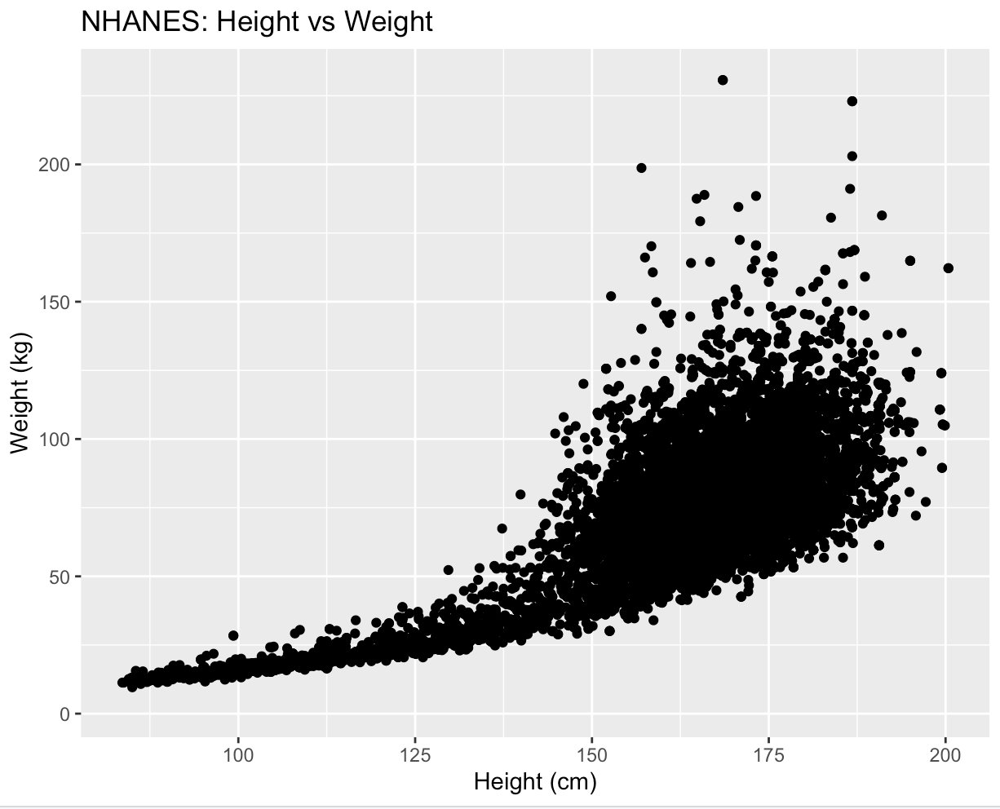

***theme_bw()***: This theme has a white background with black axis lines and grid lines. It is similar to `theme_gray()` but with higher contrast. This theme is often used when you want to create a publication-quality plot. Below is an example:


***theme_classic()***: This theme has a white background with black axis lines and gray grid lines. It has a classic look and feel that is similar to plots created in base R. Below is an example:

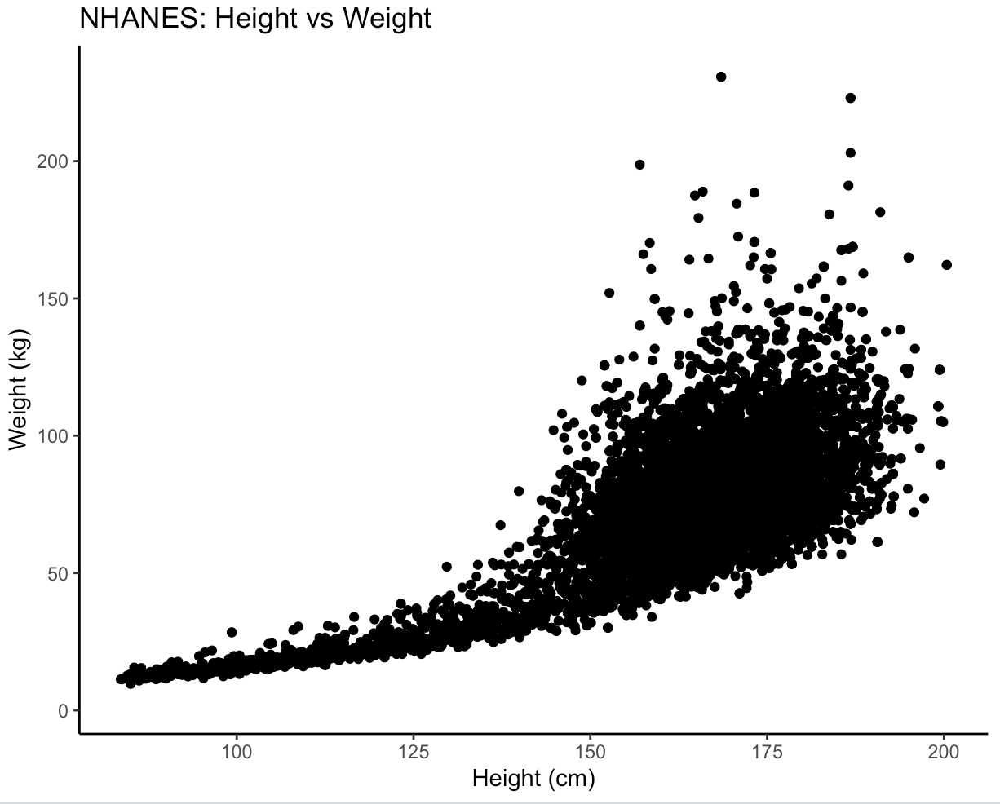

***theme_minimal()***: This theme has a white background with no grid lines or tick marks. It is a minimalistic theme that emphasizes the data. Below is an example:

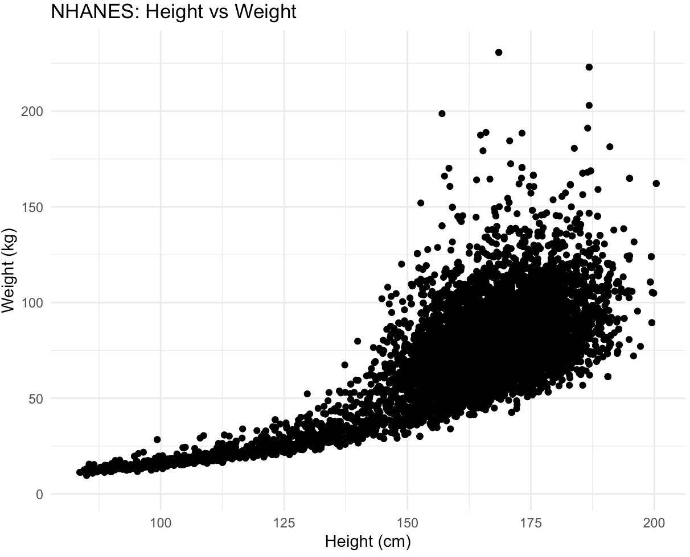


## Customizing theme elements: 

In addition to using predefined themes, ggplot2 also provides the ability to customize individual visual elements, such as the plot background, axis labels, legend, and plot title.

The visual elements of the theme layer can be classified into 3 different types: ***text***, ***rectangle*** and ***line***. Each type can be customized using the `element_function`, such as `element_text()`, `element_rect()`, and `element_line()`. 
These functions are arguments within the `theme()` function.

### **Text**
The text element of the themes layer can be modified using `element_text()`. Since there are several text elements in a plot, each of them have a unique name. Below is an overview of all different text elements that can be modified via `element_text()`:

```r
text
    axis.title
        axis.title.x
            axis.title.x.top
            axis.title.x.bottom
        axis.title.y
            axis.title.y.left
            axis.title.y.right
    title
        legend.title
        plot.title
        plot.subtitle
        plot.caption
        plot.tag
    axis.text
        axis.text.x
            axis.text.x.top
            axis.text.x.bottom
        axis.text.y
            axis.text.y.left
            axis.text.y.right
    legend.text
    strip.text
        strip.text.x
        strip.text.y
```
Certain elements are nested within each other, creating some sort of hierarchy. This is important, as the hierarchy determines which theme elements inherit properties from other theme elements. You can see that all text elements are nested within `text`. This means that all the text within a plot will be changed, if you use the `text` argument. 

To modify an element, call its argument (see code template above) within the theme function and use the `element_text()` to specify what we want to change. Below are listed some ways in which you can modify the text elements of the themes layer.

#### **Changing the Legend**

The legend in ggplot2 can be customized using the `theme() `function. To change the color, font size, and font family of the legend text, you can use the `legend.text` argument. Here's an example:

```r
ggplot(NHANES, aes(x = Height, y = Weight, color = Gender)) +
  geom_point() +
  theme(legend.text = element_text(color = "green", size = 12, family = "Arial"))

```
In this example, the last lines of code will set the color of the legend text to green, the font size to 12, and the font family to "Arial". This leads to the following plot:

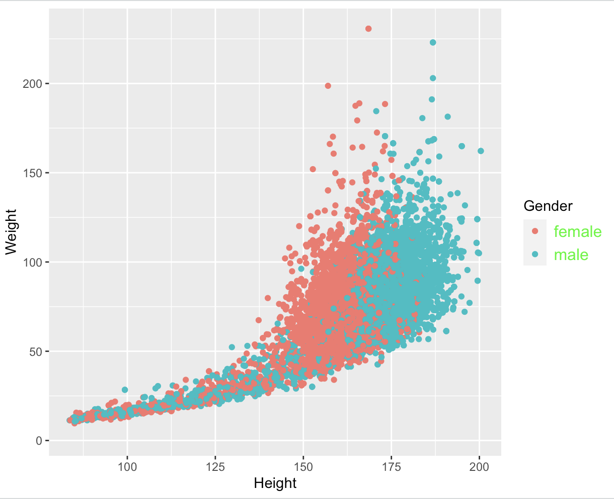

#### **Changing the Plot Title**

The plot title in ggplot2 can be customized using the `labs()` function. To change the color, font size, and font family of the plot title, you can use the `title` argument:
```r
ggplot(NHANES, aes(x = Height, y = Weight, color = Gender)) +
  geom_point() +
  labs(title = "Weight vs Height by Gender") +
  theme(plot.title = element_text(color = "purple", size = 20, family = "Helvetica", hjust = 0.5))
```

In this example, we've set the color of the plot title to purple, the font size to 20, the font family to "Helvetica", and the horizontal justification (hjust) to 0.5, which centers the plot title horizontally:

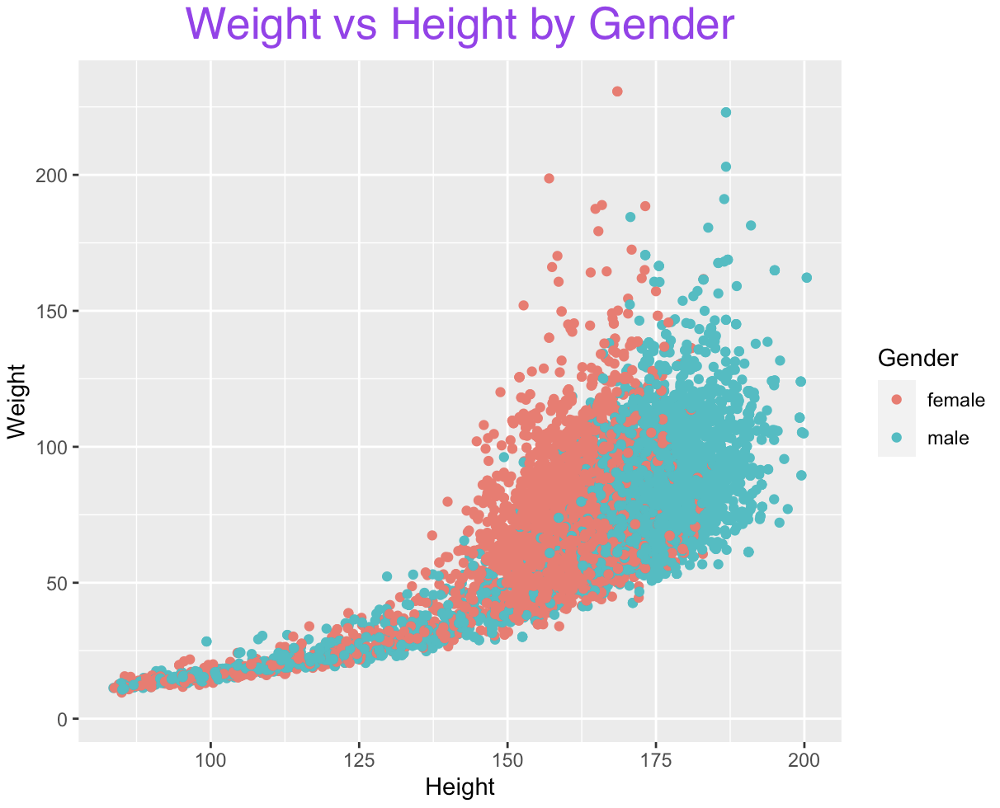

:::tip

#### The `labs()` function

The `labs()` function can be used to add labels to title, subtitle, y axis and x axis. To change the axis labels in ggplot2, the labs() function takes arguments for the x-axis label (x), the y-axis label (y), and the plot title (title):

```r
ggplot(NHANES, aes(x = Height, y = Weight, color = Gender)) +
  geom_point() +
  labs(x = "Height (cm)", y = "Weight (kg)", title = "Weight vs Height by Gender")
```
This will set the x-axis  to "Height (cm)", the y-axis  to "Weight (kg)", and the plot title to "Weight vs Height by Gender":

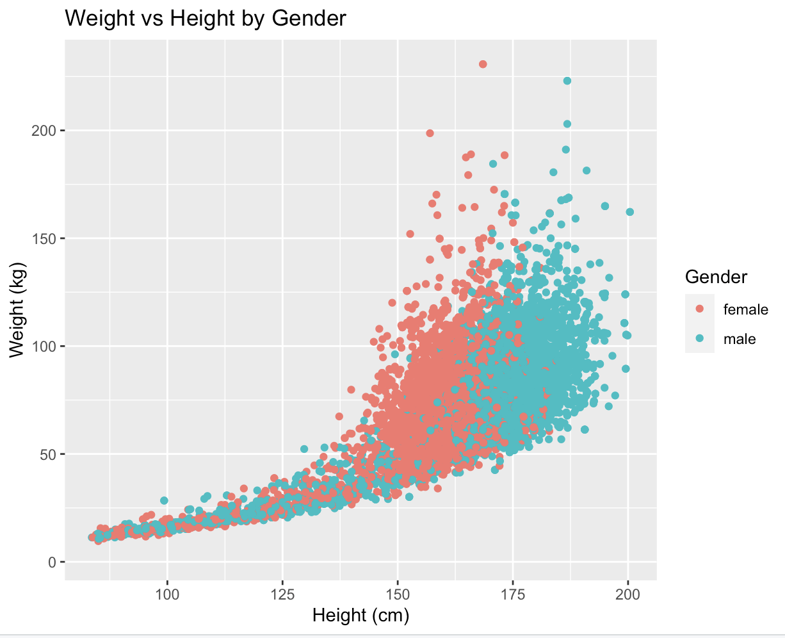

You can also use the `subtitle` argument to add a subtitle or the `caption` argument to add a caption!
:::

#### **Changing the Font Size and Color of Axis Labels**

The font size and color of axis labels can also be customized using the `element_text()` function within the `theme()` function:

```r
ggplot(NHANES, aes(x = Height, y = Weight, color = Gender)) +
  geom_point() +
  labs(x = "Height (cm)", y = "Weight (kg)", title = "Weight vs Height by Gender") +
  theme(axis.title = element_text(size = 14, color = "red"))

```
In this example, we've set the font size of both the x-axis and y-axis labels to 14, and the color to red:

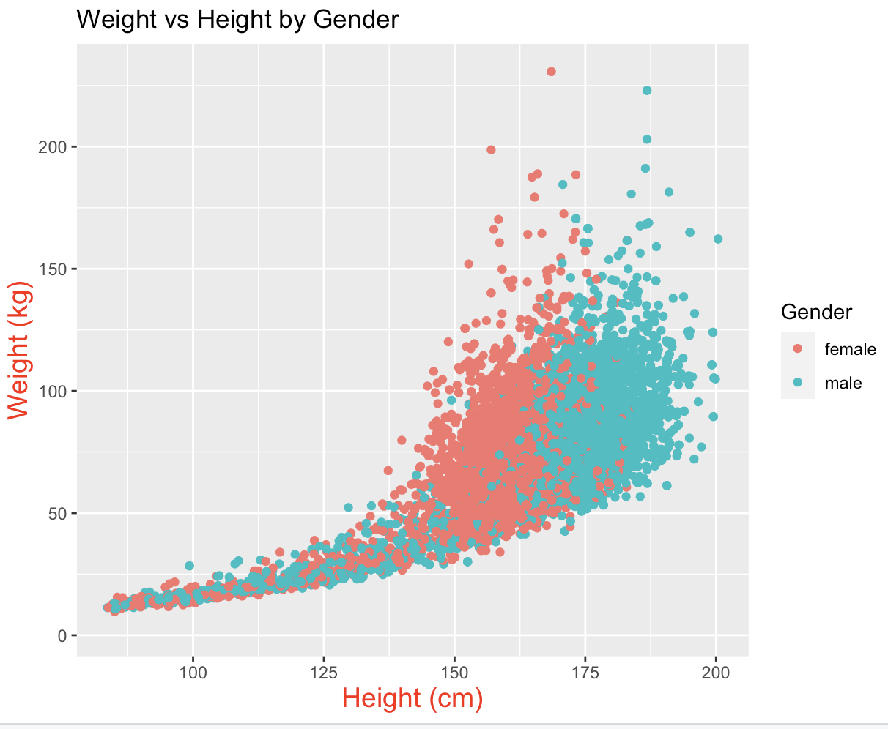

#### **Changing the Font Family of All Text Elements**

To change the font family of all text elements in the plot, including the axis labels, legend, and plot title, you can use the `theme()` function with the text argument:

```r
ggplot(NHANES, aes(x = Height, y = Weight, color = Gender)) +
  geom_point() +
  labs(x = "Height (cm)", y = "Weight (kg)", title = "Weight vs Height by Gender") +
  theme(text = element_text(family = "Comic Sans MS"))

```
In this example, we've set the font family of all text elements in the plot to "Comic Sans MS":

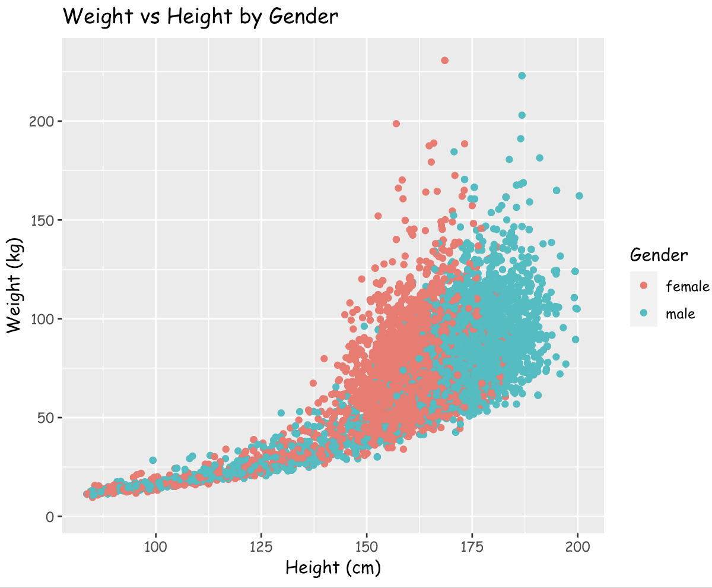


### **Line**
This type includes the tick marks on the axes, the axis lines themselves and all grid lines. Similar to the text element, you can modify the several line elements using `element_line()`. Below is summary of the line arguments that can be modified within the `theme()` function:

```r
line
    axis.ticks
        axis.ticks.x
            axis.ticks.x.top
            axis.ticks.x.bottom
        axis.ticks.y
            axis.ticks.y.left
            axis.ticks.x.right
        axis.line
            axis.line.x
                axis.line.x.top
                axis.line.x.bottom
            axis.line.y
                axis.line.y.left
                axis.line.y.right
    panel.grid
        panel.grid.major
            panel.grid.major.x
            panel.grid.major.y
        panel.grid.minor
            panel.grid.minor.x
            panel.grid.minor.y
```
:::note
Notice the hierarchy within the different elements; changing one element may affect other elements that are nested downstream!
:::

#### **Changing the major grid lines**

`panel.grid.major` is an argument in the `theme()` function in ggplot2 that controls the appearance of major grid lines in the plot. It is used to modify the appearance of the grid lines that separate the major tick marks on the axes:

```r

ggplot(NHANES, aes(x = Height, y = Weight, color = Gender)) +
  geom_point() +
  theme(panel.grid.major = element_line(color = "red", size = 0.5, linetype = "dotted"))
```

In this example, we've set the `panel.grid.major` argument to `element_line(color = "red", size = 0.5, linetype = "dotted")`, which would set the major grid lines to be red, with a size of 0.5, and a dotted linetype:

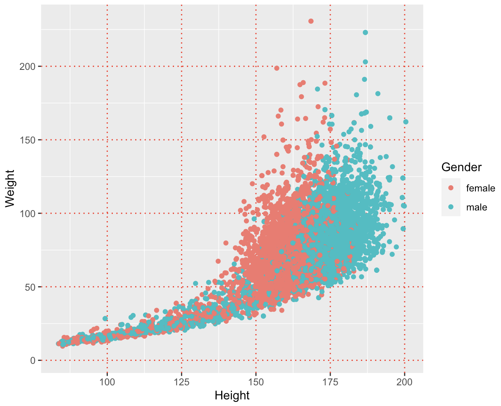

#### **Changing the appearance of minor grid lines on the y-axis**

`panel.grid.minor.y` controls the appearance of minor grid lines along the y-axis of a plot. By adjusting its properties, you can control the color, size, and line type of these minor grid lines to suit your needs:

```r

ggplot(NHANES, aes(x = Height, y = Weight, color = Gender)) +
  geom_point() +
  theme(panel.grid.minor.y = element_line(color = "blue", size = 1, linetype = "dashed"))
```

In this example, we've set the `panel.grid.minor.y` argument to `element_line(color = "blue", size = 1, linetype = "dashed")`, which would set the major grid lines to be blue, with a size of 1, and a dashed linetype:

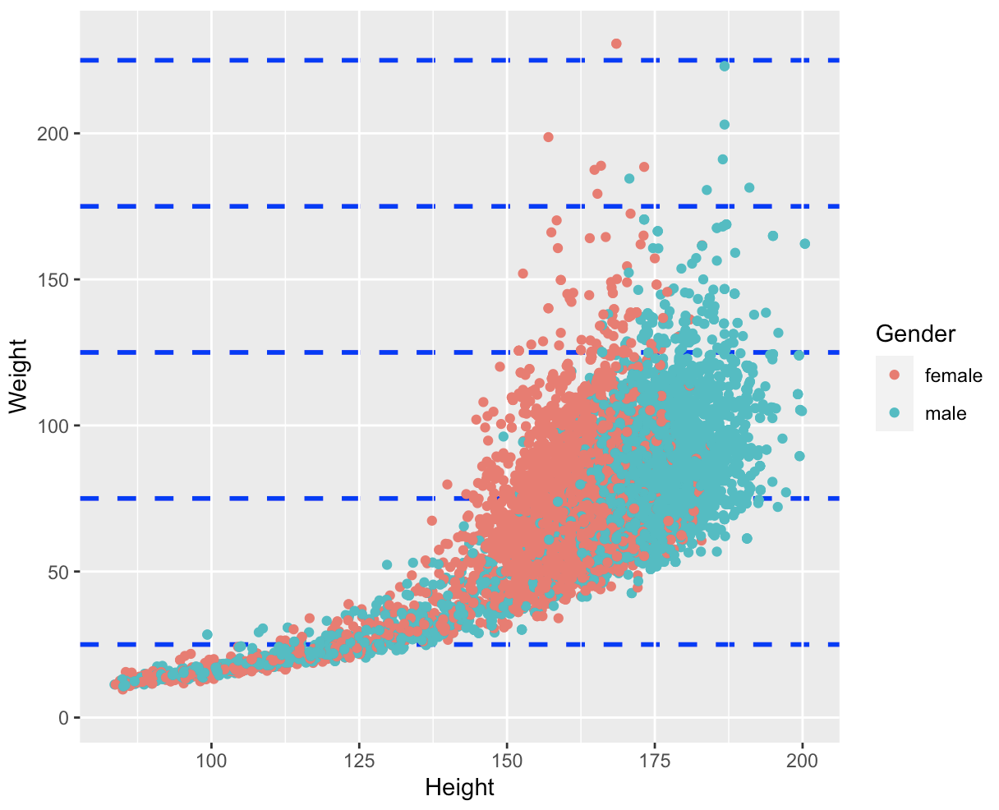

#### **Changing the axis ticks**

`axis.ticks` controls the appearance of the tick marks on the axes of a plot. By adjusting its properties, you can change the length, color, and thickness of the tick marks, as well as the distance between the tick marks and the axis labels:

```r
ggplot(NHANES, aes(x = Height, y = Weight, color = Gender)) +
  geom_point() +
  theme(axis.ticks = element_line(color = "dark green", size = 3 ))
```

In this example, we've set the `axis.ticks` argument to `element_line(color = "dark green", size = 3`, which changes the line color to dark green and the size to 3.

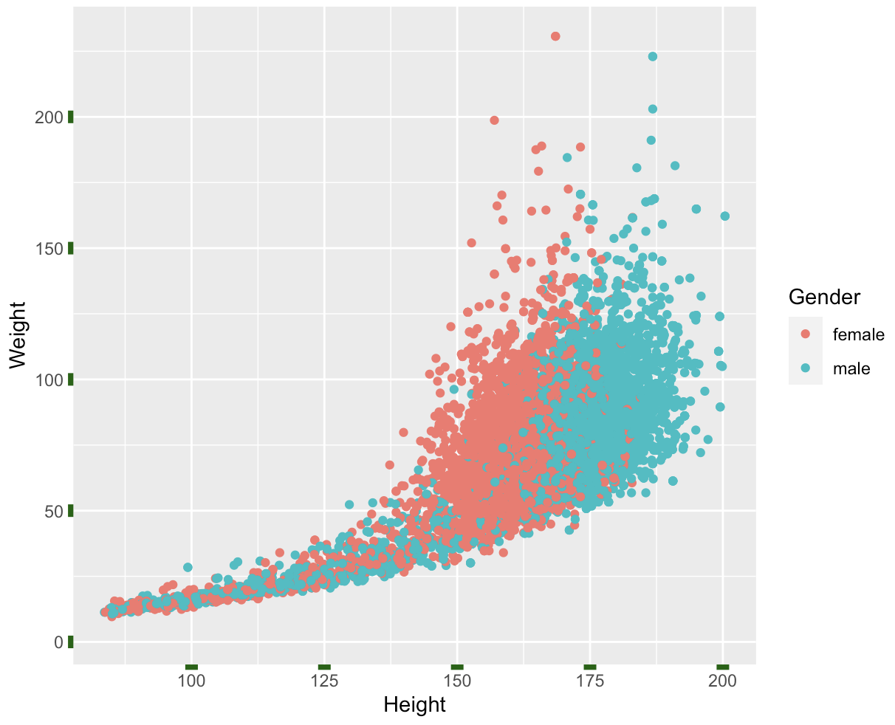

### **Rectangle**
In ggplot2, all rectangles in a plot of various sizes can be modified using `element_rect()`. There are also different elements used to modify the various rectangles found in a plot:

```r
rect
    legend.background
    legend.key
    legend.box.background
    panel.background
    panel.border
    plot.background
    strip.background
        strip.background.x
        strip.background.y
```

#### **Changing the Plot Background**

The background of a ggplot2 plot can be customized using the `theme()` function. To change the background color of the plot, you can use the panel.background argument. Here's an example:

```r
ggplot(NHANES, aes(x = Height, y = Weight, color = Gender)) +
  geom_point() +
  theme(panel.background = element_rect(fill = "lightblue"))
```

In this example, we've set the `panel.background` argument to `element_rect(fill = "lightblue")`, which changes the background color of the plot to light blue.

3


:::tip

***The `element_blank()` function***

The `element_blank()` function is used in a plot to remove an item. It creates a completely blank element, with no visible content:

```r
ggplot(NHANES, aes(x = Height, y = Weight, color = Gender)) +
  geom_point() +
  theme(
      line = element_blank(),
      rect = element_blank(),
      text = element_blank())
```
This will create the following plot:

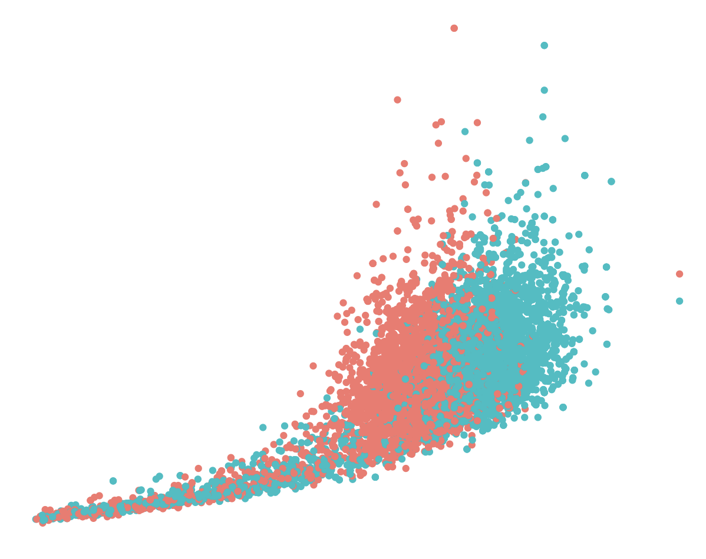
:::

## Creating your own theme:

As seen above, it is possible to create an entire theme layer from scratch, using the `theme()` function. However, this a rather time-intensive process and if you have numerous plots to display (in a publication for instance), you may want to automate the process.

Once you have created your own custom theme layout, you can assign it to a named variable. This allows you to use the theme repeatedly, making sure, you have consistent plot style throughout and use the specific theme to any plot you want.

The example below shows a custom theme function that is assigned to a named variable:

```r
NHANES_theme <- theme(text = element_text(family= "Courier New", size = 14),
                      rect = element_blank(),
                      panel.grid = element_blank(),
                      title = element_text(color = "orange"),
                      axis.line = element_line(color = "green"))
```
In this example, we've defined our custom theme as a function called `NHANES_theme`. Within this function, we've used the `theme()` function to change the font family and size of all text elements in the plot to Courier New and 14, respectively. The `rect` argument removes all rectangular elements from the plot. The `panel.grid` argument removes all horizontal and vertical grid line. The color of the plot title is changed to orange and the color of the x and y axis lines is set to green. 

Once we've defined our custom theme function, we can apply it to a plot using variable we have assigned it to:

```r
ggplot(NHANES, aes(x = Height, y = Weight, color = Gender)) +
  geom_point() +
  labs(x = "Height (cm)", y = "Weight (kg)", title = "Weight vs Height by Gender") +
  NHANES_theme
```

In this example, we've created a scatter plot of weight versus height by gender, and we've applied our custom theme using the `NHANES_theme` variable. The resulting plot will look like this:

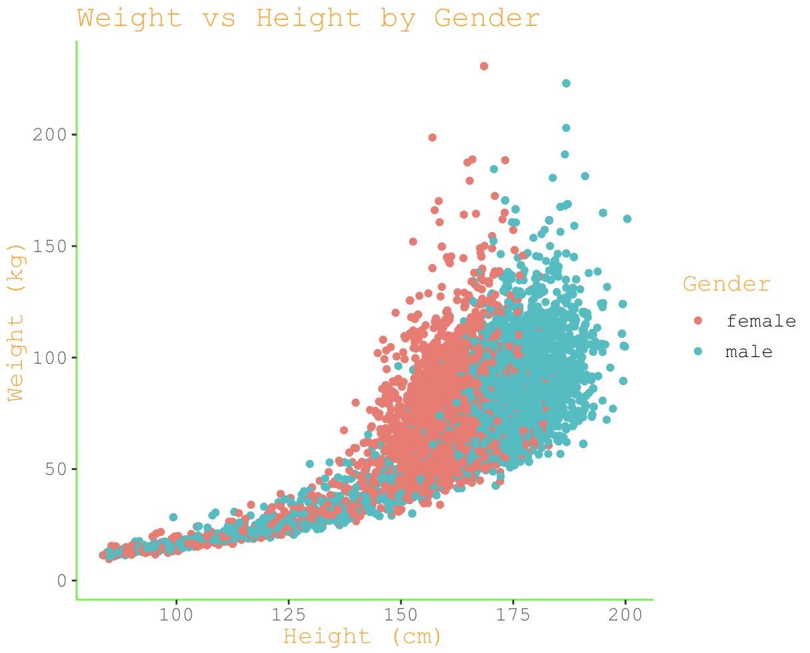

### Modifying Specific Theme Elements
If you want to modify some things on your theme objects, you can do so by adding another theme layer which overrides the previous settings. For example, let's say we wanted to modify the font family of the axis labels in the `theme_bw()` theme. We could do this as follows:

```r
my_theme_bw <- theme_bw() +
    theme(
        axis.title = element_text(family = "Arial", size = 30)
        )

```
In this example, we've created a custom theme function called `my_theme_bw()` that first applies the `theme_bw()` theme and then modifies the font family of the axis labels to Arial and changes the size to 30 using the `element_text()` function. We can then apply this custom theme to a plot in the same way as before:


```r
ggplot(NHANES, aes(x = Height, y = Weight, color = Gender)) +
  geom_point() +
  labs(x = "Height (cm)", y = "Weight (kg)", title = "Weight vs Height by Gender") +
  my_theme_bw
```
In this example, we've created a scatter plot of weight versus height by gender, and we've applied our custom theme using the `my_theme_bw()` function. The resulting plot will have a white background, axis label font family of Arial and size 30:

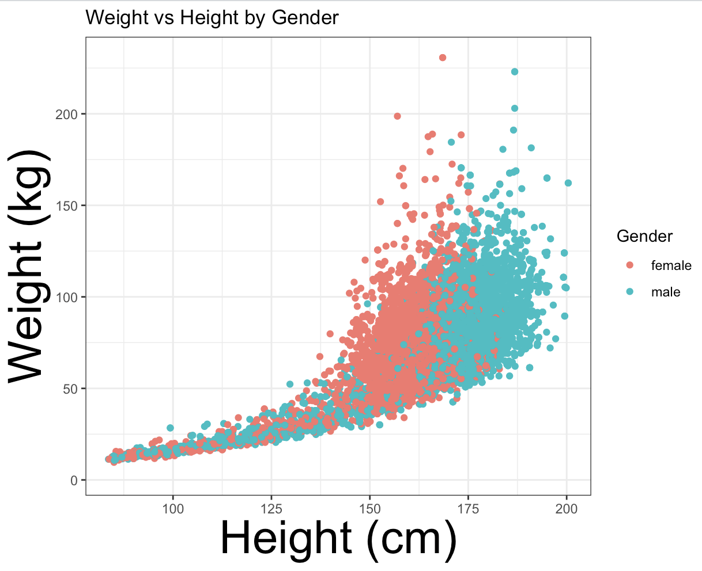


## Combining Themes with `theme_set()`

By default, ggplot2 applies a default theme to every plot we create. This default theme is applied to all plots, unless we override it with a different theme. We can change the default theme by using the `theme_set()` function. For example, we can set the default theme to be `theme_bw()`:
```r
theme_set(theme_bw())
```
This will make all new plots have a black and white theme.

::: info
The `theme_set()` allows us to set a new default theme that will be used for all subsequent plots in the current R session. 
:::

## Updating Themes with `theme_update()`
We can also modify individual elements of a theme using the `theme_update()` function. This function allows us to update specific theme elements, such as axis labels or legend, without changing the rest of the theme. To update an element, we need to specify which element to update, and then provide the new settings for that element. For example, we can update the font family of the plot title in `theme_bw()` to be Arial:

```r
theme_update(plot.title = element_text(family = "Arial"))
```
This will modify the default theme so that all plot titles are displayed using the Arial font family.

 ## Working with extensions: 

 ggplot2 is a powerful data visualization package in R, but its default themes may not always be the best fit for your data or presentation needs. Fortunately, there are several extensions available that allow you to access additional themes and customize the appearance of your plots. We will discuss two popular ggplot2 extensions, `ggthemes` and `hrbrthemes`, and show how to use them to create more visually appealing plots.

### **`ggthemes`**

`ggthemes` is an extension package that provides a collection of additional themes for ggplot2. To use `ggthemes`, you first need to install it by running the command:

```r
install.packages("ggthemes")
```
Once installed, you can load the `ggthemes` package by running the command:
```r
library(ggthemes)
```

This will allow you to access the additional themes provided by the package. `ggthemes` provides a wide range of themes, including:

- ***theme_economist()***: a theme based on the style used by The Economist magazine.
- ***theme_stata()***: a theme based on the style used in Stata software.
- ***theme_excel()***: a theme based on the style used in Microsoft Excel.
- ***theme_wsj()***: a theme based on the style used by The Wall Street Journal.
- ***theme_tufte()***: a theme based on the style used by Edward Tufte in his books.

For example, if we wanted to create a scatter plot of the relationship between BMI and systolic blood pressure using the economist theme, we could use the following code:

```r
ggplot(NHANES, aes(x=BMI, y=BPSys1)) + 
  geom_point() +
  labs(x="BMI", y="Systolic Blood Pressure") +
  theme_economist()
```
This will produce a scatter plot with a white background, gray grid lines, and a sans-serif font, all consistent with the style used by The Economist:

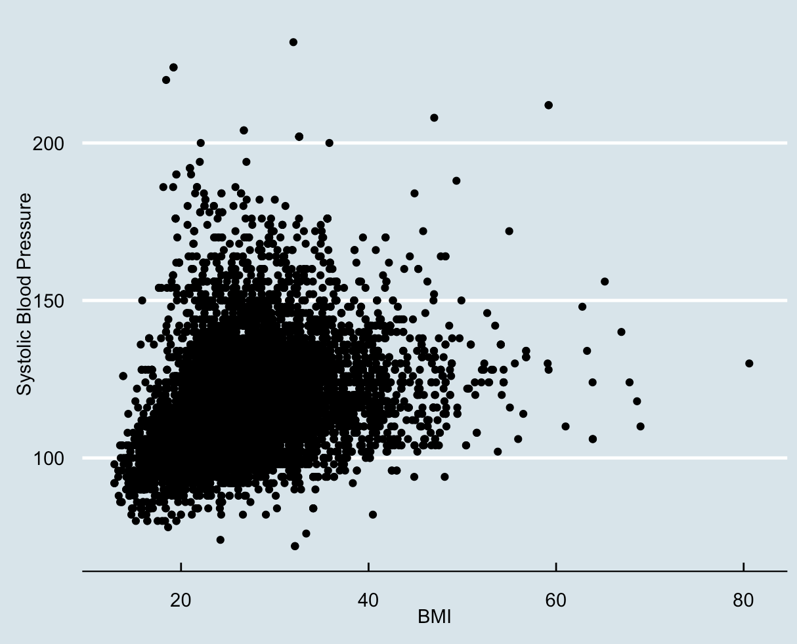

### **`hrbrthemes`:**

`hrbrthemes` is another extension package for ggplot2 that provides additional themes and customization options. To use `hrbrthemes`, you first need to install it by running the command:

```r
install.packages("hrbrthemes")
```
Once installed, you can load the hrbrthemes package by running the command:
```r
library(hrbrthemes)
```
hrbrthemes provides several themes, including:

- ***theme_ipsum()***: a clean and minimalist theme.
- ***theme_fivethirtyeight()***: a theme based on the style used by FiveThirtyEight website.
- ***theme_gdocs()***: a theme based on the style used in Google Docs.
- ***theme_economist_white()***: a variation of the economist theme with a white background.

For example, if we wanted to create a histogram of the age distribution using the fivethirtyeight theme, we could use the following code:
```r
ggplot(NHANES, aes(x=AgeMonths)) +
  geom_histogram(fill="#008FD5", color="black") +
  labs(x="Age", y="Count") +
  theme_fivethirtyeight()
```
This will produce a histogram with a gray background, bold fonts, and a color scheme consistent with the style used by the FiveThirtyEight website:

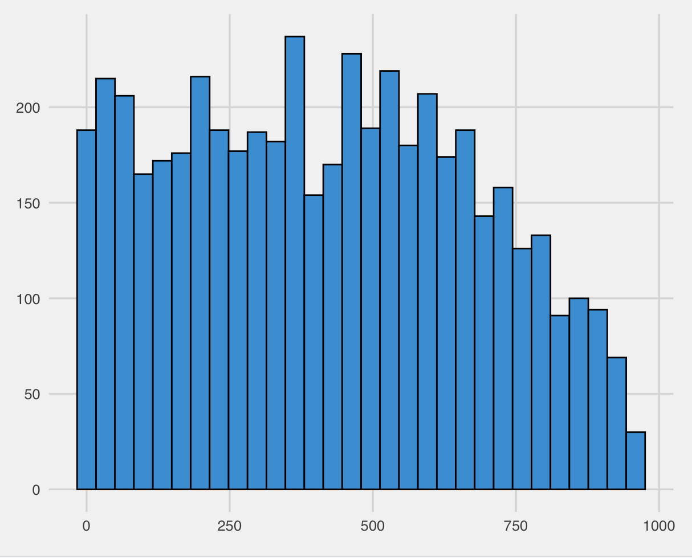

:::tip
Some other popular extensions include ***ggrepel***, which provides functionality for text labels that don't overlap, and ***ggforce***, which offers additional geometric shapes and coordinate systems!
:::

 