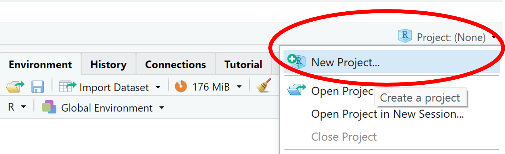
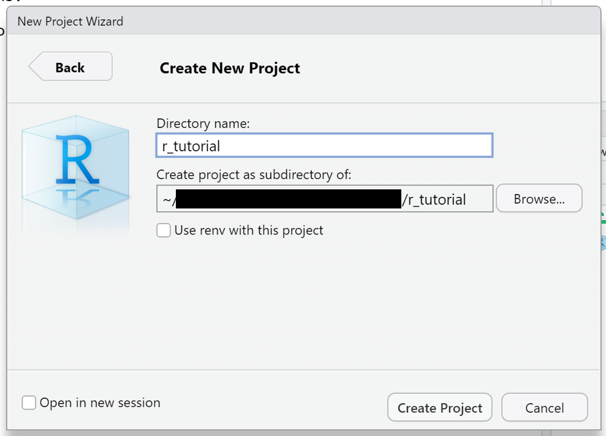
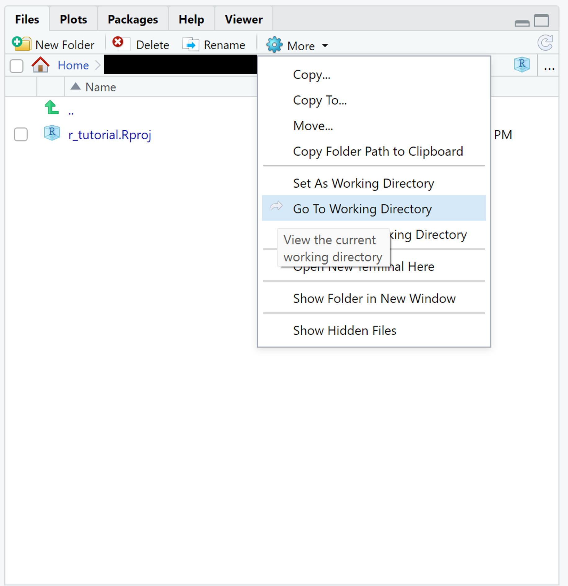

# Creating a Project in R
By creating a project in R, you choose a folder as your working space and directory. 
This means that R will call files from this folder (for example when using .csv files for your data) and save plots and data in it.

"New project" will give you the choice of either creating a new folder as your workspace or choosing an existing folder to work in.
"New directory" -> "New project" will allow you to choose a directory for your folder and give it a name.

In the bottom right part of R Studio you can now see your working directory. "View working directory" will open your folder in R Studio.

You can now create scripts and save data in this folder.
When using a file from this folder, you don't give R the whole directory but simply start within the working directory (relative path). 
For example, instead of using an absolute path like `C:/.../documents/r_project/data.csv`, you can use `data.csv` if `r_project` is your working directory.

It is possible to create several R-projects, so you can easily keep an overview over you scripts and data.
