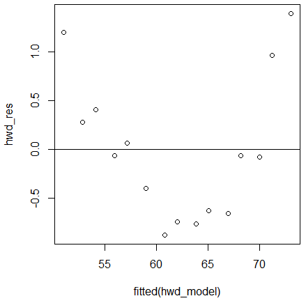

# Regression Analysis

**Regression analysis** is a statistical method of analysis.
Regression can be used to test how effectively you can predict the values of one variable (= *dependent variable*) based on the values of one or more other variables (= *independent variables*).
To do this, you examine the correlation of the variables and develop a prediction function on this basis.
The higher the correlation between the variables, the better one variable can be predicted by the other.

There are different types of regression analysis.
In this article we will discuss **linear regression** as well as **logistic regression**.

## Linear Regression

Linear regression is a regression model that describes the relationship between variables using a straight line.
It determines the best fit line for your data by looking for the value of the regression coefficient(s) that minimizes the overall error of the model.

Linear regression is divided into two types:
- **Simple linear regression**: looks at only one independent variable
- **Multiple linear regression**: looks at two or more independent variables

:::caution
In linear regression, the dependent variables have to be *continuous*!

You cannot perform linear regression with *categorical* dependent variables.
For this, you would have to perform a [**logistic regression**](#logistic-regression).
:::

### Simple Linear Regression

Simple linear regression is used to evaluate the relationship between two quantitative variables.

In this chapter, we will work with the [Heights and weights](https://www.kaggle.com/datasets/tmcketterick/heights-and-weights) data set.
"*This data set gives average masses for women as a function of their height in a sample of American women of age 30–39*."


We will analyse the relationship between the `Height` (*m*, independent variable) and the `Weight` (*kg*, dependent variable).

#### 1. Load the Data Set

In order to load the data set, we have to [import the CSV file](./loadingdata.md#importing-a-csv-file) as follows:

```r
# Import the data set
hwd <- read.csv("hwd.csv")

# Look at the structure
str(hwd)

'data.frame':	15 obs. of  2 variables:
 $ Height: num  1.47 1.5 1.52 1.55 1.57 1.6 1.63 1.65 1.68 1.7 ...
 $ Weight: num  52.2 53.1 54.5 55.8 57.2 ...
```

To make it easier to work with this data set, you can attach it to the search path as follows:

```r
attach(hwd)
```

This allows you to refer to the variables in the data set by their names alone, rather than as components of the data frame (e.g. `Height` rather than `hwd#Height`).

#### 2. Visualize the Data Set

We should first visualize the data to understand it before running a simple linear regression.

First, we need to make sure that the relationship between `Height` and `Weight` is generally linear.
We can do this by creating a simple **scatter plot** with R's built-in function `scatter.smooth()`:

```r
 scatter.smooth(Height, Weight)
```


This plot shows that there is a linear relationship between `Height` and `Weight`.
The higher the `Height`, the higher the `Weight`.

Next, we can create a **box plot** to visualize the distribution of `Weight` and check for outliers.
By default, R will create a tiny circle if an observation is an outlier.

```r
boxplot(Weight)
```


There are no tiny circles in the box plot, which means there are no outliers in our dataset.

#### 3. Simple Linear Regression Analysis

Now that we have established that the relationship between our variables is linear and that there are no outliers, we can design a simple linear regression model with the `lm()` function.

```r
# Compute a simple linear regression model
hwd_model <- lm(Weight ~ Height)

# Look at the summary
summary(hwd_model)

Call:
lm(formula = Weight ~ Height)

Residuals:
     Min       1Q   Median       3Q      Max 
-0.88171 -0.64484 -0.06993  0.34095  1.39385 

Coefficients:
            Estimate Std. Error t value Pr(>|t|)    
(Intercept)  -39.062      2.938  -13.29 6.05e-09 ***
Height        61.272      1.776   34.50 3.60e-14 ***
---
Signif. codes:  0 ‘***’ 0.001 ‘**’ 0.01 ‘*’ 0.05 ‘.’ 0.1 ‘ ’ 1

Residual standard error: 0.7591 on 13 degrees of freedom
Multiple R-squared:  0.9892,	Adjusted R-squared:  0.9884 
F-statistic:  1190 on 1 and 13 DF,  p-value: 3.604e-14884 
F-statistic:  1190 on 1 and 13 DF,  p-value: 3.604e-14
```

According to the model summary, the **fitted regression equation** to our model is `Weight = -39.062 + 61.272 x Height`.
There are many other values that you can read from the linear regression outcome:
- **Pr(>|t|)**: This is the p-value corresponding to the model coefficients.
If it is below 0.05, there is a statistically significant relationship between the variables.
- **Multiple R-squared**: The coefficient of determination is a value between 0 and 1 that indicates how well a statistical model predicts an outcome.
The higher the value, the better the explanatory factors predict the value of the response variable.
- **Residual standard error**: This is the average distance between the observed values and the regression line.
The lower this number, the better a regression line agrees with the observed data.
- **F-statistic & p-value**: The F-statistic and the associated p-value indicate the overall significance of the regression model, i.e. whether the explanatory variables of the model can explain the variance of the response variables.

#### 4. Checking Assumptions of the Model

One of the basic assumptions of linear regression is that the residuals of a regression model are essentially normally distributed and homoscedastic at each level of the explanatory variable.
If these assumptions do not apply to our model, the results of may be misleading.

To ensure that these assumptions are met, we can create the residual diagrams shown below.

##### 4.1. Residual vs Fitted Values Plot

```r
# Define the residuals
hwd_res <- resid(hwd_model)

# Create a residual vs fitted plot
plot(fitted(hwd_model), hwd_res)

# Add a horizontal line
abline(0,0)
```



We can assume that homoscedasticity is not broken as long as the residuals appear to be randomly and uniformly scattered across the graph around the number zero.

##### 4.2. Q-Q Plot

```r
# Create a Q-Q plot for the residuals
qqnorm(hwd_res)

# Add a diaganol line 
qqline(hwd_res)
```


The data is normally distributed when the numbers on the graph fall along a relatively straight line at a 45-degree angle.

From the two residual plots, we can conclude that our model is normally distributed and homoscedastic.

#### 5. Visualize the Results

The last step, visualizing the results, is optional and can be done as follows:

```r
library(ggplot2)

# Plot the data points on a graph
hwd_graph <- ggplot(hwd, aes(x = Height, y = Weight)) + geom_point()

# Add the linear regression line to the plotted data
hwd_graph <- hwd_graph + geom_smooth(method = "lm", col = "black")

# Look at the graph
hwd_graph
```


### Multiple Linear Regression

Multiple linear regression can explain dependent variables through *multiple* independent variables.

In this chapter, we will work with the [Happiness Index 2018-2019](https://www.kaggle.com/datasets/sougatapramanick/happiness-index-2018-2019) data set.
"*This study analyses the association between the Happiness Index Score in 2018 and 2019, and a set of independent variables [...].*"
We will analyse the relationship between `Score` (dependent variable) and `Social.support` and `Healthy.life.expectancy` (independent variables).

#### 1. Load the Data Set

First, you have to load your data set.

```r
# Import the data set
happiness <- read.csv("2018.csv")

# Create a new data set with the relevant variables
happiness <- happiness[, "Score", "Country.or.region", "Social.support", "Healthy.life.expectancy"]

# Call heads
head(happiness)

  Score Country.or.region Social.support Healthy.life.expectancy
1 7.632           Finland          1.592                   0.874
2 7.594            Norway          1.582                   0.861
3 7.555           Denmark          1.590                   0.868
4 7.495           Iceland          1.644                   0.914
5 7.487       Switzerland          1.549                   0.927
6 7.441       Netherlands          1.488                   0.878
```

#### 2. Visualize the Data Set

Before calculating the multiple linear regression analysis, you should first check whether this regression model could be a good model for the data.

For this, we want to check our variables for linearity (`Score` vs `Social.support` and `Score` vs `Healthy.life.expectancy`).
We can do this with R's built-in function `plot()`.

```r
# Attach the data set
attach(happiness)

# Plot Score vs Social.support
plot(Score ~ Social.support)
```


```r
# Plot Score vs Healthy.life.expectancy
plot(Score ~ Healthy.life.expectancy)
```


As you can see, both independent variables, `Social.support` and `Healthy.life.expectancy`, seem to have a linear correlation with the dependent variable `Score`, so we can continue with the regression analysis.
 
#### 3. Multiple Linear Regression Analysis

A multiple linear regression model can be created with the `lm()` function that we have already used for the simple linear regression analysis.
However, since we are working with two or more independent variables now, we have to use the following syntax instead: `lm(dependent_var ~ independent_var1 + independent_var2 + ...)`.

```r
# Compute a multiple linear regression model
happiness_model <- lm(Score ~ Social.support + Healthy.life.expectancy)

# Look at the summary
summary(happiness_model)

Call:
lm(formula = Score ~ Social.support + Healthy.life.expectancy)

Residuals:
    Min      1Q  Median      3Q     Max 
-1.6034 -0.4125 -0.1027  0.4461  1.8989 

Coefficients:
                        Estimate Std. Error t value Pr(>|t|)    
(Intercept)               2.1746     0.2072  10.496  < 2e-16 ***
Social.support            1.5222     0.2217   6.866 1.55e-10 ***
Healthy.life.expectancy   2.2675     0.2708   8.374 3.30e-14 ***
---
Signif. codes:  0 ‘***’ 0.001 ‘**’ 0.01 ‘*’ 0.05 ‘.’ 0.1 ‘ ’ 1

Residual standard error: 0.6216 on 153 degrees of freedom
Multiple R-squared:  0.6957,	Adjusted R-squared:  0.6917 
F-statistic: 174.9 on 2 and 153 DF,  p-value: < 2.2e-16
```

Again, there are many values that you can read from the multiple linear regression result.
They are similar to the simple linear regression analysis (click [here](#3-simple-linear-regression-analysis) for further explanation).
- **F-statistic & p-value**: These results show that our overall model is statistically significant.
- **`Social.support` & `Healthy.life.expectancy`**: The Pr(>|t|) values indicate that our independent variables are statistically significant.

#### 4. Checking Assumptions of the Model

The multiple linear regression model is based on the same assumptions as the simple linear regression model: Normal distribution and homoscedasticity.

##### 4.1. Testing for Normal Distribution

We can test for normal distribution by creating a simple residual histogram.

```r
# Create a residual histogram
hist(residuals(happiness_model), col = "steelblue")
```


The histogram shows that the distribution of our model appears to be normal.

##### 4.2. Testing for Homoscedasticity

To test for homoscedasticity, we can compute a graph comparing the fitted value with the residual.

```r
# Create a fitted value vs residual graph
plot(fitted(happiness_model), residuals(happiness_model))

# Add a horizontal line
abline(h = 0, lty = 2)
```


Our model is homoscedastic because the residuals are evenly distributed at each fitted value.
In summary, we have confirmed that the model assumptions are reasonably met.

#### 5. Visualize the Results

In the following, I will show you a simple and quick way to visualize a multiple linear regression model with the `car` package.

```r
# Install & load the car package
install.packages("car")
library(car)

# Plot the model
avPlots(happiness_model)
```


- The x-axis represents a single independent variable and the y-axis represents the dependent variable.
- The blue line shows the relationship between those two variables.
The other independent variables (that are not plotted in the particular graph) are kept at a constant value.

:::note
Since we have multiple independent variables, we cannot plot a single fitted regression line on a two-dimensional graph.
:::

## Logistic Regression

Logistic regression is used in situations where the dependent variable is *categorical*.
That is, when there are only 2 possible outcomes, for example "Yes" and "No".

This time, we will use the [Breast Cancer Prediction Data Set](https://www.kaggle.com/datasets/merishnasuwal/breast-cancer-prediction-dataset) that was obtained from the University of Wisconsin Hospitals.

### 1. Load the Data Set

As always, the first step is to import and load your desired dataset.

```r
# Import the data set
bcd <- read.csv("Breast_cancer_data.csv")

# Call heads
head(bcd)

  mean_radius mean_texture mean_perimeter mean_area mean_smoothness diagnosis
1       17.99        10.38         122.80    1001.0         0.11840         0
2       20.57        17.77         132.90    1326.0         0.08474         0
3       19.69        21.25         130.00    1203.0         0.10960         0
4       11.42        20.38          77.58     386.1         0.14250         0
5       20.29        14.34         135.10    1297.0         0.10030         0
6       12.45        15.70          82.57     477.1         0.12780         0
```

As you can see, this data set includes a lot of information, including `diagnosis`, where `1` = breast cancer diagnosis and `0` = no diagnosis.

## Sources & Further Reading

- [Breast Cancer Prediction Data Set](https://www.kaggle.com/datasets/merishnasuwal/breast-cancer-prediction-dataset)
- [Happiness Index 2018-2019](https://www.kaggle.com/datasets/sougatapramanick/happiness-index-2018-2019)
- [Heights and weights](https://www.kaggle.com/datasets/tmcketterick/heights-and-weights)