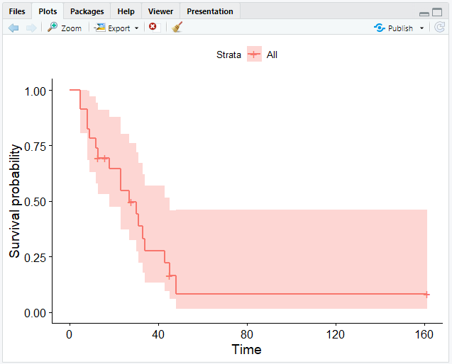
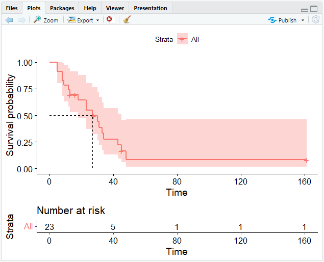
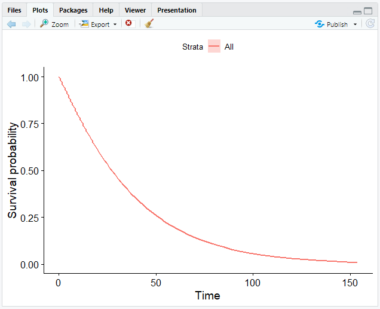
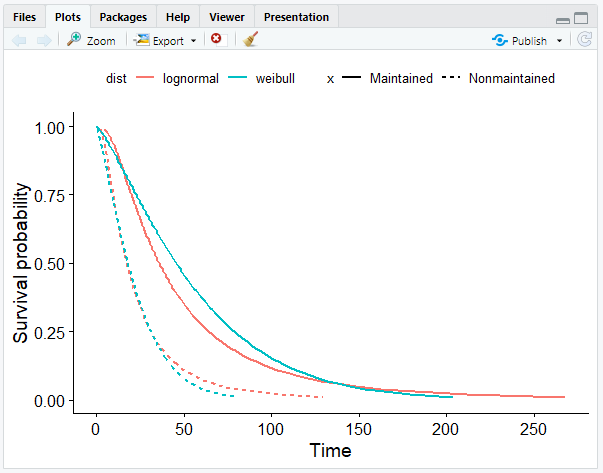
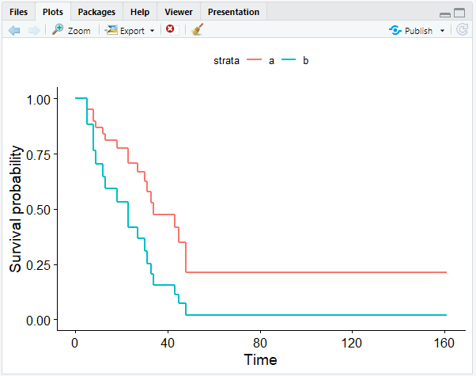

# Survival Analysis

The goal of **Survival Analysis** is to identify the time until the event of interest occurs.
This event can be anything but most of the time, it represents death.

Survival Analysis may be used to explore large datasets, for example the time from surgery to death or from start of treatment to progression.

## Getting Started

In the following example we will use the `survival` package which you can install and load like this:

```r
install.packages("survival")
library(survival)
```

For better visualization, we will also be using the `survminer` package:

```r
install.packages("survminer")
library(survminer)
```

Next, you can load the dataset that you wish to analyse.
In this course, we will be using [Acute Myelogenous Leukaemia survival data](https://www.rdocumentation.org/packages/survival/versions/3.5-3/topics/aml).
It is included in the `survival` package and may be loaded using the `data()` function:

```r
data(cancer, package = "survival")
```

:::note example dataset AML
"*Survival in patients with Acute Myelogenous Leukaemia.*
*The question at the time was whether the standard course of chemotherapy should be extended ('maintenance') for additional cycles.*"
- time: survival or censoring time
- status: censoring status
- x: maintenance chemotherapy given? (factor)
:::

:::tip
Use R's `help()` function to discover more about a dataset:

```r
help(cancer, package = "survival")
```
:::

## Censoring

Data that is incomplete is referred to as *censoring*.
Although there are other forms of censoring, *right-censoring* is the most typical in survival statistics.
Reasons for censoring can be: The patient was either forgotten for follow-up, dropped out of the study, or the "event" did not occur until the research was over.

To summarize, the `cens` variable holds data indicating whether a person in the program died.
You can count both censored and uncensored people with the `table()` function.

In our example dataset, the variable *status* indicates whether a person was censored.

```r
# Count censored and uncensored data
num_cens <- table(aml$status)
num_cens

output:
 0  1 
 5 18 
```

The result shows that 5 people were censored (`=0`), whereas 18 were uncensored, i.e. died (`=1`).

```r
# Create barplot of censored and uncensored data
barplot(num_cens)
```

The outcome of our calculation will then be visually shown:


## Kaplan-Meier Estimate

The **Kaplan-Meier estimate** is a non-parametric statistic used to calculate the survival function from lifetime data.
This statistic indicates the probability that a certain patient will live through a given time `t`.
The Kaplan-Meier estimator is `1` at `t = 0` and decreases to `0` as `t` approaches infinity.

### Creating a Survival Object

`Surv` objects are created using the `Surv()` function.
The main arguments of this function are `time` (follow-up time) and `event` (status indicator, normally 0 = alive/censored, 1 = dead).
Each subject will have one entry that is the survival time, followed by a `+` if the subject was censored.

```r
# Create Surv object
sobj <- Surv(aml$time, aml$status)

# Look at 10 first elements
sobj[1:10]

output:
[1]  9  13  13+ 18  23  28+ 31  34  45+ 48 

# Look at the summary
summary(sobj)

output:
      time            status      
 Min.   :  5.00   Min.   :0.0000  
 1st Qu.: 12.50   1st Qu.:1.0000  
 Median : 23.00   Median :1.0000  
 Mean   : 29.48   Mean   :0.7826  
 3rd Qu.: 33.50   3rd Qu.:1.0000  
 Max.   :161.00   Max.   :1.0000  

# Look at the structure
str(sobj)

output:
 'Surv' num [1:23, 1:2]   9   13   13+  18   23   28+  31   34   45+  48  ...
 - attr(*, "dimnames")=List of 2
  ..$ : NULL
  ..$ : chr [1:2] "time" "status"
 - attr(*, "type")= chr "right"
```

### Creating a Kaplan-Meier Plot

The `survfit()` function can generate survival curves based on the *Kaplan-Meier estimate*.
It requires the previously created *survival object*.

```r
# Calculate the Kaplan-Meier estimate
km <- survfit(Surv(time, status) ~ 1, data = aml)
```

The `1` after the tilde (`~`) indicates that we want to construct a single survival function for all observations.

```r
# Look at the structure
str(km)

output:
List of 16
 $ n        : int 23
 $ time     : num [1:18] 5 8 9 12 13 16 18 23 27 28 ...
 $ n.risk   : num [1:18] 23 21 19 18 17 15 14 13 11 10 ...
 $ n.event  : num [1:18] 2 2 1 1 1 0 1 2 1 0 ...
 $ n.censor : num [1:18] 0 0 0 0 1 1 0 0 0 1 ...
 $ surv     : num [1:18] 0.913 0.826 0.783 0.739 0.696 ...
 $ std.err  : num [1:18] 0.0643 0.0957 0.1099 0.1239 0.1379 ...
 $ cumhaz   : num [1:18] 0.087 0.182 0.235 0.29 0.349 ...
 $ std.chaz : num [1:18] 0.0615 0.0912 0.1053 0.119 0.1328 ...
 $ type     : chr "right"
 $ logse    : logi TRUE
 $ conf.int : num 0.95
 $ conf.type: chr "log"
 $ lower    : num [1:18] 0.805 0.685 0.631 0.58 0.531 ...
 $ upper    : num [1:18] 1 0.996 0.971 0.942 0.912 ...
 $ call     : language survfit(formula = Surv(aml$time, aml$status) ~ 1)
 - attr(*, "class")= chr "survfit"
```

### Visualizing a Kaplan-Meier Plot

The `ggsurvplot()` function in the `survminer` package that we loaded before allows us to plot survival curves.

To create a simple curve, just insert the `survfit` object that we created earlier into `ggsurvplot()`.

```r
# Create a Kaplan-Meier curve
ggsurvplot(fit = km)
```

This will give you the following output:



`ggsurvplot()` provides several options for customizing your curve.
Further information may be found [here](https://www.rdocumentation.org/packages/survminer/versions/0.4.9/topics/ggsurvplot) or by using the `help()` function in your R console.

### Number at Risk

A risk table displaying the total number of patients under surveillance can also be included to the plot.
This can be achieved with the `risk.table` argument.

```r
# Add the risk table and visualize the median survival time
ggsurvplot(km, risk.table = TRUE, surv.median.line = "hv")
```



## The Weibull Model

The **Weibull model** is similar to the *Kaplan-Meier estimate*.
While the Kaplan-Meier estimate is useful for looking at data, the Weibull model is helpful for more advanced analysis such as adjusting covariates and forming inferences.
Another difference is that within the Kaplan-Meier curve you see the little "steps," whereas the Weibull model can smoothen the curve.

The Weibull distribution can match several distribution shapes.
It defines the probability connected with continuous data, much like the normal distribution does.
Nonetheless, it can also model skewed data, which does not follow a normal distribution.

### Creating a Weibull Model

To create a Weibull model in R, you need the `survreg()` function instead of `survfit()`.
However, it requires the same arguments.

```r
# Compute a Weibull model
wb <- survreg(Surv(time, status) ~ 1, data = aml)
```

### Calculating Measures 

The `predict()` function allows us to calculate the point in time at which n % of patients would still live.

```r
# Calculate the time point at which 90 % survive 
predict(wb, type = "quantile", p = 1 - 0.9, newdate = data.frame(1))

output:
 [1] 4.905592
```

This means that 90 % of patients survive more than 4 days.

### Creating a Weibull Curve

Unfortunately, using `ggsurvplot()` for creating a Weibull curve will not work, because it is not a step function.
Instead, we have to follow these steps:
1. Create a sequence of numbers for the survival probability between 0 and 1
2. Calculate the time point for each probability using `predict()` with a vector of quantiles instead of a single value
3. Generate a data frame

```r
# Create a vector from .99 to .01 in steps of .01
surv <- seq(.99, .01, by = -.01)

# Calculate time points for each probability
t <- predict(wb, type = "quantile", p = 1 - surv, newdata = data.frame(1))

# Create a data frame
surv_wb <- data.frame(time = t, surv = surv)

# Call head on surv_wb
head(surv_wb)

output:
       time surv
1 0.5755697 0.99
2 1.0879602 0.98
3 1.5820251 0.97
4 2.0662605 0.96
5 2.5445740 0.95
6 3.0192307 0.94
```

4. We may now visualize data using the data frame we have constructed.
For this, we need the `ggsurvplot_df()` function.

```r
# Plot the data frame
ggsurvplot_df(fit = surv_wb, surv.geom = geom_line)
```

:::note
`ggsurvplot_df()` only takes data frames of the format that we specified.
The argument `surv.geom` specifies that our model generates a smooth function with `geom_line` instead of `geom_step`.
:::

Now that we have completed graphing our data, we have obtained a smooth curve:



### Weibull Model with Covariates

For further analysis, you may want to construct different survival curves with covariates.
This makes it easier to compare several hypothetical circumstances ("*imaginary patients*").
As an example, you could discuss the question of who will survive longer — patients with a larger or smaller tumour size.

In this chapter, we will continue to use the *Acute Myelogenous Leukaemia survival data* and discuss the potential impact of a maintenance chemotherapy (factor `x`) on the survival curve.
We will go through how to create a Weibull model with covariates step by step using our example.

1. **Compute the Weibull model including the covariates.**

```r
wbmod <- survreg(Surv(time, status) ~ x, data = aml)
```

2. **Decide on covariate combinations for which to compute the survival curves ("*imaginary patients*").**

```r
# Create newdat
newdat <- expand.grid(
       x = levels(aml$x)
)

# Look at newdat
newdat

output:
              x
1    Maintained
2 Nonmaintained
```

3. **Compute the survival curves for the *imaginary patients*.**

This is similar to what we have done before.
The only difference is that we set `newdata` to our new data (`newdat`) that we created in step 2.

```r
# Create a sequence between .99 and 0.01
surv <- seq(.99, .01, by = -.01)

# Calculate a time point for each probability
t <- predict(wbmod, type = "quantile", p = 1 - surv, newdata = newdat)

# Look at the dimension of t
dim(t)

output:
[1]  2 99
```

This means, we have 99 columns and 2 rows.
We cannot plot the survival curves in this format, therefore we have to reshape them.

4. **Create a `data.frame` with survival curve information.**

```r
# Bind the columns to the survival functions
surv_wbmod_wide <- cbind(newdat, t)

# Install & load the reshape2 package to use the melt function
install.packages("reshape2")
library(reshape2)

# Transform data from wide to long format with melt()
surv_wbmod <- melt(surv_wbmod_wide, id.vars = c("x"), variable.name = "surv_id", value.name = "time")

# Create the column "surv"
surv_wbmod$surv <- surv[as.numeric(surv_wbmod$surv_id)]

# Add variables to the data frame (required by the plotting function, but not for us)
surv_wbmod[c("upper", "lower", "std.err", "strata")] <- NA

# Look at the structure of the data frame
str(surv_wbmod)

output:
'data.frame':	198 obs. of  8 variables:
$ x      : Factor w/ 2 levels "Maintained","Nonmaintained": 1 2 1 2 1 2 1 2 1 2 ...
$ surv_id: Factor w/ 99 levels "1","2","3","4",..: 1 1 2 2 3 3 4 4 5 5 ...
$ time   : num  1.601 0.632 2.781 1.098 3.848 ...
$ surv   : num  0.99 0.99 0.98 0.98 0.97 0.97 0.96 0.96 0.95 0.95 ...
$ upper  : logi  NA NA NA NA NA NA ...
$ lower  : logi  NA NA NA NA NA NA ...
$ std.err: logi  NA NA NA NA NA NA ...
$ strata : logi  NA NA NA NA NA NA ...
```

5. **Plot the Weibull model.**

```r
# Create a smooth survival curve and specify the color according to the covariate
ggsurvplot_df(surv_wbmod, surv.geom = geom_line, color = "x", legend.title = NULL)
```


:::note
If you have more covariates than in our case, you can set the `linetype` argument in `ggsurvplot_df()` to the other covariate.
:::

## Other Distributions

In addition to the Weibull distribution, there are several other distributions.
In most cases, we would select the Weibull distribution, since it is more flexible.
However, the decision for a particular distribution is more a question of philosophy.

You can select the distribution to use with the `survreg()` function by using the `dist` argument.
For example, you could use exponential or log-normal distributions:

```r
# Compute an exponential distribution
survreg(Surv(time, status) ~ horTh, data = aml, dist = "exponential")

# Compute a lognormal distribution
survreg(Surv(time, status) ~ horTh, data = aml, dist = "lognormal")
```

:::note
By default, `dist` is set to `weibull`.
:::

### Comparing Weibull and Log-Normal Model

In this chapter, we will be comparing the Weibull to the log-normal model using the AML data.
Make sure that the `survival`, `survminer` and `reshape2` packages as well as the `aml` data are loaded.

1. **Compute the Weibull and the log-normal model.**

```r
# Compute Weibull model
wbmod <- survreg(Surv(time, status) ~ x, data = aml)

# Compute log-normal model
lnmod <- survreg(Surv(time, status) ~ x, data = aml, dist = "lognormal")
```

2. **Compute the survival functions for both models.**

```r
# Create a new dataset with the two levels of maintenance chemotherapy
newdat <- data.frame(x = levels(aml$x))

# Create a sequence between .99 and 0.01
surv <- seq(.99, .01, by = -.01)

# Compute both survival curves with predict()
wbt <- predict(wbmod, type = "quantile", p = 1 - surv, newdata = newdat)
lnt <- predict(lnmod, type = "quantile", p = 1 - surv, newdata = newdat)
```

3. **Add the correct survival probabilities to the data frame.**

```r
# Bind the columns to the survival functions
surv_wbmod_wide <- cbind(newdat, wbt)
surv_lnmod_wide <- cbind(newdat, lnt)

# Merge the survival functions and add the column "dist"
surv_wide <- rbind(surv_wbmod_wide, surv_lnmod_wide)
surv_wide$dist <- c("weibull", "weibull", "lognormal", "lognormal")

# Melt data.frame from wide to long format
surv_long <- melt(surv_wide, id.vars = c("x", "dist"), variable.name = "surv_id", value.name = "time")

# Add the column "surv"
surv_long$surv <- surv[as.numeric(surv_long$surv_id)]

# Add columns upper, lower, std.err, and strata contianing NA values
surv_long[, c("upper", "lower", "std.err", "strata")] <- NA
```

4. **Plot the survival curves.**

```r
# Create a smooth survival curve
# The linetype should correspond to the maintenance chemotherapy
# The color should correspond to the distribution
ggsurvplot_df(surv_long, surv.geom = geom_line, linetype = "x", color = "dist", legend.title = NULL)
```



## The Cox Model

The Cox model allows the analysis of the influence of variables on the time-to-event outcome.
In contrast to the *Weibull model*, it is a semi-parametric model.
This indicates that we are less strict about the time-to-event distribution.

The Cox model is also known as the *proportional hazards model* since, like the *Weibull model*, it assumes proportional hazards.
That is why survival curves cannot cross.

In the following example, we will again use our dataset `aml`.
We want to know if the maintenance chemotherapy is associated with the patients' survival time.
Make sure you have loaded the `survival` and `survminer` packages as well as our dataset.

### Computing a Cox Model

Constructing a Cox model is quite similar to the Weibull model.
Simply replace the `survreg()` function with `coxph()`.

```r
# Compute a Cox model
cxmod <- coxph(Surv(time, status) ~ x, data = aml)
```

Because the Cox model is semi-parametric, there is no intercept in the coefficients as there is in the Weibull model.
In contrast to the Weibull model, negative coefficient values indicate a positive influence on the duration time.

```r
# Look at the model coefficient
coef(cxmod)

output:
xNonmaintained 
     0.9155326 
```

The coefficient implies that nonmaintained patients have a reduced survival probability.

### Visualizing a Cox Model

The method for visualizing a Cox model is almost identical to that for Weibull models.
We will go through them again step by step.

1. **Compute the Cox model.**

```r
cxmod <- coxph(Surv(time, status) ~ x, data = aml)
```

2. **Decide on covariate combinations.**

```r
# Create newdat
newdat <- expand.grid(
       x = levels(aml$x)
)

# Rename the rownames (remember that we have 2 rows)
rownames(newdat) <- letters[1:2]

# Look at newdat
newdat

output:
              x
a    Maintained
b Nonmaintained
```

3. **Compute the survival curves.**

We can now compute the survival curves using the `survfit()` function.
Since we don't need confidence intervals, we set `conf.type` to `none`.

```r
# Compute the survival curves
cxsf <- survfit(cxmod, data = aml, newdata = newdat, conf.type = "none")

# Look at the structure
str(cxsf)

output:
List of 11
 $ n       : int 23
 $ time    : num [1:18] 5 8 9 12 13 16 18 23 27 28 ...
 $ n.risk  : num [1:18] 23 21 19 18 17 15 14 13 11 10 ...
 $ n.event : num [1:18] 2 2 1 1 1 0 1 2 1 0 ...
 $ n.censor: num [1:18] 0 0 0 0 1 1 0 0 0 1 ...
 $ surv    : num [1:18, 1:2] 0.951 0.898 0.869 0.841 0.811 ...
  ..- attr(*, "dimnames")=List of 2
  .. ..$ : NULL
  .. ..$ : chr [1:2] "a" "b"
 $ cumhaz  : num [1:18, 1:2] 0.0504 0.1081 0.1403 0.1737 0.2101 ...
 $ std.err : num [1:18, 1:2] 0.0402 0.0666 0.0801 0.0937 0.1081 ...
 $ logse   : logi TRUE
 $ std.chaz: num [1:18, 1:2] 0.0402 0.0666 0.0801 0.0937 0.1081 ...
 $ call    : language survfit(formula = cxmod, newdata = newdat, conf.type = "none", data = aml)
 - attr(*, "class")= chr [1:2] "survfitcox" "survfit"
```

4. **Create a `data.frame` with survival curve information.**

To generate the data frame with the desired information about the survival curve, we use the `surv_summary()` function of the `survminer` package.

`surv_summary()` provides a data frame containing a neat summary from `survfit()` results, containing columns like `time` and `surv`.

```r
# Create the data frame
surv_cxmod0 <- surv_summary(cxsf)

# Call head on surv_cxmod0
head(surv_cxmod0)

output:
  time n.risk n.event n.censor      surv    std.err upper lower strata
1    5     23       2        0 0.9508567 0.04022921    NA    NA      a
2    8     21       2        0 0.8975825 0.06663029    NA    NA      a
3    9     19       1        0 0.8690765 0.08013356    NA    NA      a
4   12     18       1        0 0.8405707 0.09374603    NA    NA      a
5   13     17       1        1 0.8105393 0.10813703    NA    NA      a
6   16     15       0        1 0.8105393 0.10813703    NA    NA      a
```

We add another column to the data frame that contains information about the covariate `x` (maintenance chemotherapy).
To do this, we use the `cbind()` function to choose the row of `newdat` that corresponds to the correct variable for each row in the data frame and combine it with the survival curve information.

```r
# Add the colum with info about x
surv_cxmod <- cbind(surv_cxmod0,
                     newdat[as.character(surv_cxmod0$strata), ])

```

5. **Plot the Cox model.**

To plot the Cox model, we can use the `ggsurvplot_df()` function that we used before to visualize the Weibull model.

```r
ggsurvplot_df(surv_cxmod, color = "x", legend.title = NULL, censor = FALSE)
```

As a result, we get the Cox model with two survival curves: `a` representing maintained patients, and `b` representing nonmaintained patients:



As our coefficient predicted, the survival curve of the maintained patients show that they have a better outcome.

## Sources & Further Reading

- [Acute Myelogenous Leukaemia survival data](https://www.rdocumentation.org/packages/survival/versions/3.5-3/topics/aml)
- [`reshape2` package](https://www.rdocumentation.org/packages/reshape2/versions/1.4.4)
- [`survival` package](https://www.rdocumentation.org/packages/survival/versions/3.5-5)
- [`survminer` package](https://www.rdocumentation.org/packages/survminer/versions/0.4.9)