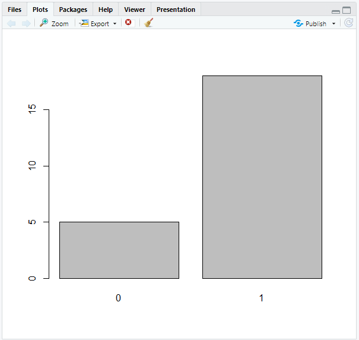
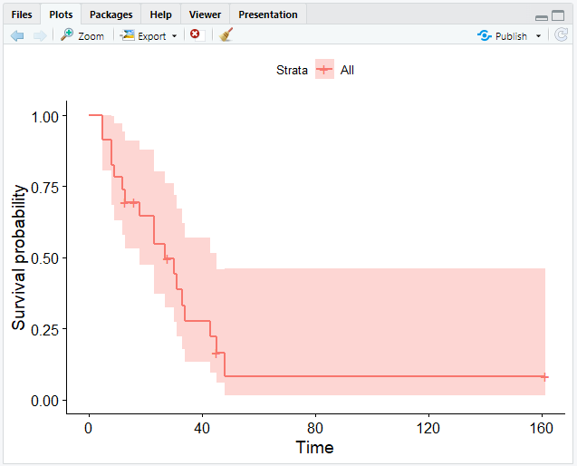
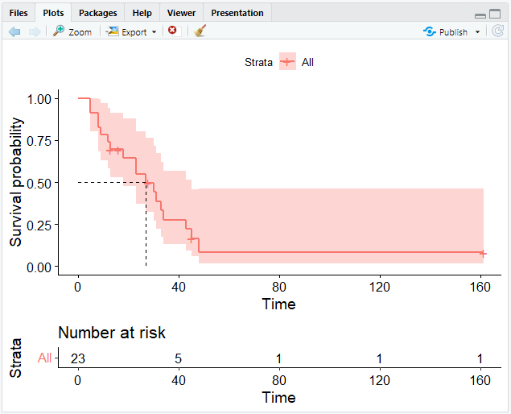
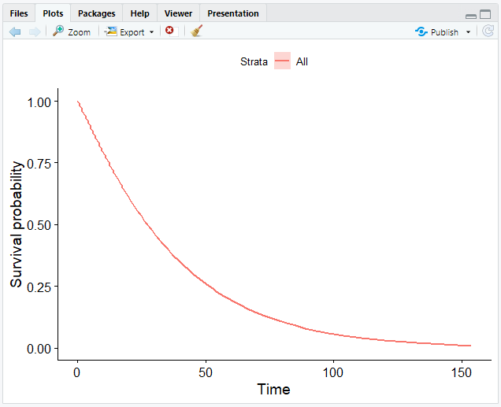

# Survival Analysis

The goal of **Survival Analysis** is to identify the time until the event of interest occurs.
This event can be take several forms.
Most of the time, it represents death.
That is why it is referred to as *Survival Analysis*.

Survial Analysis may be used to explore large datasets, for example the time from surgery to death or from start of treatment to progression.

## Getting started

In order to do a survival analysis, you need to install and load the `survival` package:

```r
install.packages("survival")
library(survival)
```

For better visualizations, we will also be using the `survminer` package:

```r
install.packages("survminer")
library(survminer)
```

Next on, you can load the dataset that you wish to analyze.
In this course, we will be using the [Acute Myelogenous Leukemia survival data](https://www.rdocumentation.org/packages/survival/versions/3.5-5/topics/aml).
It is included in the `survival` package and may be loaded using the `data()` function:

```r
data(cancer, package = "survival")
aml
```

:::note example dataset AML
"*Survival in patients with Acute Myelogenous Leukemia.*
*The question at the time was whether the standard course of chemotherapy should be extended ('maintainance') for additional cycles.*"
- time: survival or censoring time
- status: censoring status
- x: maintenance chemotherapy given? (factor)
:::

:::tip
Use R's `help()` function to discover out more about a dataset:

```r
help(cancer, package = "survival")
```
:::

## Censoring

Data that is incomplete is referred to as *censoring*.
Although there are other forms of censoring, *right-censoring* is the most typical in survival statistics.
Reasons for censoring can be: The patient was either forgotten for follow-up, dropped out of the study, or the "event" did not occur until the research was over.

To summarize, the `cens` variable holds data indicating whether or not a person in the program died.
You can count both censored and uncensored people with the `table()` function.

In our example dataset, the variable *status* indicates whether or not a person was censored.

```r
# Count censored and uncensored data
num_cens <- table(aml$status)
num_cens

output:
 0  1 
 5 18 
```

The result shows that 5 people were censored (= `0`), whereas 18 were uncensored, i.e. died (= `1`).

```r
# Create barplot of censored and uncensored data
barplot(num_cens)
```

The outcome of our calculation will then be visually shown:



## Kaplan-Meier estimate

The **Kaplan-Meier estimate** is a non-parametric statistic used to calculate the survival function from lifetime data.
This statistic indicates the probability that a certain patient will live through a given time `t`.
The Kaplan-Meier estimator is `1` at `t = 0` and decreases to `0` as `t` approaches infinity.

### Creating a survival object

`Surv` objects are created using the `Surv()` function.
The main arguments of this function are `time` (= follow up time) and `event` (status indicator, normally 0 = alive/censored, 1 = dead) in that order.
Each subject will have one entry that is the survival time, followed by a `+` if the subject was censored.

```r
# Create Surv object
sobj <- Surv(aml$time, aml$status)

# Look at 10 first elements
sobj[1:10]

output:
[1]  9  13  13+ 18  23  28+ 31  34  45+ 48 

# Look at the summary
summary(sobj)

output:
      time            status      
 Min.   :  5.00   Min.   :0.0000  
 1st Qu.: 12.50   1st Qu.:1.0000  
 Median : 23.00   Median :1.0000  
 Mean   : 29.48   Mean   :0.7826  
 3rd Qu.: 33.50   3rd Qu.:1.0000  
 Max.   :161.00   Max.   :1.0000  

# Look at the structure
str(sobj)

output:
 'Surv' num [1:23, 1:2]   9   13   13+  18   23   28+  31   34   45+  48  ...
 - attr(*, "dimnames")=List of 2
  ..$ : NULL
  ..$ : chr [1:2] "time" "status"
 - attr(*, "type")= chr "right"
```

### Creating a Kaplan-Meier curve

The `survfit()` function can generate survival curves based on the *Kaplan-Meier estimate*.
It requires the previously created *survival object*.

```r
# Calculate the Kaplan-Meier estimate
km <- survfit(Surv(time, status) ~ 1, data = aml)
```

The `1` after the tilde (`~`) indicates that we want to construct a single survival function for all observations.

```r
# Look at the structure
str(km)

output:
List of 16
 $ n        : int 23
 $ time     : num [1:18] 5 8 9 12 13 16 18 23 27 28 ...
 $ n.risk   : num [1:18] 23 21 19 18 17 15 14 13 11 10 ...
 $ n.event  : num [1:18] 2 2 1 1 1 0 1 2 1 0 ...
 $ n.censor : num [1:18] 0 0 0 0 1 1 0 0 0 1 ...
 $ surv     : num [1:18] 0.913 0.826 0.783 0.739 0.696 ...
 $ std.err  : num [1:18] 0.0643 0.0957 0.1099 0.1239 0.1379 ...
 $ cumhaz   : num [1:18] 0.087 0.182 0.235 0.29 0.349 ...
 $ std.chaz : num [1:18] 0.0615 0.0912 0.1053 0.119 0.1328 ...
 $ type     : chr "right"
 $ logse    : logi TRUE
 $ conf.int : num 0.95
 $ conf.type: chr "log"
 $ lower    : num [1:18] 0.805 0.685 0.631 0.58 0.531 ...
 $ upper    : num [1:18] 1 0.996 0.971 0.942 0.912 ...
 $ call     : language survfit(formula = Surv(aml$time, aml$status) ~ 1)
 - attr(*, "class")= chr "survfit"
```

### Visualizing a Kaplan-Meier curve

The `ggsurvplot()` function in the `survminer` package that we loaded before allows us to plot survival curves.

To create a simple curve, just insert the `survfit` object that we created earlier into `ggsurvplot()`.

```r
# Create a Kaplan-Meier curve
ggsurvplot(fit = km)
```

This will give you the following output:



`ggsurvplot()` provides several options for customizing your curve.
Further information may be found [here](https://www.rdocumentation.org/packages/survminer/versions/0.4.9/topics/ggsurvplot) or by using the `help()` function in your R console.

### Number at risk

A risk table displaying the total number of patients under surveillance can also be included to the plot.
This can be achieved with the `risk.table()` argument.

```r
# Add the risk table and visualize the median survival time
ggsurvplot(km, risk.table = TRUE, surv.median.line = "hv")
```



## The Weibull model

The **Weibull model** is similar to the *Kaplan-Meier estimate*.
While the Kaplan-Meier estimate is useful for looking at data, the Weibull model is helpful for more advanced analysis such as adjusting covariables and forming inferences.
Another difference is that within the Kaplan-Meier curve you see the little "steps," whereas the Weibull model can smoothen the curve.

The Weibull distribution can match severeal different distribution shapes.
It defines the probability connected with continuous data, much like the normal distribution does.
Nonetheless, it can also model skewed data, unlike the normal distribution.

### Creating a Weibull model

To create a Weibull model in R, you need the `survreg()` function instead of `survfit()`.
However, it contains the same arguments.

```r
# Compute a Weibull model
wb <- survreg(Surv(time, status) ~ 1, data = aml)
```

### Calculating measures 

The `predict()` function allows us to calculate the time point which for example 90 % of patients survive.

```r
# Calculate the time point which 90 % survive 
predict(wb, type = "quantile", p = 1 - 0.9, newdate = data.frame(1))

output:
 [1] 4.905592
```

This means that 90 % of patients survive more than 4 days.

### Creating a Weibull curve

Unfortunately, using `ggsurvplot()` for creating a Weibull curve will not work, because it is not a step function.
Instead, we have to follow these steps:
1. Create a suitable grid.
2. Get time for each probability using `predict()` with a vector of quantiles instead of a single value.
3. Generate a data frame.

```r
# Create a grid from .99 to .01 in steps of .01
surv <- seq(.99, .01, by = -.01)

# Get time for each probability
t <- predict(wb, type = "quantile", p = 1 - surv, newdata = data.frame(1))

# Create a data frame
surv_wb <- data.frame(time = t, surv = surv)

# Call heads on surv_wb
head(surv_wb)

output:
       time surv
1 0.5755697 0.99
2 1.0879602 0.98
3 1.5820251 0.97
4 2.0662605 0.96
5 2.5445740 0.95
6 3.0192307 0.94
```

4. We may now visualize data using the data frame we have constructed.
For this, we need the `ggsurvplot_df()` function.

```r
# Plot the data frame
ggsurvplot_df(fit = surv_wb, surv.geom = geom_line)
```

:::note
`ggsurvplot_df()` only takes data frames of the format that we specified.
The argument `surv.geom` specifies that our model generates a smooth function with `geom_line` instead of `geom_step`.
:::

Now that we have completed graphing our data, we have obtained a smooth curve:



### Weibull model with covarietes

