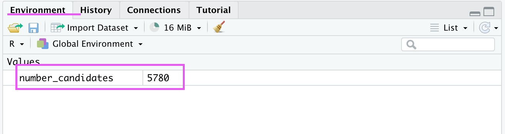
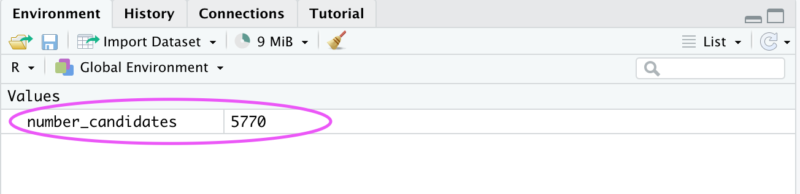

# Variables

A variable is a place to store a value. The value can be anything: a text, a numeric, a data frame, etc. The value can later be used in R by simply typing the name of the variable.

A variable is created when you assign a value to it. There are three symbols used to assign a value to a variable:
- `<-` : The name of the variable is on the **left** of the symbol and the value is on the **right**.
- `->`:The name of the variable is on the **right** of the symbol and the value is on the **left**.
- `=`: The name of the variable is on the **left** of the symbol and the value is on the **right**.

 > Although there are many ways to assign a value to a variable, `<-` is the most commonly used symbol to do so! 
 >


:::note Example
You have a study that has 5780 candidates. You would like to store that number in a variable:
```r
number_candidates <- 5780
```
In this line of code, we assigned the value `5780` to the variable `number_candidates`. R will store the variable and its value assigned in the current workspace. You can view all variables in the workspace in RStudio in the ‘Environment’ tab in the top right corner.


:::


**To change the value of a variable, you need to reassign the new value using `<-`. The new value will replace the previous value**

:::note Example
Some candidates decided to not participate in the study, you have now around 5770 candidates. Assign a new value to the variable:
```r
number_candidates <- 5770
```
This change is also reflected in the workspace in RStudio:


:::


## Rules for Naming Variables
- A variable name can contain letters, numbers, dots and underscores.
- A variable cannot start with a number, dot or an underscore.
- R is case-sensitive (`NUMBER`, `Number` and `number` are all different variables.)
- The variable should not have the same name as functions.

## Printing Variables

If you would like to see the contents of a variable, you can simply type out the name of the variable in the console.
You can also use the `print()` function to print the value of variables.

```r
colour_favourite <- "blue"

#auto-print the value of the name variable
colour_favourite
Output: [1] "blue"

#using the print() function:
print(colour_favourite)
Output: [1] "blue"
```

You can use the `cat()` or the `paste()` function to combine variables.

```r
#using the cat() function:
cat("My favourite colour is", colour_favourite)
Output: My favourite colour is blue

#using the paste() funtion:
paste("My favourite colour is", colour_favourite)
Output: [1] "My favourite colour is blue"

```

It is also possible to assign one value to multiple variables at once:

```r

breakfast_1 <- lunch_1 <- dinner_1 <- "Tuna sandwich"
paste(breakfast_1, lunch_1, dinner_1)
Output: [1] "Tuna sandwich Tuna sandwich Tuna sandwich"
```