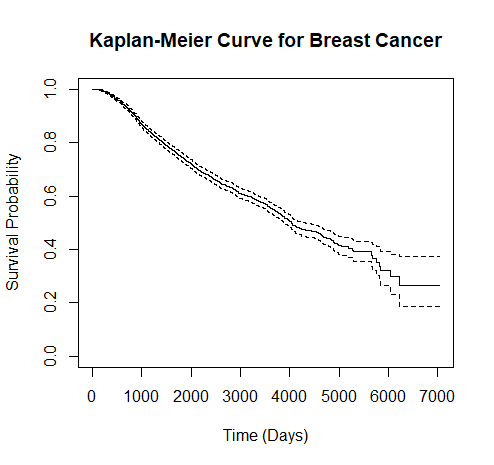
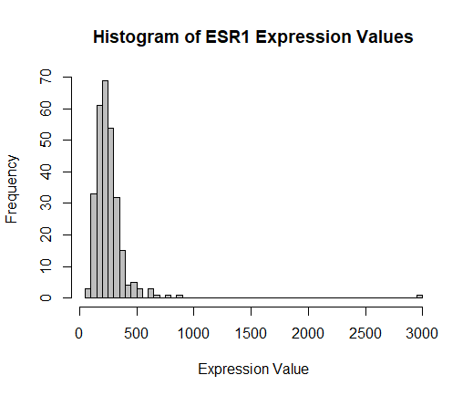
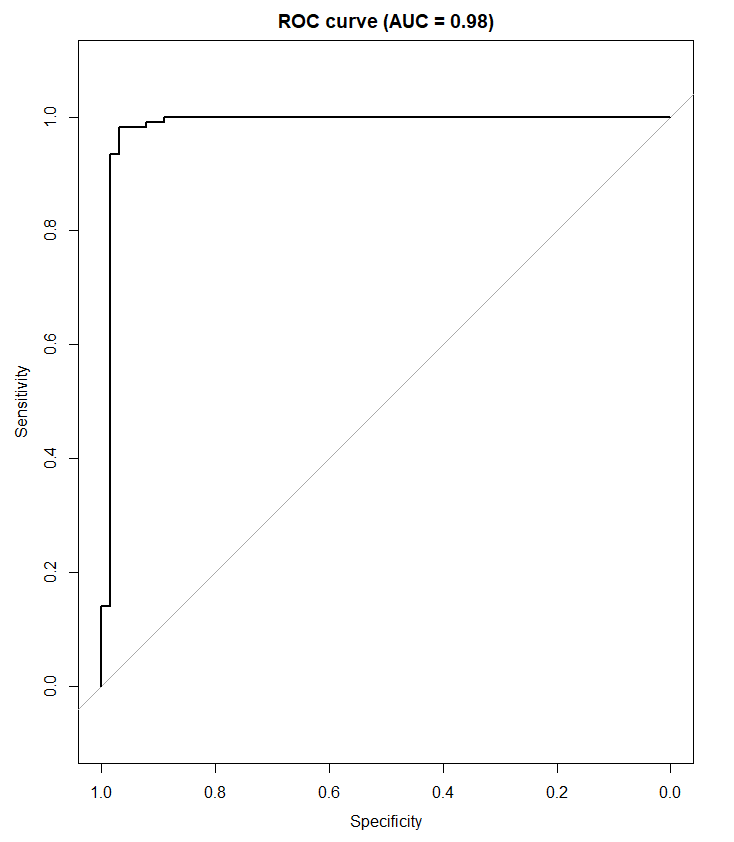
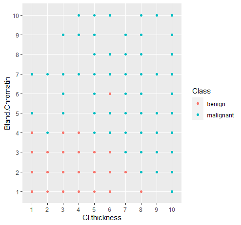
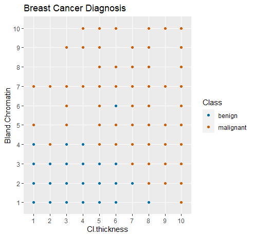
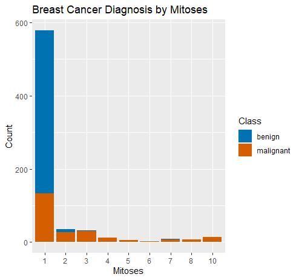
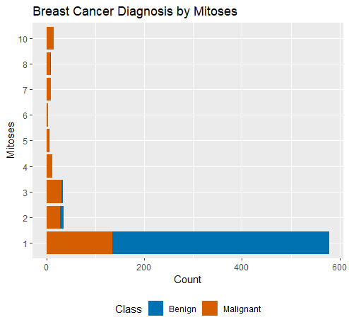

# Using R: Breast Cancer

## Introduction
Breast cancer is a malignant condition originating from the proliferation of abnormal breast cells.
It ranks as the second most prevalent cancer among women on a global scale, and it can also affect men. 
In recent times, there has been a notable surge in the utilization of computational methodologies and tools within the field of cancer research.
Among these, the programming language R has gained substantial prominence due to its robust capacities for statistical computing and graphical representation.
Below are several applications highlighting the utility of R in the realm of breast cancer informatics:

**1. Data Preprocessing:** R serves as a valuable tool for conducting data preprocessing, a fundamental phase within the realm of cancer informatics.
This critical step encompasses the cleansing, transformation, and organization of data prior to analysis.
In R, packages from the [**tidyverse**](https://cran.r-project.org/web/packages/tidyverse/index.html) can be used for data cleaning, transformation and manipulation.

**2. Survival Analysis:** Survival analysis is a statistical method used to analyse the time it takes for an event to occur, such as death or disease progression.
R has several packages that can be used for survival analysis in breast cancer, including [**survival**](https://cran.r-project.org/web/packages/survival/index.html) or [**survminer**](https://cran.r-project.org/web/packages/survminer/index.html).

**3. Gene Expression Analysis:** Gene expression analysis can help identify genes that are overexpressed or underexpressed in breast cancer.
R has several packages, including [**limma**](https://bioconductor.org/packages/release/bioc/html/limma.html) and [**DESeq2**](https://bioconductor.org/packages/release/bioc/html/DESeq2.html), which can be used for differential gene expression analysis. 
These packages can help identify genes that are differentially expressed between different subtypes of breast cancer.

**4. Machine Learning:** Machine learning algorithms can be used to identify patterns in breast cancer data that can help predict patient outcomes.
R has several packages for machine learning, including [**caret**](https://cran.r-project.org/web/packages/caret/vignettes/caret.html) or [**randomForest**](https://cran.r-project.org/web/packages/randomForest/index.html).
These packages can be used to develop predictive models based on patient data, including gene expression data, clinical data, and imaging data.

**5. Data Visualization:** R is an excellent tool for data visualization, which is essential in cancer informatics.
R has several packages, including [**ggplot2**](https://cran.r-project.org/web/packages/ggplot2/index.html) and [**lattice**](https://cran.r-project.org/web/packages/lattice/index.html), that can be used to create informative and visually appealing plots and graphs.
These packages can be used to create plots of gene expression data, survival curves, and other types of data relevant to breast cancer.

In the following, individual methods mentioned above are explained using breast cancer as an example.
Afterwards, you should be able to perform individual analyses using R and apply them to a medical problem.

## Data preprocessing

Here's an example of how to preprocess the Breast Cancer dataset **gbsg: Breast cancer data sets used in Royston and Altman**, which is included in the survival package in R:
To generate the dataset you can use the following code. 
Further information regarding abbreviations can be found in the legend at the following link [**gbsg: Breast cancer data sets used in Royston and Altman**](https://www.rdocumentation.org/packages/survival/versions/3.5-5/topics/gbsg).

```r
data(cancer, package="survival")
gbsg
```
Next, we need to preprocess the data to make it suitable for survival analysis. In particular, we need to:

- Remove any missing or incomplete data.
- Convert the factor variables to numeric variables.
- Create a Surv object that specifies the survival time and censoring status.

The `na.omit` R function removes all incomplete cases of a data object (typically of a data frame, matrix or vector)

```r
# remove any missing or incomplete data
gbsg <- na.omit(gbsg)

# convert factor variables to numeric variables
gbsg$nodes <- ifelse(gbsg$nodes >= 1, 1, 0)
gbsg$er <- ifelse(gbsg$er >= 1 , 1, 0)
```

Our example converts the "nodes" column into either 1 or 0 values depending on if the patient has one or more positive lymph nodes.
Similarly, we convert the estrogen receptor (ER) status into 1 or 0 depending on if the ER status is above zero.

:::tip
`ifelse` is particularly useful when you want to transform a categorical variable. 
For example, if you have a factor variable called gender with levels "male" and "female", you can use ifelse to create a new variable called gender_num that takes the value 1 for "male" and 0 for "female":
:::

Next, we can subset the data to include only the variables of interest. 
For example, we might want to include only the age, tumour size, and nodal status variables:

```r
# subset the data
gbsg.subset <- gbsg[, c("age", "size", "nodes")]
```

Now the dataset **gbsg.subset** only contains the following three columns and could look like this:


Finally, we might want to normalize the data to remove any systematic biases or differences in scale between the variables. 
One common way to do this is to perform z-score normalization:

:::info
Z-score normalization (also known as standardization) is a data preprocessing technique that rescales the values in a numerical variable so that they have a mean of zero and a standard deviation of one. 
The rescaled values are known as z-scores.
:::

```r
# z-score normalization
gbsg.norm <- scale(gbsg.subset)
```
The gbsg.norm object now contains the normalized variables, which can be used for further analysis.

:::note
Note that these preprocessing steps are just a few examples of the many ways to preprocess data for survival analysis. 
The specific steps will depend on the nature of the data and the research question.
:::

## Survival Analysis

In our example we will utilize the `survival` and `tidyverse` package:

```r
install.packages("survival")
library(survival)
install.packages("tidyverse")
library(tidyverse)
```

Next on, you can load the dataset that you wish to analyse.
In this course, we will be using the [**rotterdam: Breast cancer data set used in Royston and Altman**](https://www.rdocumentation.org/packages/survival/versions/3.5-5/topics/rotterdam).
It is included in the `survival` package and may be loaded using the `data()` function:

```r
data(cancer, package="survival")
rotterdam
```

First we create a survival object using the Surv function from the survival package.
The first argument should be the time-to-event variable (in this case, days to death or last follow-up) and the second argument should be the event variable (in this case, whether the patient died or not).

In the data we used this should be the following two columns:
- dtime: days to death or last follow-up
- death: 0= alive, 1= dead

```r
# This will incloud our two variables: dtime and the event that the patient died (1)
surv_object <- with(rotterdam, Surv(dtime, death))
```

Next we create a Kaplan-Meier survival curve using the `survfit` function from the survival package and visualize it using the `plot` function

```r
# Create one survival analysis using surv_object ~ 1
surv_prob <- survfit(surv_object ~ 1, data = rotterdam)
plot(surv_prob, xlab = "Time (Days)", ylab = "Survival Probability", main = "Kaplan-Meier Curve for Breast Cancer")
```
This should generate the following graphic:



As expected, the probability of survival decreases as the period of disease increases

In the following we use the Cox proportional hazards model to investigate the relationship between predictor variables and time-to-event outcomes. 
In this case we use the survival object created above and add the predictor variables of interest. 
For example **age, meno, size and nodes**. 
Getting more detailed information on the abbreviations and all the information contained in the dataset, it is advisable to consult the above-mentioned website, including the legend.
For the sake of simplicity, only four variables are briefly explained below.

:::info
- age: age at surgery

- meno: menopausal status (0= premenopausal, 1= postmenopausal)

- size: tumour size, a factor with levels <=20 20-50 >50

- nodes: number of positive lymph nodes
:::

```r
# Create a Cox proportional hazards model using the coxph function from the survival package.
cox_model <- coxph(surv_object ~ age + meno + size + nodes, data = rotterdam)

Output:

              coef exp(coef) se(coef)      z Pr(>|z|)    
age       0.010972  1.011032 0.003744  2.931  0.00338 ** 
meno      0.115715  1.122676 0.097337  1.189  0.23452    
size20-50 0.477329  1.611764 0.065093  7.333 2.25e-13 ***
size>50   0.882872  2.417834 0.090818  9.721  < 2e-16 ***
nodes     0.074264  1.077091 0.004760 15.603  < 2e-16 ***
---
Signif. codes:  0 ‘***’ 0.001 ‘**’ 0.01 ‘*’ 0.05 ‘.’ 0.1 ‘ ’ 1
```
:::info
- **Hazard ratio:** It represents the relative hazard of the outcome in one group (e.g., treatment group) compared to another group (e.g., control group) with a different level of the predictor variable, while holding all other variables constant. 
For example, a hazard ratio of 1.5 for a treatment group compared to a control group would indicate that the hazard of the outcome is 50% higher in the treatment group compared to the control group, while holding all other variables constant. 
Hazard ratios are important for identifying which predictor variables are most strongly associated with the outcome and can help guide clinical decision-making and treatment strategies.
:::

The amount of data may initially overwhelm you. The five lines are briefly explained below:

- **First column "Coefficients":** provides the coefficients for each predictor variable in the model. 
These coefficients represent the estimated change in the hazard ratio for each unit increase in the predictor variable, holding all other variables constant.

- **Second column "exp(coef)":** provides the exponentiated coefficients (i.e., the hazard ratios) for each predictor variable. 
These hazard ratios represent the estimated change in the hazard of the outcome (in this case, death) for a one-unit increase in the predictor variable, holding all other variables constant.

- **Third column "se(coef)":** provides the standard errors of the coefficients.

- **Fourth column "z":** provides the z-statistics and associated p-values for each predictor variable. 
The z-statistic is the coefficient divided by its standard error, and the p-value represents the probability of observing a z-statistic as extreme as the one observed in the data, assuming the null hypothesis (i.e., no effect of the predictor variable on the outcome).

- **Fifth column "Pr(>|z|)":** provides the p-values for each predictor variable. 
These p-values are equivalent to the ones in the fourth column, but are presented in a more conventional format.

:::info Data interpretation
In conclusion, the hazard ratios mentioned above show that the size of the primary tumour has a decisive influence on the probability of survival. 
The presence of a tumour with size 20-50 is associated with a 1.6-fold increased probability of reduced survival and size larger than 50 even with a 2.4-fold increased probability of reduced survival. 
Also of interest: lymph node involvement has little effect on survival probability compared to the size of the primary tumour.
:::

## Gene Expression Analysis

:::tipMost common genes associated with breast cancer
**- 1. BRCA1 and BRCA2** - These are tumour suppressor genes that help to prevent the development of breast cancer. 
Mutations in these genes can increase the risk of developing breast cancer.

**- 2. TP53** - This is another tumour suppressor gene that plays a role in preventing the development of breast cancer. 
Mutations in TP53 can increase the risk of developing breast cancer.

**- 3. HER2** - This is a gene that codes for a protein called human epidermal growth factor receptor 2 (HER2). 
Overexpression of HER2 is found in about 20-25% of breast cancers and is associated with more aggressive tumours.

**- 4. ESR1** - This is a gene that codes for the estrogen receptor alpha (ERα). 
ERα-positive breast cancer accounts for about 70% of all breast cancer cases. 
:::

Here's a simple example of gene expression analysis using the GSE2034 dataset, which is a breast cancer gene expression dataset available on the Gene Expression Omnibus (GEO) database.

First, we need to load the necessary packages and download the dataset:

```r
# Load necessary packages
library(GEOquery)
library(limma)

# Download the dataset
gse <- getGEO("GSE2034", GSEMatrix = TRUE)

# Extract the expression data
exprs <- exprs(gse[[1]])
```

The exprs object now contains the expression data for all the genes in the dataset. 
We can explore this data using various visualization techniques. 
For example, we can plot a histogram of the expression values for a particular gene. 
In this example we want to visualize the expression rate of the **ESR1 gene**. 
We can explore this data using various visualization techniques. For example, we can plot a histogram of the expression values for a particular gene:

:::infoESR1 gene
ESR1 has been a focus in breast cancer for quite some time, but is also clinically relevant in endometrial, ovarian and other cancer types. 
The identification of ER-positive breast cancers that are resistant to hormone therapy have inspired clinical sequencing efforts to shed light on the mechanisms of this resistance. 
A number of mutations in the ligand binding domain of ESR1 have been implicated in hormone resistance and anti-estrogen therapies. 
These observations have spurred efforts to develop therapeutics that stimulate ESR1 protein degradation (e.g. Fulvestrant), rather than acting as a small molecule antagonist. 
These agents are currently in clinical trials and have seen some success.
:::

```r
# Plot a histogram of the expression values for the gene ESR1
hist(exprs["117_at",], breaks=50, col="gray", xlab="Expression Value", main="Histogram of ESR1 Expression Values")
```

This should result in the following image:



The histogram shows the distribution of gene expression values for a particular gene in the breast cancer dataset. 
The x-axis represents the range of expression values and the y-axis shows the frequency of samples with expression values falling within each range.

In this example, we can see that the distribution is roughly symmetrical, with a peak around 250 and a spread of values between 0 and 500. 
This indicates that the gene is expressed at moderate levels in most of the samples, with a smaller number of samples having either really low or high expression levels.

In subsequent chapters, even more complex analyses of gene expression will also be performed. 
Thus, there is the possibility of a clear differentiation of expressed genes in healthy and diseased patients using R. 


## Machine Learning

Breast cancer is a complex disease, and machine learning techniques can be useful for predicting patient outcomes and identifying potential biomarkers for targeted therapies. 
The Breast Cancer Wisconsin (Diagnostic) dataset from the UCI Machine Learning Repository is a well-known dataset that can be used for machine learning applications. 
This dataset contains 569 breast cancer samples with 30 features, including clinical and demographic information as well as measurements of cell nuclei from digitized images of fine needle aspirate (FNA) biopsies.

Here are the general steps for analysing the [**Breast Cancer Wisconsin**](https://archive.ics.uci.edu/ml/machine-learning-databases/breast-cancer-wisconsin/wdbc.data) dataset in R using a machine learning approach:
First we will load the package in R. This code uses the `read_csv() function` from the tidyverse package to load the Breast Cancer Wisconsin (Diagnostic) dataset into R and assign column names to the dataset.
```r
# Load the dataset in R
library(tidyverse)
bc_data <- read_csv("https://archive.ics.uci.edu/ml/machine-learning-databases/breast-cancer-wisconsin/wdbc.data", 
                    col_names = c("id", "diagnosis", paste0("feature_", 1:30)), 
                    col_types = cols(.default = "d", diagnosis = col_factor(levels = c("M", "B"))))
```
Then we need to split the data into training and testing sets. 

```r
# Split the dataset into training and testing sets:
library(caret)
set.seed(123)
train_index <- createDataPartition(bc_data$diagnosis, p = 0.7, list = FALSE)
train_data <- bc_data[train_index, ]
test_data <- bc_data[-train_index, ]

# Next we transform the diagnosis column in a numeric column making it easier for us to use the machine learning prediction model
train_data <- train_data %>%
+     mutate(diagnosis_numeric = ifelse(diagnosis == "M", 1, 0))
```
This code uses the `randomForest() function` from the [**randomForest package**](https://cran.r-project.org/web/packages/randomForest/index.html) to build a random forest model for predicting breast cancer diagnosis (malignant or benign) using all 30 features in the dataset.

```r
# Build a machine learning model:
library(randomForest)
model <- randomForest(diagnosis ~ ., data = train_data[, -c(1, 2)], importance = TRUE)
```
Now we evaluate the model performance. 
This code uses `the predict() function` to make predictions on the testing set and calculates the area under the receiver operating characteristic (ROC) curve to evaluate the model's performance.
Now this should result in the following image:



The receiver operating characteristic (ROC) curve is a plot that illustrates the performance of a binary classification model at various classification thresholds. 
In this case, the ROC curve was generated to evaluate the performance of a random forest model for predicting breast cancer diagnosis using the Breast Cancer Wisconsin (Diagnostic) dataset in R.

:::tipThe Roc Curve 
The ROC curve is created by plotting the true positive rate (sensitivity) against the false positive rate (1 - specificity) for a range of classification thresholds. 
The ideal model would have a true positive rate of 1 and a false positive rate of 0, which would result in a point in the upper left corner of the plot (i.e., sensitivity = 1 and 1 - specificity = 0). 
A model that performs no better than random guessing would have a ROC curve that follows the diagonal line from the bottom left to the top right of the plot.
::: 

In this specific case, the ROC curve was generated using the [**pROC package**](https://www.rdocumentation.org/packages/pROC/versions/1.18.0) in R. 
The plot shows the ROC curve (in blue), as well as a diagonal line (in red) that represents the performance of a random classifier. 
The area under the ROC curve (AUC) is a measure of the overall performance of the model, with values ranging from 0.5 (random guessing) to 1.0 (perfect classification). 
In this case, the AUC was calculated to be 0.98, indicating that the random forest model has excellent discriminatory power and can accurately predict breast cancer diagnosis using the features in the dataset.

Overall, the ROC curve is a useful tool for evaluating the performance of binary classification models, and the AUC is a useful summary statistic that can provide insight into the model's overall performance.

## Data Visualization

:::info
In the following we will deal with the visualization of the data sets. 
For this we primarily use the `ggplot` function. 
If you need to brush up on this beforehand, visit the chapter provided for this under Learning R.
:::

Here's an example of how to create a basic data visualization for breast cancer data in R:

First, we'll load the required libraries and the "BreastCancer" dataset from the "mlbench" package.
To generate the dataset you can use the following code. Further information regarding abbreviations can be found in the legend at the following link [**BreastCancer: Wisconsin Breast Cancer Database**](https://rdrr.io/cran/mlbench/man/BreastCancer.html).

```r
# Install the mlbench package and then access the BreastCancer dataset
install.packages(mlbench)
library(mlbench)
data(BreastCancer)
```

The data set contains a total of 11 variables. The variables we use are explained below
:::info
- **Cl.thickness**:	Clump Thickness
-> This is used to assess if cells are mono-layered or multi-layered. 
Benign cells tend to be grouped in monolayers, while cancerous cells are often grouped in multi-layer.
- **Bl.cromatin**:	Bland Chromatin
-> Describes a uniform texture of the nucleus seen in benign cell. 
In cancer cell, the chromatin tends to be coarser.
- **Mitoses**: Mitoses
->  It is an estimate of the number of mitosis that has taken place. 
Larger the value, greater is the chance of malignancy
:::

We can use the "ggplot2" package to create a scatter plot of two features, "Cl.thickness" and "Bland.Chromatin", coloured by diagnosis ("benign" or "malignant").
```r
# Visualization using the ggplot2
install.packages(ggplot2)
library(ggplot2)
# Renaming column 8 for better understanding
colnames(BreastCancer)[8] <- "Bland.Chromatin"
ggplot(BreastCancer, aes(x = Cl.thickness, y = Bland.Chromatin, color = Class)) + 
  geom_point()
```
This will create a scatter plot with points coloured by diagnosis:



We can add additional layers to the plot to improve its readability and add more information. 
For example, we can add axis labels and a title to the plot, and adjust the colour scale to use a more visible colour scheme.
```r
# Improving the ggplot2 graph
ggplot(BreastCancer, aes(x = Cl.thickness, y = Bland.Chromatin, color = Class)) + 
  geom_point() + 
  labs(x = "Cl.thickness", y = "Bland.Chromatin", title = "Breast Cancer Diagnosis") +
  scale_color_manual(values = c("#0072B2", "#D55E00"))
```



:::info
As can be seen from the graph, the risk of breast malignancy increases with increasing clump thickness and coarsening of the bland chromatin portion.
:::

Here's another example of a data visualization using the "BreastCancer" dataset from the "mlbench" package in R. 
In this case we use a stacked bar chart. 

We can use the "ggplot2" package to create a stacked bar chart showing the distribution of diagnoses ("benign" or "malignant") by the presence or absence of a specific feature ("Mitoses").

```r
# This will create a stacked bar chart showing the distribution of diagnoses by the presence or absence of Mitoses.
library(ggplot2)
ggplot(BreastCancer, aes(x = Mitoses, fill = Class)) + 
  geom_bar(position = "stack") + 
  labs(x = "Mitoses", y = "Count", title = "Breast Cancer Diagnosis by Mitoses") +
  scale_fill_manual(values = c("#0072B2", "#D55E00"))
```



We can further customize the plot by adjusting the colour scale, adding a legend, and changing the bar chart orientation.
```r
# This will create a customized stacked bar chart with a legend at the bottom and a horizontal orientation.
ggplot(BreastCancer, aes(x = Mitoses, fill = Class)) + 
  geom_bar(position = "stack") + 
  labs(x = "Mitoses", y = "Count", title = "Breast Cancer Diagnosis by Mitoses") +
  scale_fill_manual(values = c("#0072B2", "#D55E00"), labels = c("Benign", "Malignant")) +
  theme(legend.position = "bottom") + 
  coord_flip()
```



:::info
Once again as said before: The larger the value of the mitoses, the greater is the chance of malignancy
:::

:::note
There are many other types of data visualizations that can be created in R, depending on the data and research question. 
The "ggplot2" package offers a wide range of customization options for creating high-quality visualizations.
:::

## Sources & Further Reading
- Elsheakh DN, Mohamed RA, Fahmy OM, Ezzat K, Eldamak AR. Complete Breast Cancer Detection and Monitoring System by Using Microwave Textile Based Antenna Sensors. Biosensors (Basel). 2023;13(1):87. Published 2023 Jan 4. doi:10.3390/bios13010087

- Chiao JY, Chen KY, Liao KY, Hsieh PH, Zhang G, Huang TC. Detection and classification the breast tumors using mask R-CNN on sonograms. Medicine (Baltimore). 2019;98(19):e15200. doi:10.1097/MD.0000000000015200

- Akselrod-Ballin A, Chorev M, Shoshan Y, et al. Predicting Breast Cancer by Applying Deep Learning to Linked Health Records and Mammograms. Radiology. 2019;292(2):331-342. doi:10.1148/radiol.2019182622

- West M, Blanchette C, Dressman H, et al. Predicting the clinical status of human breast cancer by using gene expression profiles. Proc Natl Acad Sci U S A. 2001;98(20):11462-11467. doi:10.1073/pnas.201162998

- Finak G, Mayer B, Fulp W, et al. DataPackageR: Reproducible data preprocessing, standardization and sharing using R/Bioconductor for collaborative data analysis. Gates Open Res. 2018;2:31. Published 2018 Jul 10. doi:10.12688/gatesopenres.12832.2

- Bose M, Benada J, Thatte JV, et al. A catalog of curated breast cancer genes. Breast Cancer Res Treat. 2022;191(2):431-441. doi:10.1007/s10549-021-06441-y

- Nagel A, Szade J, Iliszko M, et al. Clinical and Biological Significance of ESR1 Gene Alteration and Estrogen Receptors Isoforms Expression in Breast Cancer Patients. Int J Mol Sci. 2019;20(8):1881. Published 2019 Apr 16. doi:10.3390/ijms20081881