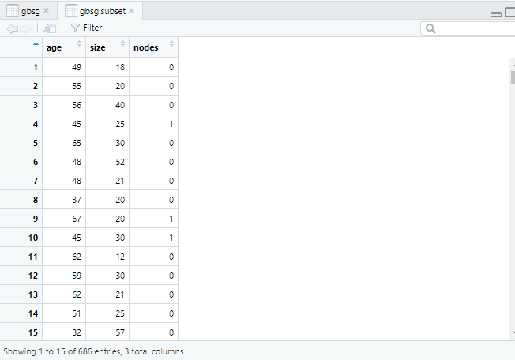

# Using R: Breast Cancer

## Introduction

Breast cancer is a cancer entity that develops in breast cells.
It is the second most common cancer in women worldwide, and it is also possible in men.
In recent years, the use of computational methods and tools for cancer informatics has increased significantly.
R, a programming language for statistical computing and graphics, is a popular choice for cancer informatics due to its powerful data manipulation and visualization capabilities.
Here are some ways R can be used in breast cancer informatics:

**1. Data Preprocessing:** R can be used for data preprocessing, which is an essential step in cancer informatics.
This step involves cleaning, transforming, and organizing data before analysis.
In R, packages like [**tidyverse**](https://cran.r-project.org/web/packages/tidyverse/index.html) can be used for data cleaning and transformation, while [**dplyr**](https://cran.r-project.org/web/packages/dplyr/index.html) can be used for data manipulation.

**2. Survival Analysis:** Survival analysis is a statistical method used to analyse the time it takes for an event to occur, such as death or disease progression.
R has several packages that can be used for survival analysis in breast cancer, including [**survival**](https://cran.r-project.org/web/packages/survival/index.html) or [**survminer**](https://cran.r-project.org/web/packages/survminer/index.html).

**3. Gene Expression Analysis:** Gene expression analysis can help identify genes that are overexpressed or underexpressed in breast cancer.
R has several packages, including [**limma**](https://bioconductor.org/packages/release/bioc/html/limma.html) and [**DESeq2**](https://bioconductor.org/packages/release/bioc/html/DESeq2.html), which can be used for differential gene expression analysis. 
These packages can help identify genes that are differentially expressed between different subtypes of breast cancer.

**4. Machine Learning:** Machine learning algorithms can be used to identify patterns in breast cancer data that can help predict patient outcomes.
R has several packages for machine learning, including [**caret**](https://cran.r-project.org/web/packages/caret/vignettes/caret.html) or [**randomForest**](https://cran.r-project.org/web/packages/randomForest/index.html).
These packages can be used to develop predictive models based on patient data, including gene expression data, clinical data, and imaging data.

**5. Data Visualization:** R is an excellent tool for data visualization, which is essential in cancer informatics.
R has several packages, including [**ggplot2**](https://cran.r-project.org/web/packages/ggplot2/index.html) and [**lattice**](https://cran.r-project.org/web/packages/lattice/index.html), that can be used to create informative and visually appealing plots and graphs.
These packages can be used to create plots of gene expression data, survival curves, and other types of data relevant to breast cancer.

In the following, individual methods mentioned above are explained using breast cancer as an example.
Afterwards, you should be able to perform individual analyses using R and apply them to a medical problem.

## Data preprocessing

Here's an example of how to preprocess the Breast Cancer dataset **gbsg: Breast cancer data sets used in Royston and Altman**, which is included in the survival package in R:
To generate the dataset you can use the following code. 
Further information regarding abbreviations can be found in the legend at the following link [**gbsg: Breast cancer data sets used in Royston and Altman**](https://www.rdocumentation.org/packages/survival/versions/3.5-5/topics/gbsg).

```r
data(cancer, package="survival")
gbsg
```
Next, we need to preprocess the data to make it suitable for survival analysis. In particular, we need to:

- Remove any missing or incomplete data.
- Convert the factor variables to numeric variables.
- Create a Surv object that specifies the survival time and censoring status.

The `na.omit` R function removes all incomplete cases of a data object (typically of a data frame, matrix or vector)

```r
# remove any missing or incomplete data
gbsg <- na.omit(gbsg)

# convert factor variables to numeric variables
gbsg$nodes <- ifelse(gbsg$nodes == 1, 1, 0)
gbsg$er <- ifelse(gbsg$er == 1 , 1, 0)
```

As a result, the dataset now only lists those patients in the data rows node and er who had exactly one positive lymph node involvement or whose estrogen receptors (fmol/l) level was exactly 1 fmol/l. 
This helps, for example, to classify only subgroups.

:::tip
`ifelse` is particularly useful when you want to transform a categorical variable into a numerical one. 
For example, if you have a factor variable called gender with levels "male" and "female", you can use ifelse to create a new variable called gender_num that takes the value 1 for "male" and 0 for "female":
:::

Next, we can subset the data to include only the variables of interest. 
For example, we might want to include only the age, tumour size, and nodal status variables:

```r
# subset the data
gbsg.subset <- gbsg[, c("age", "size", "nodes")]
```

Now the dataset **gbsg.subset** only contains the following three columns and should look like this:



Finally, we might want to normalize the data to remove any systematic biases or differences in scale between the variables. 
One common way to do this is to perform z-score normalization:

:::info
Z-score normalization (also known as standardization) is a data preprocessing technique that rescales the values in a numerical variable so that they have a mean of zero and a standard deviation of one. 
The rescaled values are known as z-scores.
:::

```r
# z-score normalization
gbsg.norm <- scale(gbsg.subset)
```
The bc.norm object now contains the normalized variables, which can be used for further analysis.

:::note
Note that these preprocessing steps are just a few examples of the many ways to preprocess data for survival analysis. 
The specific steps will depend on the nature of the data and the research question.
:::

## Sources & Further Reading
- Elsheakh DN, Mohamed RA, Fahmy OM, Ezzat K, Eldamak AR. Complete Breast Cancer Detection and Monitoring System by Using Microwave Textile Based Antenna Sensors. Biosensors (Basel). 2023;13(1):87. Published 2023 Jan 4. doi:10.3390/bios13010087

- Chiao JY, Chen KY, Liao KY, Hsieh PH, Zhang G, Huang TC. Detection and classification the breast tumors using mask R-CNN on sonograms. Medicine (Baltimore). 2019;98(19):e15200. doi:10.1097/MD.0000000000015200

- Akselrod-Ballin A, Chorev M, Shoshan Y, et al. Predicting Breast Cancer by Applying Deep Learning to Linked Health Records and Mammograms. Radiology. 2019;292(2):331-342. doi:10.1148/radiol.2019182622

- West M, Blanchette C, Dressman H, et al. Predicting the clinical status of human breast cancer by using gene expression profiles. Proc Natl Acad Sci U S A. 2001;98(20):11462-11467. doi:10.1073/pnas.201162998

- Finak G, Mayer B, Fulp W, et al. DataPackageR: Reproducible data preprocessing, standardization and sharing using R/Bioconductor for collaborative data analysis. Gates Open Res. 2018;2:31. Published 2018 Jul 10. doi:10.12688/gatesopenres.12832.2

- Bose M, Benada J, Thatte JV, et al. A catalog of curated breast cancer genes. Breast Cancer Res Treat. 2022;191(2):431-441. doi:10.1007/s10549-021-06441-y

- Nagel A, Szade J, Iliszko M, et al. Clinical and Biological Significance of ESR1 Gene Alteration and Estrogen Receptors Isoforms Expression in Breast Cancer Patients. Int J Mol Sci. 2019;20(8):1881. Published 2019 Apr 16. doi:10.3390/ijms20081881