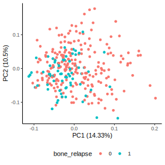

# GEO: Breast Cancer

## Introduction
Breast cancer is a malignant condition originating from the proliferation of abnormal breast cells.
It ranks as the second most prevalent cancer among women on a global scale, and it can also affect men. 
In recent times, there has been a notable surge in the utilization of computational methodologies and tools within the field of cancer research.
Among these, the programming language R has gained substantial prominence due to its robust capacities for statistical computing and graphical representation.

## Packages

We are using a couple of external packages for the following exampels. 
Please note that some are from CRAN (the default R repository), while others are from BioConductor (a repository for bioinformatics packages).
```r
if (!require("BiocManager", quietly = TRUE))
  install.packages("BiocManager")
BiocManager::install("GEOquery")
BiocManager::install("limma")
BiocManager::install("preprocessCore")
install.packages("ggplot2")
```

After installing the packages you need to load them into R:
```r
library(GEOquery)
library(limma)
library(preprocessCore)
library(ggplot2)
```

## GEO

The Gene Expression Omnibus (GEO) is a public repository of gene expression data.
With the `GeoQuery` package from BioConductor we can easily access the data from the GEO database.

```r 
# Download the dataset
gset <- getGEO("GSE2034", GSEMatrix = TRUE, AnnotGPL = TRUE)
gpl <- getGEO("GPL96")
pData <- pData(gset[[1]])
```

The `getGEO()` function downloads a dataset from the GEO database.
This dataset can be a series dataset ("GSE..."), a platform dataset ("GPL..."), or a sample dataset ("GSM...").

```r
# Extract the expression data
exprs <- exprs(gset[[1]])

# Extract the phenotype data
pData <- pData(gset[[1]]) 
```

The `exprs()` function extracts the expression data from a series dataset, and the `pData()` function extracts the phenotype data from a series dataset.

```r
# We define a index (idx) to align the order from the GPL and GSE probe names 
idx <- which(Table(gpl)$ID %in% rownames(exprs))
# Get gene names from gpl and append it to the expression table
geneMatrix <- cbind(exprs, Table(gpl)[idx, "Gene Symbol", drop=FALSE])
# Some genes have multiple probes, so we need to make the probe names unique to utilize them as rownames
rownames(geneMatrix) <- make.unique(geneMatrix[, "Gene Symbol"])
# Remove the last column, which is the gene symbol column (as we already have the gene names as rownames)
geneMatrix <- geneMatrix[,1:length(geneMatrix)-1]
# Convert the data.frame to a numeric matrix
geneMatrix <- as.matrix(geneMatrix)
```

We need to verify if our data is adequately normalized.
A solution is to use the `boxplot()` function to visualize the distribution of expression values for each sample.
```r
boxplot(geneMatrix[,1:40], outline = FALSE, las = 2, xaxt="n")
```


As we can see, the data is not well normalized.
We can use the `normalize.quantiles()` function from the `preprocessCore` package to normalize the data.
```r
geneMatrix.norm <- normalize.quantiles(geneMatrix, keep.names=T)
```

Let's check if the normalization was successful:
```r
boxplot(geneMatrix.norm[,1:40], outline = F, las = 2, xaxt="n")
```


## Dimensionality Reduction

Our example dataset contains 22,283 probes and 286 samples/patients.
One approach to explore this dataset is to utilize dimensionality reduction or machine learning.
First, we need to retrieve some clinical data from the dataset (e.g., bone metastasis status).
The matrix needs to be transposed from this point forward as currently each row represents one probe, but we need each row to represent one sample/patient.

```r
# use t() to transform i.e. flip a matrix (turn columns into rows and vice-versa)
geneMatrix.norm.t <- t(geneMatrix.norm)
```

Next, we need to extract the clinical data from the dataset.
```r
# Extract the bone metastasis status
bone_relapse <- pData[rownames(geneMatrix.norm.t),"bone relapses (1=yes, 0=no):ch1"]
# Combine the gene expression data with the clinical data
df <- cbind(geneMatrix.norm.t, bone_relapse)
```

It is not trivial to visualize 22,283 probes in a plot.
We need to reduce the dimensionality e.g., via principal component analysis (PCA).
```r
pca_res <- prcomp(geneMatrix.norm.t, scale. = TRUE, center=T)
autoplot(pca_res, colour ="bone_relapse", data=df)  + theme_classic() + theme(legend.position="bottom")
```


Another popular example is the t-distributed stochastic neighbour embedding (t-SNE).
```r
# Inspired from https://stackoverflow.com/questions/44837536/how-to-use-ggplot-to-plot-t-sne-clustering
tsne <- Rtsne(geneMatrix.norm.t)
tsne_plot <- data.frame(x = tsne$Y[,1], y = tsne$Y[,2],
                        col = bone_relapse)
ggplot(tsne_plot) + geom_point(aes(x=x, y=y, color=col))
```


## Sources & Further Reading
- Wang Y et al. Gene-expression profiles to predict distant metastasis of lymph-node-negative primary breast cancer. Lancet. 2005 Feb 1