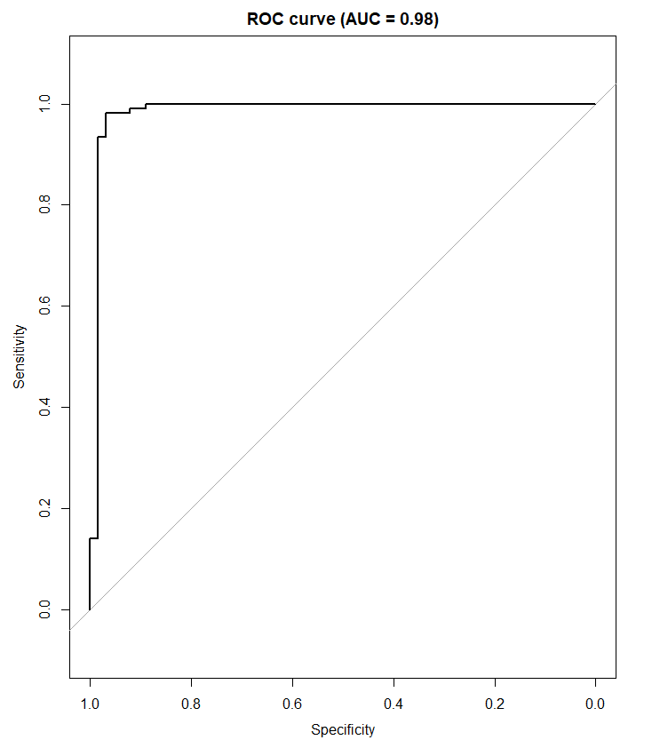
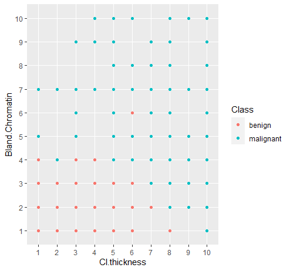
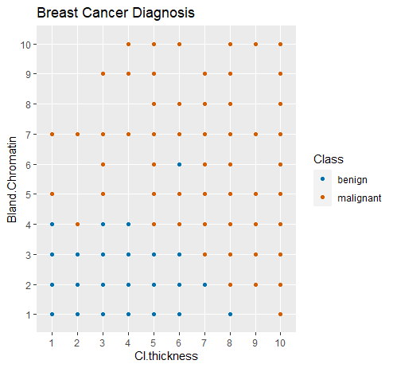

# ML: Breast Cancer

## Introduction
Breast cancer is a malignant condition originating from the proliferation of abnormal breast cells.
It ranks as the second most prevalent cancer among women on a global scale, and it can also affect men. 
In recent times, there has been a notable surge in the utilization of computational methodologies and tools within the field of cancer research.
Among these, the programming language R has gained substantial prominence due to its robust capacities for statistical computing and graphical representation.

## Packages

We are using a couple of external packages for the following exampels. 
Please note that some are from CRAN (the default R repository), while others are from BioConductor (a repository for bioinformatics packages).
```r
if (!require("BiocManager", quietly = TRUE))
  install.packages("BiocManager")
BiocManager::install("GEOquery")
BiocManager::install("limma")
BiocManager::install("preprocessCore")
install.packages("ggplot2")
```

After installing the packages you need to load them into R:
```r
library(GEOquery)
library(limma)
library(preprocessCore)
library(ggplot2)
```

## GEO

The Gene Expression Omnibus (GEO) is a public repository of gene expression data.
With the `GeoQuery` package from BioConductor we can easily access the data from the GEO database.

```r 
# Download the dataset
gset <- getGEO("GSE2034", GSEMatrix = TRUE, AnnotGPL = TRUE)
gpl <- getGEO("GPL96")
```

The `getGEO()` function downloads a dataset from the GEO database.
This dataset can be a series dataset ("GSE..."), a platform dataset ("GPL..."), or a sample dataset ("GSM...").

```r
# Extract the expression data
exprs <- exprs(gset[[1]])

# Extract the phenotype data
pData <- pData(gset[[1]]) 
```

The `exprs()` function extracts the expression data from a series dataset, and the `pData()` function extracts the phenotype data from a series dataset.

```r
# We define a index (idx) to align the order from the GPL and GSE probe names 
idx <- which(Table(gpl)$ID %in% rownames(exprs))
# Get gene names from gpl and append it to the expression table
geneMatrix <- cbind(exprs, Table(gpl)[idx, "Gene Symbol", drop=FALSE])
# Some genes have multiple probes, so we need to make the probe names unique to utilize them as rownames
rownames(geneMatrix) <- make.unique(geneMatrix[, "Gene Symbol"])
# Remove the last column, which is the gene symbol column (as we already have the gene names as rownames)
geneMatrix <- geneMatrix[,1:length(geneMatrix)-1]
# Convert the data.frame to a numeric matrix
geneMatrix <- as.matrix(geneMatrix)
```

We need to verify if our data is adequately normalized.
A solution is to use the `boxplot()` function to visualize the distribution of expression values for each sample.
```r
boxplot(geneMatrix[,1:40], outline = FALSE, las = 2, xaxt="n")
```


As we can see, the data is not well normalized.
We can use the `normalize.quantiles()` function from the `preprocessCore` package to normalize the data.
```r
geneMatrix.norm <- normalize.quantiles(geneMatrix, keep.names=T)
```

Let's check if the normalization was successful:
```r
boxplot(geneMatrix.norm[,1:40], outline = F, las = 2, xaxt="n")
```


## Machine Learning

Our example dataset contains 22,283 probes and 286 samples/patients.
One approach to explore this dataset is to utilize machine learning.
First, we need to retrieve some clinical data from the dataset (e.g., bone metastasis status).
The matrix needs to be transposed from this point forward as currently each row represents one probe, but we need each row to represent one sample/patient.

```r
# use t() to transform i.e. flip a matrix (turn columns into rows and vice-versa)
geneMatrix.norm.t <- t(geneMatrix.norm)
```

Next, we need to extract the clinical data from the dataset.
```r
# Extract the bone metastasis status
bone_relapse <- pData[rownames(geneMatrix.norm.t),"bone relapses (1=yes, 0=no):ch1"]
# Combine the gene expression data with the clinical data
df <- cbind(geneMatrix.norm.t, bone_relapse)
```

It is not trivial to visualize 22,283 probes in a plot.
We need to reduce the dimensionality e.g., via principal component analysis (PCA).
```r
pca_res <- prcomp(geneMatrix.norm.t, scale. = TRUE, center=T)
autoplot(pca_res, colour ="bone_relapse", data=df)  + theme_classic() + theme(legend.position="bottom")
```


Another popular example is the t-distributed stochastic neighbour embedding (t-SNE).
```r
# Inspired from https://stackoverflow.com/questions/44837536/how-to-use-ggplot-to-plot-t-sne-clustering
tsne <- Rtsne(geneMatrix.norm.t)
tsne_plot <- data.frame(x = tsne$Y[,1], y = tsne$Y[,2],
                        col = bone_relapse)
ggplot(tsne_plot) + geom_point(aes(x=x, y=y, color=col))
```


Breast cancer is a complex disease, and machine learning techniques can be useful for predicting patient outcomes and identifying potential biomarkers for targeted therapies. 
The Breast Cancer Wisconsin (Diagnostic) dataset from the UCI Machine Learning Repository is a well-known dataset that can be used for machine learning applications. 
This dataset contains 569 breast cancer samples with 30 features, including clinical and demographic information as well as measurements of cell nuclei from digitized images of fine needle aspirate (FNA) biopsies.

Here are the general steps for analysing the [**Breast Cancer Wisconsin**](https://archive.ics.uci.edu/ml/machine-learning-databases/breast-cancer-wisconsin/wdbc.data) dataset in R using a machine learning approach:
First we will load the package in R. This code uses the `read_csv() function` from the tidyverse package to load the Breast Cancer Wisconsin (Diagnostic) dataset into R and assign column names to the dataset.
```r
# Load the dataset in R
library(tidyverse)
bc_data <- read_csv("https://archive.ics.uci.edu/ml/machine-learning-databases/breast-cancer-wisconsin/wdbc.data", 
                    col_names = c("id", "diagnosis", paste0("feature_", 1:30)), 
                    col_types = cols(.default = "d", diagnosis = col_factor(levels = c("M", "B"))))
```
Then we need to split the data into training and testing sets. 

```r
# Split the dataset into training and testing sets:
library(caret)
set.seed(123)
train_index <- createDataPartition(bc_data$diagnosis, p = 0.7, list = FALSE)
train_data <- bc_data[train_index, ]
test_data <- bc_data[-train_index, ]

# Next we transform the diagnosis column in a numeric column making it easier for us to use the machine learning prediction model
train_data <- train_data %>%
+     mutate(diagnosis_numeric = ifelse(diagnosis == "M", 1, 0))
```
This code uses the `randomForest() function` from the [**randomForest package**](https://cran.r-project.org/web/packages/randomForest/index.html) to build a random forest model for predicting breast cancer diagnosis (malignant or benign) using all 30 features in the dataset.

```r
# Build a machine learning model:
library(randomForest)
model <- randomForest(diagnosis ~ ., data = train_data[, -c(1, 2)], importance = TRUE)
```
Now we evaluate the model performance. 
This code uses `the predict() function` to make predictions on the testing set and calculates the area under the receiver operating characteristic (ROC) curve to evaluate the model's performance.
Now this should result in the following image:



The receiver operating characteristic (ROC) curve is a plot that illustrates the performance of a binary classification model at various classification thresholds. 
In this case, the ROC curve was generated to evaluate the performance of a random forest model for predicting breast cancer diagnosis using the Breast Cancer Wisconsin (Diagnostic) dataset in R.

:::tipThe Roc Curve 
The ROC curve is created by plotting the true positive rate (sensitivity) against the false positive rate (1 - specificity) for a range of classification thresholds. 
The ideal model would have a true positive rate of 1 and a false positive rate of 0, which would result in a point in the upper left corner of the plot (i.e., sensitivity = 1 and 1 - specificity = 0). 
A model that performs no better than random guessing would have a ROC curve that follows the diagonal line from the bottom left to the top right of the plot.
::: 

In this specific case, the ROC curve was generated using the [**pROC package**](https://www.rdocumentation.org/packages/pROC/versions/1.18.0) in R. 
The plot shows the ROC curve (in blue), as well as a diagonal line (in red) that represents the performance of a random classifier. 
The area under the ROC curve (AUC) is a measure of the overall performance of the model, with values ranging from 0.5 (random guessing) to 1.0 (perfect classification). 
In this case, the AUC was calculated to be 0.98, indicating that the random forest model has excellent discriminatory power and can accurately predict breast cancer diagnosis using the features in the dataset.

Overall, the ROC curve is a useful tool for evaluating the performance of binary classification models, and the AUC is a useful summary statistic that can provide insight into the model's overall performance.

## Data Visualization

:::info
In the following we will deal with the visualization of the data sets. 
For this we primarily use the `ggplot` function. 
If you need to brush up on this beforehand, visit the chapter provided for this under Learning R.
:::

Here's an example of how to create a basic data visualization for breast cancer data in R:

First, we'll load the required libraries and the "BreastCancer" dataset from the "mlbench" package.
To generate the dataset you can use the following code. Further information regarding abbreviations can be found in the legend at the following link [**BreastCancer: Wisconsin Breast Cancer Database**](https://rdrr.io/cran/mlbench/man/BreastCancer.html).

```r
# Install the mlbench package and then access the BreastCancer dataset
install.packages(mlbench)
library(mlbench)
data(BreastCancer)
```

The data set contains a total of 11 variables. The variables we use are explained below
:::info
- **Cl.thickness**:	Clump Thickness
-> This is used to assess if cells are mono-layered or multi-layered. 
Benign cells tend to be grouped in monolayers, while cancerous cells are often grouped in multi-layer.
- **Bl.cromatin**:	Bland Chromatin
-> Describes a uniform texture of the nucleus seen in benign cell. 
In cancer cell, the chromatin tends to be coarser.
- **Mitoses**: Mitoses
->  It is an estimate of the number of mitosis that has taken place. 
Larger the value, greater is the chance of malignancy
:::

We can use the "ggplot2" package to create a scatter plot of two features, "Cl.thickness" and "Bland.Chromatin", coloured by diagnosis ("benign" or "malignant").
```r
# Visualization using the ggplot2
install.packages(ggplot2)
library(ggplot2)
# Renaming column 8 for better understanding
colnames(BreastCancer)[8] <- "Bland.Chromatin"
ggplot(BreastCancer, aes(x = Cl.thickness, y = Bland.Chromatin, color = Class)) + 
  geom_point()
```
This will create a scatter plot with points coloured by diagnosis:



We can add additional layers to the plot to improve its readability and add more information. 
For example, we can add axis labels and a title to the plot, and adjust the colour scale to use a more visible colour scheme.
```r
# Improving the ggplot2 graph
ggplot(BreastCancer, aes(x = Cl.thickness, y = Bland.Chromatin, color = Class)) + 
  geom_point() + 
  labs(x = "Cl.thickness", y = "Bland.Chromatin", title = "Breast Cancer Diagnosis") +
  scale_color_manual(values = c("#0072B2", "#D55E00"))
```



:::info
As can be seen from the graph, the risk of breast malignancy increases with increasing clump thickness and coarsening of the bland chromatin portion.
:::

Here's another example of a data visualization using the "BreastCancer" dataset from the "mlbench" package in R. 
In this case we use a stacked bar chart. 

We can use the "ggplot2" package to create a stacked bar chart showing the distribution of diagnoses ("benign" or "malignant") by the presence or absence of a specific feature ("Mitoses").

```r
# This will create a stacked bar chart showing the distribution of diagnoses by the presence or absence of Mitoses.
library(ggplot2)
ggplot(BreastCancer, aes(x = Mitoses, fill = Class)) + 
  geom_bar(position = "stack") + 
  labs(x = "Mitoses", y = "Count", title = "Breast Cancer Diagnosis by Mitoses") +
  scale_fill_manual(values = c("#0072B2", "#D55E00"))
```


We can further customize the plot by adjusting the colour scale, adding a legend, and changing the bar chart orientation.
```r
# This will create a customized stacked bar chart with a legend at the bottom and a horizontal orientation.
ggplot(BreastCancer, aes(x = Mitoses, fill = Class)) + 
  geom_bar(position = "stack") + 
  labs(x = "Mitoses", y = "Count", title = "Breast Cancer Diagnosis by Mitoses") +
  scale_fill_manual(values = c("#0072B2", "#D55E00"), labels = c("Benign", "Malignant")) +
  theme(legend.position = "bottom") + 
  coord_flip()
```


:::info
Once again as said before: The larger the value of the mitoses, the greater is the chance of malignancy
:::

:::note
There are many other types of data visualizations that can be created in R, depending on the data and research question. 
The "ggplot2" package offers a wide range of customization options for creating high-quality visualizations.
:::

## Sources & Further Reading
- Wang Y et al. Gene-expression profiles to predict distant metastasis of lymph-node-negative primary breast cancer. Lancet. 2005 Feb 19-25;365(9460):671-9. doi: 10.1016/S0140-6736(05)17947-1.

- Elsheakh DN, Mohamed RA, Fahmy OM, Ezzat K, Eldamak AR. Complete Breast Cancer Detection and Monitoring System by Using Microwave Textile Based Antenna Sensors. Biosensors (Basel). 2023;13(1):87. Published 2023 Jan 4. doi:10.3390/bios13010087

- Chiao JY, Chen KY, Liao KY, Hsieh PH, Zhang G, Huang TC. Detection and classification the breast tumors using mask R-CNN on sonograms. Medicine (Baltimore). 2019;98(19):e15200. doi:10.1097/MD.0000000000015200

- Akselrod-Ballin A, Chorev M, Shoshan Y, et al. Predicting Breast Cancer by Applying Deep Learning to Linked Health Records and Mammograms. Radiology. 2019;292(2):331-342. doi:10.1148/radiol.2019182622

- West M, Blanchette C, Dressman H, et al. Predicting the clinical status of human breast cancer by using gene expression profiles. Proc Natl Acad Sci U S A. 2001;98(20):11462-11467. doi:10.1073/pnas.201162998

- Finak G, Mayer B, Fulp W, et al. DataPackageR: Reproducible data preprocessing, standardization and sharing using R/Bioconductor for collaborative data analysis. Gates Open Res. 2018;2:31. Published 2018 Jul 10. doi:10.12688/gatesopenres.12832.2

- Bose M, Benada J, Thatte JV, et al. A catalog of curated breast cancer genes. Breast Cancer Res Treat. 2022;191(2):431-441. doi:10.1007/s10549-021-06441-y

- Nagel A, Szade J, Iliszko M, et al. Clinical and Biological Significance of ESR1 Gene Alteration and Estrogen Receptors Isoforms Expression in Breast Cancer Patients. Int J Mol Sci. 2019;20(8):1881. Published 2019 Apr 16. doi:10.3390/ijms20081881