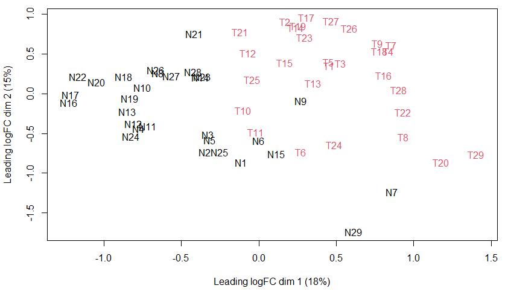
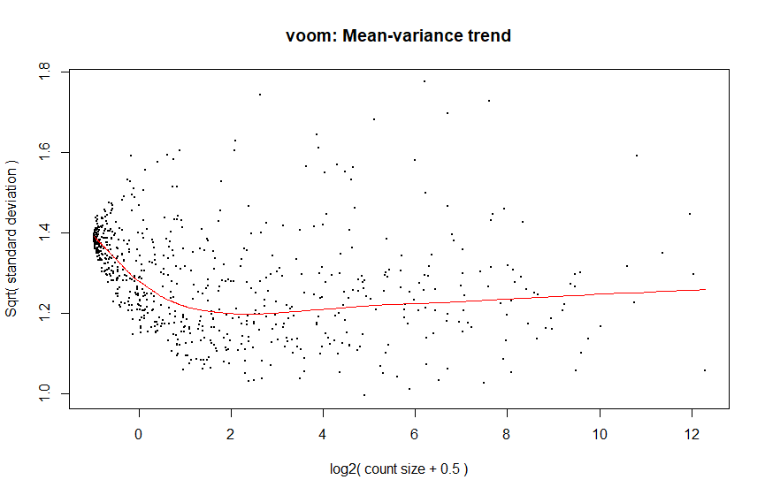

# Use Case: Cervical Cancer

This chapter focuses on two different datasets on **cervical cancer**, which we will use to perform different tasks.

## Case 1: Gene Expression Levels

In the upcoming tasks, we will analyse the [**cervical cancer data**](https://search.r-project.org/CRAN/refmans/NBLDA/html/cervical.html) from the [`NBLDA`](https://cran.r-project.org/web/packages/NBLDA/index.html) (*Negative Binomial Linear Discriminant Analysis*) package.
This dataset contains gene expression levels of 714 miRNAs in 29 tumour and 29 non-tumour cervical samples. We aim to determine differences in miRNA gene expression levels between the cervical cancer and non-tumour samples using this dataset.

To perform **differential expression analysis** of miRNA, we will use [**`limma`**](https://bioconductor.org/packages/release/bioc/html/limma.html) and [**`edgeR`**](https://bioconductor.org/packages/release/bioc/html/edgeR.html). These are packages developed by [Bioconductor](https://bioconductor.org/), which is an open source bioinformatics software.

### Getting Started

To get started, download the `NBLDA` package and the `cervical` dataset into your R session.

```r
# Install & load NBLDA
install.packages("NBLDA")
library(NBLDA)

# Load the dataset
data(cervical)
```

Look at the first 4 rows and the structure of the cervical cancer data.
Next, provide a summary of the dataset.

```r
# Look at the first 4 rows
head(cervical, 4)

# Look at the structure
str(cervical)

# Look at the summary
summary(cervical)
```

Do not worry if you feel a little overwhelmed by large datasets.
Take your time and try to understand what is happening in your dataset.
The more you work with the dataset, the more comfortable you will become!

For performing **differential expression analysis**, you need to install [`BiocManager`](<https://CRAN.R-project.org/package=BiocManager>) (*a tool for installing and updating Bioconductor packages*) and the packages `limma` and `edgeR`:

```r
# Install BiocManager
if (!require("BiocManager", quietly = TRUE))
    install.packages("BiocManager")

# Install & load limma
BiocManager::install("limma")
library(limma)

# Install & load edgeR
BiocManager::install("edgeR")
library(edgeR)
```

### Data Preprocessing

To analyse the difference in expression, we need to prepare our data beforehand.
Please note that our example is using **RNA-seq data**.
`limma` was originally designed for *microarray* data, but we can also use it for RNA-seq data with its `voom()` function.
`voom()` converts RNA-seq data into values that are suitable for linear modelling and differential expression analysis.
This method is also known as the **limma voom method**.
Choosing the right preprocessing steps according to the data type is crucial in obtaining accurate and reliable results.
If you use data other than RNA-seq, your steps may differ.


#### 1. Creating a `DGEList` Object

Firstly, we need to create a `DGEList` object, which is a list that contains various components, including sample information, groups, and genes, among others.
This provides a well-structured and efficient way to manage count data for further analysis.

```r
# Create a DGEList object
cerv0 <- DGEList(cervical)
```

#### 2. Data Normalization Factors

We can then calculate the scaling factors with `calcNormFactors()`.
This converts the original library size to a normalized effective library size.

```r
# Compute normalization factors
cerv0 <- calcNormFactors(cerv0)
```

:::caution
`calcNormFactors()` alone does not perform any data normalization.
It concentrates on normalizing the library size.
To achieve complete normalization, you need to include additional steps, such as using the `voom()` function which we will discuss later.
:::

#### 3. Filtering Low-Expressed Genes

Genes with low expression levels may not contribute significantly to further analysis and may be more affected by noise.
That is why they are usually filtered out.

```r
# Set the cutoff to "1"
cutoff <- 1

# Calculate the max CPM value for each gene
# Store genes with a max CPM value below the cutoff under "drop"
drop <- which(apply(cpm(cerv0), 1, max) < cutoff)

# Create a new DGEList object by excluding "drop"
cerv <- cerv0[-drop,] 

# Look at the number of genes left
dim(cerv)
```

```r
[1] 712  58
```

We now have expression levels for 712 miRNAs, indicating that 2 miRNAs were removed.

#### 4. Extracting Experiment Information

We will now extract experimental information from the sample names.
The sample names in our dataset determine their respective groups.
Non-tumour samples are represented by the letter "N" whereas the letter "T" represents tumour samples.

```r
# Extract the sample names
sample_names <- colnames(cervical)

# Extract the first letter (N/T) of the sample names
group <- substr(sample_names, 1, 1)
group
```

```r
 [1] "N" "N" "N" "N" "N" "N" "N" "N" "N" "N" "N" "N" "N" "N" "N" "N" "N" "N" "N" "N" "N" "N" "N" "N" "N" "N" "N" "N" "N"
[30] "T" "T" "T" "T" "T" "T" "T" "T" "T" "T" "T" "T" "T" "T" "T" "T" "T" "T" "T" "T" "T" "T" "T" "T" "T" "T" "T" "T" "T"
```

#### 5. Multidimensional Scaling Plot

The multidimensional scaling (MDS) plot is a method to display how similar or different samples are based on their gene expression profiles.

```r
# Convert the group vector into a numeric vector
group_numeric <- ifelse(group == "N", 1, 2) # this will convert "N" to 1, "T" to 2

# Create the MDS plot
# Specify the sample colors based on their groups
plotMDS(cerv, col = group_numeric)
```

This will produce the following **MDS plot**:



MDS plots provide a first insight into your gene expression data.
Samples that are closer together on the graph have more similar gene expression than those that are further apart. 
Ideally, samples from the same group should cluster together, indicating that different groups should be separated.
Outliers, samples that fall outside the expected range, may indicate poor data quality.

:::caution
MDS plots visually represent data similarities but **do not** indicate statistical significance.
Therefore, they should be followed up with appropriate statistical analysis.
:::

#### 6. `voom`-Transformation

The final step in the preprocessing is the `voom`-transformation.
As mentioned above, `voom()` is a crucial step in the preprocessing of RNA-seq data.
After applying `voom()`, the data can be used in linear models to perform differential expression analysis.

```r
# Specify the model to be fitted
design <- model.matrix(~ 0 + group)

# voom()
cervoom <- voom(cerv, design, plot = TRUE)
```

With `plot` set to `TRUE`, R will automatically generate a mean-variance plot:



This plot helps you to evaluate if the `voom`-transformation is appropriate and to check if the variance is stable.
This is necessary for a proper differential expression analysis.

Ideally, the variance should remain constant throughout the range of mean expression values.
The dots on the graph should be evenly distributed, forming a horizontal shape or cloud around a straight line.
If you notice any noticeable patterns or trends in the graph, this may indicate problems with the normalization or transformation.
You should then consider performing additional normalisation or transformation steps.
If you notice a U- or J-shape, as in our case, this could mean that genes with low expression levels have higher variance.
Therefore, it seems that we should filter out more low-expressed genes.

### Differential Expression Analysis

After all the preprocessing, we can finally start the differential expression analysis.

#### 1. Fitting Linear Models

Since our data is now appropriate for linear models, we can begin by fitting the model.

```r
# Fit the linear model
fit <- lmFit(cervoom, design)
```

To perform the differential expression analysis, we then have to create a contrast matrix comparing the non-tumour group to the tumour group.
After that, we need to fit the contrast model.
To improve variances specific to genes, we will use a technique called *empirical Bayes moderation* (`eBayes`).
This technique improves the accuracy of differential expression analysis.

```r
# Create a contrast matrix ("N" vs "T")
contrast_matrix <- makeContrasts(groupN - groupT, levels = colnames(coef(fit)))

# Fit the contrast model
fit_contrast <- contrasts.fit(fit, contrast_matrix)

# Apply eBayes()
fit_contrast <- eBayes(fit_contrast)
```

#### 2. Top-Ranked miRNAs

Lastly, we want to obtain the results of the differential expression analysis.
We can achieve this by using the `topTable()` function in `limma`.

```r
# Extract the result
top.table <- topTable(fit_contrast, sort.by = "P", n = Inf)
head(top.table, 10)
```

This will give you the following table of **top-ranked miRNAs**:

```r
                    logFC   AveExpr         t      P.Value    adj.P.Val        B
miR-7           -3.474128  9.018808 -8.460990 1.262319e-12 5.981448e-10 18.43735
miR-125b         3.676469 13.284352  8.396801 1.680182e-12 5.981448e-10 18.15492
miR-10b*         3.900269  6.003784  8.186562 4.284794e-12 1.016924e-09 17.24763
miR-140-5p       2.606562  9.308576  8.073335 7.091159e-12 1.220002e-09 16.76360
miR-143          3.497444 15.738198  8.030807 8.567429e-12 1.220002e-09 16.57698
miR-205         -5.685219  9.916617 -7.764754 2.792235e-11 3.313452e-09 15.43504
Candidate-12-3p -3.196413  5.167992 -7.702141 3.685426e-11 3.748605e-09 15.16657
miR-944         -3.961094  5.439555 -7.665702 4.331013e-11 3.854602e-09 15.01042
miR-125a-5p      2.961733 10.762754  7.638651 4.882114e-11 3.862295e-09 14.89378
miR-21*         -3.675837  8.285200 -7.565493 6.748198e-11 4.560699e-09 14.57877
```

:::info `topTable()` Columns
- `logFC`: The logarithm of the fold change indicates the difference in gene expression between the tumour and non-tumour group.
Positive values show upregulation in tumour samples, while negative values show downregulation in tumour samples.
- `AveExpr`: The average gene expression level across all samples.
- `t`: The t-statistic measures the difference in the means of gene expression between tumour and non-tumour samples, which has been normalized by the standard error.
- `P.Value`: The raw p-value.
- `adj.P.Value`: The adjusted p-value.
- `B`: The B-statistic is associated with the posterior probability that a gene is expressed differentially.
Positive B-values provide evidence for differential expression.
:::

We have now identified ten potentially differentially expressed miRNAs between non-tumour and cervical cancer samples.
"Potentially" indicates that further analysis is required to confirm these findings.
It is always important to interpret bioinformatic analyses with caution.

## Sources & Further Reading

- Chen Y, Lun ATL, Smyth GK (2016). From reads to genes to pathways: differential expression analysis of RNA-Seq experiments using Rsubread and the edgeR quasi-likelihood pipeline. F1000Research 5, 1438
- Gentleman R, Carey V, Huber W, Irizarry R, Dudoit S. (2005). Bioinformatics and Computational Biology Solutions Using R and Bioconductor. doi.org/10.1007/0-387-29362-0
- Goksuluk D, Zararsiz G, Korkmaz S (2022). _NBLDA: Negative Binomial Linear Discriminant Analysis_. R package version 1.0.1, <https://CRAN.R-project.org/package=NBLDA>.
- Law CW, Chen Y, Shi W, Smyth GK (2014). Voom: precision weights unlock linear model analysis tools for RNA-seq read counts. Genome Biology 15, R29. doi:10.1186/gb-2014-15-2-r29.
- McCarthy DJ, Chen Y and Smyth GK (2012). Differential expression analysis of multifactor RNA-Seq experiments with respect to biological variation. Nucleic Acids Research 40, 4288-4297
- Morgan M, Ramos M (2023). _BiocManager: Access the Bioconductor Project Package Repository_. R package version 1.30.21, <https://CRAN.R-project.org/package=BiocManager>.
- Ritchie ME, Phipson B, Wu D, Hu Y, Law CW, Shi W, Smyth GK (2015). “limma powers differential expression analyses for RNA-sequencing and microarray studies.” Nucleic Acids Research, 43(7), e47. doi:10.1093/nar/gkv007.
- Robinson MD, McCarthy DJ and Smyth GK (2010). edgeR: a Bioconductor package for differential expression analysis of digital gene expression data. Bioinformatics 26, 139-140
- Witten D, et al. (2010) Ultra-high throughput sequencing-based small RNA discovery and discrete statistical biomarker analysis in a collection of cervical tumours and matched controls. BMC Biology, 8:58. Published online 2010 May 11. doi: 10.1186/1741-7007-8-58