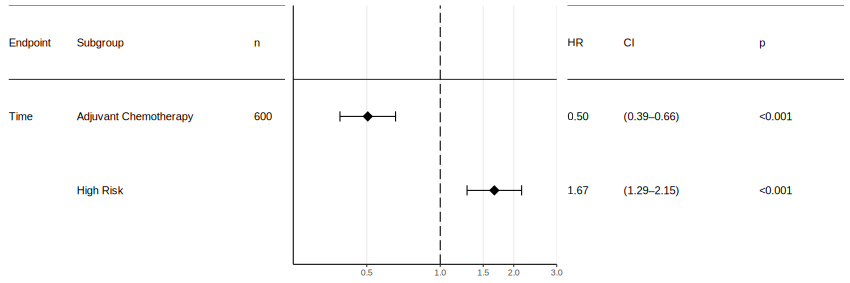
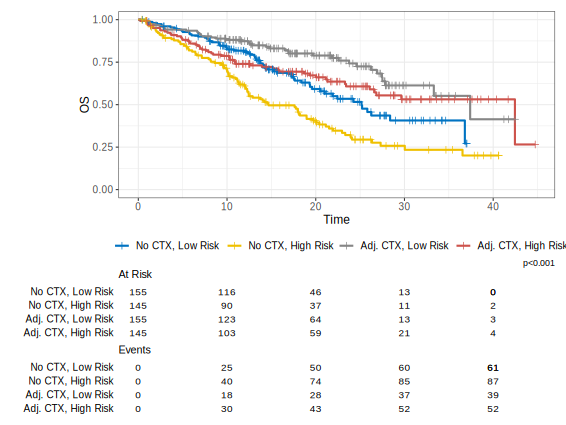
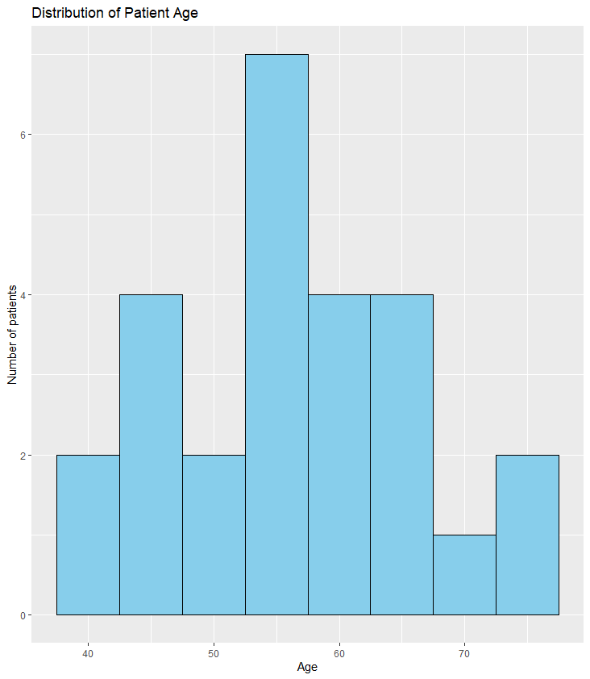
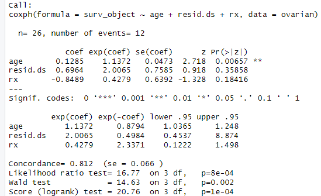

# Survival: Ovarian Cancer

:::info
This resource is available as an [R Markdown Notebook](/notebooks/ovarian_cancer.Rmd) and as a [PDF](/notebooks/ovarian_cancer.pdf).
:::

## Introduction

Ovarian cancer (OS) can be subdivided into three main types: epithelial ovarian cancer, germ cell tumours, and stromal tumours with epithelial ovarian cancer being the most common type.
In this article, we will focus on the early stage serous epithelial ovarian cancer, which is the most common type of ovarian cancer.
Upon first diagnosis of early OS a staging laparotomy is performed to determine the extent of the disease.
One well-known study (ICON1) compared immediate adjuvant chemotherapy after surgery vs no adjuvant chemotherapy (see sources below).
We provide a simulated dataset based on the ICON1 study, which can be used to perform survival analysis in R.
**Please note that this dataset is simulated and for educational purposes only and should not be used for clinical decision-making.**

## Ovarian Cancer and Use Cases in R

Here are some examples of how R can be used in ovarian cancer research:

**1. Data Preprocessing:** R can be used for data preprocessing, which is an essential step in any bioinformatics workflow.
This step involves cleaning, transforming, and organizing data before analysis.
You can choose to use base R functions or packages for data preprocessing.
A popular suite of tools is [**tidyverse**](https://cran.r-project.org/web/packages/tidyverse/index.html) which contains a lot of useful functions for data manipulation.
In our article we try to stick to base R functions as much as possible.

**2. Survival Analysis:** Survival analysis is a statistical method used to analyse the time it takes for an event to occur, such as death or disease progression.
R has several packages that can be used for survival analysis in ovarian cancer, including [**survivalAnalysis**](https://cran.r-project.org/web/packages/survivalAnalysis/index.html), [**survival**](https://cran.r-project.org/web/packages/survival/index.html) or [**survminer**](https://cran.r-project.org/web/packages/survminer/index.html).

**3. Data Visualization:** R is an excellent tool for data visualization, which is essential in cancer informatics.
Popular examples include [**ggplot2**](https://cran.r-project.org/web/packages/ggplot2/index.html) and [**lattice**](https://cran.r-project.org/web/packages/lattice/index.html), both can be used to create informative and visually appealing plots and graphs.

## Used Packages
We will use the following packages in this article.
Keep in mind that you might need to install the packages first before you can use them.

```r
# Install the Required Packages (example for the survivalAnalysis package)
install.packages("survivalAnalysis")
# Load the Required Packages
library(survivalAnalysis) #For survival analysis
library(ggplot2) # For plotting
library(ggsurvfit) # For plotting
library(ggsci) # Provides color palettes for plotting e.g., scale_color_jco (optional)
```

## Load Data

First we need to obtain the data.
Our mock dataset can be found under https://cancer-informatics.org/datasets/ovarian.csv
You can either download the csv file first and reference the local file or point R directly to the url:
```r
# Load the data from a local file
data <- read.csv("ovarian.csv", header = TRUE, sep = ",")
# Load the data from a url
data <- read.csv("https://cancer-informatics.org/datasets/ovarian.csv", header = TRUE, sep = ",")
```

You can deduct the parameters `header = TRUE` and `sep = ","` from the csv file.
Here are the first 5 lines of the csv file:
```csv
"Treatment",    "HighRisk", "Time",           "Status"
1,              1,          42.4503750028979, 1
0,              0,          18.3782004531846, 1
0,              1,          12.1239407387935, 1
0,              1,          10.1788407434407, 1
```
As you can see we provide the column names in the first line and use a comma as a separator.

## Data preprocessing

First we examine the structure and content of the ovarian dataset to understand its variables and format:
```r
# Explore the Dataset:
str(data)
summary(data)
```
This should result in the following output:

```r
> str(data)
'data.frame':	600 obs. of  4 variables:
 $ Treatment: int  1 0 0 0 1 0 1 1 1 0 ...
 $ HighRisk : int  1 0 1 1 1 1 1 1 0 1 ...
 $ Time     : num  42.45 18.38 12.12 10.18 4.81 ...
 $ Status   : int  1 1 1 1 1 1 0 1 0 1 ...
> summary(data)
   Treatment      HighRisk           Time            Status   
 Min.   :0.0   Min.   :0.0000   Min.   : 0.215   Min.   :0.0  
 1st Qu.:0.0   1st Qu.:0.0000   1st Qu.: 9.575   1st Qu.:0.0  
 Median :0.5   Median :0.0000   Median :14.766   Median :0.0  
 Mean   :0.5   Mean   :0.4833   Mean   :16.417   Mean   :0.4  
 3rd Qu.:1.0   3rd Qu.:1.0000   3rd Qu.:22.985   3rd Qu.:1.0  
 Max.   :1.0   Max.   :1.0000   Max.   :44.737   Max.   :1.0  
```

The ovarian dataset contains information on 4 variables related to ovarian cancer, including survival time, survival status, treatment, and high-risk status.

:::tip Explaining the variables in the ovarian dataset
- **Treatment:** This variable indicates whether the patient received no adjuvant chemotherapy (0) or adjuvant chemotherapy (1).
- **HighRisk:** This variable indicates whether the patient is considered low-risk (0) or high-risk (1).
- **Time:** This variable represents the survival time. As this is a mock dataset, we do not define the unit of time. In a real-world scenario this would be days, months or years.
- **Status:** This variable indicates whether an event (death) occurred: the patient is alive (0) or dead (1).
:::

It might be helpful to convert some columns into different data types.
For instance, you might convert the treatment variable from numeric to factor with adequate labels:
```r
#Convert to named factors
data$Treatment <- factor(data$Treatment, levels=c(0,1), labels=c("No CTX", "Adj. CTX"))
data$HighRisk <- factor(data$HighRisk, levels=c(0,1),
                           labels=c("Low Risk",
                                    "High Risk"))
#Adjust column names
colnames(data)[2] <- "RiskGroup"
```

Next, we can perform any necessary data cleaning and transformation steps. 
Please note that our example already utilizes a fairly clean dataset, so we do not need to perform any additional data cleaning steps.
For instance, you might need to check for missing values in the selected variables and handle them appropriately.
In this example, we'll remove any rows with missing values.
```r
# Check for missing values. The result is zero as there are no missing values in the selected dataset.
sum(is.na(data))

# Remove rows with missing values; In our example this step is redundant as we already know that there are no missing values in the dataset. 
data_filtered <- na.omit(data)
``` 

## Multivariate Analysis

In our example we have two independent variables (treatment and high-risk status) and one dependent variable (survival time).
To calculate the impact of the independent variables on the dependent variable we can use a Cox proportional hazards model.

```r
#run multivariate analysis
result <- analyse_multivariate(data_filtered,
                               c("Time", "Status"),
                               covariates = c("Treatment", "RiskGroup")) 
```

Let's take a look at a part of the results by inspecting `result$summary`:
```r
> result$summary
Call:
coxph(formula = Surv(Time, Status) ~ Treatment + RiskGroup, data = data)

  n= 600, number of events= 240 

                      coef exp(coef) se(coef)      z Pr(>|z|)    
TreatmentAdj. CTX  -0.6837    0.5048   0.1338 -5.110 3.22e-07 ***
RiskGroupHigh Risk  0.5102    1.6657   0.1313  3.886 0.000102 ***
---
Signif. codes:  0 ‘***’ 0.001 ‘**’ 0.01 ‘*’ 0.05 ‘.’ 0.1 ‘ ’ 1

                   exp(coef) exp(-coef) lower .95 upper .95
TreatmentAdj. CTX     0.5048     1.9812    0.3883    0.6561
RiskGroupHigh Risk    1.6657     0.6003    1.2877    2.1546

Concordance= 0.61  (se = 0.019 )
Likelihood ratio test= 41.4  on 2 df,   p=1e-09
Wald test            = 40.24  on 2 df,   p=2e-09
Score (logrank) test = 41.46  on 2 df,   p=1e-09
```

Our results show that both treatment and high-risk status have a significant impact on survival time.
The hazard ratio for treatment is 0.5048, which means that patients receiving adjuvant chemotherapy have a 50% lower risk of death compared to patients receiving no adjuvant chemotherapy.
The hazard ratio for high-risk status is 1.6657, which means that patients with high-risk status have a 66% higher risk of death compared to patients with low-risk status.

## Forest Plot
In the next step, we can visualize the results using a forest plot.
```r
#this is required to adjust the labels in the forest plot
#try creating the plot without this helper variable to see why we use it
covariates_labels <-   c(
  "RiskGroup:High Risk" = "High Risk",
  "Treatment:Adj. CTX" = "Adjuvant Chemotherapy"
)

#create forest plot from multivariate analysis
forest_plot(result,
            factor_labeller = covariates_labels,
            endpoint_labeller = c(futime="OS"),
            orderer = ~order(HR),
            labels_displayed = c("endpoint", "factor", "n"),
            HR_x_breaks = c(0.25, 0.5, 1, 1.5, 2, 3),
            HR_x_limits = c(0.25,3)
)

#save the plot as a svg and a pdf
ggsave("ovarian_forest_plot.pdf", width=300, height=100, units = "mm", device = cairo_pdf)
ggsave("ovarian_forest_plot.svg", width=300, height=100, units = "mm")
```



We first create a helper variable `covariates_labels` to adjust the labels in the forest plot.
Next, we create the forest plot using the `forest_plot()` function from the survivalAnalysis package.
It accepts our previously generated multivariate analysis result as input.
Finally, we save the plot as a pdf and svg file. 

## Survival Analysis

Survival data is typically shown using Kaplan-Meier survival curves.

```r
#create a kaplan meier plot
surv_obj <- survfit2(Surv(Time, Status) ~ Treatment+RiskGroup, data = data_filtered) 
ggsurvfit(surv_obj, linewidth = 1) + add_pvalue()+
  scale_color_jco() + add_censor_mark() +
  labs(
    y = "OS",
    x = "Time"
  ) + ylim(0,1)+add_risktable()

ggsave("code_along/plots/ovarian_kaplan_meier.pdf", width=200, height=150, units = "mm", device = cairo_pdf)
ggsave("code_along/plots/ovarian_kaplan_meier.svg", width=200, height=150, units = "mm")
```



In our example we use the `survfit2()` function to create the survival object by utilizing a formula (`dependent variable (outcome) ~ independent variable(s)`).
Our formula defines `Treatment` and `RiskGroup` as independent variables.


:::info Detailed explanation of the Kaplan-Meier survival curves above
The Kaplan-Meier survival curves provide a graphical representation of the survival probabilities over time for a group of individuals.
Let's explain the Kaplan-Meier survival curves created in the example above:

The survival curves display the estimated probability of survival over time based on the ovarian cancer dataset.
The x-axis represents time, usually measured in days or months, while the y-axis represents the probability of survival.

The curves themselves show the estimated survival probability at each time point. The line drops or "steps down" whenever an event (death) occurs, indicating a decrease in the survival probability.
If a patient is censored (i.e., lost to follow-up or still alive at the end of the study), the line remains flat until an event occurs or until the end of the study period.


If you perform a group-specific Kaplan-Meier analysis (as demonstrated in our example with `survfit2(Surv(Time, Status) ~ Treatment+RiskGroup, ...)`), separate survival curves are generated for each treatment group.
These curves allow for the comparison of survival between different subgroups, such as patients receiving standard treatment versus experimental treatment.

The plots generated by `ggsurvfit()` also include a risk table, which provides information on the number of events (deaths) and censored observations at different time points.
Additionally, p-values for log-rank tests are displayed, which compare the survival between different groups (if applicable).

The Kaplan-Meier survival curves are widely used in survival analysis to visualize and compare survival probabilities between groups.
They provide valuable insights into the survival patterns and can help identify potential differences in survival outcomes based on various factors, such as treatment groups, clinical characteristics, or other variables of interest.
:::

## Data Visualization

Here's an example of data visualization using the ovarian package in R:
Start by loading the necessary packages for data visualization:
```r
# Load the Required Packages:
library(ovarian)
library(ggplot2)
```
Load the ovarian dataset from the ovarian package into R:
```r
# Load the Ovarian Cancer Dataset:
data(cancer, package="survival")
```
Let's say you want to visualize the distribution of patient age in the ovarian cancer dataset. You can create a histogram using the ggplot2 package:
```r
# Create a histogram of patient age
ggplot(ovarian, aes(x = age)) +
  geom_histogram(binwidth = 5, fill = "skyblue", color = "black") +
  labs(x = "Age", y = "Number of patients", title = "Distribution of Patient Age")
```



:::info Detailed explanation of the histogram created above
The histogram created in the example above visualizes the distribution of patient age in the ovarian cancer dataset. 
Let's explain the components of the histogram:

The x-axis represents the range of patient age values. 
In this example, each bar on the x-axis represents a specific age range. 
The width of each bar is determined by the binwidth parameter, which controls the size of the age intervals.

The y-axis represents the frequency or count of patients falling within each age range. 
The height of each bar corresponds to the number of patients within that age range. 
The higher the bar, the greater the number of patients falling within that particular age group.

The bars in the histogram are filled with a colour specified by the "fill" parameter (in this case, "skyblue") and outlined with a black colour specified by the "colour" parameter.

The histogram provides an overview of the distribution of patient age in the ovarian cancer dataset. 
It allows you to see the concentration of patients within different age ranges and identify any patterns or notable features in the age distribution.

In this specific visualization, the x-axis represents the age of the patients, the y-axis represents the frequency or count of patients within each age range, and the title "Distribution of Patient Age" provides a clear description of the plot's content.

Remember that histograms are commonly used to explore the distribution of continuous variables.
They provide insights into the central tendency, variability, and shape of the data. 
You can customize the histogram by adjusting parameters such as binwidth, colours, and labels to better suit your specific needs and preferences.
:::

## Cox proportional hazards model
Here's a detailed explanation of how to use the Cox proportional hazards model with the ovarian dataset from the survival package in R:
Start by loading the necessary packages for survival analysis:
```r
# Load the Required Packages:
library(survival)
```
Load the ovarian dataset from the ovarian package into R:
```r
# Load the Ovarian Cancer Dataset:
data(cancer, package="survival")
```
To perform a survival analysis using the Cox proportional hazards model, you need to create a survival object using the `Surv()` function. 
Specify the survival time and event status variables from the ovarian dataset:
```r
# Create the Survival Object:
surv_object <- with(ovarian, Surv(futime, fustat))
```

The futime variable represents the survival time, and the fustat variable indicates the event status (1 for death, 0 for censored).
Use the `coxph()` function to fit the Cox proportional hazards model:
```r
# Fit the Cox Proportional Hazards Model:
cox_model <- coxph(surv_object ~ age + resid.ds + rx, data = ovarian)
```
In this example, we are fitting the model with the formula surv_object ~ age + resid.ds + rx. 
This formula specifies the survival object as the response variable and includes age, resid.ds (residual disease status), and rx (treatment) as covariates. 
Adjust the covariates according to your research question and variable of interest.
To view the summary of the Cox proportional hazards model, use the `summary()` function:
```r
# View the Model Summary:
summary(cox_model)
```



:::info How to read a cox model
The results from the Cox proportional hazards model provide information about the estimated coefficients, standard errors, p-values, and hazard ratios for each covariate included in the model. Let's explain the key elements of the model summary:

**Coefficients:**
The "coef" column in the model summary displays the estimated coefficients for each covariate. 
These coefficients represent the logarithm of the hazard ratio, indicating the direction and magnitude of the effect of each covariate on the hazard of the event (death). 
Positive coefficients indicate an increased hazard, while negative coefficients indicate a decreased hazard.

**Standard Errors:**
The "se(coef)" column provides the standard errors associated with the estimated coefficients. 
These standard errors indicate the precision or reliability of the coefficient estimates. Smaller standard errors suggest more precise estimates.

**Hazard Ratios:**
The "exp(coef)" column displays the hazard ratios, which are exponentiated values of the estimated coefficients. 
Hazard ratios represent the relative risk of an event (death) associated with a one-unit increase in the corresponding covariate, while adjusting for other covariates in the model. 
Hazard ratios greater than 1 indicate an increased risk, while hazard ratios less than 1 indicate a decreased risk.

**Confidence Intervals:**
The "exp(coef)" column is accompanied by two additional columns, "lower .95" and "upper .95," which represent the lower and upper bounds of the 95% confidence interval for the hazard ratios. 
The confidence interval provides a range of plausible values for the true hazard ratio, considering the uncertainty in the estimation.

**p-values:**
The "Pr(>|z|)" column displays the p-values associated with the estimated coefficients. 
These p-values indicate the statistical significance of each covariate in the model. A p-value less than the chosen significance level (e.g., 0.05) suggests that the covariate has a significant effect on the hazard of the event.
:::

:::tip Further explanation (very detailed)

***Coefficient Interpretation:***

**Age:** 
The coefficient for age is 0.1285. 
It indicates that for every one-unit increase in age, the hazard (risk) of the event (death) increases by a factor of exp(0.1285) = 1.1372, after adjusting for the other covariates in the model. 
The p-value (0.00657) suggests that age is statistically significant in predicting the survival outcome.

**Residual Disease Status:** 
The coefficient for resid.ds is 0.6964. 
However, the p-value (0.35858) indicates that resid.ds is not statistically significant in predicting the survival outcome. 
The hazard ratio (exp(0.6964) = 2.0065) suggests that patients with higher residual disease status have a 2.0065 times higher hazard compared to those with lower residual disease status, but this effect is not statistically significant.

**Treatment:** 
The coefficient for rx is -0.8489. 
The p-value (0.18416) suggests that treatment is not statistically significant in predicting the survival outcome. 
The hazard ratio (exp(-0.8489) = 0.4279) indicates that patients receiving the treatment have a 0.4279 times lower hazard compared to those not receiving the treatment, but again, this effect is not statistically significant.

**Confidence Intervals:**
The confidence intervals provide a range within which we can be reasonably confident that the true hazard ratios lie. 
For example, the 95% confidence interval for age (lower .95 = 1.0365, upper .95 = 1.248) suggests that the true hazard ratio for age is likely to be between 1.0365 and 1.248.

***Model Evaluation:***

**Concordance:** 
The concordance value of 0.812 indicates a moderate level of predictive accuracy for the Cox proportional hazards model. 
It measures the ability of the model to rank order pairs of subjects correctly with respect to their survival times.

**Likelihood Ratio Test:** 
The likelihood ratio test statistic (16.77) with 3 degrees of freedom (df) assesses the overall significance of the model. 
The p-value (8e-04) indicates that the model as a whole is statistically significant in predicting the survival outcome.

**Wald Test:** 
The Wald test statistic (14.63) with 3 df evaluates the significance of individual coefficients in the model. 
The p-value (0.002) suggests that the overall effect of the covariates in the model is statistically significant.

**Score (Logrank) Test:** 
The score test statistic (20.76) with 3 df assesses the proportional hazards assumption of the Cox model. 
The p-value (1e-04) indicates that there is strong evidence of violation of the proportional hazards assumption.

Overall, the results suggest that age is a statistically significant predictor of survival outcome, with higher age associated with an increased hazard of death. 
However, the other variables (residual disease status and treatment) are not statistically significant in predicting the survival outcome in this analysis. 
It is important to interpret these results in the context of the study and consider potential limitations and confounding factors.
:::

## Sources & Further Reading

- S3-Leitlinie Diagnostik, Therapie und Nachsorge maligner Ovarialtumoren https://register.awmf.org/de/leitlinien/detail/032-035OL

- Colombo N et al.; International Collaborative Ovarian Neoplasm (ICON) collaborators. International Collaborative Ovarian Neoplasm trial 1: a randomized trial of adjuvant chemotherapy in women with early-stage ovarian cancer. J Natl Cancer Inst. 2003 Jan 15;95(2):125-32. doi: 10.1093/jnci/95.2.125. PMID: 12529345.

- Roett MA, Evans P. Ovarian cancer: an overview. Am Fam Physician. 2009;80(6):609-616.

- Stewart C, Ralyea C, Lockwood S. Ovarian Cancer: An Integrated Review. Semin Oncol Nurs. 2019;35(2):151-156. doi:10.1016/j.soncn.2019.02.001

- Morand S, Devanaboyina M, Staats H, Stanbery L, Nemunaitis J. Ovarian Cancer Immunotherapy and Personalized Medicine. Int J Mol Sci. 2021;22(12):6532. Published 2021 Jun 18. doi:10.3390/ijms22126532

- Johann DJ Jr, McGuigan MD, Tomov S, et al. Novel approaches to visualization and data mining reveals diagnostic information in the low amplitude region of serum mass spectra from ovarian cancer patients. Dis Markers. 2003;19(4-5):197-207. doi:10.1155/2004/549372

- Temkin SM, Smeltzer MP, Dawkins MD, et al. Improving the quality of care for patients with advanced epithelial ovarian cancer: Program components, implementation barriers, and recommendations. Cancer. 2022;128(4):654-664. doi:10.1002/cncr.34023

- Yu JS, Ongarello S, Fiedler R, et al. Ovarian cancer identification based on dimensionality reduction for high-throughput mass spectrometry data. Bioinformatics. 2005;21(10):2200-2209. doi:10.1093/bioinformatics/bti370