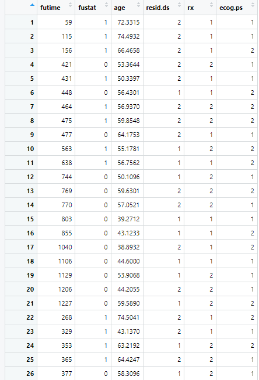
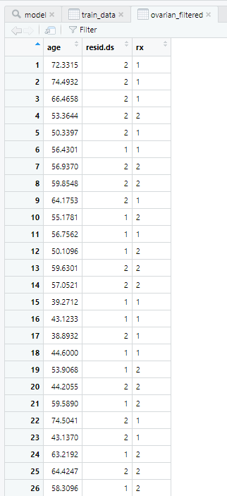

# Using R: Ovarian Cancer

## Introduction

Ovarian cancer is a type of cancer that begins in the ovaries, and it is the most common type of cancer affecting the female reproductive system.
Here are some key points about ovarian cancer:

**Types of Ovarian Cancer:** 
There are several types of ovarian cancer, including epithelial ovarian cancer (the most common type), germ cell tumours, and stromal tumours.
Epithelial ovarian cancer originates in the cells that line the surface of the ovaries.

**Risk Factors:** 
Some factors that may increase the risk of developing ovarian cancer include a family history of ovarian, breast, or colorectal cancer, certain inherited gene mutations (such as BRCA1 and BRCA2), increasing age, a history of infertility or never having been pregnant, and the use of hormone replacement therapy.

**Symptoms:**
Ovarian cancer is often referred to as the "silent killer" because early-stage ovarian cancer may not cause noticeable symptoms. 
However, as the disease progresses, symptoms may include abdominal bloating or swelling, pelvic pain, feeling full quickly while eating, changes in bowel habits, frequent urination, and unexplained weight loss or gain.

**Diagnosis:** 
The diagnosis of ovarian cancer involves a combination of medical history evaluation, physical examination, imaging tests (such as ultrasound and CT scan), and a biopsy to confirm the presence of cancerous cells. 
Blood tests, such as CA-125, may also be used as a tumour marker.

**Staging:**
Ovarian cancer is staged based on the extent of the disease. 
The stages range from I to IV, with stage I indicating cancer that is confined to the ovaries, and stage IV indicating cancer that has spread to distant organs.

**Treatment:** 
Treatment options for ovarian cancer may include surgery, chemotherapy, radiation therapy, targeted therapy, and immunotherapy. 
The specific treatment approach depends on factors such as the stage and type of ovarian cancer, as well as the individual's overall health.

**Prognosis:** 
The prognosis for ovarian cancer varies depending on the stage at diagnosis and other factors. 
Early detection is key for better outcomes. Unfortunately, ovarian cancer is often diagnosed at advanced stages, which makes it more challenging to treat successfully. 
Regular screenings and awareness of potential symptoms are important.

## Ovarian cancer and use cases in R

R is an ideal tool for ovarian cancer research due to its extensive statistical and data analysis capabilities, allowing researchers to effectively analyse complex datasets such as gene expression profiles and clinical data, enabling them to uncover meaningful insights and patterns in ovarian cancer biology.

With a robust ecosystem of bioinformatics and genomics packages, R seamlessly integrates genomic data analysis into ovarian cancer research, enabling researchers to study genetic alterations, identify biomarkers, and understand the molecular underpinnings of the disease.

The active and supportive community surrounding R, comprising statisticians, bioinformaticians, and data scientists, provides a collaborative environment for researchers in ovarian cancer, facilitating knowledge sharing, code development, and reproducible research, ultimately accelerating discoveries and advancements in the field.

In the following, individual methods mentioned in the following are explained using ovarian cancer as an example.
Afterwards, you should be able to perform individual analyses using R and apply them to a medical problem.

**1. Data Preprocessing:** R can be used for data preprocessing, which is an essential step in cancer informatics.
This step involves cleaning, transforming, and organizing data before analysis.
In R, packages like [**tidyverse**](https://cran.r-project.org/web/packages/tidyverse/index.html) can be used for data cleaning and transformation, while [**dplyr**](https://cran.r-project.org/web/packages/dplyr/index.html) can be used for data manipulation.

**2. Survival Analysis:** Survival analysis is a statistical method used to analyse the time it takes for an event to occur, such as death or disease progression.
R has several packages that can be used for survival analysis in breast cancer, including [**survival**](https://cran.r-project.org/web/packages/survival/index.html) or [**survminer**](https://cran.r-project.org/web/packages/survminer/index.html).

**3. Data Visualization:** R is an excellent tool for data visualization, which is essential in cancer informatics.
R has several packages, including [**ggplot2**](https://cran.r-project.org/web/packages/ggplot2/index.html) and [**lattice**](https://cran.r-project.org/web/packages/lattice/index.html), that can be used to create informative and visually appealing plots and graphs.
These packages can be used to create plots of gene expression data, survival curves, and other types of data relevant to breast cancer.

**4. Cox proportional hazards model:** The Cox proportional hazards model is a widely used statistical model in survival analysis. It is used to assess the relationship between covariates (independent variables) and the time until an event of interest occurs (e.g., death, relapse, or failure). 

## Data preprocessing

Here's a detailed example of data preprocessing for ovarian cancer using the "ovarian" dataset from the survival package in R:
Start by loading the necessary packages: survival, dplyr, and survminer. 
These packages provide functions for survival analysis and data manipulation.
```r
# Load the Required Packages
library(survival)
library(dplyr)
library(survminer)
```
The [**ovarian dataset**](https://r-data.pmagunia.com/dataset/r-dataset-package-survival-ovarian) is included in the survival package. 
Load the dataset into R:
```r
# Load the Ovarian Cancer Dataset:
data(cancer, package="survival")
```
Examine the structure and content of the ovarian dataset to understand its variables and format:
```r
# Explore the Dataset:
str(ovarian)
summary(ovarian)
```
This should result in the following image:



The ovarian dataset contains information on 6 variables related to ovarian cancer, including survival status, age, stage, and treatment variables.

:::tip Explanation of the items included in the ovarian dataset:
**futime:** The follow-up time or survival time of the patients in days.

**fustat:** The event status indicator, where 1 represents death (an event occurred) and 0 represents censoring (no event occurred).

**age:** The age of the patient at the time of diagnosis.

**resid.ds:** The residual disease status, which indicates the amount of residual disease after primary treatment. It is categorized as follows:

    0: No visible residual disease.

    1: Residual disease ≤1 cm.

    2: Residual disease >1 cm.

**rx:** The treatment received by the patient. This variable represents the type of chemotherapy treatment and is a factor variable with levels such as "standard" and "experimental".

**ecog.ps:** The Eastern Cooperative Oncology Group performance status, which provides a measure of the patient's functional status or overall health. It is categorized as follows:

    1: Fully active, able to carry out all activities without restriction.

    2: Restricted in physically strenuous activity but ambulatory and able to carry out light work.

    3: Restricted in ability to perform work and requiring some bed rest during the day.

    4: Completely disabled and confined to bed or chair.
:::

Perform any necessary data cleaning and transformation steps. 
In this example, we'll focus on selecting relevant variables and handling missing values.
```r
# Select relevant variables
ovarian_filtered <- select(ovarian, age, resid.ds, rx)
```
Here, we select the variables age, resid.ds (residual disease status), and rx (treatment) for further analysis. 
Adjust the variable selection according to your specific research questions.

Check for missing values in the selected variables and handle them appropriately. In this example, we'll remove any rows with missing values.
```r
# Check for missing values
missing_values <- sum(is.na(ovarian_filtered))

# Remove rows with missing values
ovarian_filtered <- na.omit(ovarian_filtered)
``` 
Convert the variables into the desired format for analysis. For example, convert the treatment variable (rx) into a factor:
```r
# Data formatting
ovarian_filtered$rx <- as.factor(ovarian_filtered$rx)
```
Make sure to format the variables based on their data types and the analysis methods you plan to use.

The following image will then be created:



## Sources & Further Reading

- Roett MA, Evans P. Ovarian cancer: an overview. Am Fam Physician. 2009;80(6):609-616.

- Stewart C, Ralyea C, Lockwood S. Ovarian Cancer: An Integrated Review. Semin Oncol Nurs. 2019;35(2):151-156. doi:10.1016/j.soncn.2019.02.001

- Morand S, Devanaboyina M, Staats H, Stanbery L, Nemunaitis J. Ovarian Cancer Immunotherapy and Personalized Medicine. Int J Mol Sci. 2021;22(12):6532. Published 2021 Jun 18. doi:10.3390/ijms22126532

- Johann DJ Jr, McGuigan MD, Tomov S, et al. Novel approaches to visualization and data mining reveals diagnostic information in the low amplitude region of serum mass spectra from ovarian cancer patients. Dis Markers. 2003;19(4-5):197-207. doi:10.1155/2004/549372

- Temkin SM, Smeltzer MP, Dawkins MD, et al. Improving the quality of care for patients with advanced epithelial ovarian cancer: Program components, implementation barriers, and recommendations. Cancer. 2022;128(4):654-664. doi:10.1002/cncr.34023

- Yu JS, Ongarello S, Fiedler R, et al. Ovarian cancer identification based on dimensionality reduction for high-throughput mass spectrometry data. Bioinformatics. 2005;21(10):2200-2209. doi:10.1093/bioinformatics/bti370